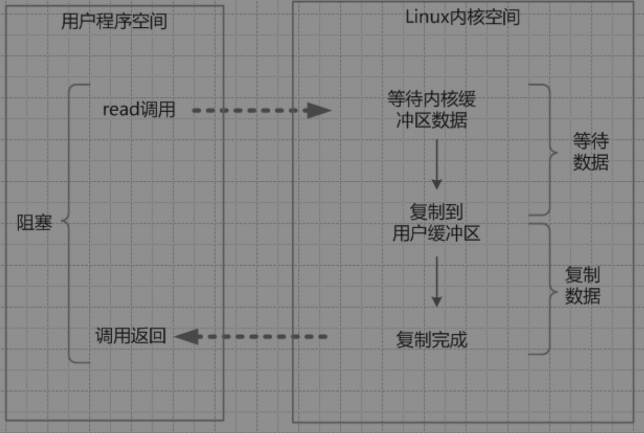
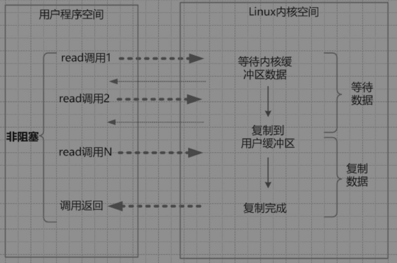
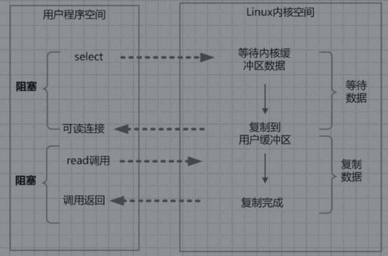
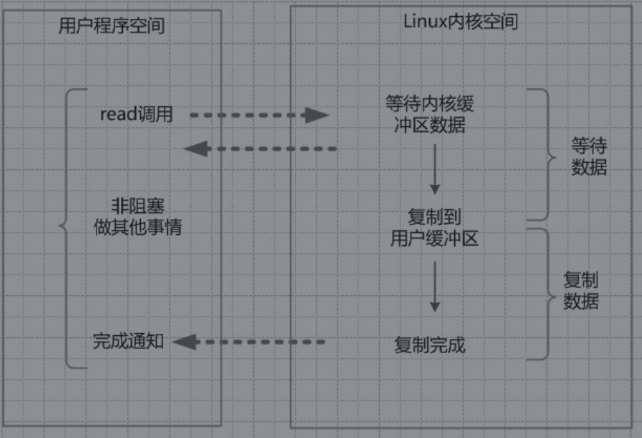

#### IO读写的基础原理

调用操作系统的read，是把数据从**内核缓冲区**复制到**进程缓冲区**；

而write系统调用，是把数据从**进程缓冲区**复制到**内核缓冲区**。


##### 内核缓冲区与进程缓冲区

​	上层应用使用read系统调用时，仅仅把数据从内核缓冲区复制到上层应用的缓冲区（进程缓冲区）；

​	上层应用使用write系统调用时，仅仅把数据从进程缓冲区复制到内核缓冲区中。

​	底层操作会对内核缓冲区进行监控，等待缓冲区达到一定数量的时候，再进行IO设备的中断处理，集中执行物理设备的实际IO操作，这种机制提升了系统的性能。


这里以read系统调用为例，先看下一个完整输入流程的两个阶段：

1. 等待数据准备好。
2. 从内核向进程复制数据。


如果是read一个socket（套接字），那么以上两个阶段的具体处理流程如下：

1. 第一个阶段，等待数据从网络中到达网卡。当所等待的分组到达时，它被复制到内核中的某个缓冲区。这个工作由操作系统自动完成，用户程序无感知。
2.  第二个阶段，就是把数据从内核缓冲区复制到应用进程缓冲区。


再具体一点，如果是在Java服务器端，完成一次socket请求和响应，完整的流程如下：

1. 客户端请求：Linux通过网卡读取客户端的请求数据，将数据读取到内核缓冲区。
2. 获取请求数据：Java服务器通过read系统调用，从Linux内核缓冲区读取数据，再送入Java进程缓冲区。
3.  服务器端业务处理：Java服务器在自己的用户空间中处理客户端的请求。
4.  服务器端返回数据：Java服务器完成处理后，构建好的响应数据，将这些数据从用户缓冲区写入内核缓冲区。这里用到的是write系统调用。
5. 发送给客户端：Linux内核通过网络IO，将内核缓冲区中的数据写入网卡，网卡通过底层的通信协议，会将数据发送给目标客户端。


#### 四种主要的IO模型

##### 同步阻塞IO

在Java应用程序进程中，默认情况下，所有的socket连接的IO操作都是同步阻塞IO（Blocking IO）。

在阻塞式IO模型中，Java应用程序从IO系统调用开始，直到系统调用返回，在这段时间内，Java进程是阻塞的。返回成功后，应用进程开始处理用户空间的缓存区数据。



阻塞IO的特点是：在内核进行IO执行的两个阶段，用户线程都被阻塞了。

阻塞IO的优点是：应用的程序开发非常简单；在阻塞等待数据期间，用户线程挂起。在阻塞期间，用户线程基本不会占用CPU资源。

阻塞IO的缺点是：一般情况下，会为每个连接配备一个独立的线程；反过来说，就是一个线程维护一个连接的IO操作。在并发量小的情况下，这样做没有什么问题。但是，当在高并发的应用场景下，需要大量的线程来维护大量的网络连接，内存、线程切换开销会非常巨大。因此，基本上阻塞IO模型在高并发应用场景下是不可用的。


##### 同步非阻塞NIO

socket连接默认是阻塞模式，在Linux系统下，可以通过设置将socket变成为非阻塞的模式（Non-Blocking）。

使用非阻塞模式的IO读写，叫作同步非阻塞IO（None Blocking IO），简称为NIO模式。

在NIO模型中，应用程序一旦开始IO系统调用，会出现以下两种情况：

1. 在内核缓冲区中没有数据的情况下，系统调用会立即返回，返回一个调用失败的信息。
2. 在内核缓冲区中有数据的情况下，是阻塞的，直到数据从内核缓冲复制到用户进程缓冲。复制完成后，系统调用返回成功，应用进程开始处理用户空间的缓存数据。



同步非阻塞IO的特点：应用程序的线程需要不断地进行IO系统调用，轮询数据是否已经准备好，如果没有准备好，就继续轮询，直到完成IO系统调用为止。

同步非阻塞IO的优点：每次发起的IO系统调用，在内核等待数据过程中可以立即返回。用户线程不会阻塞，实时性较好。

同步非阻塞IO的缺点：不断地轮询内核，这将占用大量的CPU时间，效率低下。

同步非阻塞IO，可以简称为**NIO，但是，它不是Java中的NIO**，虽然它们的英文缩写一样，希望大家不要混淆。**Java的NIO（NewIO）**，对应的不是四种基础IO模型中的NIO（None Blocking IO）模型，而是另外的一种模型，叫作IO多路复用模型（IO Multiplexing）。


#####  IO多路复用模型

在IO多路复用模型中，引入了一种新的系统调用，查询IO的就绪状态。在Linux系统中，对应的系统调用为select/epoll系统调用。通过该系统调用，一个进程可以监视多个文件描述符，一旦某个描述符就绪（一般是内核缓冲区可读/可写），内核能够将就绪的状态返回给应用程序。随后，应用程序根据就绪的状态，进行相应的IO系统调用。

发起一个多路复用IO的read读操作的系统调用，流程如下：

1. 选择器注册。在这种模式中，首先，将需要read操作的目标socket网络连接，提前注册到select/epoll选择器中，Java中对应的选择器类是Selector类。然后，才可以开启整个IO多路复用模型的轮询流程。
2. 就绪状态的轮询。通过选择器的查询方法，查询注册过的所有socket连接的就绪状态。通过查询的系统调用，内核会返回一个就绪的socket列表。当任何一个注册过的socket中的数据准备好了，内核缓冲区有数据（就绪）了，内核就将该socket加入到就绪的列表中。当用户进程调用了select查询方法，那么整个线程会被阻塞掉。
3. 用户线程获得了就绪状态的列表后，根据其中的socket连接，发起read系统调用，用户线程阻塞。内核开始复制数据，将数据从内核缓冲区复制到用户缓冲区。
4. 复制完成后，内核返回结果，用户线程才会解除阻塞的状态，用户线程读取到了数据，继续执行。




IO多路复用模型的**特点**：IO多路复用模型的IO涉及两种系统调用（System Call），另一种是select/epoll（就绪查询），一种是IO操作。IO多路复用模型建立在操作系统的基础设施之上，即操作系统的内核必须能够提供多路分离的系统调用select/epoll。

和NIO模型相似，多路复用IO也需要轮询。负责select/epoll状态查询调用的线程，需要不断地进行select/epoll轮询，查找出达到IO操作就绪的socket连接。

IO多路复用模型的**优点**：与一个线程维护一个连接的阻塞IO模式相比，使用select/epoll的最大优势在于，一个选择器查询线程可以同时处理成千上万个连接（Connection）。系统不必创建大量的线程，也不必维护这些线程，从而大大减小了系统的开销。

Java语言的NIO（New IO）技术，使用的就是IO多路复用模型。在Linux系统上，使用的是epoll系统调用。

IO多路复用模型的**缺点**：本质上，select/epoll系统调用是阻塞式的，属于同步IO。都需要在读写事件就绪后，由系统调用本身负责进行读写，也就是说这个读写过程是阻塞的。


##### 异步IO模型

异步IO模型（Asynchronous IO，简称为AIO）。AIO的基本流程是：用户线程通过系统调用，向内核注册某个IO操作。内核在整个IO操作（包括数据准备、数据复制）完成后，通知用户程序，用户执行后续的业务操作。在异步IO模型中，在整个内核的数据处理过程中，包括内核将数据从网络物理设备（网卡）读取到内核缓冲区、将内核缓冲区的数据复制到用户缓冲区，用户程序都不需要阻塞。




发起一个异步IO的read读操作的系统调用，流程如下：

1. 当用户线程发起了read系统调用，立刻就可以开始去做其他的事，用户线程不阻塞。
2. 内核就开始了IO的第一个阶段：准备数据。等到数据准备好了，内核就会将数据从内核缓冲区复制到用户缓冲区（用户空间的内存）。
3. 内核会给用户线程发送一个信号（Signal），或者回调用户线程注册的回调接口，告诉用户线程read操作完成了。
4. 用户线程读取用户缓冲区的数据，完成后续的业务操作。

异步IO模型的特点：在内核等待数据和复制数据的两个阶段，用户线程都不是阻塞的。用户线程需要接收内核的IO操作完成的事件，或者用户线程需要注册一个IO操作完成的回调函数。正因为如此，异步IO有的时候也被称为信号驱动IO。

异步IO异步模型的缺点：应用程序仅需要进行事件的注册与接收，其余的工作都留给了操作系统，也就是说，需要底层内核提供支持。

Netty框架，使用的就是IO多路复用模型，而不是异步IO模型。

#### 文件句柄|文件描述符

通过合理配置来支持百万级并发连接

在生产环境Linux系统中，基本上都需要解除文件句柄数的限制。原因是，Linux的系统默认值为1024，也就是说，一个进程最多可以接受1024个socket连接。这是远远不够的。

文件句柄，也叫文件描述符。在Linux系统中，文件可分为：普通文件、目录文件、链接文件和设备文件。**文件描述符（File Descriptor）是内核为了高效管理已被打开的文件所创建的索引**，它是一个非负整数（通常是小整数），用于指代被打开的文件。所有的IO系统调用，包括socket的读写调用，都是通过文件描述符完成的。

在Linux下，通过调用ulimit命令，可以看到单个进程能够打开的最大文件句柄数量，这个命令的具体使用方法是：`ulimit -n`

文件句柄数不够，会导致什么后果呢？当单个进程打开的文件句柄数量，超过了系统配置的上限值时，就会发出“Socket/File:Can't open somany files”的错误提示。

设置ulimit命名 `ulimit -n 1000000`

使用ulimit命令来修改当前用户进程的一些基础限制，仅在当前用户环境有效。直白地说，就是在当前的终端工具连接当前shell期间，修改是有效的；一旦断开连接，用户退出后，它的数值就又变回系统默认的1024了。也就是说，ulimit只能作为临时修改，系统重启后，句柄数量又会恢复为默认值。

如果想永久地把设置值保存下来，可以编辑/etc/rc.local开机启动文件，在文件中添加如下内容：

```
ulimit  -SHn 1000000
```

增加-S和-H两个命令选项。选项-S表示软性极限值，-H表示硬性极限值。硬性极限是实际的限制，就是最大可以是100万，不能再多了。软性极限是系统警告（Warning）的极限值，超过这个极限值，内核会发出警告。

普通用户通过ulimit命令，可将软极限更改到硬极限的最大设置值。如果要更改硬极限，必须拥有root用户权限。

终极解除Linux系统的最大文件打开数量的限制，可以通过编辑Linux的极限配置文件/etc/security/limits.conf来解决，修改此文件，加入如下内容：

```
soft nofile 1000000
hard nofile 1000000
```

