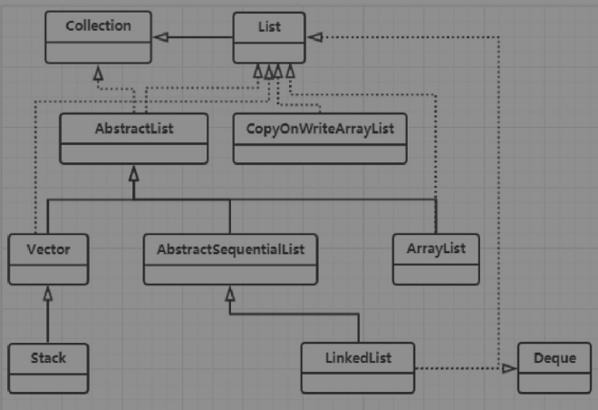

## List




### `ArrayList`

`ArrayList`（`java.util.ArrayList`）是用数组来实现的List，是最常见的列表之一。它与数组有着同样的特点：1）随机访问（相对于顺序访问）效率高。2）读快写慢，由于写的过程中需要涉及元素的移动，因此写操作的效率比较低。

**随机访问**（又称直接访问）：在一组长度为n的数据中，要找到其中第i个元素，只需要通过下标i就可以找到。

**顺序访问**：在一组长度为n的数据中，要找到其中第i个元素，只能从头到尾或者从尾到头遍历，直到找到第i个元素，需要依次查找i或n-i次。

#### `ArrayList`的实现原理：

##### 父类和接口

- `java.util.AbstractList`。该抽象类是大部分List的共同父类，它提供了一些基本的方法封装，以及通用的迭代器实现。
- `java.util.List`。列表标准接口，列表是一个有序集合，又被称为序列。该接口对它内部的每一个元素的插入位置都有精确控制，用户可以使用整数索引（index）来查询。一般来说，列表允许重复元素，也可以插入null元素。
- `java.util.RandomAccess`。这是一个标记性质的随机访问接口，它没有提供任何方法。如果一个类实现了这个接口，那么表示这个类使用索引遍历比迭代器要更快（`ArrayList`、`CopyOnWriteArrayList`、`Stack`和`Vector`都实现了这个接口）。
- `java.lang.Cloneable`。用于标记可克隆对象，是一个常见接口，没有实现该接口的对象在调用`Object.clone()`方法时会抛出异常。
- `java.io.Serializable`。序列化标记接口，是一个常见接口，被此接口标记的类可以实现Java序列化和反序列化。该接口没有任何内容，但是Java序列化里有一些默认成员变量和默认方法，会在序列化和反序列化的时候调用到。

```java
package java.util;

public class ArrayList<E> extends AbstractList<E>
        implements List<E>, RandomAccess, Cloneable, java.io.Serializable{
	
}
```

#####  成员变量和常量

- `private transient Object[]elementData`，`elementData`是该List的数据域，其中被transient修饰表示这个变量不会被序列化，它提供给`Serializable`接口使用。
- `private int size`，size表示当前List的长度，需要注意的是，`elementData`的length是必然大于或等于size的。这是因为`elementData`是存放数据的数组。一方面，数组尾部可能有不计入长度的null元素。另一方面，数组的length是固定的，如果每一次添加都需要扩容，那么这是巨大的消耗。所以，`ArrayList`提供了一系列机制来维持数组的大小，并且提供了一个size变量来标识真正的List大小。
- `protected transient int modCount=0`，该成员变量继承自`java.util.AbstractList`，记录了`ArrayList`结构性变化的次数。在`ArrayList`的所有涉及结构变化的方法中都会增加`modCount`的值，这些方法包括：add( )、remove( )、`addAll()`、`removeRange( )`及clear( )。


```java
package java.util;

public class ArrayList<E> extends AbstractList<E>
        implements List<E>, RandomAccess, Cloneable, java.io.Serializable{
    
	transient Object[] elementData;
    
    private int size;
    
}

public abstract class AbstractList<E> extends AbstractCollection<E> implements List<E> {

	protected transient int modCount = 0;
    
}
```


######`ArrayList`的序列化与反序列化

`ArrayList`实现了`Serializable`接口的`writeObject`方法，这个方法把`elementData`中的元素全部序列化到文件中。

```java
package java.util;

public class ArrayList<E> extends AbstractList<E>
        implements List<E>, RandomAccess, Cloneable, java.io.Serializable{
    
	transient Object[] elementData;
    
    private int size;
    
    private void writeObject(java.io.ObjectOutputStream s)
        throws java.io.IOException{
        
        // Write out element count, and any hidden stuff
        int expectedModCount = modCount;
        s.defaultWriteObject();

        // Write out size as capacity for behavioural compatibility with clone()
        s.writeInt(size);

        // Write out all elements in the proper order.
        for (int i=0; i<size; i++) {
            s.writeObject(elementData[i]);
        }

        if (modCount != expectedModCount) {
            throw new ConcurrentModificationException();
        }
    }
}

```

但是这个方法是private的，在`ArrayList`中并没有在任何位置调用它。那么它是如何被调用的呢？

当list被序列化时，序列化方法会反射调用该方法来替代默认的序列化方式。

那么为什么不直接用`elementData`来序列化，而采用上面的方式来实现序列化呢？主要的原因是`elementData`是一个缓存数组，为了性能的考虑，它通常会预留一些容量，当容量不足时会扩充容量，因此，可能会有大量的空间没有实际存储元素。采用上面的方式来实现序列化可以保证只序列化实际有值的那些元素，而不序列化整个数组。


##### 常量

- `private static final longserialVersionUID=8683452581122892189L`序列化版本`UID`，根据这个名字能判断出它是提供给序列化接口使用的，该`UID`是为了维持序列化版本一致性的。`ArrayList`在某次升级后，多出了新的成员需要被序列化，那么在旧版本中序列化的内容就无法反序列化成新版本的`ArrayList`对象。

- `private static final int MAX_ARRAY_SIZE=Integer.MAX_VALUE-8` 数组长度的上限，这里设置的是最大整数-8。

```java
package java.util;

public class ArrayList<E> extends AbstractList<E>
        implements List<E>, RandomAccess, Cloneable, java.io.Serializable{
    
    private static final long serialVersionUID = 8683452581122892189L;

    private static final int MAX_ARRAY_SIZE = Integer.MAX_VALUE - 8;
    
}
```

##### 构造方法

`ArrayList`有三个重载的构造方法

```java
package java.util;

public class ArrayList<E> extends AbstractList<E>
        implements List<E>, RandomAccess, Cloneable, java.io.Serializable{

    private static final Object[] EMPTY_ELEMENTDATA = {};
    private static final Object[] DEFAULTCAPACITY_EMPTY_ELEMENTDATA = {};

    private static final int DEFAULT_CAPACITY = 10;

    public ArrayList(int initialCapacity) {
        if (initialCapacity > 0) {
            this.elementData = new Object[initialCapacity];
        } else if (initialCapacity == 0) {
            this.elementData = EMPTY_ELEMENTDATA;
        } else {
            throw new IllegalArgumentException("Illegal Capacity: "+
                                               initialCapacity);
        }
    }
    
    public ArrayList() {
        this.elementData = DEFAULTCAPACITY_EMPTY_ELEMENTDATA;
    }

    public ArrayList(Collection<? extends E> c) {
        elementData = c.toArray();
        if ((size = elementData.length) != 0) {
            // c.toArray might (incorrectly) not return Object[] (see 6260652)
            if (elementData.getClass() != Object[].class)
                elementData = Arrays.copyOf(elementData, size, Object[].class);
        } else {
            // replace with empty array.
            this.elementData = EMPTY_ELEMENTDATA;
        }
    }
    
}
```


`initialCapacity`表示初始化的`elementData`的长度，*如果使用无参构造，那么默认为10*。当构造方法的参数为集合的时候，它会把`elementData`的长度设置等同为集合的大小，然后再复制集合的所有元素到`ArrayList`的`elementData`中。


####  常用方法的实现

##### indexof/lastIndexof/contains方法

- indexof方法用于查询指定对象的索引index，实现的方式是对数组顺序遍历，调用指定元素的equals方法来比对，如果查询不到，那么返回-1。lastIndexof则于indexof相反，是对数组倒序遍历。contains方法直接调用indexof方法，根据返回值是否为-1判断代查找的元素是否存在。
- lastIndexof则于indexof相反，是对数组倒序遍历。
- contains方法直接调用indexof方法，根据返回值是否为-1判断代查找的元素是否存在。

```java
package java.util;

public class ArrayList<E> extends AbstractList<E>
        implements List<E>, RandomAccess, Cloneable, java.io.Serializable{
    
    public boolean contains(Object o) {
        return indexOf(o) >= 0;
    }

    public int indexOf(Object o) {
        if (o == null) {
            for (int i = 0; i < size; i++)
                if (elementData[i]==null)
                    return i;
        } else {
            for (int i = 0; i < size; i++)
                if (o.equals(elementData[i]))
                    return i;
        }
        return -1;
    }

    public int lastIndexOf(Object o) {
        if (o == null) {
            for (int i = size-1; i >= 0; i--)
                if (elementData[i]==null)
                    return i;
        } else {
            for (int i = size-1; i >= 0; i--)
                if (o.equals(elementData[i]))
                    return i;
        }
        return -1;
    }

}
```


##### set/add/addAll方法

- set方法的实现很简单，即替换数组里的对应索引处的值。
- add和addAll方法的实现相对复杂一些。首先要检查当前elementData的长度，如果添加后的大小超出elementData的长度，那么需要对elementData的容量进行修正。

```java
package java.util;

public class ArrayList<E> extends AbstractList<E>
        implements List<E>, RandomAccess, Cloneable, java.io.Serializable{
    
    public E set(int index, E element) {
        rangeCheck(index);

        E oldValue = elementData(index);
        elementData[index] = element;
        return oldValue;
    }
    
	public boolean add(E e) {
        ensureCapacityInternal(size + 1);  // Increments modCount!!
        elementData[size++] = e;
        return true;
    }
    
    private static final Object[] DEFAULTCAPACITY_EMPTY_ELEMENTDATA = {};

    private void ensureCapacityInternal(int minCapacity) {
        if (elementData == DEFAULTCAPACITY_EMPTY_ELEMENTDATA) {
            minCapacity = Math.max(DEFAULT_CAPACITY, minCapacity);
        }

        ensureExplicitCapacity(minCapacity);
    } 
    
    private void ensureExplicitCapacity(int minCapacity) {
        modCount++;

        // overflow-conscious code
        if (minCapacity - elementData.length > 0)
            grow(minCapacity);
    }

    private void grow(int minCapacity) {
        // overflow-conscious code
        int oldCapacity = elementData.length;
        int newCapacity = oldCapacity + (oldCapacity >> 1);
        if (newCapacity - minCapacity < 0)
            newCapacity = minCapacity;
        if (newCapacity - MAX_ARRAY_SIZE > 0)
            newCapacity = hugeCapacity(minCapacity);
        // minCapacity is usually close to size, so this is a win:
        elementData = Arrays.copyOf(elementData, newCapacity);
    }
    
}
```

elementData容量修正的逻辑。

容量修正主要是两个方向：多余和不足。

 grow(int)方法的int参数指定了“本次扩容所允许的最小容量”。在ArrayList里，除了外部直接调用ensureCapacity方法间接地调用外，grow只会被add或addAll触发。此时，所需要的最小容量一定是超出当前elementD ata的长度的。

grow的逻辑很简单。首先，找出当前容量，把新容量设置为旧容量的1.5倍，如果新容量比可用最小容量（形参）要小，那么设置新容量为最小容量；**如果新容量比极限容量常量要大，那么设置为极限容量常量和最大的整型数中的大值**。接着，使用该新容量初始化一个新的数组，将原有elementData中的元素等位复制过去。


##### remove/removeAl/retainAll方法

remove方法有两种重载形式：remove(int)和remove(Object)。

当形参为int时，表示移除位于指定index的数据，如果移除的不是最后一位，那么会调用System.arrayCopy方法把index之后的数据向前移动一位，该方法的返回值指向被删除的元素。由此可见ArrayList的remove方法效率比较低。

当形参为Object时，表示移除指定的对象，该方法会顺序遍历整个数组，找到第一个与之相等对象（使用该对象的equals方法来判断两个对象是否相等），并执行类似remove(int)的操作。该方法的返回值表示删除是否成功。

removeAll方法用于移除指定集合里的所有元素。与之相对的retainAll方法则是会保留指定集合里存在的元素。这两个方法都是调用batchRemove(Collection,boolean)，区别是传入的参数值不同，removeAll传入的是false，retainAll传入的是true。

```java
package java.util;

public class ArrayList<E> extends AbstractList<E>
        implements List<E>, RandomAccess, Cloneable, java.io.Serializable{
    
    public E remove(int index) {
        rangeCheck(index);

        modCount++;
        E oldValue = elementData(index);

        int numMoved = size - index - 1;
        if (numMoved > 0)
            System.arraycopy(elementData, index+1, elementData, index,
                             numMoved);
        elementData[--size] = null; // clear to let GC do its work

        return oldValue;
    }
    
    public boolean remove(Object o) {
        if (o == null) {
            for (int index = 0; index < size; index++)
                if (elementData[index] == null) {
                    fastRemove(index);
                    return true;
                }
        } else {
            for (int index = 0; index < size; index++)
                if (o.equals(elementData[index])) {
                    fastRemove(index);
                    return true;
                }
        }
        return false;
    }
    
   public boolean removeAll(Collection<?> c) {
        Objects.requireNonNull(c);
        return batchRemove(c, false);
    }
 
   public boolean retainAll(Collection<?> c) {
        Objects.requireNonNull(c);
        return batchRemove(c, true);
    }

    // c是集合形参表示指定的集合 
    // complement是boolean形参，false表示removeAll反之则是retainAll。
    private boolean batchRemove(Collection<?> c, boolean complement) {
        final Object[] elementData = this.elementData; //elementData是数据域数组
        int r = 0, w = 0; //r是已经读取过的索引，w是已经写入过的索引
        boolean modified = false;
        try {
            for (; r < size; r++)
                if (c.contains(elementData[r]) == complement)
                    elementData[w++] = elementData[r];
        } finally {
            // Preserve behavioral compatibility with AbstractCollection,
            // even if c.contains() throws.
            if (r != size) {
                System.arraycopy(elementData, r,
                                 elementData, w,
                                 size - r);
                w += size - r;
            }
            if (w != size) { //如果w==size成立，那么说明写入次数已经覆盖了整个elementData
                // clear to let GC do its work
                for (int i = w; i < size; i++)
                    elementData[i] = null;
                modCount += size - w;
                size = w;
                modified = true;
            }
        }
        return modified;
    }
}
```

removeAll流程

- 遍历elementData，判断每一个元素[r]是否被c包含。
- 如果包含，那么不做任何处理，判断下一个元素。
- 如果不包含，那么将elementData的第w位替换成该elementData[r]，w递增1。因为r一定是大于等于w的，如果等于，那么等同于没有操作，如果是大于，那么说明之前的位数都属于“包含”的情况，是属于需要删除的数据。
- 完成遍历后，清除elementData里w标号之后的所有元素。

retainAll流程，把②、③里的包含判断条件取否。

#### 迭代器

RandomAccess接口是用于标记该List的，使用索引遍历会比迭代器遍历效率更高，那么是什么原因导致索引遍历有更高的效率呢？下面从两个方面来进行讲解：

- 由于索引遍历使用get(int)方法来取数据，而get(int)方法直接从数组中获取数据，T1(n)=nθ(1)，因此遍历列表操作的时间复杂度为O(n)。
- 迭代器遍历使用java.util.Iterator来实现。标准写法如下所示：

```java
		
		Iterator iterator = list.iterator();
        while (iterator.hasNext()){
            iterator.next();
        }

```

可以看到，hasNext()方法和next()方法都被调用了n次，T2(n)=n(hasNext()+next())。

hasNext()方法中判断了索引是否和size相等，hasNext()=θ(1)。

next()方法则进行了多个操作，分别为：取出索引元素，索引增加1，声明一个本地变量elementData，指向作为外部类的ArrayList里的elementData，以及一系列比对。设一个常量a表示这些操作的开销，那么next()=aθ(1)。

综上T2(n)=(a+1)nθ(1)；其中a为某个常量，时间复杂度为O(1)。由此可见，两种方式的时间复杂度一致，这说明无论用哪种，都不会出现数量级上的区别，但是T1(n)<T2(n)是确定的，只有当数据量很大的时候，这两种方法的性能差别才会体现出来。


### LinkedList

LinkedList的两个主要的特性为：顺序访问和写快读慢。


#### 父类和接口

- `java.util.AbstractSequentialList`。该抽象类继承自`java.util.AbstractList`，提供了顺序访问存储结构，只要类似于LinkedList这样的顺序访问List，都可以继承该类。它提供了`get\set\add\addAll\remove`等方法的迭代器方式的实现，前提是必须提供对迭代器接口`java.util.Iterator`的实现。
- `java.util.Deque`。双向队列接口，继承自`java.util.Queue`。LinkedList为什么要实现该接口呢？因为Queue的特性是“先进先出”，也就是说，可以在尾部增加数据，头部获取数据。Deque则可以同时在头尾处完成读写操作。在此基础上，LinekdList还能操作头尾之间的任意结点，所以LinkedList在实现Deque的同时实现了`java.util.List`。
- `java.lang.Cloneable`、`java.util.List`和`java.lang.Serialiable`。

```java
package java.util;
public class LinkedList<E>
    	extends AbstractSequentialList<E>
    	implements List<E>, Deque<E>, Cloneable, java.io.Serializable{
	
}
```

####成员变量

- `transient int size=0; `用于标记序列的大小，因为链表由单个结点组成，除了统计结点个数以外并没有办法获取size，所以提供了一个标记量来做记录，来提高效率。
- `transient Node<E>first;` 链表的头结点。
- `transient Node<E> last; `链表的尾结点。同时提供头尾结点是为了实现java.util.Deque双向队列接口要求的功能。

```java
package java.util;
public class LinkedList<E>
    	extends AbstractSequentialList<E>
    	implements List<E>, Deque<E>, Cloneable, java.io.Serializable{

    //所有成员变量都被transient修饰符修饰，该修饰符用于标记无需序列化的成员变量。
    transient int size = 0;
    transient Node<E> first;
    transient Node<E> last;
	
}
```

####构造方法

LinkedList有两个重载的构造方法：

- public LinkedList()。
- public LinkedList(Collection<? extends E>c)。与ArrayList需要一个定长的数组不同，链表无需初始化任何对象，所以无参构造方法里没有做任何操作；Collection形参的构造方法中，调用了addAll(Collection)方法。


####Deque双向队列的实现

LinkedList是一个在双向队列基础上搭建的双向链表；

双向链表的关键方法主要有以下几个：

- addFirst(E)：在队头添加元素。
- addLast(E)：在队尾添加元素。
- E removeFirst()：删除队头元素。
- E removeLast()：删除队尾元素。

这些方法都是通过操作成员变量first和last来实现的。first和last的类型是私有类`Node<E>`

```java
package java.util;

public class LinkedList<E>
    extends AbstractSequentialList<E>
    implements List<E>, Deque<E>, Cloneable, java.io.Serializable{

    transient int size = 0;
    transient Node<E> first;
    transient Node<E> last;
    
    public void addFirst(E e) {
        linkFirst(e);
    }

    private void linkFirst(E e) {
        final Node<E> f = first;
        final Node<E> newNode = new Node<>(null, e, f);
        first = newNode;
        if (f == null)
            last = newNode;
        else
            f.prev = newNode;
        size++;
        modCount++;
    }

    private static class Node<E> {
        E item;
        Node<E> next;
        Node<E> prev;

        Node(Node<E> prev, E element, Node<E> next) {
            this.item = element;
            this.next = next;
            this.prev = prev;
        }
    }
    
    
}
```


熟悉双向链表数据结构的读者一定知道：“链表是由结点构成的，结点分为数据域和指针域，双向链表里的单个结点会保存上前驱结点和后继结点的指针（在Java语言中是引用）”。

这个Node，是不是就符合和双向链表的结点概念？

- `E item`是数据域，用于存储数据。
- `Node<E>next`指向后继结点。
- `Node<E>prev`指向前驱结点。

addLast(E)，新建一个Node结点n，数据域为方法形参，n.prev设置为当前的last，last.next设置为n，然后last=n，即可完成需求。

```java
package java.util;

public class LinkedList<E>
    extends AbstractSequentialList<E>
    implements List<E>, Deque<E>, Cloneable, java.io.Serializable{

    public void addLast(E e) {
        linkLast(e);
    }
    
    void linkLast(E e) {
        final Node<E> l = last;
        final Node<E> newNode = new Node<>(l, e, null);
        last = newNode;
        if (l == null)
            first = newNode;
        else
            l.next = newNode;
        size++;
        modCount++;
    }

}
```


##### getFirst/getLast/get方法实现

getFirst和getLast这两个方法分别用于取出头或尾的数据，在理解了first和last这两个Node之后，就很好理解了，直接返回first.item和last.item即可实现。

get(int)方法则不一样，LinkedList是顺序存储结构，要取到第i个数据，必须顺序遍历到i结点，所以这个方法的时间复杂度为O(n)。具体实现时，在这个基础上进行了优化，实现代码如下所示：

```java
package java.util;

public class LinkedList<E>
    extends AbstractSequentialList<E>
    implements List<E>, Deque<E>, Cloneable, java.io.Serializable{

    public E get(int index) {
        checkElementIndex(index);
        return node(index).item;
    }
    
    //如果index小于size（成员变量，代表链表长度）的一半，那么正序遍历，
    //反之倒序遍历。虽然这依然是个O(n)级别的算法，但是遍历规模小了一倍。这里也体现了双向队列的应用。
    Node<E> node(int index) {
        // assert isElementIndex(index);

        if (index < (size >> 1)) {
            Node<E> x = first;
            for (int i = 0; i < index; i++)
                x = x.next;
            return x;
        } else {
            Node<E> x = last;
            for (int i = size - 1; i > index; i--)
                x = x.prev;
            return x;
        }
    }
    private void checkElementIndex(int index) {
        if (!isElementIndex(index))
            throw new IndexOutOfBoundsException(outOfBoundsMsg(index));
    }
    private boolean isElementIndex(int index) {
        return index >= 0 && index < size;
    }
    
}
```


##### set/add/addAll的实现

与ArrayList不同的是，LinkedList的add方法比set更加迅速。add的本质是在尾部增加一个结点，LinkedList维护有成员变量last，很快就能实现。而set则需要遍历查找到指定结点i，并替换之。

addAll(Collection)等价于调用add(E)多次。

```java
package java.util;

public class LinkedList<E>
    extends AbstractSequentialList<E>
    implements List<E>, Deque<E>, Cloneable, java.io.Serializable{

    public boolean add(E e) {
        linkLast(e);
        return true;
    }
    void linkLast(E e) {
        final Node<E> l = last;
        final Node<E> newNode = new Node<>(l, e, null);
        last = newNode;
        if (l == null)
            first = newNode;
        else
            l.next = newNode;
        size++;
        modCount++;
    }
    
}
```


##### removeFirst/removeLast/remove方法实现

removeFirst与removeLast方法用于移除头尾结点并返回数据，remove则是遍历到指定结点，然后移除它。都很好理解，这里需要注意的是它们都会调用的方法unlinkFirst/unlinkLast/unlink。而这三个方法都是用于解除Node指针域的指向关系，也就是把Node.prev或Node.next指向null。remove方法的删除操作只需要修改待删除结点后继结点的pre与前驱结点的next的指向，而不需要像ArrayList的remove操作一样移动数据，因此，删除操作有更高的效率。

```java
package java.util;

public class LinkedList<E>
    extends AbstractSequentialList<E>
    implements List<E>, Deque<E>, Cloneable, java.io.Serializable{

    public E removeFirst() {
        final Node<E> f = first;
        if (f == null)
            throw new NoSuchElementException();
        return unlinkFirst(f);
    }
    
    private E unlinkFirst(Node<E> f) {
        // assert f == first && f != null;
        final E element = f.item;
        final Node<E> next = f.next;
        f.item = null;
        f.next = null; // help GC
        first = next;
        if (next == null)
            last = null;
        else
            next.prev = null;
        size--;
        modCount++;
        return element;
    }
    
    E unlink(Node<E> x) {
        // assert x != null;
        final E element = x.item;
        final Node<E> next = x.next;
        final Node<E> prev = x.prev;

        if (prev == null) {
            first = next;
        } else {
            prev.next = next;
            x.prev = null;
        }

        if (next == null) {
            last = prev;
        } else {
            next.prev = prev;
            x.next = null;
        }

        x.item = null;
        size--;
        modCount++;
        return element;
    }

    
}
```

#### 迭代器

`ListIteractor<E>listIterator()`方法返回了一个内部类ListItr，该类即是LinkedList迭代器的实现。由于LinkedList本身就是顺序结构，该迭代器除了记录nextIndex之外没有做特殊处理。此外LinkedList的迭代器也具备fail-fast特性。


### Vector

Vector的实现与ArrayList基本一致，底层使用的也是数组，其迭代也具备fail-fast特性，但它和ArrayList还有一些区别，主要体现在以下特性：

- Vector是线程安全的，ArrayList不是。这体现在Vector的所有public方法都使用了synchronized关键字。
- Vector多了一个成员变量capacityIncrement，用于标明扩容的增量，与ArrayList每次固定扩容50%相比，Vector根据capacityIncrement的数值来扩容，capacityIncrement大于0时，增加等同于capacityIncrement的容量，否则增加一倍容量。capacityIncrement由构造方法Vector(int,int)的第二个形参决定。


### Stack

Stack是Vector的子类，所以它的实现和Vector是一致的，与Vector相比，它多提供了以下方法以表达栈的含义。

- E push(E)，入栈，等同在Vector最末位置增加一个元素。
- E pop()，出栈，移除Vector最末位置元素，并返回。
- E peek()，查看栈顶，返回Vector最末位置元素。
- empty()，检查栈是否为空。
- search(E)，查找元素的栈深，注意，栈顶元素的深度为1，当找不到指定元素时，返回-1。算法为size()-lastIndexof(E)。


由此可知，Stack如果调用Vector的方法，那么还是可以修改非栈顶元素的，但是在使用一个栈的时候，用户应当自觉使用栈的特性。

需要注意的是，Stack和Vector使用了大量synchronized关键字来实现线程安全，这并不是当下的推荐方式，因为这种实现方式效率比较低，在java.util.Collections工具类中有提供synchronizedList方法也提供线程安全的列表，而且有更好的性能。因此，这两个类可以被看做是已经过时的容器。