### HashMap

HashMap是最常用的Map结构，Map的本质是键值对。它使用数组来存放这些键值对，键值对与数组下标的对应关系由key值的hashCode来决定，这种类型的数据结构可以称之为哈希桶。

在Java语言中，hashCode是个int值，虽然int的取值范围是[-2^32，2^31-1]，但是Java的数组下标只能是正数，所以该哈希桶能存储[0,2^31-1]区间的哈希值。这个存储区间可以存储的数据足足有20亿之多，可是在实际应用中，hashCode会倾向于集中在某个区域内，这就导致了大量的hashCode重复，这种重复又称为哈希冲突。

当且仅当hashCode一致，且equals比对一致的对象，才会被HashMap认为是同一个对象。


####Java 8之前的HashMap

在Java 7及之前的版本中，HashMap的底层实现是数组和链表

```java
package java.util;

public class HashMap<K,V> extends AbstractMap<K,V>
    implements Map<K,V>, Cloneable, Serializable {

    //存储数据的核心成员变量
    transient Entry<K,V>[] table = (Entry<K,V>[]) EMPTY_TABLE;
	//键值对的数量
    transient int size;
    //加载因子
    final float loadFactor;

    static class Entry<K,V> implements Map.Entry<K,V> {
        final K key;
        V value;
        Entry<K,V> next; //指向下一个节点的引用
        int hash; //key 所对应的 hashCode
    }
}
```


table是HashMap的核心成员变量。该数组用于记录HashMap的所有数据，它的每一个下标都对应一条链表。换言之，所有哈希冲突的数据，都会被存放到同一条链表中。Entry<K,V>则是该链表的结点元素。

通过上述源码可以看出，HashMap的核心实现是一个单向链表数组（Entry<K,V>[]table），由此可以推测，HashMap的所有方法都是通过操作该数组来完成，HashMap规定了该数组的两个特性：

- 会在特定的时刻，根据需要来扩容。
- 其长度始终保持为2的幂次方。

在HashMap中，数据都是以键值对的形式存在的，其键值所对应的hashCode将会作为其在数组里的下标。例如，字符串“1”的hashCode经过计算得到51，那么，在它被作为键值存入HashMap后，table[51]对应的Entry.key就是“1”。

##### 常量

```java
package java.util;

public class HashMap<K,V> extends AbstractMap<K,V>
    implements Map<K,V>, Cloneable, Serializable {

    //默认的初始化容量，必须为 2 的 幂次方
    static final int DEFAULT_INITIAL_CAPACITY = 1 << 4; // aka 16
    //最大容量，构造函数指定 HashMap 容量的时候用于比较
    static final int MAXIMUM_CAPACITY = 1 << 30;

}
```


##### put(K,V)方法

put(K,V)方法用于向HashMap中添加元素put是最常见HashMap的之一，下面通过对其实现的解析，来深入理解HashMap的基本原理，其实现源码如下所示：

```java
package java.util;

public class HashMap<K,V> extends AbstractMap<K,V>
    implements Map<K,V>, Cloneable, Serializable {

    public V put(K key, V value) {
        if (table == EMPTY_TABLE) {
            inflateTable(threshold);
        }
        if (key == null)
            return putForNullKey(value);
        int hash = hash(key);
        
        int i = indexFor(hash, table.length);//作用是根据hashCode和table长度来计算下标
        
        for (Entry<K,V> e = table[i]; e != null; e = e.next) {
            Object k;
            if (e.hash == hash && ((k = e.key) == key || key.equals(k))) {
                V oldValue = e.value;
                e.value = value;
                e.recordAccess(this);
                return oldValue;
            }
        }

        modCount++;
        addEntry(hash, key, value, i);
        return null;
    }
    
    static int indexFor(int h, int length) {
        // assert Integer.bitCount(length) == 1 : "length must be a non-zero power of 2";
        return h & (length-1);//按位与计算
    }
    
}
```

put方法执行流程

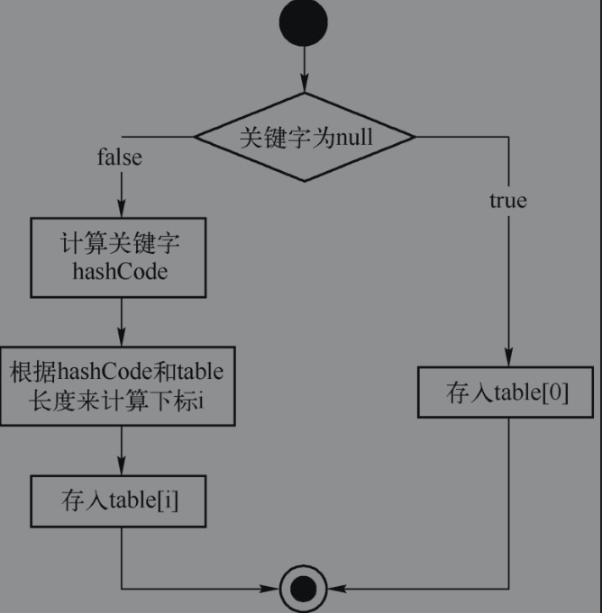

可以注意到，该流程图和put方法的实现不是完全一一对应的，接下来会详细讲解相关内容。

###### indexFor方法计算下标

indexFor(int,int)方法，作用是根据hashCode和table长度来计算下标。`h & (length-1)`

在这里h&(length-1) 有什么意义呢？

h是目标key值的hashCode，该hashCode最终要被换算为table中的指定下标，那么，如果不发生扩容，那么hashCode应当是不能超出length-1的。由此，需要把hashCode进行一定变换，保留不超出length的特征值，也即是hash表的冲突处理。

&（与运算）是如何实现这个功能的呢？

这里就涉及了length的特殊性，在之前介绍成员变量的时候有提及过，table的长度一定是2的幂。在二进制表示里，可以认为length一定满足1 << x。也即是10,1000,100000这样的二进制形式。那么length-1，自然就是高位全部为0，低位全部为1的二进制形式。

与运算的特性是：1&1=1，1&0=0，0&1=0。

那么，h&(length-1)的意义就很明确了，假如h>length-1，计算后，超出的位数归零，没有超出的位数不变。也即是高位全部归零，而低位保持不变，等同于对h取余，保证计算后的index不会超出table的长度范围。

即是：h小于length-1的时候，取h；h大于length-1的时候，取余数。

###### hash(Object k)方法计算键值k的hashCode

hash(Object k)方法，用于计算键值k的hashCode。

```java
package java.util;

public class HashMap<K,V> extends AbstractMap<K,V>
    implements Map<K,V>, Cloneable, Serializable {

    final int hash(Object k) {
        int h = hashSeed;
        if (0 != h && k instanceof String) {
            //当处理String类型数据时，直接调用sun.misc.Hashing.stringHash32(String)方法来获取最终的哈希值。
            return sun.misc.Hashing.stringHash32((String) k);
        }
		//当处理其他类型数据时，提供一个相对于HashMap事例唯一且不变的随机值hashSeed作为hashCode计算的初始量。
        h ^= k.hashCode();
		//之后执行了一些异或操作和无符号右移操作，则是把高位的数据和低位的数据特性混合起来，使hashCode更加离散。
        h ^= (h >>> 20) ^ (h >>> 12);
        return h ^ (h >>> 7) ^ (h >>> 4);
    }
    
}
```


首先建立一个概念，松散哈希。松散哈希是指数值尽可能平衡分布的hashCode，在Java语言中，一般会认为hashCode是一个int值，int是一个32bit整型数，比如一个八位十六进制数：1A47F1C0，比之C790 0000就要松散。

松散哈希有什么意义呢？

之前提到过，HashMap默认的容量是16，同时，在indexFor(int,int)方法的介绍里也提到过，hashCode如果超出length-1，那么会执行取余计算。

设想一个情况，如果有一类数据，其原始的hashCode集中在000A 0000～FFFF 0000之间，那么，计算indexFor的时候，其结果会全部为0。

这种hashCode重复的现象称之为哈希碰撞，当发生哈希碰撞的时候，碰撞的键值对都会被存入同一条链表中，导致HashMap效率低下。松散哈希可以尽量减少哈希碰撞的发生。


**异或操作**（^），同位数相同则为0，不同则为1。比如0^0=0，1^0=1。

**无符号右移操作**（>>>），是忽略符号位（最高位），整体位数右移。


###### 存储数据。对应put方法中for循环之后的部分。

```java
 		for (Entry<K,V> e = table[i]; e != null; e = e.next) {
            Object k;
            if (e.hash == hash && ((k = e.key) == key || key.equals(k))) {
                V oldValue = e.value;
                e.value = value;
                e.recordAccess(this);
                return oldValue;
            }
        }

        modCount++;
        addEntry(hash, key, value, i);
        return null;
```

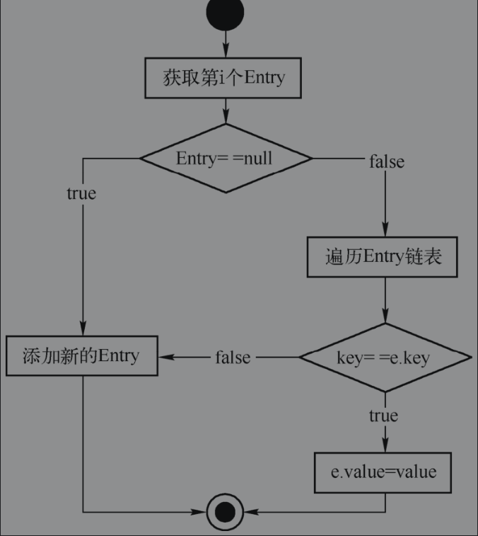


根据该流程图，可以得出结论，新增Entry的情况有以下两种：

- table[]里不存在指定下标，也就是没有发生哈希碰撞。
- table[]里存在指定下标（发生了哈希碰撞），但是该下标对应的链表上所有结点都和待添加的键值对的key值不同，在这种情况下也会向这个链表中添加Entry结点。


###### addEntry(int,K,V,int)和createEntry(int,K,V,int)，添加键值对。

该方法参数分别为hash值、键值、值以及下标。由于HashMap的核心数据结构是一个数组，所以一定会涉及数组的扩容。是否需要扩容的依据为成员变量：`threshold`

当添加键值对的时候，如果键值对将要占用的位置不是null，并且size>=threshold，那么会启动HashMap的扩容方法resize(2*table.length)，扩容之后会重新计算一次hash和下标。

不论HashMap是否扩容，都会执行创建键值对createEntry(hash,key,value,bucketIndex)方法，该方法会增加size。

```java
package java.util;

public class HashMap<K,V> extends AbstractMap<K,V>
    implements Map<K,V>, Cloneable, Serializable {

    void addEntry(int hash, K key, V value, int bucketIndex) {
        if ((size >= threshold) && (null != table[bucketIndex])) {
            resize(2 * table.length);
            hash = (null != key) ? hash(key) : 0;
            bucketIndex = indexFor(hash, table.length);
        }

        createEntry(hash, key, value, bucketIndex);
    }

    void createEntry(int hash, K key, V value, int bucketIndex) {
        Entry<K,V> e = table[bucketIndex];
        table[bucketIndex] = new Entry<>(hash, key, value, e);
        size++;
    }

    static class Entry<K,V> implements Map.Entry<K,V> {
    
        Entry(int h, K k, V v, Entry<K,V> n) {
            value = v;
            next = n;
            key = k;
            hash = h;
        }
    } 
}
```

###### resize(int)扩充容量

resize(int)，用于给HashMap扩充容量。resize主要完成以下工作：

1 根据新的容量，确定新的扩容阈值（threshold）大小。如果当前的容量已经达到了最大容量（1<<30)，那么把threshold设为Integer最大值；反之，则用新计算出来的容量乘以加载因子（loadFactor），计算结果和最大容量+1比较大小，取较小者为新的扩容阈值。

Integer最大值为0x7fffffff，如果threshold被设置为最大整型数，那么它必然大于size，扩容操作不会再次触发。而容量*加载因子得到的是一个小于容量的数（加载因子必须小于1大于0），以它为阈值则说明，加载因子的大小对HashMap影响很大，太小了会导致HashMap频繁扩容，太大了会导致空间的浪费。0.75是Java提供的建议值。


2 确定是否要哈希重构（rehash），判断依据是原有的useAltHashing（是否使用替代哈希算法标识）和新产生的这个值，是否一致。不一致时，需要哈希重构。

这一点可以参考前文的hash(K)方法，useAltHashing这个值的一致性导致了计算hash值时，是否需要调用替代方案。


3 使用新容量来构造新的Entry<K,V>table数组，调用transfer(newTable, rehash)来重新计算当前所有结点转移到新table数组后的下标。

```java
package java.util;

public class HashMap<K,V> extends AbstractMap<K,V>
    implements Map<K,V>, Cloneable, Serializable {

    void resize(int newCapacity) {
        Entry[] oldTable = table;
        int oldCapacity = oldTable.length;
        if (oldCapacity == MAXIMUM_CAPACITY) {
            threshold = Integer.MAX_VALUE;
            return;
        }

        Entry[] newTable = new Entry[newCapacity];
        transfer(newTable, initHashSeedAsNeeded(newCapacity));
        table = newTable;
        threshold = (int)Math.min(newCapacity * loadFactor, MAXIMUM_CAPACITY + 1);
    }

}
```

###### transfer(Entry[], boolean)，重新计算转移到新table数组后的Entry下标。

该方法会遍历所有的键值对，根据键值的哈希值和新的数组长度来确定新的下标，如果需要哈希重构，那么还需先对所有键值执行哈希重构。

```java
package java.util;

public class HashMap<K,V> extends AbstractMap<K,V>
    implements Map<K,V>, Cloneable, Serializable {

    void transfer(Entry[] newTable, boolean rehash) {
        int newCapacity = newTable.length;
        for (Entry<K,V> e : table) {
            while(null != e) {
                Entry<K,V> next = e.next;
                if (rehash) {
                    e.hash = null == e.key ? 0 : hash(e.key);
                }
                int i = indexFor(e.hash, newCapacity);
                e.next = newTable[i];
                newTable[i] = e;
                e = next;
            }
        }
    }
}
```

###### put方法总结

put方法是HashMap中最常用的方法之一，可以看到，它的实现相对复杂，整个功能包括：

- 计算键值（key）的hash值。
- 根据hash值和table长度来确定下标。
- 存入数组。
- 根据key值和hash值来比对，确定是创建链表结点还是替代之前的链表值。
- 根据增加后的size来扩容，确定下一个扩容阈值，确定是否需要使用替代哈希算法。


#####  get方法


```java
package java.util;

public class HashMap<K,V> extends AbstractMap<K,V>
    implements Map<K,V>, Cloneable, Serializable {

    public V get(Object key) {
        if (key == null)
            return getForNullKey();
        Entry<K,V> entry = getEntry(key);

        return null == entry ? null : entry.getValue();
    }
    
    final Entry<K,V> getEntry(Object key) {
        if (size == 0) {
            return null;
        }

        int hash = (key == null) ? 0 : hash(key);
        for (Entry<K,V> e = table[indexFor(hash, table.length)];
             e != null;
             e = e.next) {
            Object k;
            if (e.hash == hash &&
                ((k = e.key) == key || (key != null && key.equals(k))))
                return e;
        }
        return null;
    }
}
```

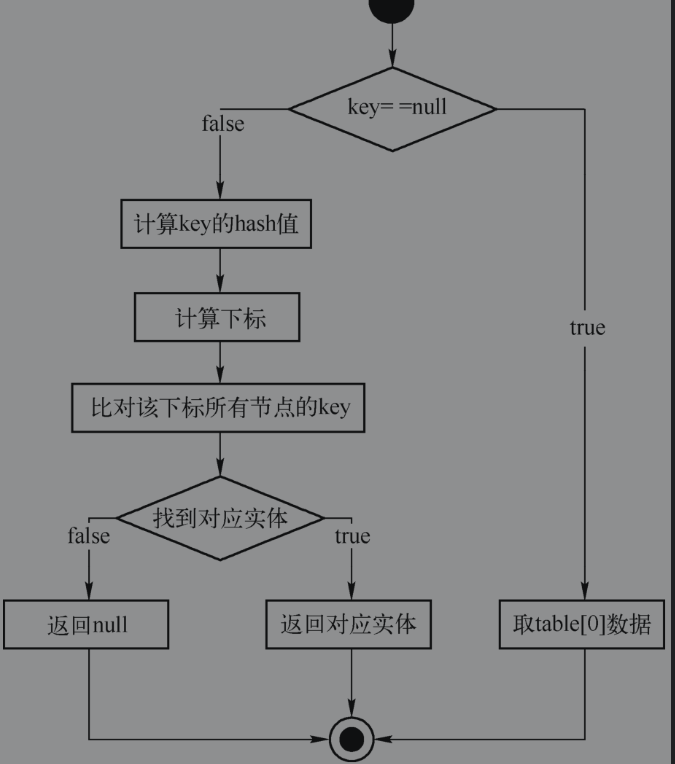


从上面的流程图可以看出，每一次get操作都要比较对应链表所有结点key值，因为链表的遍历操作的时间复杂度为O(n)，所以，get方法的性能关键就在链表的长度上。


#### Java 8提供的HashMap

Java 8的HashMap数据结构发生了较大的变化，之前的HashMap使用的数组+链表来实现，这主要体现在Entry<K,V>[]table这个成员变量，新的HashMap里，虽然依然使用的是table数组，但是数据类型发生了变化。如下所示：

显而易见，代表链表结点的Entry<K,V>换成了Node<K,V>，Node本身具备链表结点的特性，同时，它还有一个子类TreeNode<K,V>，从名字可以看出，这是个树结点。

可以得出推论：Java 8里的HashMap使用的是数组+树+链表的结构。

```java
public class HashMap<K,V> extends AbstractMap<K,V>
    implements Map<K,V>, Cloneable, Serializable {

    static final int DEFAULT_INITIAL_CAPACITY = 1 << 4; // aka 16
    static final int MAXIMUM_CAPACITY = 1 << 30;
    static final float DEFAULT_LOAD_FACTOR = 0.75f;

    transient Node<K,V>[] table;

    static class Node<K,V> implements Map.Entry<K,V> {
        final int hash;
        final K key;
        V value;
        Node<K,V> next;
    }
    
    static final class TreeNode<K,V> extends LinkedHashMap.Entry<K,V> {
        TreeNode<K,V> parent;  // red-black tree links
        TreeNode<K,V> left;
        TreeNode<K,V> right;
        TreeNode<K,V> prev;    // needed to unlink next upon deletion
        boolean red;
    }
}
```

显而易见，代表链表结点的Entry<K,V>换成了Node<K,V>，Node本身具备链表结点的特性，同时，它还有一个子类TreeNode<K,V>，从名字可以看出，这是个树结点。

##### put(K,V)方法

Java 8的put方法与历史版本中的实现相比，有很多变化。

主体流程只有以下两步：

1. 获取key值的hashCode。
2. 调用putVal方法进行存值。

```java
public class HashMap<K,V> extends AbstractMap<K,V>
    implements Map<K,V>, Cloneable, Serializable {

    public V put(K key, V value) {
        return putVal(hash(key), key, value, false, true);
    }
    
    static final int hash(Object key) {
        int h;
        return (key == null) ? 0 : (h = key.hashCode()) ^ (h >>> 16);
    }
    
}
```

Java 8也进行了哈希分散，只不过计算过程简单了很多，这是一个经验性质的改进，之前版本采用的多次位移异或计算方式与这种实现方式相比，并不能避免太多的哈希碰撞，反倒增加了计算次数。

HashMap的效率问题主要还是出在链表部分的遍历上。因此提高链表遍历的效率就能够提高HashMap的效率。下面通过源码的实现来讲解Java 8如何提高遍历的效率。


putVal(int,K,V,boolean,boolean)方法详解。

putVal方法的定义如下所示：

```java
public class HashMap<K,V> extends AbstractMap<K,V>
    implements Map<K,V>, Cloneable, Serializable {

	//hash代表key值的hashCode。
    //onlyIfAbsent代表是否取代已存在的值。
    //ecvict在HashMap里并没有特殊含义，是一个为继承预留的布尔值，暂时不用关注。
    final V putVal(int hash, K key, V value, boolean onlyIfAbsent,
                   boolean evict) {
        
        Node<K,V>[] tab; Node<K,V> p; int n, i;
        
        if ((tab = table) == null || (n = tab.length) == 0)
            n = (tab = resize()).length;
        
        if ((p = tab[i = (n - 1) & hash]) == null)
            tab[i] = newNode(hash, key, value, null);
        
        else {
            Node<K,V> e; K k;
            if (p.hash == hash &&
                ((k = p.key) == key || (key != null && key.equals(k))))
                e = p;
            else if (p instanceof TreeNode)
                e = ((TreeNode<K,V>)p).putTreeVal(this, tab, hash, key, value);
            else {
                for (int binCount = 0; ; ++binCount) {
                    if ((e = p.next) == null) {
                        p.next = newNode(hash, key, value, null);
                        if (binCount >= TREEIFY_THRESHOLD - 1) // -1 for 1st
                            treeifyBin(tab, hash);
                        break;
                    }
                    if (e.hash == hash &&
                        ((k = e.key) == key || (key != null && key.equals(k))))
                        break;
                    p = e;
                }
            }
            if (e != null) { // existing mapping for key
                V oldValue = e.value;
                if (!onlyIfAbsent || oldValue == null)
                    e.value = value;
                afterNodeAccess(e);
                return oldValue;
            }
        }
        ++modCount;
        if (++size > threshold)
            resize();
        afterNodeInsertion(evict);
        return null;
    }
}
```

这个方法主要做了以下三件事：

①计算下标，j 计算公式为：下标=table的长度-1&hash，与历史版本一致。

②当table为空，或者数据数量（size）超过扩容阈值（threshold）的时候，重新计算table长度。

③保存数据。保存数据又分为多种情况：

- 当下标位置没有结点的时候，直接增加一个链表结点。
- 当下标位置结点为树结点（TreeNode）的时候，增加一个树结点。
- 当前面情况都不满足时，则说明当前下标位置有结点，且为链表结点，此时遍历链表，根据hash和key值判断是否重复，以决定是替代某个结点还是新增结点。
- 在添加链表结点后，如果链表深度达到或超过建树阈值（TREEIFY_THRESHOLD-1)，那么调用treeifyBin方法把整个链表重构为树。注意，TREEIFY_THRESHOLD是一个常量，值固定为8。也就是说，当链表长度达到7的时候，会转化为树结构，为什么要这样设计呢？该树是一棵红黑树，由于链表的查找是O(n)，而红黑树的查找是O(log2n)的，数值太小的时候，它们的查找效率相差无几，Java 8认为7是一个合适的阈值，因此这个值被用来决定是否要从链表结构转化为树结构。


##### resize方法

resize方法用于重新规划table长度和阈值，如果table长度发生了变化，那么部分数据结点也需要重新进行排列。这里分两部分来讨论：

①重新规划table长度和阈值，它主要遵循以下的逻辑：

当数据数量（size）超出扩容阈值时，进行扩容：把table的容量增加到旧容量的两倍。

如果新的table容量小于默认的初始化容量16，那么将table容量重置为16，阈值重新设置为新容量和加载因子（默认0.75）之积。

如果新的table容量超出或等于最大容量（1<<30），那么将阈值调整为最大整型数，并且return，终止整个resize过程。注意，由于size不可能超过最大整型数，所以之后不会再触发扩容。


②重新排列数据结点，该操作遍历table上的每一个结点，对它们分别进行处理：

如果结点为null，那么不进行处理。

如果结点不为null且没有next结点，那么重新计算该结点的hash值，存入新的table中。

如果结点为树结点(TreeNode)，那么调用该树结点的split方法处理，该方法用于对红黑树进行调整，如果红黑树太小，则将其退化为链表。

如果以上条件都不满足，那么说明结点为链表结点。在上文中提到过，根据hashcode计算出来的下标不会超出table容量，超出的位数会被设为0，而resize进行扩容后，table容量发生了变化，同一个链表里有部分结点的下标也应当发生变化。所以，需要把链表拆成两部分，分别为hashCode超出旧容量的链表和未超出容量的链表。对于hash&oldCap==0的部分，不需要做处理；反之，则需要被存放到新的下标位置上，公式如下所示：

新下标=原下标+旧容量；

该等式是个巧算，利用了位运算以及容量必然是2的指数的特性，下面会探讨它为什么会成立。

证明：

∵下标公式index=(length-1)&hash

∴新下标=(newCap-1)&hash，原下标+旧容量=(oldCap-1)&hash+oldCap

∵oldCap&hash !=0，oldCap是2的整数倍

∴oldCap&hash=oldCap

又∵newCap=oldCap<<1，oldCap是2的整数倍

∴新下标=(newCap-1)&hash

​	=(oldCap+oldCap-1)&hash

​	=oldCap&hash+(oldCap-1)&hash

​	=oldCap+(oldCap-1)&hash

​	=原下标+旧下标


思考一个问题，这样能确保新下标位置数据为null吗？

首先，(oldCap-1)&hash>0，所以index=oldCap+(oldCap-1)&hash必然大于oldCap，所以新下标一定存在于扩容的空间中，而新扩容的空间必然是null。

然后，又可证明，旧下标不同的数据，计算得出的新下标也不同。下标公式为：新下标=原下标+旧容量。这里的旧容量是个偏移量，所以原下标不同的结点不可能会被分配到同一个新下标。

```java

    final Node<K,V>[] resize() {
        Node<K,V>[] oldTab = table;
        int oldCap = (oldTab == null) ? 0 : oldTab.length;
        int oldThr = threshold;
        int newCap, newThr = 0;
        if (oldCap > 0) {
            if (oldCap >= MAXIMUM_CAPACITY) {
                threshold = Integer.MAX_VALUE;
                return oldTab;
            }
            else if ((newCap = oldCap << 1) < MAXIMUM_CAPACITY &&
                     oldCap >= DEFAULT_INITIAL_CAPACITY)
                newThr = oldThr << 1; // double threshold
        }
        else if (oldThr > 0) // initial capacity was placed in threshold
            newCap = oldThr;
        else {               // zero initial threshold signifies using defaults
            newCap = DEFAULT_INITIAL_CAPACITY;
            newThr = (int)(DEFAULT_LOAD_FACTOR * DEFAULT_INITIAL_CAPACITY);
        }
        if (newThr == 0) {
            float ft = (float)newCap * loadFactor;
            newThr = (newCap < MAXIMUM_CAPACITY && ft < (float)MAXIMUM_CAPACITY ?
                      (int)ft : Integer.MAX_VALUE);
        }
        threshold = newThr;
        @SuppressWarnings({"rawtypes","unchecked"})
            Node<K,V>[] newTab = (Node<K,V>[])new Node[newCap];
        table = newTab;
        if (oldTab != null) {
            for (int j = 0; j < oldCap; ++j) {
                Node<K,V> e;
                if ((e = oldTab[j]) != null) {
                    oldTab[j] = null;
                    if (e.next == null)
                        newTab[e.hash & (newCap - 1)] = e;
                    else if (e instanceof TreeNode)
                        ((TreeNode<K,V>)e).split(this, newTab, j, oldCap);
                    else { // preserve order
                        Node<K,V> loHead = null, loTail = null;
                        Node<K,V> hiHead = null, hiTail = null;
                        Node<K,V> next;
                        do {
                            next = e.next;
                            if ((e.hash & oldCap) == 0) {
                                if (loTail == null)
                                    loHead = e;
                                else
                                    loTail.next = e;
                                loTail = e;
                            }
                            else {
                                if (hiTail == null)
                                    hiHead = e;
                                else
                                    hiTail.next = e;
                                hiTail = e;
                            }
                        } while ((e = next) != null);
                        if (loTail != null) {
                            loTail.next = null;
                            newTab[j] = loHead;
                        }
                        if (hiTail != null) {
                            hiTail.next = null;
                            newTab[j + oldCap] = hiHead;
                        }
                    }
                }
            }
        }
        return newTab;
    }

```


### 红黑树相关知识点详解

二叉查找树。在介绍二叉树之前首先引入一个问题：对于有序数列[10，13，31，72，76，89，91，97]，如何确定31在哪个位置上？

当然可以依靠遍历来解决这个问题，直接遍历的时间复杂度和数列规模增长一致，也就是O(n)。更好的方式也很显而易见，二分查找法。

计算过程如下所示：

`[10，13，31，72，76，89，91，97]`

对于长度为8的数列，先找到length/2位置的数字，76比较，由于76>31，因此在数列的左半部分继续查找，左半部分长度为4，因此会查找在2/2=2的位置的数据，显然是31，查找结束。显然，第二次查找就找到了31这个数字。

`[10，13，31，72]`

从这个过程可以看出，最优结果是要查找的数字正好在划分点上，最差结果是，一直划分log2n次才找到对应结果。即是说，在最差结果下，二分查找的时间复杂度也是O(log2n)。

二分查找树就是以二分法思想为指导，设计出来一种快速查找树。

把上述查找过程转换成树结构。这棵树保证了以下几个特性：

- 每一个结点关键字只会在树中出现一次。
- 任何一个结点，如果它有子结点，那么左侧的关键字一定比较小，右侧的关键字一定比较大。

如果把之前的数列转化为这种结构，每次都从根结点开始查找，就算查找到叶子结点，也只是进行了log2n次比较，效率明显高于顺序\倒序遍历。


#### 平衡二叉树（AVL树） 

二叉树（AVL树有如下特点：

- 它是一棵空树或者二分树查找树。
- 左右两个子树的高度差的绝对值不超过1。
- 左右两个子树都是一棵平衡二叉树。

满足这些条件的二叉树，查找的时间复杂度不会超过O(log2n)。

换言之，在对二叉查找树做插入或删除的时候，需要通过一系列旋转操作（自平衡），让其始终满足平衡二叉树的条件，从而可以达到查找效率最优。

决定该树是否失衡的关键变量为平衡因子bf。bf(p)=p左子树高度-p右子树高度，它有以下特性：

- 结点平衡因子变化后，回溯修改父结点的平衡因子。
- 当平衡因子等于-2或者2的时候，认为以该结点为根结点的树失衡。
- 失衡后需要进行修复，修复完成后，停止回溯修改父结点的平衡因子。


##### 插入操作

插入操作有四种失衡情况。

①结点平衡因子为2，左孩子平衡因子为1，进行LL旋转（单向右旋）。比如，插入7：点插入后，因为7比10小，所以放置在了10的左侧。此时，受到影响而失衡最小子树为如图所示。

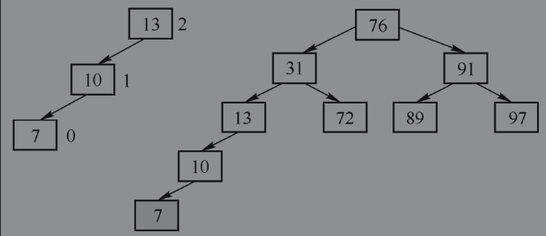

其左子树为根结点为10，左侧插入了7，对于这种情况，可以以13为旋转点进行单向右旋，这个子树替代原树的13结点，重新构成了平衡二叉树。旋转后结果如图所示。


②结点平衡因子为-2，右孩子平衡因子为1，则进行RR旋转（单向左旋）。旋转方式与情况一正好相反，参考情况一图解。

③结点平衡因子为2，左孩子平衡因子为-1，进行LR旋转(先左再右）。比如，插入结点19后的二叉树如图所示。

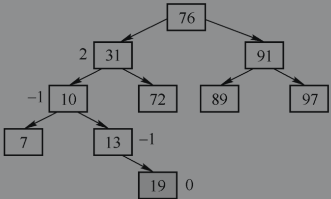


然后，对左子树进行左旋，左旋后的结果如图所示。

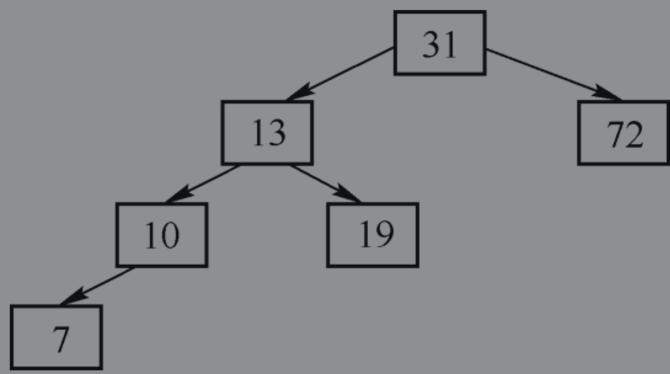

接下来，对整棵树进行右旋，结果如图所示。

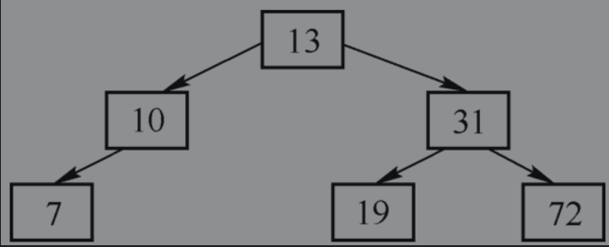

可以观察到，该子树重新恢复了平衡。④结点平衡因子为-2，左孩子平衡因子为1，进行RL旋转（先右后左旋转）。


##### 删除操作

①如果删除的结点的左右子结点任意一个为空，那么用另一个非空子结点直接替换当前结点，并回溯校验父结点的平衡因子。注意，如果没有子结点，那么事实上也满足该条件，也就是用空结点来替换当前结点。

②如果删除的结点的左右子结点都不为空，那么分两种情况：

- 当平衡因子为0或1时，在左子树里找到最大值，交换待删除结点与该最大值结点的值，然后执行删除该最大值结点的操作；这里以删除结点76为例，首先交换76与72，然后删除原来72对应的结点，如图所示。

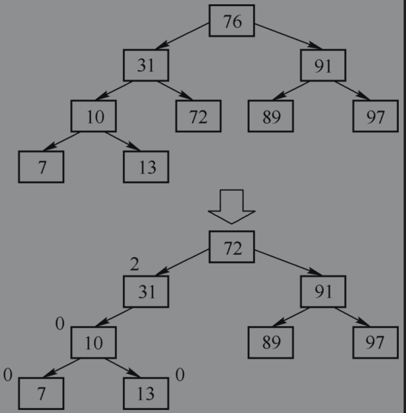

​	可以注意到，最小失衡树根结点为31，平衡因子为2，其左子树10平衡因子为0，不满足之前LL旋转，也不满足LR旋转。和上一个步骤一样，平衡因子0当作1一样的处理，进行LL单向右旋。

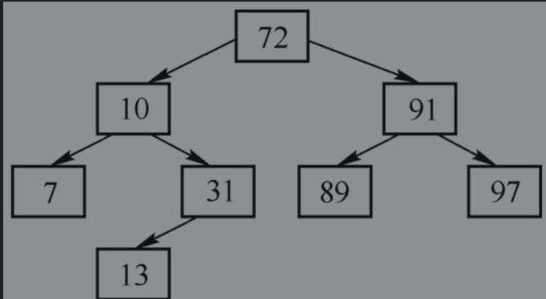


- 当平衡因子为-1时，则是在右子树里查找最小值，用这个最小值与待删除的结点进行交换，然后删除交换前最小值对应的结点，其余操作与上述操作相反。


####红黑树（R-B树）

红黑树也是一种自平衡二叉树，它的实现原理和平衡二叉树类似，但在统计上，它的性能要优于平衡二叉树。它有五个特性：

- 结点是红色或者黑色。
- 根结点是黑色。
- 每个叶子结点（NIL结点）为黑色。
- 每个红色结点的两个子结点都是黑色。
- 从任一结点到其每个叶子的所有路径都包含相同数目的黑色结点。

根据这些性质，可以得出推论：从根到叶子的最长路径，不超过最短路径的两倍。

为什么呢？

性质5约束了黑色结点数目一定相等，性质4又约束了不会有两个相邻的红色结点。所以可能的最长路径也就是以黑色结点结束的红黑相间的结点，红色结点数目最多为黑色结点数目-1，红色+黑色不可能超出黑色x2。

对红黑树进行增删操作，一定会违背这些性质，所以，和平衡二叉树一样，需要在插入时做一些特定的操作。

在讲解红黑树复杂的操作之前，需要先介绍红黑树结点，它除了其他二叉树一样的left\right\parent结点引用之外，还有颜色（red\black）属性，以及是否为叶子结点（isNil）标记。


##### 插入操作

现在来进行一次插入操作，因为性质5的约束，所有新插入的结点，都是红色结点。假设插入结点为N，父结点为P，祖父结点为G，叔结点为U，定义一个函数f(A,B)，函数返回A结点相对于B结点的位置（left/right)。来看看插入的流程：

①如果该树为空树，那么N为根结点，变色为黑（性质2）。

②如果P为黑色，那么由于新增的结点为红色，不会违背性质5，满足红黑树性质，所以，不做任何操作。

③如果P为红色，那么分多种子情况处理：

​		U为红色，把P、U改为黑色、G改为红色。G改为红色后，由于G的父结点也可能是红色，从而违背性质4，这时，把G结点视为新插入的结点，递归进行插入操作。

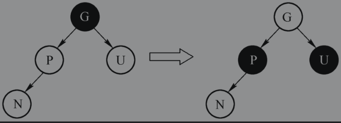

​		U为黑色，且f(P,G)=f(N,P)，则将P、G变色，对G为根结点的树作单向旋转（f(P,G)=L则LL右旋转，为R则RR左旋转），旋转是为了保证子树上的黑色结点总数一致。如下例所示，P在G左侧，N在P左侧，变色后作LL单向右旋转，如图5-39所示。

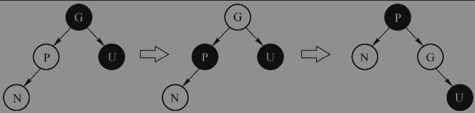


​		U为黑色，且f(P,G) !=f(N,P)，对P进行一次单向旋转，转化为f(P,G)=f(P,N)情况。如下例所示，P在G左侧，N在P右侧，以P为旋转点进行RR单向左旋。

##### 总结

红黑树的插入过程主要操作有两种：

- 变色，用于调整两个红色结点相邻的情况，以适应性质4。
- 旋转，用于调整左右子树黑色结点数目不等的情况，以适应性质5。


### 红黑树在HashMap中的体现

#### treeifyBin方法

当table容量小于最小建树容量（64）时，则调整table大小（resize）。由于resize的过程可以分解链表，所以无需转化链表为树。

“最小建树容量”这个常量存在的意义在于：

重新规划table大小和树化某个哈希桶（哈希值对应下标位置的容器），这两种方式都可以提高查询效率，那么，如何在这两种方式之间就需要某个平衡点呢？

如果有大量结点堆积在某个哈希桶里，那么应该倾向于重新规划table大小，但是当table足够小时，大量结点堆积的情况较为常见，因此，这里取了一个经验数字64作为衡量。

如果table容量超出64，那么调用TreeNode.treeify方法把链表转化为红黑树。

####putTreeVal方法

putTreeVal方法用于保存树结点。该方法执行二叉树查找，每一次都比较当前结点和待插入结点的大小，如果待插入结点较小，那么在当前结点左子树查找，否则在右子树查找。

这种查找效率等同于二分法，时间复杂度为O(log2n)。

待找到空位可以存放结点值之后，执行两个方法：

①balanceInsertion(root,x)，平衡插入，一方面把结点插入红黑树中，另一方面对红黑树进行转换，使之平衡。

②moveRootToFront(table,root)，由于红黑树重新平衡之后，root结点可能发生了变化，table里记录的结点不再是红黑树的root，需要重置。


####balanceInsertion平衡插入方法

```java
public class HashMap<K,V> extends AbstractMap<K,V>
    implements Map<K,V>, Cloneable, Serializable {

    static final class TreeNode<K,V> extends LinkedHashMap.Entry<K,V> {

        //root 为根节点
        // x 代表 要插入的节点
        // 返回值为新的根节点
        static <K,V> TreeNode<K,V> balanceInsertion(TreeNode<K,V> root,
                                                    TreeNode<K,V> x) {
            x.red = true;
            for (TreeNode<K,V> xp, xpp, xppl, xppr;;) {
                if ((xp = x.parent) == null) {
                    //没有根节点，插入节点为根节点，置位黑色
                    x.red = false;
                    return x;
                }
                //父节点为黑色，无需转换直接返回根节点
                //父节点为红色，则祖父节点 xpp 不可能为 null，这里仅仅为了执行 xpp 赋值
                else if (!xp.red || (xpp = xp.parent) == null)
                    return root;
                //父节点在祖父节点的左侧
                if (xp == (xppl = xpp.left)) {
                    //叔 节点为红色的执行情况
                    if ((xppr = xpp.right) != null && xppr.red) {
                        xppr.red = false;
                        xp.red = false;
                        xpp.red = true;
                        x = xpp;
                    }
                    // 没有 叔节点，或叔节点为黑色的执行情况
                    else {
                        //节点在父节点右侧的情况，左旋
                        if (x == xp.right) {
                            root = rotateLeft(root, x = xp);
                            xpp = (xp = x.parent) == null ? null : xp.parent;
                        }
                        //如没有执行过上一步左旋，那么xp必然不为null，即是 x==xp.left，执行右旋
                        //如果进行过上一步的左旋，如果xp不为null，那么需要执行一次右旋
                        if (xp != null) {
                            xp.red = false;
                            if (xpp != null) {
                                xpp.red = true;
                                root = rotateRight(root, xpp);
                            }
                        }
                    }
                }
                else {
                    //父节点在祖父节点的右侧，且叔节点为红的情况
                    if (xppl != null && xppl.red) {
                        xppl.red = false;
                        xp.red = false;
                        xpp.red = true;
                        x = xpp;
                    }
                    //父节点在祖父节点的右侧，且没有叔节点的情况
                    else {
                        if (x == xp.left) {
                            root = rotateRight(root, x = xp);
                            xpp = (xp = x.parent) == null ? null : xp.parent;
                        }
                        if (xp != null) {
                            xp.red = false;
                            if (xpp != null) {
                                xpp.red = true;
                                root = rotateLeft(root, xpp);
                            }
                        }
                    }
                }
            }
        }

        //左旋
        static <K,V> TreeNode<K,V> rotateLeft(TreeNode<K,V> root,
                                              TreeNode<K,V> p) {
            TreeNode<K,V> r, pp, rl;
            if (p != null && (r = p.right) != null) {
                if ((rl = p.right = r.left) != null)
                    rl.parent = p;
                if ((pp = r.parent = p.parent) == null)
                    (root = r).red = false;
                else if (pp.left == p)
                    pp.left = r;
                else
                    pp.right = r;
                r.left = p;
                p.parent = r;
            }
            return root;
        }

        //右旋
        static <K,V> TreeNode<K,V> rotateRight(TreeNode<K,V> root,
                                               TreeNode<K,V> p) {
            TreeNode<K,V> l, pp, lr;
            if (p != null && (l = p.left) != null) {
                if ((lr = p.left = l.right) != null)
                    lr.parent = p;
                if ((pp = l.parent = p.parent) == null)
                    (root = l).red = false;
                else if (pp.right == p)
                    pp.right = l;
                else
                    pp.left = l;
                l.right = p;
                p.parent = l;
            }
            return root;
        }
        
    }
}
```

xp、xpp、xppl、xppr分别代表父结点、祖父结点、祖父左子结点、祖父右子结点。

祖父的左右子结点，一个是父结点，另一个自然是叔结点，因此可以使用xp==xppl来确认父结点是祖父结点的左结点还是右结点。

rotateLeft和rotateRight方法。这两个方法用于旋转。


### TreeMap

TreeMap是完全由红黑树实现的。

#### 成员变量

```java
package java.util;

public class TreeMap<K,V>
    extends AbstractMap<K,V>
    implements NavigableMap<K,V>, Cloneable, java.io.Serializable{
    
    //比较器，决定了节点在树中的分布
    private final Comparator<? super K> comparator;
	//树中的根节点
    private transient Entry<K,V> root;
    //树中包含的实体数目
    private transient int size = 0;
    
}
```

#### 构造方法

TreeMap有四个构造方法：

- public TreeMap()。无参构造，初始化comparator=null。
- public TreeMap(Comparator<? super K>comparator)。比较器构造，使用外部传入的比较器。
- public TreeMap(Map<? extends K, ? extends V>m)。使用传入的Map初始化TreeMap的内容。
- public TreeMap(SortedMap<K, ? extends V>m)。使用SortedMap初始化TreeMap内容，同时使用SortedMap的比较器来初始化TreeMap比较器。

#### put方法

put的实现较为清晰：

- 如果TreeMap是空的，那么使用指定数据作为根结点。
- 反之，如果comparetor不为空，那么使用comparetor来决定插入位置；如果comparetor为空，那么认为key值实现了Comparable，直接调用compareTo方法来决定插入位置；如果key没有实现Comparable，那么抛出ClassCastException。
- 插入完成后，修复红黑树。修复方式参考前面章节中红黑树相关知识。


###  Java 8之前的LinkedHashMap

#### 成员变量

除了与HashMap类似的部分实现外，LinkedHashMap有以下两个需要特别注意的成员变量：

```java
package java.util;

public class LinkedHashMap<K,V>
    extends HashMap<K,V>
    implements Map<K,V{
    
    //双向链表的表头
    private transient Entry<K,V> header;
    //访问顺序，true为顺序访问，false为逆序
    private final boolean accessOrder;
    
}
```

LinkedHashMap的存储中包含了一个额外的双向链表结构，header既是头又是尾，可以视作一个环状链表，但它本身只是个表头标记，不包含数据域。

LinkedHashMap可以像HashMap一样的使用，同时它为每个数据结点的引用多维护了一份链表，从而可以达到有序访问的目的。


#### createEntry(hash,key,value,index)方法

LinkedHashMap和HashMap的第一个主要区别体现在createEntry方法上。

HashMap的createEntry执行的是创建Hash桶里的链表结点。

LinkedHashMap的createEntry除了完成HashMap的功能外，还把该链表结点的引用插入到了header环形链表里，实现源码如下所示：

```java
package java.util;

public class LinkedHashMap<K,V>
    extends HashMap<K,V>
    implements Map<K,V{
    
    void createEntry(int hash, K key, V value, int bucketIndex) {
        HashMap.Entry<K,V> old = table[bucketIndex];
        Entry<K,V> e = new Entry<>(hash, key, value, old);
        table[bucketIndex] = e;
        //插入到 head 节点 和 head.before 节点之间
        e.addBefore(header);
        size++;
    }
    
}
```

####如何使用LinkedHashMap

查阅LinkedHashMap的API，可以注意到LinkedHashMap没有提供新的公开方法。那么，它的链表特性怎么体现呢？

LinkedHashMap通过对 keySet()、values()、entrySet() 这三个方法进行重写使上述三个方法产生的集合可以按照插入顺序排列。


###  Java 8里的LinkedHashMap

#### 成员变量

关键变量有三个：

```java
public class LinkedHashMap<K,V>
    extends HashMap<K,V>
    implements Map<K,V>{
    
    transient LinkedHashMap.Entry<K,V> head;

    transient LinkedHashMap.Entry<K,V> tail;
    
    final boolean accessOrder;

}
```

与历史版本的LinkedHashMap的实现方法不同，head和tail分别维护在了两个引用里，这让LinkedHashMap的结构发生了变化，实现原理如图所示。

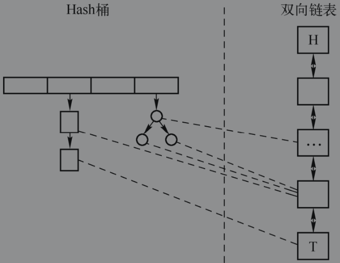

由上图可以发现，LinkedHashMap新版本的实现与HashMap新版本的实现类似，也是采用了链表与二叉树组合的方式来实现。原理上与历史版本的LinkedHashMap并没有区别。


#### linkNodeLast方法

newNode方法与newTreeNode方法源自HashMap，是用来新建结点的。在LinkedHashMap中，重写了这两个方法，负责在创建结点的同时插入链表，实现了保存数据结点副本到双向链表里的功能。

在这两个方法的实现中，关键实现是对linkNodeLast方法的调用。

linkNodeLast方法源码如下所示，参数p为新创建的结点：

```java
    private void linkNodeLast(LinkedHashMap.Entry<K,V> p) {
        LinkedHashMap.Entry<K,V> last = tail;
        tail = p;
        if (last == null)
            head = p;
        else {
            p.before = last;
            last.after = p;
        }
    }

```

#### transferLinks方法

replacementNode方法和replacementTreeNode方法负责替换指定结点，对这两个方法的重写保证了在结点替换时，同时维护好它们在双向链表里的原始插入顺序。

在LinkedHashMap里，它们会额外调用transferLinks方法。


### Hashtable

Hashtable的实现与HashMap很类似，Java 8的Hashtable稍有不同，但整体流程是没有变化的。Hashtable的put过程大致如下所示：

- 计算key值的hashCode。
- 根据hashCode计算下标。
- 如果存在hashCode和key值完全相等的value，那么替换它并返回。
- 反之，如果总数据数超出了扩容阈值，那么对数组扩容，并重新计算所有的数据结点的下标。
- 为新数据创建新结点。


从源码可以看出Hashtable的实现方式被synchronized修饰，由此可见Hashtable是线程安全的，而HashMap是线程不安全的；此外Hashtable不能存放null作为key值，HashMap会把null key存在下标0位置。

虽然Hashtable是“线程安全”的，但在多线程环境下并不推荐使用。因为采用synchr-onized方式实现的多线程安全的容器在大并发量的情况下效率比较低下，Java还引入了专门与大并发量的情况下使用的并发容器，这种容器由于在实现的时候采用了更加细粒度的锁，由此在大并发量的情况下有着更好的性能。在5.5并发容器的章节中，将会对部分并发容器详细解析。