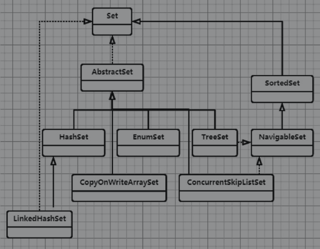

### HashSet

HashSet的两个重要的特性：

- HashSet中不会有重复的元素。
- HashSet中最多只允许有一个null。




显然HashMap也有着相同的特性：HashMap的key不能有重复的元素，key最多也只能有一个null。正因为如此，HashSet内部是通过HashMap来实现的。下面给出HashSet的部分实现源码：

```java
package java.util;

public class HashSet<E>
    extends AbstractSet<E>
    implements Set<E>, Cloneable, java.io.Serializable{
    
    static final long serialVersionUID = -5024744406713321676L;
	//底层使用 HashMap 实现
    private transient HashMap<E,Object> map;
    
    //定义一个虚拟的  Object对象 作为HashMap的value
    private static final Object PRESENT = new Object();
    
    public HashSet() {
        map = new HashMap<>();
    }

    HashSet(int initialCapacity, float loadFactor, boolean dummy) {
        map = new LinkedHashMap<>(initialCapacity, loadFactor);
    }

}
```

从上面的源码可以看出HashSet在底层是通过HashMap来实现的，只不过对于HashMap来说，每个key可以有自己的value；而在HashSet中，由于只关心key的值，因此所有的key都会使用相同的value（PRESENT）。由于PRESENT被定义为static，因此会被所有的对象共享，这样的实现显然会节约空间。

由于这些实现源码都是非常直观的，这里就不详细介绍了，下面重点给出几点注意事项：

- HashSet不是线程安全的，如果想使用线程安全的Set，那么可以使用CopyOnWriteArraySet、Collections.synchronizedSet(Setset)、ConcurrentSkipListSet和Collections.newSetFromMap(NewConcurrentHashMap)。
- HashSet不会维护数据插入的顺序，如果想维护插入顺序，那么可以使用Linked HashSet。
- HashSet也不会对数据进行排序，如果想对数据进行排序，那么可以使用TreeSet。


###LinkedHashSet

LinkedHashSet是HashSet的扩展，HashSet并不维护数据的顺序，而LinkedHashSet维护了数据插入的顺序。HashSet在内部是使用HashMap来实现的，而LinkedHashSet内部通过LinkedHashMap来实现。这一节将重点介绍LinkedHashSet内部的实现机制以及它是怎么维护数据的插入顺序的。

```java
package java.util;

public class LinkedHashSet<E>
    extends HashSet<E>
    implements Set<E>, Cloneable, java.io.Serializable {

    //initialCapacity 初始容量
    //loadFactor 加载因子
    public LinkedHashSet(int initialCapacity, float loadFactor) {
        super(initialCapacity, loadFactor, true);
    }
    
}
```


###TreeSet

TreeSet有HashSet所有的特性，而且它还增加了一个排序的特性。也就是说TreeSet中的数据是有序的，它默认使用的是数据的自然顺序，当然在创建TreeSet的时候也可以指定Comparator来对数据进行排序。那么TreeSet底层是如何实现数据的排序呢，下面给出TreeSet内部实现的部分源码：

```java
package java.util;

public class TreeSet<E> extends AbstractSet<E>
    implements NavigableSet<E>, Cloneable, java.io.Serializable{
    
    private transient NavigableMap<E,Object> m;
    
    private static final Object PRESENT = new Object();
    
    TreeSet(NavigableMap<E,Object> m) {
        this.m = m;
    }
    
}
```

通过源码可以发现，它的实现与HashMap类似，底层使用TreeMap来存储数据，因此把数据有序功能的实现交给了TreeMap。这里重点介绍一下add方法。对于TreeMap而言，它的返回值有两种情况：

- 如果新增加的key是唯一的，那么它会返回null。
- 如果新增加的key在TreeMap中已经存在了，那么它会返回key对应的value值。

因此TreeSet的add方法正是通过这个返回值来判断新的数据是否被加入进去：如果put方法返回null，那么说明数据被插入到TreeSet中了，此时map.put(e, PRESENT)==null的值为true，因此add方法返回true。否则返回false表示数据已经在TreeSet中了，不需要再次插入了。