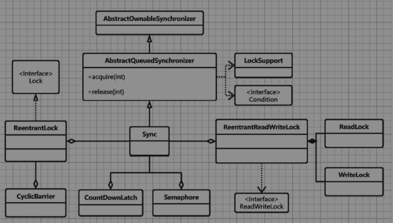
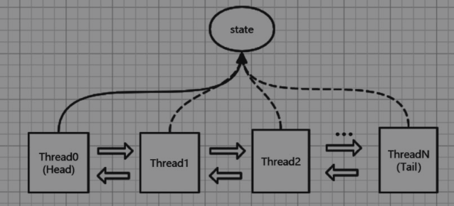
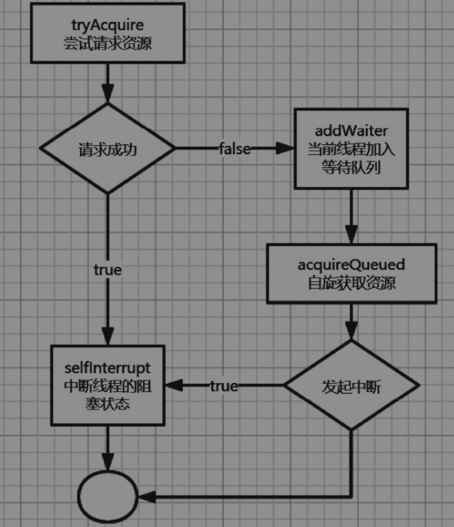
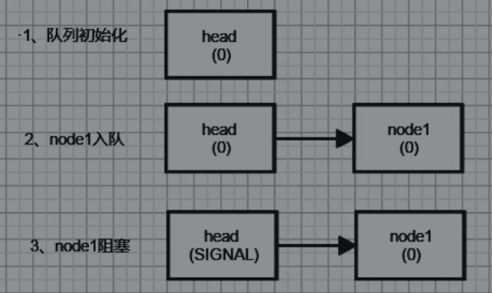
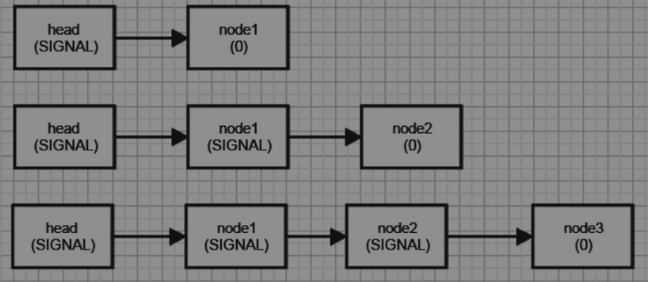
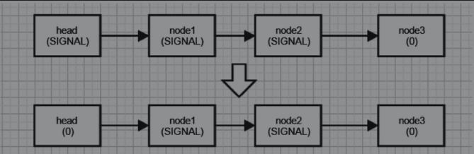
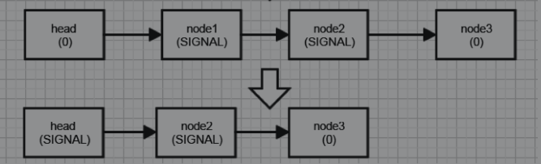

## AQS队列同步器

java.util.concurrent包的核心类是AbstractQueueSynchronizer（之后简称AQS）。

AQS是一个同步器+阻塞锁的基本架构，用于控制加锁和释放锁，并在内部维护一个FIFO（First In First Out，先进先出）的线程等待队列。java.util.concurrent包中的锁、屏障等同步器多数都是基于它实现的。



AbstractOwnableSynchronizer是一个可以由线程以独占方式拥有的同步器，这个类为创建锁和相关同步器提供了基础。虽然它本身不管理或使用此信息。但是，子类或其他工具可以维护相应的值来提供诊断信息。

AbstractQueuedSynchronizer用虚拟队列的方式来管理线程中锁的获取与释放，同时也提供了各种情况下的线程中断。这个类虽然提供了默认的同步实现，但是获取锁和释放锁的实现被定义为抽象方法，由子类实现。这样做的目的是使开发人员可以自由定义锁的获取与释放方式。

Sync是ReentrantLock的内部抽象类，实现了简单的锁的获取与释放。

Sync有两个子类NonfairSync和FairSync，分别表示“非公平锁”和“公平锁”，且都是ReentrantLock的内部类。ReentrantLock实现了Lock接口的lock-unlock方法，这个方法会根据fair参数决定使用NonfairSync还是FairSync。

ReentrantReadWriteLock是Lock的另一种实现方式，ReentrantLock是一个排他锁，同一时间只允许一个线程访问，而ReentrantReadWriteLock允许多个读线程同时访问，但不允许写线程和读线程、写线程和写线程同时访问。与排他锁相比，能提供更高的并发性。


AQS底层使用的链表



AQS维护了一个volatile int state和一个FIFO线程等待队列（使用双向链表实现的，当多线程争用资源被阻塞时会进入此队列）。只有当Head结点持有的线程释放了资源后，下一个线程才能获得资源。在这个工作模型中，state即是AQS的同步状态标量，也被称为资源。


```java
package java.util.concurrent.locks;

public abstract class AbstractOwnableSynchronizer
    implements java.io.Serializable {

}
```


```java
package java.util.concurrent.locks;

public abstract class AbstractQueuedSynchronizer
    extends AbstractOwnableSynchronizer
    implements java.io.Serializable {
    
    private volatile int state;
    
    private transient volatile Node head;
    private transient volatile Node tail;//尾节点
    
    protected final int getState() {
        return state;
    }
    
    protected final void setState(int newState) {
        state = newState;
    }
    
    protected final boolean compareAndSetState(int expect, int update) {
        // See below for intrinsics setup to support this
        return unsafe.compareAndSwapInt(this, stateOffset, expect, update);
    }
    
    static final class Node {
		static final Node SHARED = new Node();
        static final Node EXCLUSIVE = null;
        static final int CANCELLED =  1;
        static final int SIGNAL    = -1;
        static final int CONDITION = -2;
        static final int PROPAGATE = -3;
        volatile int waitStatus;
        volatile Node prev;
        volatile Node next;
        volatile Thread thread;
    }
}
```


### AQS的同步状态关键字

state是AQS非常重要的描述线程同步状态的成员变量。

state用来表示“线程争抢的资源”。如果是0，那么说明没有线程正在等待资源，如果为n（n>0），那么说明有n个线程正在等待资源释放。在AQS中，state有三种访问方式：getState、setState、compareAndSetState。

通过观察state的定义，可以注意到一个关键字：volatile。

volatile关键字让state变量保持线程间的可见性和有序性，是保证state线程安全的必要条件之一。

AQS定义两种资源共享方式：Exclusive（独占，在特定的时间内，只有一个线程能执行，如ReentrantLock）和Share（共享，多个线程可同时执行，如Semaphore/CountDownLatch）。

可见不同的实现方式争用共享资源的方式也不同。由此，在自定义同步器在实现时只需要根据需求来实现共享资源state的获取与释放方式即可，至于具体线程等待队列的维护（如获取资源失败入队/唤醒出队等），AQS已经实现好了。自定义同步器时主要需要实现以下几种方法：

- isHeldExclusively()：该线程是否正在独占资源。只有用到condition时才需要去实现它。
- tryAcquire(int)：独占方式。尝试获取资源，成功则返回true，失败则返回false。
- tryRelease(int)：独占方式。尝试释放资源，成功则返回true，失败则返回false。
- tryAcquireShared(int)：共享方式。尝试获取资源。成功返回0，失败返回负数。
- tryReleaseShared(int)：共享方式。尝试释放资源，如果释放后允许唤醒后续等待结点，那么返回true，否则返回false。


### volatile关键字

volatile在线程安全场景下被广泛使用，以AQS中队列的head和tail为例：

```java
    private transient volatile Node head;
    private transient volatile Node tail; 
```

在AQS的等待队列里，最新添加的结点node，会成为新的tail，添加过程如下所示：

```java
1. pred=tail
2. node.prev=pred
3. tail=node
4. pred.next=node
```

这个过程让node成为了新的tail，同时对tail和node的next/prev的指向进行相应的修改，在单线程环境下，这样的代码是没有问题的。

但是，tail是一个成员变量，在多线程环境下，步骤1和步骤3里的tail可能指向的不是同一个对象，因为tail可能在被线程A使用的过程中，被线程B所修改。

在使用synchronized进行线程同步的时候，只能让A或者B中的一个先执行完成，然后再让等待的线程继续执行，使用这种方式，虽然安全性有了保障，但性能不佳。那么，要如何保证tail和node交换这个操作是线程安全且效率更高的呢？

首先是volatile关键字的使用，需要注意的是：volatile的使用是为了线程安全，但volatile不保证线程安全。

线程安全有三个要素：可见性，有序性，原子性。

线程安全是指在多线程情况下，对共享内存的使用，不会因为不同线程的访问和修改而发生不期望的情况。

#### volatile有三个作用：

**一、volatile用于解决多核CPU高速缓存导致的变量不同步**

这本质上是个硬件问题，其根源在于：CPU的高速缓存的读取速度远远快于主存（物理内存）。

所以，CPU在读取一个变量的时候，会把数据先读取到缓存，这样下次再访问同一个数据的时候就可以直接从缓存读取了，显然提高了读取的性能。而多核CPU有多个这样的缓存。这就带来了问题，当某个CPU（例如CPU1）修改了这个变量（比如把a的值从1修改为2），但是其他的CPU（例如CPU2）在修改前已经把a=1读取到自己的缓存了，当CPU2再次读取数据的时候，它仍然会去自己的缓存区中去读取，此时读取到的值仍然是1，但是实际上这个值已经变成2了。这里，就涉及了线程安全的要素：可见性。

可见性是指当多个线程在访问同一个变量时，一个线程修改了变量的值，其他线程应该能立即看到修改后的值。

volatile的实现原理是内存屏障（Memory Barrier），其原理为：当CPU写数据时，如果发现一个变量在其他CPU中存有副本，那么会发出信号量通知其他CPU将该副本对应的缓存行置为无效状态，当其他CPU读取到变量副本的时候，会发现该缓存行是无效的，然后，它会从主存重新读取。

**二、volatile还可以解决指令重排序的问题**

一般情况下，程序是按照顺序执行的，例如下面的代码

```java
int i = 0;
i++;
boolean f = false;
f = true;
```

如果i++发生在int i=0之前，那么会不可避免的出错，CPU在执行代码对应指令的时候，会认为1、2两行是具备依赖性的，因此，CPU一定会安排行1早于行2执行。

那么，int i=0一定会早于boolean f=false吗？

并不一定，CPU在运行期间会对指令进行优化，没有依赖关系的指令，它们的顺序可能会被重排。在单线程执行下，发生重排是没有问题的，CPU保证了顺序不一定一致，但结果一定一致。

但在多线程环境下，重排序则会引起很大的问题，这又涉及了线程安全的要素：有序性。

有序性：程序执行的顺序应当按照代码的先后顺序执行。

**三、volatile不保证操作的原子性**

原子性：一个或多个操作，要么全部连续执行且不会被任何因素中断，要么就都不执行。

一眼看上去，这个概念和数据库概念里的事务（Transaction）很类似，没错，事务就是一种原子性操作。

原子性、可见性和有序性，这就组成了线程安全的三要素。

需要特别注意，volatile保证可见性和有序性，但是不保证操作的原子性。


### AQS和CAS

Compare And Swap（之后简称CAS）从字面上理解是“比较并交换”的意思，它的作用是，对指定内存地址的数据，校验它的值是否为期望值，如果是，那么修改为新值，返回值表示是否修改成功。

在通常的开发流程中，Java代码会被编译为class字节码，字节码在JVM中解释执行，最终会作为一个一个的指令集交由CPU处理，同一句Java语句可能产生多条指令集，由于CPU的优化策略和多线程同时执行，指令集可能不会顺序执行，这就产生了操作原子性问题。

CAS和代码级的比较交换相比，其特殊之处在于，CAS保证它的操作是原子性的。也就是说一个序列的指令必定会连续执行，不会被其他的指令所妨碍。

答案是部分可以。通常而言，Java是不建议直接操作底层的，但事实上，Java有提供一个非公开的类sun.misc.Unsafe，来专门做较为底层的操作，它提供的方法都是native本地方法，它封装了一系列的原子化操作。

需要注意的是，该类原则上是禁止被使用的。native方法没有方法体，不需要Java代码实现，它的真正方法体来自于底层的动态链接库(dll,so)，是由c\c++来实现的。

```java
package sun.misc;
public final class Unsafe {
    
    public final int getAndAddInt(Object var1, long var2, int var4) {
        int var5;
        do {
            var5 = this.getIntVolatile(var1, var2);
        } while(!this.compareAndSwapInt(var1, var2, var5, var5 + var4));

        return var5;
    }
    
    public final native boolean compareAndSwapInt(Object var1, long var2, int var4, int var5);

}
```

unsafe.compareAndSwapInt(Object,offset,expect,newValue)，用于比较Object对象在内存偏移量offset位置的数值是否为期望值expect，如果是，那么修改为newValue。修改成功则返回true，失败则返回false。


在AQS里，Unsafe作用主要体现在以下方法：

```java
package java.util.concurrent.locks;

public abstract class AbstractQueuedSynchronizer
    extends AbstractOwnableSynchronizer
    implements java.io.Serializable {
    
    private static final Unsafe unsafe = Unsafe.getUnsafe();
    
    protected final boolean compareAndSetState(int expect, int update) {
        // See below for intrinsics setup to support this
        return unsafe.compareAndSwapInt(this, stateOffset, expect, update);
    }
    private final boolean compareAndSetHead(Node update) {
        return unsafe.compareAndSwapObject(this, headOffset, null, update);
    }
    private final boolean compareAndSetTail(Node expect, Node update) {
        return unsafe.compareAndSwapObject(this, tailOffset, expect, update);
    }

}
```

至此，“如何在多线程环境下保证结点交换时的线程安全”这个问题，就得到了解答。

AQS使用了volatile以保证head和tail结点执行中的有序性和可见性，又使用了unsafe/CAS来保障了操作过程中的原子性。AQS的结点操作满足线程安全的三要素。所以，可以认为相关操作是线程安全的。而且，CAS的执行方式是自旋锁，与synchronized相比，更加充分利用了资源，效率更高。

###AQS的等待队列

AQS的原理在于，每当有新的线程请求资源的时候，该线程都会进入一个等待队列（Waiter Queue），只有当持有锁的线程释放资源之后，该线程才能持有资源。

该等待队列的实现方式是双向链表，线程会被包裹在链表结点Node中。

#### 结点对象Node

Node即是队列的结点对象，它封装了各种等待状态，前驱与后继结点信息，以及它对应的线程。

```java
package java.util.concurrent.locks;

public abstract class AbstractQueuedSynchronizer
    extends AbstractOwnableSynchronizer
    implements java.io.Serializable {

    static final class Node {
		static final Node SHARED = new Node(); //标记节点为共享模式
        static final Node EXCLUSIVE = null; //标记节点为独占模式
        
        static final int CANCELLED =  1; //Node状态：表示线程已取消
        static final int SIGNAL    = -1; //Node状态：表示竞争锁的胜者线程需要唤醒
        static final int CONDITION = -2; //Node状态：表示线程正在 condition 队列中等待
        static final int PROPAGATE = -3; //Node状态：表示后继节点会传播唤醒操作，只会在共享模式下起作用
        
        volatile int waitStatus; //等待状态 ：Node的waitStatus成员变量通常处于以上状态
        
        volatile Node prev;//前驱节点
        volatile Node next;//后继节点
        volatile Thread thread;//线程
    }
}
```

#### 独占模式和共享模式

**独占模式**表示该锁会被一个线程占用着，其他线程必须等到持有线程释放锁后才能获取到锁继续执行，也就是说，在同一时间内，只能有一个线程获取到这个锁。在Concurrency包里，ReentrantLock就是采用的独占模式。

**共享模式**表示多个线程获取同一个锁的时候，有可能（并非一定）会成功，在Concurrency包里，ReadLock采用的这种模式。

在AQS中，独占模式和共享模式的方法实现是不一样的，它们的方法成对出现

| 作用         | 独占模式         | 共享模式               |
| ------------ | ---------------- | ---------------------- |
| 请求锁       | acquire          | acquireShared          |
| 释放锁       | release          | releaseShared          |
| 获取线程队列 | getQueuedThreads | getSharedQueuedThreads |

  

#### 等待队列的状态处理

结点对象Node有四种不同的状态，这些状态究竟起了怎样的作用？

#####acquire()方法 - 请求锁

AQS的acquire()方法的实现代码：

```java
package java.util.concurrent.locks;

public abstract class AbstractQueuedSynchronizer
    extends AbstractOwnableSynchronizer
    implements java.io.Serializable {
 
    public final void acquire(int arg) {
        if (!tryAcquire(arg) &&
            acquireQueued(addWaiter(Node.EXCLUSIVE), arg))
            selfInterrupt();
    }
   
    //中断当前线程的阻塞
    static void selfInterrupt() {
        Thread.currentThread().interrupt();
    }

    //子类实现
    protected boolean tryAcquire(int arg) {
        throw new UnsupportedOperationException();
    }

}
```

acquire方法用于获得锁，该方法执行流程如下：

- 尝试获取锁（tryAcquire），tryAcquire的返回值表示当前线程是否成功获取锁。
- 如果获取成功，那么说明当前对象已经持有锁，执行中断操作，中断操作会解除线程阻塞。
- 如果获取失败，那么把当前线程封装为Waiter结点，封装的过程已经把该结点添加进Waiter队列。
- acquiredQueue自旋获取资源，并且返回该Waiter结点持有的线程的应当具备的中断状态。
- 根据返回结果来确定是否需要执行线程的中断操作。




##### addWaiter()方法

addWaiter()方法：封装当前线程为等待队列结点并插入到队列中。其源码如下所示：

```java
package java.util.concurrent.locks;

public abstract class AbstractQueuedSynchronizer
    extends AbstractOwnableSynchronizer
    implements java.io.Serializable {
  
    //addWaiter()方法：封装当前线程为等待队列结点并插入到队列中。
    private Node addWaiter(Node mode) {
        //封装当前线程为 node 节点
        Node node = new Node(Thread.currentThread(), mode);
        // Try the fast path of enq; backup to full enq on failure
        Node pred = tail;
        if (pred != null) {
            //将 node 节点的前驱节点设置为 tail
            node.prev = pred;
            //多线程环境下，tail可能已经被其他线程修改了，这里校验pred是否依然是尾节点
            //如果是，那么将 node 设置为 尾节点，，原尾节点的后继节点设置为node，返回node 
            if (compareAndSetTail(pred, node)) {
                pred.next = node;
                return node;
            }
        }
        //会执行到这里说明 tail为null，或者tail已经发生了变动
        enq(node);
        return node;
    }
    
    private Node enq(final Node node) {
        //使用死循环将node节点插入到队列尾，由于多线程环境下，tail可能随时变动，所以要不停的尝试
        for (;;) {
            Node t = tail;
            if (t == null) { // Must initialize
                if (compareAndSetHead(new Node()))
                    tail = head;
            } else {
                node.prev = t;
                if (compareAndSetTail(t, node)) {
                    t.next = node;
                    return t;
                }
            }
        }
    }

}
```

从代码中可以看出，addWaiter会在：

- 等待队列没有结点的时候进行队列的初始化。
- 等待队列具备结点的时候，把当前线程封装为队列结点，确保它插入到队列尾端。


这段代码的实现方式兼顾了效率和安全性，虽然看上去重复调用了compareAndSetTail()方法，但在多线程环境下这是必要的。

第一次对compareAndSetTail()调用，保证了如果tail没有发生变动，然后直接把新结点加入到队列尾端，这部分代码最多执行一次，从而保证了执行的效率。但是，在多线程情况下，tail作为共享变量，有很小的概率会发生变更，只有在这种情况下会循环调用compareSetTail()来保证多线程安全，直到执行成功。

##### acquireQueued(Node)方法

acquireQueued(Node)方法：会接收addWaiter()封装好的Node对象。

该方法的本质在于以自旋的方式获取资源，即自旋锁。

它做了两件事，如果指定结点的前驱结点是头结点，那么再次尝试获取锁，反之，则尝试阻塞当前线程。

以下是acquireQueued()方法的实现：

```java
package java.util.concurrent.locks;

public abstract class AbstractQueuedSynchronizer
    extends AbstractOwnableSynchronizer
    implements java.io.Serializable {
    
    final boolean acquireQueued(final Node node, int arg) {
        boolean failed = true;
        try {
            boolean interrupted = false;
            for (;;) {
                //找到node节点的前驱节点，如果node已经为head，那么会抛出空指针异常
                //空指针异常说明整个等待队列没有能够获取锁的线程
                final Node p = node.predecessor();
                //前驱节点为头结点时，当前线程尝试获取锁
                //如果成功，那么node节点成为新的头结点，这个过程会清空node的线程信息
                if (p == head && tryAcquire(arg)) {
                    setHead(node);
                    p.next = null; // help GC
                    failed = false;
                    return interrupted;
                }
                //当前线程不能获取锁，则说明该节点需要阻塞
                //shouldParkAfterFailedAcquire用于检查和设置节点的阻塞状态
                //未通过检查，则说明没有阻塞，parkAndCheckInterrupt用于阻塞当前线程
                if (shouldParkAfterFailedAcquire(p, node) &&
                    parkAndCheckInterrupt())
                    interrupted = true;
            }
        } finally {
            if (failed)
                cancelAcquire(node);
        }
    }
    
    private final boolean parkAndCheckInterrupt() {
        LockSupport.park(this);
        return Thread.interrupted();
    }
    
}
```

可以注意到，该方法采用了自旋模式，自旋不能构成死循环，否则会浪费大量的CPU资源。在AQS中，如果p==head&&tryAcquire(arg) 条件不满足，那么它会一直循环下去吗？

事实上是不会的，原因如下：

- 通常，在p==head之前，必然会有一个线程能获取到锁，此时tryAcquire()通过，循环结束。
- 如果发生了极端情况，那么node.predecessor()也会在node==head的情况下抛出空指针异常，循环结束。
- 如果shouldParkAfterFailedAcquire()方法检查通过，那么parkAndCheckInterrupt()方法会阻塞当前线程，该循环也不会无限制的消耗资源。


##### shouldParkAfterFailedAcquire(p,node)方法

shouldParkAfterFailedAcquire(p,node)方法会根据前驱结点的等待状态（waitStatus），来确定当前结点（node）是否需要阻塞，源码如下所示：

```java
package java.util.concurrent.locks;

public abstract class AbstractQueuedSynchronizer
    extends AbstractOwnableSynchronizer
    implements java.io.Serializable {   

    private static boolean shouldParkAfterFailedAcquire(Node pred, Node node) {
        int ws = pred.waitStatus;//前驱结点的等待状态
        if (ws == Node.SIGNAL)// SIGNAL = -1
			//SIGNAL 表示前驱节点需要唤醒，此时node一定可以安全阻塞的，所以返回true
            return true;
        if (ws > 0) {
			//大于0只有 CANCELLED=1 表示线程已取消
            //从队列中移除所有前置的CANCELLED节点
            do {
                node.prev = pred = pred.prev;
            } while (pred.waitStatus > 0);
            pred.next = node;
        } else {
			//运行到这里说明前驱节点为 PROPAGATE=-2：正在 condition 队列中等待 ; CONDITION=-3：后继节点会传播唤醒操作
            //将节点状态设置为 SIGNAL，等待被唤醒
            compareAndSetWaitStatus(pred, ws, Node.SIGNAL);
        }
        return false;
    }
    
}
```

由此可以得出结论，当一个新的线程结点入队之后，会检查它的前驱结点，只要有一个结点的状态是SIGNAL，就表示当前结点之前的结点正在等待被唤醒，那么当前线程就需要被阻塞。以等待ReentrantLock.unlock()唤醒之前的线程。


##### 入队过程



在过程2中，node1刚刚入队，没有争抢到锁，此时head状态为初始化的0状态，于是调用了compareAndSetWaitStatus(pred, ws, Node.SIGNAL)，这个方法会把head的状态改为了SIGNAL。

在过程3中，acquired()方法里的for循环会再执行一次，此时，node1的前驱结点依然是head，如果它依然没有竞争到锁，那么由于head的waitStauts属性的值为SIGNAL，这会导致shouldParkAfterFailedAcquire()方法返回true，当前线程（即是node1持有的线程）被阻塞，代码不再继续往下运行。

这样，就达到了让等待队列里的线程阻塞的目的。由此可以类推更多线程入队的过程



##### release()方法 - 释放锁

SIGNAL状态由release()方法进行修改，release()方法的源码如下所示：

```java
package java.util.concurrent.locks;

public abstract class AbstractQueuedSynchronizer
    extends AbstractOwnableSynchronizer
    implements java.io.Serializable {
 
    public final boolean release(int arg) {
        if (tryRelease(arg)) {
            Node h = head;
            if (h != null && h.waitStatus != 0)
                unparkSuccessor(h);
            return true;
        }
        return false;
    }
}
```

这个方法会首先调用tryRelease()方法尝试释放锁，它返回的是锁是否处于可用状态，如果锁可用，那么该方法也不负责中断等待线程的阻塞，它仅仅把锁的线程持有者设为null；然后，如果成功的释放锁，那么判断队头状态：队头为空则说明队列没有等待线程，不再做其他操作；反之再判断队头的等待状态waitStatus，只要它不为0，就说明等待队列中有被阻塞的结点。

##### unparkSuccessor()方法

unparkSuccessor()负责确保中断正确的线程阻塞。它的源码如下所示：

```java
package java.util.concurrent.locks;

public abstract class AbstractQueuedSynchronizer
    extends AbstractOwnableSynchronizer
    implements java.io.Serializable {
    
    private void unparkSuccessor(Node node) {
        
 		int ws = node.waitStatus;
        if (ws < 0)
            compareAndSetWaitStatus(node, ws, 0);
		
        Node s = node.next;
        if (s == null || s.waitStatus > 0) {
            s = null;
            for (Node t = tail; t != null && t != node; t = t.prev)
                if (t.waitStatus <= 0)
                    s = t;
        }
        if (s != null)
            LockSupport.unpark(s.thread);
    }

}
```

在ReentrantLock.unlock()的调用过程中，unparkSuccessor(Node node)的形参node始终为head结点。这个方法执行的主要操作为：

- 首先把head结点的waitStauts设置为0，表示队列里没有需要中断阻塞的线程。
- 然后确定需要被唤醒的结点，该结点是队列中第一个waitStatus小于等于0的结点。
- 最后，调用LockSupport.unpark()方法中断指定线程的阻塞状态。


下图展示了一次ReentrantLock.unlock()执行后，等待队列中结点的状态变化：



需要注意的是，node1对应的线程此时已经中断了阻塞，它会开始继续执行AQS的acquireQueued()方法中for循环的代码，for循环的源码如下所示：

```java
 				final Node p = node.predecessor();
                if (p == head && tryAcquire(arg)) {
                    setHead(node);
                    p.next = null; // help GC
                    failed = false;
                    return interrupted;
                }
```

显然node1的前驱结点为head，且由于锁已经被释放，tryAcquire()不出意外能够执行通过，经过变化后，队列的状态如图所示。



这里部分代码比较巧妙，可以注意到，在释放的过程中，代码里并没有改变head的waitStatus为SIGNAL，而是直接使用node1替代了原先的head。

换言之，原本需要修改head/node2的前驱和后置，并且把head的waitStatus修改为SIGNAL，使用当前的代码，则只需要释放node1的持有线程，然后移除head结点，这样可以更快地达到队列规整的目的。

### AQS如何阻塞线程和中断阻塞

在之前的内容里，有提及acquired()方法的作用。该方法用于为当前线程获得锁，如果没有获得，那么会把该线程加入到等待队列中，加入到等待队列的线程都会被阻塞。

在多数情况下，线程阻塞有三种常见的实现方式：Object.wait()、Thread.join()或者Thread.sleep()。中断阻塞则通过Thread.interrupt()方法来实现。如果线程被Object.wait()，那么Thread.join()或者Thread.sleep()方法阻塞，可以通过调用线程的interrupt()方法来中断阻塞，这个方法会发出一个中断信号量从而导致线程抛出中断异常InterruptedException，以达到结束阻塞的目的。

需要注意的是，Interrupt不会中断用户用循环体造成阻塞，它仅仅只是抛出信号量，具体的处理方式还是得由用户处理。Thread.isInterrupted方法可以得到中断状态。

对于wait、sleep、join等会造成线程阻塞的方法，由于它们都会抛出Interrupted Exception


### sun.misc.Unsafe

sun.misc.Unsafe是一个较为少见的特殊类，严格来说它并不属于J2SE标准。在使用Java的时候，往往会强调Java的安全性，而sun.misc.Unsafe恰恰破坏了Java的安全性，它提供的方法可以直接操作内存和线程，一旦不慎，可能会导致严重的后果。

既然这么危险，为什么它依然存在呢？这说明，它具备足够强大的功能，让人无法割舍。下面将会展示，Unsafe可以做些什么。

- 获取底层内存信息，比如addressSize()、pageSize()。
- 获取类相关的信息，比如分配实例内存allocateInstance(Class)，获取静态域偏移量staticFieldOffset(Field)。
- 数组相关，比如获取索引范围arrayIndexScale(Class)。
- 同步相关，比如挂起线程park，CAS操作compareAndSwapInt。
- 直接访问内存，比如申请内存allocateMemory(long)。


