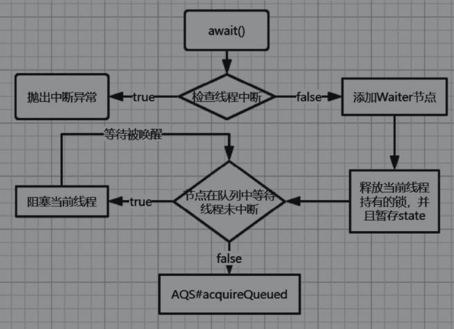
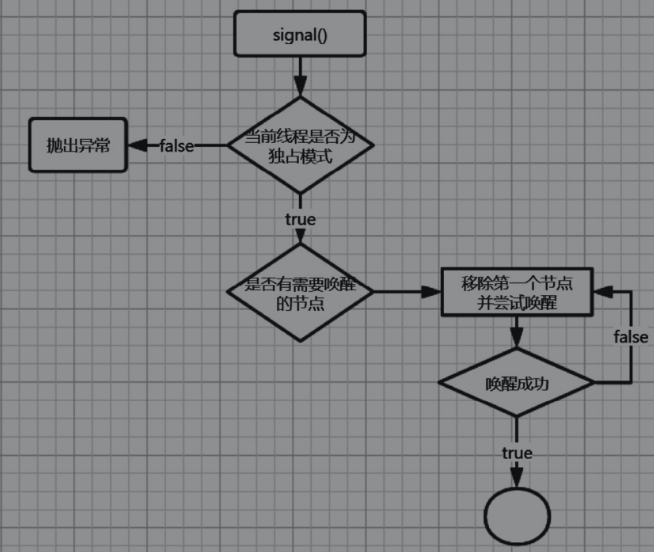

## ReentrantLock重入锁

重入锁，又称递归锁，是指在同一线程中，外部方法获得锁之后，内层递归方法依然可以获取该锁。如果锁不具备重入性，那么当同一个线程两次获取锁的时候就会发生死锁。Java提供了java.util.concurrent.ReentrantLock来解决重入锁问题。

ReentrantLock重入锁并不是容器集合类的一部分，但是它在Concurrency包中占据了非常重要的地位。在并发容器的实现中大量地被使用到。因此，在讲解并发容器前，应当先了解重入锁的原理。

ReentranLock是一种显式锁，与synchronized隐式锁对应。synchronized不能显式的对Lock对象进行操作，因此有很多不便利性。而显式锁提供了多种方法来操作Lock，包括：

- lock()：获取锁，如果锁不可用，那么当前线程会休眠直到获取到锁为止。
- lockInterruptibly()：可中断地获取锁，如果当前线程发生interrupt，则释放锁。
- tryLock()：尝试获取锁，如果获取到了，那么那么返回true，反之返回false。它与lock()的区别在于，它不会休眠当前线程。
- unlock()：释放锁。
- newCondition()：创建一个当前锁的条件监视器Condition，Condition实例用于控制当前Lock的线程队列的notify和wait。


ReentrantLock的实现是基于AQS的，通过对tryAcquire和tryRelease的重写，实现了锁机制和重入机制。

### ReentrantLock的公平锁与非公平锁实现

从前文的分析可知，ReentrantLock在底层有两种实现方式，分别是FairSync（公平锁）和NonfairSync（非公平锁），下面分别从实现流程与源代码出发来介绍这两种锁的实现原理。

#### FairSync（公平锁）的实现

##### lock

```java
package java.util.concurrent.locks;

public class ReentrantLock implements Lock, java.io.Serializable {
    private static final long serialVersionUID = 7373984872572414699L;

    private final Sync sync;
    
    abstract static class Sync extends AbstractQueuedSynchronizer {
    }
    
    static final class FairSync extends Sync {
        
        final void lock() {
            acquire(1);
        }
    }
}
```

##### acquire(int arg) 

FairSync与NonfairSync都会调用同样的acquire方法，因此有必要了解一下acquire方法的实现：

```java
package java.util.concurrent.locks;
public abstract class AbstractQueuedSynchronizer
    extends AbstractOwnableSynchronizer
    implements java.io.Serializable {

    public final void acquire(int arg) {
        if (!tryAcquire(arg) &&
            acquireQueued(addWaiter(Node.EXCLUSIVE), arg))
            selfInterrupt();
    }
}
```

tryAcquire()用于请求锁，当请求失败的时候，会把当前线程加入等待队列，addWaiter()和acquredQueued()方法分别对应封装等待线程结点和请求入队的操作。

从上一段源码的if逻辑可以看出，tryAcquire()方法是用于尝试获取锁的关键方法，它的返回值决定了之后流程的走向。在FairSync类中，tryAcquire()方法会严格按照入队顺序来处理等待线程。

##### tryAcquire()

```java
package java.util.concurrent.locks;

public class ReentrantLock implements Lock, java.io.Serializable {
    private static final long serialVersionUID = 7373984872572414699L;

    private final Sync sync;
    
    abstract static class Sync extends AbstractQueuedSynchronizer {
    }
    
    static final class FairSync extends Sync {
        
        protected final boolean tryAcquire(int acquires) {
            final Thread current = Thread.currentThread();
            int c = getState();
            if (c == 0) {
                //hasQueuedPredecessors 方法只有 FairSync才会调用，
                //他是 FairSync 和 NonfairSync 仅有的区别
                if (!hasQueuedPredecessors() &&
                    compareAndSetState(0, acquires)) {
                    setExclusiveOwnerThread(current);
                    return true;
                }
            }
            else if (current == getExclusiveOwnerThread()) {
                int nextc = c + acquires;
                if (nextc < 0)
                    throw new Error("Maximum lock count exceeded");
                setState(nextc);
                return true;
            }
            return false;
        }
    }
}
```

FairSync.tryAcquire()方法在调用setExclusiveOwnerThread()以设置持有锁的线程之前，多调用了一个返回布尔值的hasQueuedPredecessors()方法，只有返回false，当前线程才能持有锁。

hasQueuedPredecessors()方法的意义在于确定当前线程是否具备前驱结点，只有不具备前驱结点的线程才可能持有锁。

不具备前驱结点有两种可能：

- 等待队列里没有结点。
- 当前线程正式等待队列中首个待处理结点。

```java
package java.util.concurrent.locks;
public abstract class AbstractQueuedSynchronizer
    extends AbstractOwnableSynchronizer
    implements java.io.Serializable {
    
	public final boolean hasQueuedPredecessors() {
       
        Node t = tail; // 尾节点
        Node h = head; //头结点
        Node s;
        return h != t &&
            ((s = h.next) == null || s.thread != Thread.currentThread());
    }
}
```

h !=t和h.next==null用于确定队列中是否有等待结点。

s.thread !=Thread.currentThread()用于确定当前线程是否为队列中的首个待处理结点。

由此可见，如果这个方法返回true，那么说明等待队列中有其他线程需要处理，如果false，那么说明当前线程可以直接持有锁，无需等待。

因此，FairSync.tryAcquire就保证了线程执行的顺序会严格按照入队顺序来进行。而NonfairSync.nonfairTryAcquire没有通过hasQueuedPredecessors()方法来验证有序性，直接调用了compareAndSetState来让当前线程去竞争锁。由此可见，它们有以下的两个最主要的区别：

- FairSync保证了FIFO，先入队的等待线程会最先获得锁，而NonfairSync任由各个等待线程竞争。
- 由于FairSync要保证有序性，所以NonfairSync的性能更高，ReentrantLock默认使用NonfairSync。


#### NonfairSync的实现

##### lock()、tryAcquire()

```java
package java.util.concurrent.locks;

public class ReentrantLock implements Lock, java.io.Serializable {
    private final Sync sync;
    
    abstract static class Sync extends AbstractQueuedSynchronizer {
    }
    
    static final class NonfairSync extends Sync {

        final void lock() {
            //验证当前状态，如果是0，那么设置为1
            //状态为0说明没有其他线程持有锁，当前线程可以直接获得锁
            //setExclusiveOwnerThread 为当前排它锁执行所有者线程的方法
            if (compareAndSetState(0, 1))
                setExclusiveOwnerThread(Thread.currentThread());
            else//状态不为0，说明其他线程持有锁执行获得锁的方法
                acquire(1);
        }
        
        protected final boolean tryAcquire(int acquires) {
            return nonfairTryAcquire(acquires);
        }

    }
}
```

从代码的实现可以看出，与FairSync类的实现相比，主要有以下两个区别：

- NonFairSync类在lock()方法调用的第一时间，直接验证当前锁状态，如果没有其他线程持有锁（锁状态state为0），那么当前线程会持有锁。
- NonFairSync类的tryAcquire()方法执行不同，它直接调用了nonfairTryAcquire()方法，nonfairTryAcquire()方法不要求严格按照等待队列的入队顺序获取锁。

由此可见，这两种获取锁的机制最终会分别调用到FairSync.tryAcquire()和NonFairSync.nonfairTryAcquire()方法。

##### nonfairTryAcquire()

```java
package java.util.concurrent.locks;

public class ReentrantLock implements Lock, java.io.Serializable {
    private final Sync sync;
    
    abstract static class Sync extends AbstractQueuedSynchronizer {
        
    	final boolean nonfairTryAcquire(int acquires) {
            final Thread current = Thread.currentThread();
            int c = getState();
            if (c == 0) {
                if (compareAndSetState(0, acquires)) {
                    setExclusiveOwnerThread(current);
                    return true;
                }
            }
            else if (current == getExclusiveOwnerThread()) {
                int nextc = c + acquires;
                if (nextc < 0) // overflow
                    throw new Error("Maximum lock count exceeded");
                setState(nextc);
                return true;
            }
            return false;
        }

    }
    
    static final class NonfairSync extends Sync {
    }
}
```


### ReentrantLock的重入性

为什么会存在重入性问题呢？这要从加锁的实现方式讲起。加锁有两种基本形式：互斥锁与自旋锁。

**互斥锁**（Mutex lock），通过阻塞线程来进行加锁，中断阻塞来进行解锁。

**自旋锁**（Spin lock），线程保持运行态，用一个循环体不停地判断某个标识量的状态来确定加锁还是解锁，本质上用一段无意义的死循环来阻塞线程的运行。


无论是哪种实现方式，都回避不开一个问题，那就是在同一个线程中，如果递归地获取相同的锁，都会出现死锁。

设想，线程A持有了锁，在释放锁之前，A再次请求加锁，此时，由于锁拥有了持有者（虽然是A自己），于是，A被阻塞了，再也调不到释放锁的方法中去了。

那么，一个线程多次使用同一把锁的时候，它的需求应当是怎样的呢？

- 在线程持有锁的时候，其他线程不能访问上锁的共享资源。
- 在线程持有锁的时候，线程本身可以继续访问上锁的共享资源。
- 在多次递归访问中，只有当全部访问都结束了，线程才会释放锁。

由此可以想到一个很直观的解决方式—计数器，对持有锁的线程的每一次访问进行计数，只有当访问次数清空之后，其他线程才能继续访问。


#### ReentrantLock的实现方式

```java
...
            final Thread current = Thread.currentThread();
            int c = getState();
            if (c == 0) {
                ...
            }
            else if (current == getExclusiveOwnerThread()) {
                int nextc = c + acquires;
                if (nextc < 0) // overflow
                    throw new Error("Maximum lock count exceeded");
                setState(nextc);
                return true;
            }
            return false;
...
```

这段代码就是之前讲解过的FairSync.tryAcquire()和NonfairSync.nonfairTryAcquire()的重入处理部分。无论是公平锁还是非公平锁，在处理重入性上，代码都是一致的：

- 判断state标量是否为0，如果为0，那么说明没有线程持有该锁，当前线程可以持有锁，返回true。
- 如果state不为0，那么判断当前线程是否为锁持有者。
- 如果不是，那么当前线程不能持有锁，返回false。
- 如果是，那么当前线程已经持有锁，此时认为同线程请求次数增加，state需要增加acquires次，acquires表示新增的请求锁次数。


与tryAcquire方法对应的，自然应该有个tryRelease方法，用于释放锁，该方法的源码如下所示：

```java
package java.util.concurrent.locks;

public class ReentrantLock implements Lock, java.io.Serializable {
    private final Sync sync;
    
    abstract static class Sync extends AbstractQueuedSynchronizer {
        
        protected final boolean tryRelease(int releases) {
            int c = getState() - releases;
            if (Thread.currentThread() != getExclusiveOwnerThread())
                throw new IllegalMonitorStateException();
            boolean free = false;
            if (c == 0) {
                free = true;
                setExclusiveOwnerThread(null);
            }
            setState(c);
            return free;
        }
    }
}
```

tryRelease()方法有一个整型参数releases形参，用来表示本次释放锁的次数。如果当前线程不是锁持有者，那么说明这是一次非法调用，这个道理很简单：任何线程不能释放自己没有持有的锁。

当state计数归零的时候，调用setExclusiveOwnerThread(null)，用来表示没有线程持有锁了。此后该锁可以被任意调用。

```java
package java.util.concurrent.locks;
public abstract class AbstractQueuedSynchronizer
    extends AbstractOwnableSynchronizer
    implements java.io.Serializable {
    
    private volatile int state;

    protected final int getState() {
        return state;
    }
}
```


### ReentrantLock和synchronized

ReentrantLock和synchronized同样都是用于多线程同步，它们在功能上有相近之处，但通常而言，ReentrantLock可以用于替代synchronized。下面将会介绍二者的使用方法与区别。

####ReentrantLock具备synchronized的功能

ReentrankLock有显式的锁对象，锁对象可以由用户决定请求锁和释放锁的时机，它们甚至可以不在同一个代码块内，而synchronized并没有这么灵活。

synchronized使用的是Object对象内置的监视器，通过Object.wait()/Object.notify()等方法，对当前线程做等待和唤醒操作。sychronized只能有一个监视器，如果调用监视器的notifyAll，那么会唤醒所有线程，较为不灵活。

ReentrantLock则使用的是条件监视器Condition，通过ReentrantLock.newCondition()方法来获取。同一个ReentranLock可以创建多个Condition实例，每个Condition维护有自己的等待线程（waiter）队列，调用signalAll只会唤醒自己队列内的线程。与Object.wait()/Object.notify()的使用方式一样，Condition通过调用await()/signal()系列的方法来达到同样的目的。

监视器的使用必须要注意两点：

- 监视器的wait和notify操作会改变线程在等待队列里的状态，这个状态是所有线程可见的，必须保证线程安全，所以一定要有锁支撑。也就是说，调用wait/notify类型的方法时，必须在该监视器观察的锁内部执行。
- 监视器的notify方法并不会直接唤醒线程，它只会改变线程在等待队列里的状态。真正的唤醒操作是抽象队列同步器（AbstractQueueSynchronizer，AQS）完成的，这里还需要注意一点，lock.unlock()方法被调用后，线程才真正被唤醒。

signal()/notify()执行后，线程并没有马上被唤醒，而是等到当前线程所在的lock.unlock()之后，才被唤醒。synchronized和ReentrantLock在这方面是完全一致的。由此，可以得出结论，ReentrantLock可以替代synchronized的功能。

#### ReentrantLock更灵活

ReentrantLock的灵活性体现在以下几个方面：

1）ReentrantLock可以指定公平锁或非公平锁，而synchronized限制为非公平锁。

2）ReentrantLock的条件监视器较之synchronized更加方便灵活。

这体现在条件监视器java.util.concurrent.Condition的API上，它提供了可以指定多种时间单位await方式。

同时，ReentrantLock要求必须使用Condition作为监视器，而synchronized可以使用任意Object作为监视器。从语义上来看，ReentrantLock更加严谨和安全。

在具体的功能上，Condition和Object Monitor相比还有其他几个优势，如下表所示：

| 功能                        | Object Monitor | Condition      |
| --------------------------- | -------------- | -------------- |
| 等待队列个数                | 仅有一个       | 支持多个队列   |
| 释放锁进入wait状态          | 必须响应中断   | 可以不响应中断 |
| 释放锁进入wait timeout 状态 | 必须响应中断   | 可以不响应中断 |


#####请比较synchronized和ReentrantLock的优劣答案：

ReentrantLock获得锁和释放锁的操作更加灵活，且具备独立的条件监视器，等待和唤醒线程的操作也更方便和多样化，在多线程环境下，ReentrantLock的执行效率比synchronized高。

但是，synchronized的存在还是有意义的，程序不仅仅是执行更快和操作更灵活就会更优秀，还要考虑到维护成本，synchronized具有完备的语义，一个获得锁的操作就一定会对应一个释放锁的操作，否则会有编译期异常出现。对于多线程学习的新人来说，这种方式更加友好，且不易出错。

### ReentrantLock的条件监视器

Condition，即条件，这个类在AQS里起到的是监视器（monitor）的作用，监视器是用于监控一段同步的代码块，可以用于线程的阻塞和解除阻塞。

每当条件监视器（Condition）增加一个等待线程的时候，该线程也会进入一个条件等待队列，下次signal方法调用的时候，会从队列里获取结点，挨个唤醒。

Condition主要的几个核心的方法：

```java
package java.util.concurrent.locks;

public interface Condition {
    //线程进入等待状态，直到响应通知或中断
    void await() throws InterruptedException;
    //当前线程进入等待状态，直到响应通知
    void awaitUninterruptibly();
    //线程进入等待状态，直到响应通知或中断，或超时
    long awaitNanos(long nanosTimeout) throws InterruptedException;
    
    boolean await(long time, TimeUnit unit) throws InterruptedException;
    //指定一个超时时刻，线程进入等待状态，直到响应通知或中断，或超时
    boolean awaitUntil(Date deadline) throws InterruptedException;
    //对 Condition 队列中的线程进行唤醒
    void signal();
    //对 Condition 队列中的线程进行全部唤醒
    void signalAll();
}

```

从这些方法可以看出，Condition的方法主要分为两类：

- await：等效于Object.wait。
- signal：等效于Object.notify。

wait和notify是Object提供的navtie方法，Condition为了与Object的方法区分而另行命名的。

以AQS的Condition实现类ConditionObject为例，ConditionObject维护了一个双向waiter队列，下面两个属性记录了它的首尾结点：

```java
package java.util.concurrent.locks;
public abstract class AbstractQueuedSynchronizer
    extends AbstractOwnableSynchronizer
    implements java.io.Serializable {

    public class ConditionObject implements Condition, java.io.Serializable {
        private static final long serialVersionUID = 1173984872572414699L;
        /** 条件队列头结点 */
        private transient Node firstWaiter;
        /** 条件队列尾节点 */
        private transient Node lastWaiter;
    }
}
```

Node结点对象为一个双向链表结点，其数据域为线程的引用。

下面将重点介绍await和signal方法的实现原理。

#### await方法的实现

await方法实现源码如下所示：

```java
package java.util.concurrent.locks;
public abstract class AbstractQueuedSynchronizer
    extends AbstractOwnableSynchronizer
    implements java.io.Serializable {

    public class ConditionObject implements Condition, java.io.Serializable {
        private static final long serialVersionUID = 1173984872572414699L;
        /** 条件队列头结点 */
        private transient Node firstWaiter;
        /** 条件队列尾节点 */
        private transient Node lastWaiter;
        
        public final void await() throws InterruptedException {
            if (Thread.interrupted())//如果当前线程是中断，抛出中断异常
                throw new InterruptedException();
            //当前线程添加到watier队列尾
            Node node = addConditionWaiter();
            //释放当前节点拥有的锁，因为后面还要添加锁，不释放会造成死锁
            int savedState = fullyRelease(node);
            int interruptMode = 0;
            while (!isOnSyncQueue(node)) {
                LockSupport.park(this);
                if ((interruptMode = checkInterruptWhileWaiting(node)) != 0)
                    break;
            }
            if (acquireQueued(node, savedState) && interruptMode != THROW_IE)
                interruptMode = REINTERRUPT;
            if (node.nextWaiter != null) // clean up if cancelled
                unlinkCancelledWaiters();
            if (interruptMode != 0)
                reportInterruptAfterWait(interruptMode);
        }

    }
}
```

为了更容易地理解这个方法的实现原理，下图给出了这个方法的执行流程图。



需要注意的是，阻塞当前线程使用的方法为LockSupport.park()，如果需要唤醒，那么需要由signal()方法来调用LockSupport.unpark(Thread)。

#### signal方法的实现

signal方法用于唤醒Condition等待队列中的下一个等待结点，其源码如下所示：

```java
package java.util.concurrent.locks;
public abstract class AbstractQueuedSynchronizer
    extends AbstractOwnableSynchronizer
    implements java.io.Serializable {

    public class ConditionObject implements Condition, java.io.Serializable {
        private static final long serialVersionUID = 1173984872572414699L;
        /** 条件队列头结点 */
        private transient Node firstWaiter;
        /** 条件队列尾节点 */
        private transient Node lastWaiter;
        
        public final void signal() {
            //只有独占模式才能使用signal()负责抛出异常
            if (!isHeldExclusively())
                throw new IllegalMonitorStateException();
            Node first = firstWaiter;
            if (first != null)
                doSignal(first);
        }
        
        private void doSignal(Node first) {
            //从等待队列中移除节点，并尝试唤醒节点
            do {
                if ( (firstWaiter = first.nextWaiter) == null)
                    lastWaiter = null;
                first.nextWaiter = null;
            } while (!transferForSignal(first) &&
                     (first = firstWaiter) != null);
        }
        
    }
    final boolean transferForSignal(Node node) {
		//如果设置 waitStatus 失败，那么说明节点在 signal之前被取消，此时返回false
        if (!compareAndSetWaitStatus(node, Node.CONDITION, 0))
            return false;
		//放到 sync 队列的尾部
        Node p = enq(node);
        // 获取 入队节点 的前驱节点的状态
        int ws = p.waitStatus;
        //如果前驱节点取消了，那么直接唤醒当前节点的线程
        //如果前驱节点没有取消，那么设置当前节点为SIGNAL，而不唤醒这个线程
        if (ws > 0 || !compareAndSetWaitStatus(p, ws, Node.SIGNAL))
            LockSupport.unpark(node.thread);
        return true;
    }
}
```

signal方法的执行流程：



