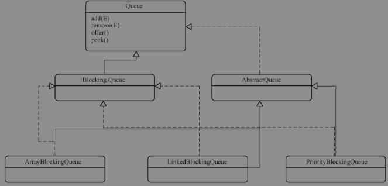

##`BlockingQueue`

在多线程环境中，经常会用到“生产者-消费者”模式，负责生产的线程要把数据交给负责消费的线程，那么，自然需要一个数据共享容器，由生产者存入，消费者取出。这个容器就像是一个仓库，生产出来的货物堆积在里面，需要消费的时候再搬运出来，这个时候，就需要队列（Queue）来实现该仓库，一般而言，该队列有两种存取方式：

- 先进先出（First In First Out，FIFO）：先插入的元素先取出，也就是按顺序排队。
- 后进先出（Last In First Out，LIFO）：后插入的元素先取出，这是个栈结构（Stack），强调的是优先处理最新的物件。

设想这样一个问题，如果生产的线程太积极，消费线程来不及处理，仓库满了，又或者消费线程太迅速，生产线程产能跟不上消费，那么要如何处理？

这就是生产者-消费者模型（Producer-Consumer）所解决的问题了。这个模型又称为有界缓存模型，它主要包括了三个基本部分：

- 产品仓库，用于存放产品。
- 生产者，生产出来的产品存入仓库。
- 消费者，消费仓库里的产品。

其特性在于：仓库里没有产品的时候，消费者没法继续消费产品，只能等待新的产品产生；当仓库装满之后，生产者没有办法存放产品，只能等待消费者消耗掉产品之后，才能继续存放。

该特性应用在多线程环境中，可以表达为：生产者线程在仓库装满之后会被阻塞，消费者线程则是在仓库清空后阻塞。

在Java Concurrent包发布之前，该模型需要程序员自己维护阻塞队列，自己实现的队列但往往会在性能和安全性上有所缺陷，Java Concurrent包提供了`BlockingQueue`接口及其实现类来实现生产者-消费者模型。

`java.util.concurrent.BlockingQueue`，是一个阻塞队列接口。当`BlockingQueue`操作无法立即响应时，有四种处理方式：

- 抛出异常。
- 返回特定的值，根据操作不同，可能是null或者false中的一个。
- 无限期的阻塞当前线程，直到操作可以成功为止。
- 根据阻塞超时设置来进行阻塞。

`BlockingQueue`的核心方法和未响应处理方式的对应形式如下表所示：

|      | 抛出异常                 | 返回特定的值       | 无限阻塞      | 超时                                            |
| ---- | ------------------------ | ------------------ | ------------- | ----------------------------------------------- |
| 插入 | boolean add(E e)         | boolean offer(E e) | void put(E e) | boolean offer(E e, long timeout, TimeUnit unit) |
| 移除 | boolean remove(Object o) | poll()             | E take()      | E poll(long timeout, TimeUnit unit)             |
| 查询 | element()                | peek()             |               |                                                 |

`BlockingQueue`有很多实现类，下图给出了部分常用的实现类。




多数实现类直接沿用了抽象类`AbstractQueue`的实现，以满足其集合类Queue的特性，下面重点介绍抽象类常用的几个方法。

- add(E)方法用于入队，入队失败则抛出队列已满异常，反之返回true；
- remove()方法用于移除队头元素；
- element()方法用于查看队头元素；

```java
package java.util;
public abstract class AbstractQueue<E>
    extends AbstractCollection<E>
    implements Queue<E> {

    public boolean add(E e) {
        if (offer(e))//调用 offer 实现add，插入失败抛出队列已满异常
            return true;
        else
            throw new IllegalStateException("Queue full");
    }
    public E remove() {
        E x = poll();
        if (x != null)
            return x;
        else
            throw new NoSuchElementException();
    }
    public E element() {
        E x = peek();
        if (x != null)
            return x;
        else
            throw new NoSuchElementException();
    }
    
    
}
```

可以注意到，这三个方法的具体实现，是交由offer\poll\peek三个方法来负责，在`BlockingQueue`的各个实现类中，通过重写这几个方法来达到多线程安全的目的。

### `ArrayBlockingQueue`

`ArrayBlockingQueue`是基于数组实现的有界`BlockingQueue`，该队列满足先入先出（FIFO）的特性。它是一个典型的“有界缓存”，由一个固定大小的数组保存元素，一旦创建好以后，容量就不能改变了。

队满时，存数据的操作会被阻塞；队空时，取数据的操作会被阻塞。

除了数组以外，它还维护了两个int变量，分别对应队头和队尾的下标，队头存放的是入队最早的元素，而队尾则是入队最晚的元素。

#### 成员变量

```java
package java.util.concurrent;
public class ArrayBlockingQueue<E> extends AbstractQueue<E>
        implements BlockingQueue<E>, java.io.Serializable {
    private static final long serialVersionUID = -817911632652898426L;
    /** 队列元素存储数组 */
    final Object[] items;
    /** 对头下标，下一次  take, poll, peek or remove 方法执行位置的下标 */
    int takeIndex;
    /** 队尾下标，下一次 put, offer, or add 方法执行位置的下标 */
    int putIndex;
    /** 队列元素数量 */
    int count;   
    /** 访问锁 */
    final ReentrantLock lock;
    /**  阻塞取值类型方法 */
    private final Condition notEmpty; 	
    /**  阻塞存值类型方法 */
    private final Condition notFull;
}
```


#### add\offer\put三种方法对比

`ArrayBlockingQueue`提供的这三种方法，都用于插入数据。

#####  add(E)

add(E)的实现体在`AbstractQueue`中，通过调用offer(E)作为实现，如果offer(E)返回false，那么抛出异常。

##### offer(E)

offer(E)方法用于入队，入队失败则返回false，反之返回true，实现源码如下所示：

```java
package java.util.concurrent;
public class ArrayBlockingQueue<E> extends AbstractQueue<E>
        implements BlockingQueue<E>, java.io.Serializable {
    
    public boolean offer(E e) {
        checkNotNull(e);
        final ReentrantLock lock = this.lock;
        lock.lock();
        try {
            //判断队列是否已满，队列满时返回false
            if (count == items.length)
                return false;
            else {
                enqueue(e);
                return true;
            }
        } finally {
            lock.unlock();
        }
    }
    
    private void enqueue(E x) {
        // assert lock.getHoldCount() == 1;
        // assert items[putIndex] == null;
        final Object[] items = this.items;
        items[putIndex] = x;
        if (++putIndex == items.length)
            putIndex = 0;
        count++;
        notEmpty.signal();
    }

}
```

##### `offer(E，long，TimeUnit)`

`offer(E,long,TimeUnit)`方法会通过反复入队来保证offer成功，除非线程中断。实现源码如下所示：

```java
package java.util.concurrent;
public class ArrayBlockingQueue<E> extends AbstractQueue<E>
        implements BlockingQueue<E>, java.io.Serializable {
    
    public boolean offer(E e, long timeout, TimeUnit unit)
        throws InterruptedException {

        checkNotNull(e);
        long nanos = unit.toNanos(timeout);
        final ReentrantLock lock = this.lock;
        lock.lockInterruptibly();
        try {
            //尝试入队，如果入队失败，阻塞当前线程指定的时长之后，再次尝试
            while (count == items.length) {
                if (nanos <= 0)
                    return false;
                nanos = notFull.awaitNanos(nanos);
            }
            enqueue(e);
            return true;
        } finally {
            lock.unlock();
        }
    }

}
```

`offer(E e, long timeout , TimeUnit unit)`方法和offer(E e)方法并没有太多相似，反而更类似于put(E e)，唯一不同的是，该方法多出了一个阻塞时长，`notFull`只会阻塞这个时长，然后再次尝试入队。

##### put(E)

put(E)方法用于入队，队满则等待`notFull`被唤醒，或者发起了中断。实现源码如下所示：

```java
package java.util.concurrent;
public class ArrayBlockingQueue<E> extends AbstractQueue<E>
        implements BlockingQueue<E>, java.io.Serializable {
    
    public void put(E e) throws InterruptedException {
        checkNotNull(e);
        final ReentrantLock lock = this.lock;
        lock.lockInterruptibly();//当前线程未中断的情况下获取锁
        try {
            //队列满时，阻塞当前线程，直到可以插入值
            while (count == items.length)
                notFull.await();
            enqueue(e);
        } finally {
            lock.unlock();
        }
    }
}
```

通过对源码的分析可以得出以下结论：

- 这三个方法使用了重入锁，都是线程安全的。
- offer方法只会尝试入队一次，入队失败则返回false。
- add方法入队失败则抛出异常。
- put方法在未中断的情况下，会一直尝试入队，如果被中断则抛出中断异常，那么需要由使用者自行处理。`notFull`对象监视器会在出队时唤醒。

#### enqueue(E x)方法

enqueue(E x)方法执行了真正的入队，前面介绍的方法最终都是通过调用这个方法实现，如队列的操作。其实现源码如下所示：

```java
package java.util.concurrent;
public class ArrayBlockingQueue<E> extends AbstractQueue<E>
        implements BlockingQueue<E>, java.io.Serializable {
    
    private void enqueue(E x) {
        // assert lock.getHoldCount() == 1;
        // assert items[putIndex] == null;
        final Object[] items = this.items;
        items[putIndex] = x;
        //putIndex 到达数组上线时归零
        if (++putIndex == items.length)
            putIndex = 0;
        count++;
        notEmpty.signal();
    }

}
```

源码实现很简单，主要思路为把x添加到队尾，然后唤醒`notEmpty`对象监视器。

add\offer\put方法都会调用enqueue方法。而唤醒`notEmtpy`对象监视器的作用在于，通知可被`notEmtpy`阻塞的取值方法（poll或者take），以中断阻塞。


#### remove/poll/take三种方法对比

remove(Object o)方法用于移除指定元素，其他两个方法则用来从队列中取数据，下面将分别介绍它们的实现原理。

##### remove方法

```java
package java.util.concurrent;
public class ArrayBlockingQueue<E> extends AbstractQueue<E>
        implements BlockingQueue<E>, java.io.Serializable {
    
    public boolean remove(Object o) {
        if (o == null) return false;
        final Object[] items = this.items;
        final ReentrantLock lock = this.lock;
        lock.lock();
        try {
            if (count > 0) {
                final int putIndex = this.putIndex;
                int i = takeIndex;
                do {
                    //循环比较对象是否一致，取得对应下标
                    if (o.equals(items[i])) {
                        //移除指定下标位置的对象
                        removeAt(i);
                        return true;
                    }
                    if (++i == items.length)
                        i = 0;
                } while (i != putIndex);
            }
            return false;
        } finally {
            lock.unlock();
        }
    }
}
```

`removeAt(int)`方法的逻辑并不复杂，实现思路如下所示：

1. 如果需要被移除的index处于队尾，那么直接移除队尾元素，不移动其他元素。
2. 反之，则移除指定index后，把所有元素前移一位。
3. 唤醒`notFull`对象监视器。

```java
package java.util.concurrent;
public class ArrayBlockingQueue<E> extends AbstractQueue<E>
        implements BlockingQueue<E>, java.io.Serializable {
    
	void removeAt(final int removeIndex) {
        
        final Object[] items = this.items;
        if (removeIndex == takeIndex) {
            items[takeIndex] = null;
            if (++takeIndex == items.length)
                takeIndex = 0;
            count--;
            if (itrs != null)
                itrs.elementDequeued();
        } else {
            
            final int putIndex = this.putIndex;
            for (int i = removeIndex;;) {
                int next = i + 1;
                if (next == items.length)
                    next = 0;
                if (next != putIndex) {
                    items[i] = items[next];
                    i = next;
                } else {
                    items[i] = null;
                    this.putIndex = i;
                    break;
                }
            }
            count--;
            if (itrs != null)
                itrs.removedAt(removeIndex);
        }
        notFull.signal();
    }
}
```


##### take方法

take方法用于取出队头元素，如果队列为空，那么它会等待`notEmpty`被唤醒，或者发起中断。其实现源码如下所示：

```java
package java.util.concurrent;
public class ArrayBlockingQueue<E> extends AbstractQueue<E>
        implements BlockingQueue<E>, java.io.Serializable {
    
    public E take() throws InterruptedException {
        final ReentrantLock lock = this.lock;
        lock.lockInterruptibly();
        try {
            while (count == 0)
                notEmpty.await();
            return dequeue();
        } finally {
            lock.unlock();
        }
    }
    
}
```

##### poll()方法

poll()方法用于取出队头元素，如果队列为空，那么返回null：

```java
package java.util.concurrent;
public class ArrayBlockingQueue<E> extends AbstractQueue<E>
        implements BlockingQueue<E>, java.io.Serializable {
 
    public E poll(long timeout, TimeUnit unit) throws InterruptedException {
        long nanos = unit.toNanos(timeout);
        final ReentrantLock lock = this.lock;
        lock.lockInterruptibly();
        try {
            while (count == 0) {
                if (nanos <= 0)
                    return null;
                nanos = notEmpty.awaitNanos(nanos);
            }
            return dequeue();
        } finally {
            lock.unlock();
        }
    }   
}
```


通过上面的讲解可以发现这些方法有下面的一些特点：

- remove、poll、take方法都是线程安全的。
- remove方法可以移除任意对象，需要遍历比对对象来确定下标位置，并且可能需要移动大量数据的位置，效率较低。
- removeAt方法可以移除指定下标的元素，比之remove少了比对过程，但它也可能需要移动大量数据位置，效率稍微好一点。
- poll和take只能移除队头元素，效率极高。


#### dequeue方法

从前面的讲解可以发现poll和take方法都是通过调用dequeue来实现出队列的功能。这里重点介绍dequeue方法的实现，如下所示：

```java
package java.util.concurrent;
public class ArrayBlockingQueue<E> extends AbstractQueue<E>
        implements BlockingQueue<E>, java.io.Serializable {
	
    int count;
    int takeIndex;
    
    private E dequeue() {
        // assert lock.getHoldCount() == 1;
        // assert items[takeIndex] != null;
        final Object[] items = this.items;
        @SuppressWarnings("unchecked")
        E x = (E) items[takeIndex];
        items[takeIndex] = null;
        if (++takeIndex == items.length)
            takeIndex = 0;
        count--;
        if (itrs != null)
            itrs.elementDequeued();
        notFull.signal();
        return x;
    }
}
```

它的逻辑很简单：

1. 移除容器里的指定对象。
2. 迭代器执行`elementDequeued`（用来保证一致性）。
3. 唤醒`notFull`对象监视器。


####peek()方法

`peek()`方法用于查看队头元素，其实现源码如下所示：

```java
package java.util.concurrent;
public class ArrayBlockingQueue<E> extends AbstractQueue<E>
        implements BlockingQueue<E>, java.io.Serializable {
    
    public E peek() {
        final ReentrantLock lock = this.lock;
        lock.lock();
        try {
            return itemAt(takeIndex); // null when queue is empty
        } finally {
            lock.unlock();
        }
    }
	
}
```


#### 总结

通过对`ArrayBlockingQueue`源码的解析，可以得出以下结论：

- `ArrayBlockingQueue`是使用数组进行存储的。
- enqueue()和dequeue()方法是入队和出队的核心方法，它们分别通知“队列非空”和“队列非满”，从而使阻塞中的入队和出队方法能继续执行，以实现生产者消费者模式。
- 插入只能从队尾开始，移除可以是任意位置，但是移除队头以外的元素效率很低。
- `ArrayBlockingQueue`是个循环队列。


###`LinkedBlockingQueue`

链表阻塞队列，从命名可以看出它是基于链表实现的。同样这也是个先入先出队列（FIFO），队头是队列里入队时间最长的元素，队尾则是入队时间最短的。理论上它的吞吐量要超出数组阻塞队列`ArrayBlockingQueue`。`LinkedBlockQueue`可以指定容量限制，在没有指定的情况下，默认为`Integer.MAX_VALUE`。下面介绍它的具体实现。


#### 成员变量

```java
package java.util.concurrent;

public class LinkedBlockingQueue<E> extends AbstractQueue<E>
        implements BlockingQueue<E>, java.io.Serializable {
    private static final long serialVersionUID = -6903933977591709194L;

    static class Node<E> {
        E item;
        Node<E> next;
        Node(E x) { item = x; }
    }
    
    private final int capacity;//最大容量
    private final AtomicInteger count = new AtomicInteger();//当前队列长度
    transient Node<E> head;//头
    private transient Node<E> last;//尾
    
    //取值锁，用于 take poll 等方法
 	private final ReentrantLock takeLock = new ReentrantLock();

    /**  队列非空 的对象监视器  */
    private final Condition notEmpty = takeLock.newCondition();

    /** 存值锁，用于 put，offer 等方法 */
    private final ReentrantLock putLock = new ReentrantLock();

    /** 表示队列非满的对象监视器 */
    private final Condition notFull = putLock.newCondition();
    
}
```

与`ArrayBlockingQueue`相比，`LinkedBlockingQueue`的重入锁被分成了两份，分别对应存值和取值。这种实现方法被称为双锁队列算法，这样做的好处在于，读写操作的lock操作是由两个锁来控制的，互不干涉，因此可以同时进行读操作和写操作，这也是`LinkedBlockingQueue`吞吐量超过`ArrayBlockingQueue`的原因。但是，使用两个锁要比一个锁复杂很多，需要考虑各种死锁的状况。


#### `signalNotEmpty()`和`signalNotFull()`方法

`notEmpty/notFull`分别对应非空和非满锁的条件监视器。

`signalNotEmpty()/signalNotFull()`方法分别负责唤醒对应的入队/出队线程。它们的实现很简单：

```java
package java.util.concurrent;

public class LinkedBlockingQueue<E> extends AbstractQueue<E>
        implements BlockingQueue<E>, java.io.Serializable {

    private void signalNotEmpty() {
        final ReentrantLock takeLock = this.takeLock;
        takeLock.lock();
        try {
            notEmpty.signal();
        } finally {
            takeLock.unlock();
        }
    }

    private void signalNotFull() {
        final ReentrantLock putLock = this.putLock;
        putLock.lock();
        try {
            notFull.signal();
        } finally {
            putLock.unlock();
        }
    }
    
}
```

`LinkedBlockingQueue`使用双锁算法来实现的，在需要唤醒重入锁的时候，重入锁与监视器可能不是对应的。以put(E)方法为例，存值方法在执行完成后，如果队列内有值存在，那么需要对`notEmpty`进行唤醒，但是put(E)方法明显是使用`putLock`进行加锁的，而`notEmtpy`则是用来监视`takeLock`，所以需要封装signal方法，以方便调用。