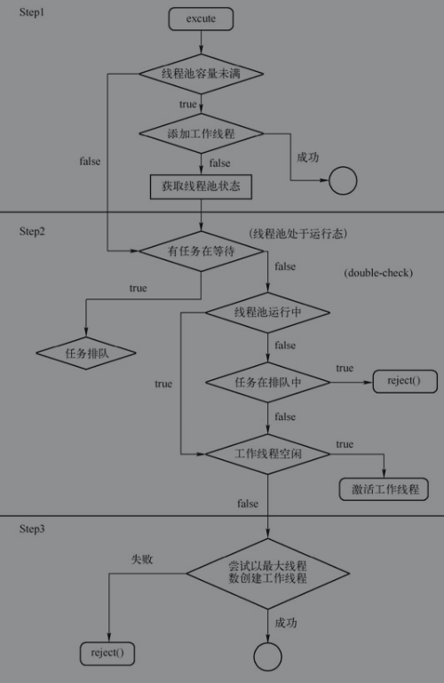
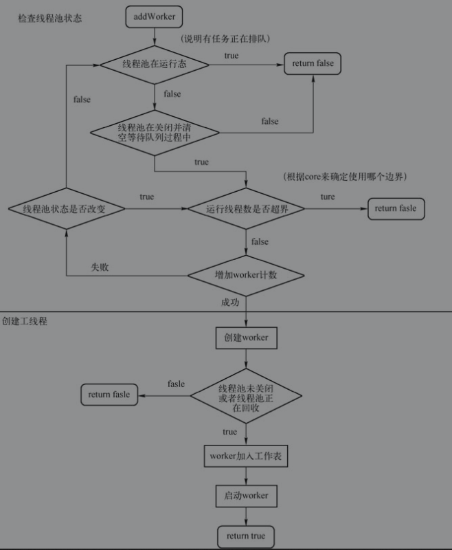
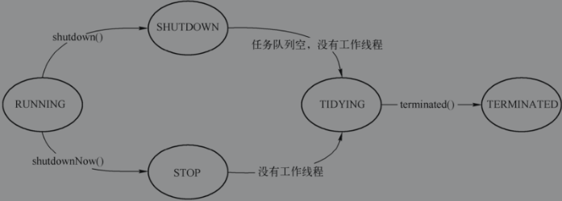

##Executor接口

java.util.concurrent.Executor是一个接口，这个接口只定义了一个方法（execute）用于执行已经提交的Runnable任务。其源码如下所示：

```java
package java.util.concurrent;

public interface Executor {

    void execute(Runnable command);
}

```

### ExecutorService

java.util.concurrent.ExecutorService接口继承自Executor，作为一个Service（服务），它提供了一系列对Executor的生命周期管理。

它提供了一系列的方法来生成和管理Future，Future则用于跟踪异步任务的处理流程。

```java
package java.util.concurrent;

public interface ExecutorService extends Executor {
    void shutdown();//有序完成所有提交的任务，不再接收新的任务，将线程池中的状态设置为SHUTDOWN状态
    
    List<Runnable> shutdownNow();//立即尝试关闭所有正在执行的任务，返回等待任务任务列表，将线程池中的状态设置为STOP状态
    
    boolean isShutdown();//返回 true 说明已关闭
    
    boolean isTerminated();//返回 true 说明执行关闭后，所有任务都已完成
    
	//阻塞指定时长，以在关闭后，等待所有任务完成
    boolean awaitTermination(long timeout, TimeUnit unit)
        throws InterruptedException;
    
    //提交一个带返回值的任务
    <T> Future<T> submit(Callable<T> task);
    //提交一个不带返回值的任务,执行成功，Future#get会返回参数T
    <T> Future<T> submit(Runnable task, T result);
    //提交一个不带返回值的任务,执行成功，Future#get会返 null
    Future<?> submit(Runnable task);

    //执行提供的任务集合，全部任务完成后返回 Future 列表，Future#isDone为true时表示对应的任务完成
    <T> List<Future<T>> invokeAll(Collection<? extends Callable<T>> tasks)
        throws InterruptedException;
    
     //执行提供的任务集合，全部任务完成 或 时间超时 后返回 Future 列表，
    <T> List<Future<T>> invokeAll(Collection<? extends Callable<T>> tasks,
                                  long timeout, TimeUnit unit)
        throws InterruptedException;

    //执行提供的任务集合，返回第一个执行完成的结果
    <T> T invokeAny(Collection<? extends Callable<T>> tasks)
        throws InterruptedException, ExecutionException;

    <T> T invokeAny(Collection<? extends Callable<T>> tasks,
                    long timeout, TimeUnit unit)
        throws InterruptedException, ExecutionException, TimeoutException;
}

```

### ThreadPoolExecutor

java.util.concurrent.ThreadPoolExecutor是ExecutorService的一个实现，也是最常见的线程池之一。线程池的意义在于它可以最大化地利用线程空闲时间以及节约系统资源。例如有一万个任务需要异步执行，一般的CPU并没有这么大的吞吐量，而线程创建的本身又要占用额外的内存。所以，利用线程池，如果有空闲的线程，那么执行任务，如果没有，那么等待执行中的线程空闲；同时，用户对线程最大数量的合理控制，能够取得执行时间和内存消耗的平衡。下面重点介绍ExecutorService类的内部实现。

#### 常量

```java
package java.util.concurrent;

public class ThreadPoolExecutor extends AbstractExecutorService {
    
    // 运行状态
    private static final int RUNNING    = -1 << COUNT_BITS;
    private static final int SHUTDOWN   =  0 << COUNT_BITS;
    private static final int STOP       =  1 << COUNT_BITS;
    private static final int TIDYING    =  2 << COUNT_BITS;
    private static final int TERMINATED =  3 << COUNT_BITS;


}    
```

这五个常量对应线程池的声明周期，它们的含义如下：

- RUNNING：运行中，可以接受新的任务，并且处理排队任务。
- SHUTDOWN：关闭，不再接受新任务，不过仍然会处理排队任务。
- STOP：停止，不再接受新任务，也不处理排队中的任务，同时中断处理中的任务。
- TIDYING：整理，当所有任务终止，workerCount计数归零，线程会转换到TIDYING状态，并且将会执行terminal()的钩子方法（也就是terminal会在TIDYING状态后自动调用）。
- TERMINATED：终止，说明terminal()方法执行完成。


#### 成员变量

##### ctl：控制器

```java
package java.util.concurrent;

public class ThreadPoolExecutor extends AbstractExecutorService {
  
    private final AtomicInteger ctl = new AtomicInteger(ctlOf(RUNNING, 0));
    
}
```

ctl是control的缩写，代表控制器。AtomicInteger是原子化的Integer，它的原子化性质由CAS来保证的。ctl的特殊性在于，它同时表达了多种含义：

1. workerCount：Worker计数，Worker的存在表示有正在处理中的任务。
2. runState：运行状态，对应RUNING、SHUTDOWN、STOP、TIDYING、TERMINATED五个状态。

workerCount和runState可以通过下面的static方法来提供：

```java
package java.util.concurrent;

public class ThreadPoolExecutor extends AbstractExecutorService {
    private final AtomicInteger ctl = new AtomicInteger(ctlOf(RUNNING, 0));
    private static final int COUNT_BITS = Integer.SIZE - 3;
    private static final int CAPACITY   = (1 << COUNT_BITS) - 1;

    // 通过 ctl 获取运行状态
    private static int runStateOf(int c)     { return c & ~CAPACITY; }
    // 通过 ctl 获取worker计数
    private static int workerCountOf(int c)  { return c & CAPACITY; }
    // 通过 workerCount 和 runState 获取 control
    private static int ctlOf(int rs, int wc) { return rs | wc; }
}
```

CAPACITY的值为(1<<COUNT_BITS)-1。

COUNT_BITS的值为Integer.SIZE-3。

runState值的对应关系下表所示。

| 属性       | 十进制表示       | 二进制表示      |
| ---------- | ---------------- | --------------- |
| RUNNING    | -1 << COUNT_BITS | 111000...000000 |
| SHUTDOWN   | 0<< COUNT_BITS   | 000000...000000 |
| STOP       | 1 << COUNT_BITS  | 001000...000000 |
| TIDYING    | 2 << COUNT_BITS  | 010000...000000 |
| TERMINATED | 3 << COUNT_BITS  | 110000...000000 |

从上表可以看出，这五个状态值的特征都集中在前三位，而CAPACITY的值为0001111...1111，取反计算～CAPACITY的值为111000...00000。

所以runStateOf是用于取前3位的值，workerCountOf是用于取后29位的值。

runState|workerCount则是合并两者，这样就可以还原ctl值。


##### 构造方法初始化时可以配置的成员变量

```java
package java.util.concurrent;

public class ThreadPoolExecutor extends AbstractExecutorService {

    private volatile ThreadFactory threadFactory;//线程工厂
    private volatile RejectedExecutionHandler handler;//被拒绝任务的处理策略
    private volatile long keepAliveTime;//决定线程多长时间没有接到任务后可以结束
    private volatile int corePoolSize;//线程池的基本大小，就算没有任务线程池也要保持这个size
    private volatile int maximumPoolSize;//线程池最大容量
    private int largestPoolSize;//曾经同时运行过线程的最大数量
}
```

##### 其他重要的成员变量

```java
package java.util.concurrent;

public class ThreadPoolExecutor extends AbstractExecutorService {
    //队列中等待处理的工作线程
    private final BlockingQueue<Runnable> workQueue;
    //所有的工作线程，只有在持有 lock 时才会处理
    private final HashSet<Worker> workers = new HashSet<Worker>();

}
```


####execute方法

ExecutorService的submit方法在AbstractExecutorService重写之后，最终都会委托给execute方法来处理。因此这里重点介绍execute方法的实现原理，execute的实现主要有三个步骤：

1）如果当前执行的线程数小于coolPoolSize(核心池容量)，那么会尝试启动一个新的线程来执行任务，这个过程会调用addWorker来检查运行状态和Worker数量，如果添加新的工作线程成功，那么直接返回。

2）如果添加工作线程失败，那么会尝试把任务放入到队列中。

3）如果任务不能加入队列，那么可能是线程池已经关闭或者装满了，此时拒绝任务。

```java
package java.util.concurrent;

public class ThreadPoolExecutor extends AbstractExecutorService {
 
    public void execute(Runnable command) {
        if (command == null)
            throw new NullPointerException();
        
        int c = ctl.get();
        if (workerCountOf(c) < corePoolSize) {
            if (addWorker(command, true))
                return;
            c = ctl.get();
        }
        if (isRunning(c) && workQueue.offer(command)) {
            int recheck = ctl.get();
            if (! isRunning(recheck) && remove(command))
                reject(command);
            else if (workerCountOf(recheck) == 0)
                addWorker(null, false);
        }
        else if (!addWorker(command, false))
            reject(command);
    }
}
```





#### addWorker方法

在execute()方法中，频繁地调用了addWorker方法，这个方法用来添加工作线程(Worker)，它有两个参数：

- firstTask:Runnable，是一个可执行代码块，是业务代码的包装。
- core:boolean，true表示使用线程池核心容量作为上限，false表示使用最大容量作为上限。

addWorker的每一次调用，都会从等待队列中获取正在等待的任务来执行。当然firstTask也可以为null，在这种情况下这个方法不会添加新的任务，而是从等待队列中取出排队的任务来执行。实现源码如下所示：

```java
package java.util.concurrent;

public class ThreadPoolExecutor extends AbstractExecutorService {
 
    private boolean addWorker(Runnable firstTask, boolean core) {
        retry:
        for (;;) {//外层循环确保 work 正常添加
            int c = ctl.get();
            int rs = runStateOf(c);//获取线程池运行状态

            // Check if queue empty only if necessary.
            if (rs >= SHUTDOWN &&
                ! (rs == SHUTDOWN &&
                   firstTask == null &&
                   ! workQueue.isEmpty()))
                return false;

            for (;;) {
                //worker 不能超出容量，也不能超出指定池的容量
                //core 用于确定需要校验的池容量
                int wc = workerCountOf(c);
                if (wc >= CAPACITY ||
                    wc >= (core ? corePoolSize : maximumPoolSize))
                    return false;
                //增加 worker count 的数量，成功则跳出循环
                if (compareAndIncrementWorkerCount(c))
                    break retry;
                //  worker count 的数量没有被增加需要反复尝试
                c = ctl.get();  // Re-read ctl
                if (runStateOf(c) != rs)
                    continue retry;
                // else CAS failed due to workerCount change; retry inner loop
            }
        }

        boolean workerStarted = false;
        boolean workerAdded = false;
        Worker w = null;
        try {
            w = new Worker(firstTask);
            final Thread t = w.thread;
            if (t != null) {
                final ReentrantLock mainLock = this.mainLock;
                mainLock.lock();
                try {
                    // 持有锁之后，检查一遍运行状态，如果关闭 那么终止
                    int rs = runStateOf(ctl.get());

                    if (rs < SHUTDOWN ||
                        (rs == SHUTDOWN && firstTask == null)) {
                        if (t.isAlive()) // precheck that t is startable
                            throw new IllegalThreadStateException();
                        
                        //在工作队列中添加当前 worker
                        workers.add(w);
                        //调整处理过的最大工作线程数
                        int s = workers.size();
                        if (s > largestPoolSize)
                            largestPoolSize = s;
                        workerAdded = true;
                    }
                } finally {
                    mainLock.unlock();
                }
                //执行 worker 的线程
                if (workerAdded) {
                    t.start();
                    workerStarted = true;
                }
            }
        } finally {
            if (! workerStarted)
                addWorkerFailed(w);
        }
        return workerStarted;
    }
```





#### Worker的执行

Worker是AQS的一个子类，同时它又实现了Runnable接口，它的主要作用在于：

- 实现一个非重入锁，避免工作线程在调用线程池控制方法（比如setCorePoolSize）时，再次申请锁。
- 保护中断状态，让工作线程对interrupt不敏感。

在addWorker里可以看到以下代码：

```java
	w = new Worker(firstTask);
	final Thread t = w.thread;
	...
    t.start();
```

addWorker也是通过调用thread的start()方法来启动一个线程执行的，看上去和Worker并没有关系。而事实上，新启动的线程会调用worker的run方法来执行具体的逻辑，参见Worker的构造函数：

```java
package java.util.concurrent;

public class ThreadPoolExecutor extends AbstractExecutorService {
 
    private final class Worker
        extends AbstractQueuedSynchronizer
        implements Runnable {
        
        Worker(Runnable firstTask) {
            setState(-1); // inhibit interrupts until runWorker
            this.firstTask = firstTask;
            this.thread = getThreadFactory().newThread(this);
        }
    }  
    
}
```

需要注意的是，getThreadFactory().newThread(this)会使用一个Runnable对象来创建线程，在这里，**Worker本身就是这个Runnable，而非传入的firstTask**。

##### runWorker方法

因此，可以想见，Worker的run()方法的实现必然是对firstTask的调用做了必要的处理。源码如下所示，这里重点关注ThreadPoolExecutor#runWorker方法：

```java
package java.util.concurrent;

public class ThreadPoolExecutor extends AbstractExecutorService {
    
     private final class Worker
        extends AbstractQueuedSynchronizer
        implements Runnable {
        
        public void run() {
            runWorker(this);
        }
    }

    final void runWorker(Worker w) {
        //获取当前线程
        Thread wt = Thread.currentThread();
        //获取 worker 的首任务
        Runnable task = w.firstTask;
        //设置 w 的 firstTask为 null
        w.firstTask = null;
        //释放锁
        w.unlock(); // allow interrupts
        boolean completedAbruptly = true;
        try {
            // 如果 task 不为 null, 则直接进入循环执行 task
            // 如果 task 为 null，那么会调用 getTask 方法
            //		getTask 是个无限循环方法，他会从阻塞队列 workQueue 中不断取出任务来执行
            //		当阻塞队列 workQueue 中所有任务都被取完之后，循环也就结束了
            while (task != null || (task = getTask()) != null) {
                //worker 同时是个 AQS，lock()保证不会有同一个 worker同时执行下面的代码
                w.lock();
                // 当线程池处于 STOP状态 或者 TIDYING、TERMINATED状态时设置当前线程处于中断状态
                // 否则当前线程就处于 RUNNING 或者 SHUTDOWN 状态，确保当前线程不处于中断状态
                // 重新检查当前线程池的状态是否大于 STOP 状态
                if ((runStateAtLeast(ctl.get(), STOP) || //线程池的运行状态至少高于 STOP
                     (Thread.interrupted() && //线程被中断
                      runStateAtLeast(ctl.get(), STOP))) && //再次检查线程池的运行状态至少高于 STOP
                    !wt.isInterrupted())	//wt（当前线程） 线程没有被状态
                    wt.interrupt(); // 中断 wt（当前线程）线程
                try {
                    beforeExecute(wt, task);
                    Throwable thrown = null;
                    try {
                        task.run();//运行给定的任务
                    } catch (RuntimeException x) {
                        thrown = x; throw x;
                    } catch (Error x) {
                        thrown = x; throw x;
                    } catch (Throwable x) {
                        thrown = x; throw new Error(x);
                    } finally {
                        afterExecute(task, thrown);
                    }
                } finally {
                    task = null;//清空执行完的任务，增加计算，并解锁
                    w.completedTasks++;
                    w.unlock();
                }
            }
            completedAbruptly = false;
        } finally {
            processWorkerExit(w, completedAbruptly);
        }
    }
}
```

runWorker是一个带有阻塞\定时阻塞的方法，它的用途在于：

1. 执行工作线程（Worker）自身的任务。
2. 如果任务执行完成，那么Worker会从等待队列（workQueue）里申请新的任务。
3. 如果等待队列里没有任务（getTask），那么阻塞当前线程。
4. 同一个Worker的任务执行相互之间是同步的。


这里有两个亟待解决的问题：

- 这里如何实现的同一个Worker不会两次调用同一段代码？
- 为什么同一个Worker还需要保持排他性呢？

在上面的代码中w.lock()最终会调用到Worker的tryAcquire方法，这个方法的实现如下所示：

```java
        public void lock()        { acquire(1); }

        protected boolean tryRelease(int unused) {
            setExclusiveOwnerThread(null);
            setState(0);
            return true;
        }

```


compareAndSetState(0,1)是标准的CAS写法，只有当state为0时，才能被设置为1并且返回true，其他情况都会返回false。

换言之，该AQS的资源state只能申请一次，直到该非重入锁的持有者释放了state。

这样可以避免同一个任务反复被执行。这样做的意义在于：beforeExecute方法是可以被用户重写的，如果用户不慎调用了setCorePoolSize等方法时触发无限递归的调用，主要原因为setCorePoolSize方法中有如下的调用路径setCorePoolSize->interruptIdleWorkers->lock，在这种情况下，Worker的tryAcquire方法会调用setCorePoolSize，而setCorePoolSize又反过来会调用Worker的tryAcquire方法，由此就会导致无限的递归调用。

##### getTask()方法

getTask()也是一个关键方法，用于从等待队列里获取正在排队的任务，其实现如下所示：

```java
package java.util.concurrent;

public class ThreadPoolExecutor extends AbstractExecutorService {
    
    private Runnable getTask() {
        boolean timedOut = false; // Did the last poll() time out?

        for (;;) {
            int c = ctl.get();
            int rs = runStateOf(c);

            // 满足：1. 线程池关闭同时队列为空；2.线程池停用。 两者中任意条件不再提供任务
            if (rs >= SHUTDOWN && (rs >= STOP || workQueue.isEmpty())) {
                decrementWorkerCount();
                return null;
            }
			
            //CAS操作保证 workerCount 减少一位
            int wc = workerCountOf(c);

            // 是否使用计时的标量
            boolean timed = allowCoreThreadTimeOut || wc > corePoolSize;

            if ((wc > maximumPoolSize || (timed && timedOut))
                && (wc > 1 || workQueue.isEmpty())) {
                if (compareAndDecrementWorkerCount(c))
                    return null;
                continue;
            }

            try {
                //workQueue是一个阻塞队列
                //poll(time,timeUnit)用于带超时的阻塞出队
                //take()用于阻塞出队
                Runnable r = timed ?
                    workQueue.poll(keepAliveTime, TimeUnit.NANOSECONDS) :
                    workQueue.take();
                if (r != null)
                    return r;
                timedOut = true;
            } catch (InterruptedException retry) {
                timedOut = false;
            }
        }
    }
    
}
```

#### shutdown和shutdownNow

在ExecutorService解析中有提及，在shutdown被调用之后，ExecutorService就不再接收新的任务，同时会尝试执行完等待队列中剩下的任务。


#### 总结

1. ThreadPoolExecutor有五个状态：RUNNING、SHUTDOWN、STOP、TIDYING、TERMINATED。ThreadPoolExecutor的功能由这些状态驱动；状态图如下图所示。
2. ThreadPoolExecutor的执行功能由execute方法提供，它负责在线程池不同的状态下，对任务进行对应的处理。
3. ThreadPoolExecutor的关闭实现由SHUTDOWN和STOP状态来维护。
4. ThreadPoolExecutor.workerQueue是一个阻塞队列，由用户来决定其具体的实现。




### 线程池的实现

目前Java语言主要提供了如下4个线程池的实现类：

1. newSingleThreadExecutor：创建一个单线程的线程池，它只会用唯一的工作线程来执行任务，也就是相当于单线程串行执行所有任务，如果这个唯一的线程因为异常结束，那么会有一个新的线程来替代它。
2. newFixedThreadPool：创建一个定长线程池，可控制线程的最大并发数，超出的线程会在队列中等待。使用这个线程池的时候，必须根据实际情况估算出线程的数量。
3. newCachedThreadPool：创建一个可缓存线程池，如果线程池的长度超过处理需要，那么可灵活回收空闲线程，如果不可回收，那么新建线程。此线程池不会对线程池的大小做限制，线程池的大小完全依赖于操作系统（或者说JVM）能够创建的最大线程大小。使用这种方式需要在代码运行的过程中通过控制并发任务的数量来控制线程的数量。
4. newScheduledThreadPool：创建一个定长线程池。此线程池支持定时以及周期性执行任务的需求。


### Future和FutureTask

#### Future

java.util.concurrent.Future接口提供了线程不会因为等待返回结果而阻塞的能力。

Future接口的定义：

```java
package java.util.concurrent;

public interface Future<V> {

    /** 如果 应该 中断 执行此任务的线程，那么参数为 true；否则允许正在运行的任务完成 */
    boolean cancel(boolean mayInterruptIfRunning);
    /** 在任务正常完成前 取消 返回 true */
    boolean isCancelled();
    /** 如果任务完成了，那么返回 true */
    boolean isDone();
    /** 阻塞线程，等待结果返回 */
    V get() throws InterruptedException, ExecutionException;
    /** 阻塞线程，等待结果返回，如果超时，那么抛出超时异常 */
    V get(long timeout, TimeUnit unit)
        throws InterruptedException, ExecutionException, TimeoutException;
}

```

#### FutureTask

java.util.concurrent.FutureTask是Future接口在concurrency包中的默认实现。它的主要用途之一是为AbstractExecutorService提供任务支持，交由AbstractExecutorService执行的任务会被包装成一个FutureTask，以提供延迟获取返回值的能力。

FutureTask间接继承自Future接口和Runnable接口，所以，它同时具备执行任务和获取结果两种能力。其实现源码如下所示：

```java
package java.util.concurrent;
public interface RunnableFuture<V> extends Runnable, Future<V> {
    void run();
}

```


```java
package java.util.concurrent;

public class FutureTask<V> implements RunnableFuture<V> {
	
    private Callable<V> callable;
    
    public FutureTask(Callable<V> callable) {
        if (callable == null)
            throw new NullPointerException();
        this.callable = callable;
        this.state = NEW;       // ensure visibility of callable
    }
    
    /**
     * NEW -> COMPLETING -> NORMAL
     * NEW -> COMPLETING -> EXCEPTIONAL
     * NEW -> CANCELLED
     * NEW -> INTERRUPTING -> INTERRUPTED
     */
    private volatile int state;
    private static final int NEW          = 0; //新建
    private static final int COMPLETING   = 1; //正在完成
    private static final int NORMAL       = 2; //正常
    private static final int EXCEPTIONAL  = 3; //异常
    private static final int CANCELLED    = 4; //取消
    private static final int INTERRUPTING = 5; //中断中
    private static final int INTERRUPTED  = 6; //中断的
    
    //执行任务
    public void run() {
        if (state != NEW ||
            !UNSAFE.compareAndSwapObject(this, runnerOffset,
                                         null, Thread.currentThread()))
            return;
        try {
            Callable<V> c = callable;
            if (c != null && state == NEW) {
                V result;
                boolean ran;
                try {
                    result = c.call(); //执行任务
                    ran = true;
                } catch (Throwable ex) {
                    result = null;
                    ran = false;
                    setException(ex);
                }
                if (ran)
                    set(result);
            }
        } finally {
            runner = null;
            int s = state;
            if (s >= INTERRUPTING)
                handlePossibleCancellationInterrupt(s);
        }
    }
    

    public boolean cancel(boolean mayInterruptIfRunning) {
        if (!(state == NEW &&
              UNSAFE.compareAndSwapInt(this, stateOffset, NEW,
                  mayInterruptIfRunning ? INTERRUPTING : CANCELLED)))
            return false;
        try {    // 以防调用中断引发异常 
            if (mayInterruptIfRunning) {
                try {
                    Thread t = runner;
                    if (t != null)
                        t.interrupt();
                } finally { // final state
                    UNSAFE.putOrderedInt(this, stateOffset, INTERRUPTED);
                }
            }
        } finally {
            finishCompletion();
        }
        return true;
    }

    //获取数据
    public V get() throws InterruptedException, ExecutionException {
        int s = state;
        if (s <= COMPLETING) //根据任务状态决定是否阻塞
            s = awaitDone(false, 0L);
        return report(s);
    }
    
}
```


### Latch

java.util.concurrent.CountDownLatch经常被称为闭锁，它能够使指定线程等待计数线程完成各自工作后再执行。


CountDownLatch提供了对一组线程任务进行约束的能力，也就是说可以在任务中灵活的根据条件来调用latch#countDown()方法，从而决定是否中断CountDownLatch#await造成的阻塞。

这种优秀的能力也是由AQS实现的，参见CountDownLatch.Sync的源码：

```java
package java.util.concurrent;

public class CountDownLatch {
	
    private static final class Sync extends AbstractQueuedSynchronizer {
        private static final long serialVersionUID = 4982264981922014374L;

        Sync(int count) {
            setState(count); //State 记录队列中等待的任务数量
        }

        int getCount() {
            return getState();
        }

        protected int tryAcquireShared(int acquires) {
            //用于申请锁，负数代表获取锁失败，进入等待队列，即是阻塞当前线程
            //整数代表获取锁成功，线程可以继续执行
            //这个表达式表明 getState() == 0的时候中断阻塞 
            return (getState() == 0) ? 1 : -1;
        }

        protected boolean tryReleaseShared(int releases) {
            // CAS 的方式对 count 进行递减操作 
            for (;;) {
                int c = getState();
                if (c == 0)
                    return false;
                int nextc = c-1;
                if (compareAndSetState(c, nextc))
                    return nextc == 0;
            }
        }        
    }

    private final Sync sync;

```


### Barrier

CyclicBarrier，回环栅栏，它用于等待一组线程完成某个条件后再全部一起执行后续功能的能力。之所以称之为回环，是因为与CountDownLatch一次性使用方式不同，它可以被反复使用。

####dowait

利用重入锁ReentrantLock和条件监视器Condition实现Barrier

利用Generation对象和Interrupt提供break功能

Break会临时终止当前计数过程。在计数过程终止后，理想中的后续处理应当是：

1. 计数器重置。
2. 之后的CyclicBarrier.await操作抛出异常。
3. 唤醒所有的当前等待中的线程，无论计数有没有归零。
4. 可以重置break状态以重用CyclicBarrier。

```java

    private int dowait(boolean timed, long nanos)
        throws InterruptedException, BrokenBarrierException,
               TimeoutException {
        final ReentrantLock lock = this.lock;
        lock.lock();
        try {
            final Generation g = generation;
			//对象已损坏时直接抛出异常
            if (g.broken)
                throw new BrokenBarrierException();

            if (Thread.interrupted()) {
                breakBarrier();
                throw new InterruptedException();
            }

            int index = --count;//计数递减
            if (index == 0) {  // tripped
                boolean ranAction = false;
                try {
                    final Runnable command = barrierCommand;
                    if (command != null)
                        command.run();
                    ranAction = true;
                    nextGeneration();//计数归0 时唤醒所有等待线程
                    return 0;
                } finally {
                    if (!ranAction)
                        breakBarrier();
                }
            }

            // loop until tripped, broken, interrupted, or timed out
            for (;;) {
                try {
                    if (!timed)
                        trip.await(); // trip 是条件监视器，用于阻塞当前线程
                    else if (nanos > 0L)
                        nanos = trip.awaitNanos(nanos);
                } catch (InterruptedException ie) {
                    // await 被中断时破坏 generation
                    if (g == generation && ! g.broken) {
                        breakBarrier();
                        throw ie;
                    } else {
                        // We're about to finish waiting even if we had not
                        // been interrupted, so this interrupt is deemed to
                        // "belong" to subsequent execution.
                        Thread.currentThread().interrupt();
                    }
                }

                if (g.broken)
                    throw new BrokenBarrierException();

                if (g != generation)
                    return index;

                if (timed && nanos <= 0L) {
                    breakBarrier();
                    throw new TimeoutException();
                }
            }
        } finally {
            lock.unlock();
        }
    }
```

这一段代码有些难以理解，可以尝试按照以下流程来还原这个过程：

1. 有多个线程被Barrier阻塞，且此时Barrier的计数没有归零。
2. 有外部代码执行了Thread.currentThread().interrupt()，中断了线程的阻塞状态。
3. 此时该线程会进入InterruptedException处理流程，当前的generation必然没有重置，且没有broken，所以，会调用breakBarrier()方法，然后抛出异常。
4. breakBarrier方法会唤醒所有使用trip阻塞住的线程，由于是正常唤醒操作，这些线程不会进入InterruptedException，且它们的generation已经broken，所以，会抛出BrokenBarrierException。
5. 如，在之后有新的线程进入dowait流程，那么会因为genertion被broken而抛出BrokenBarrierException。


#### nextGeneration

利用Generation对象实现回归性

Barrier已经提供了和Latch一样的能力，那么CyclicBarrier的回归性质体现在哪里呢？稍加观察，可以注意到Generation对象，这个对象是一个标志位，在同一次计数过程中，具备Generation对象，计数完结后，生成一个新的Generation对象。具体实现可以参考以下代码：

```java
    private void nextGeneration() {
        // 唤醒所有等待中的线程
        trip.signalAll();
        // 重置计数器
        count = parties;
        // 生成新的 Generation
        generation = new Generation();
    }

```


