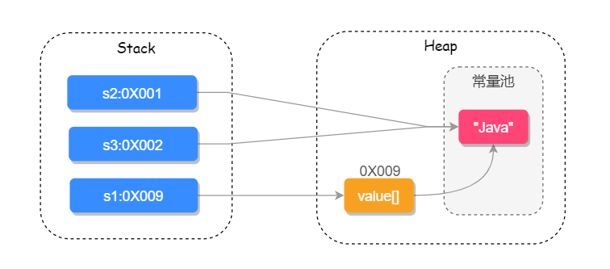

####  String 是如何实现的？它有哪些重要的方法？

```java
public final class String
    implements java.io.Serializable, Comparable<String>, CharSequence {
    // 用于存储字符串的值
    private final char value[];
    // 缓存字符串的 hash code
    private int hash; // Default to 0
    // ......其他内容
}

```


##### 多构造方法

String 字符串有以下 4 个重要的构造方法：

```java
public final class String
    implements java.io.Serializable, Comparable<String>, CharSequence {

    // String 为参数的构造方法
	public String(String original) {
    	this.value = original.value;
    	this.hash = original.hash;
	}
	// char[] 为参数构造方法
	public String(char value[]) {
	    this.value = Arrays.copyOf(value, value.length);
	}
	// StringBuffer 为参数的构造方法
	public String(StringBuffer buffer) {
	    synchronized(buffer) {
	        this.value = Arrays.copyOf(buffer.getValue(), buffer.length());
	    }
	}
	// StringBuilder 为参数的构造方法
	public String(StringBuilder builder) {
	    this.value = Arrays.copyOf(builder.getValue(), builder.length());
	}
}    
```

##### equals() 比较两个字符串是否相等

```java
public final class String
    implements java.io.Serializable, Comparable<String>, CharSequence {

    public boolean equals(Object anObject) {
    	// 对象引用相同直接返回 true
    	if (this == anObject) {
	        return true;
	    }
	    // 判断需要对比的值是否为 String 类型，如果不是则直接返回 false
	    if (anObject instanceof String) {
	        String anotherString = (String)anObject;
	        int n = value.length;
	        if (n == anotherString.value.length) {
	            // 把两个字符串都转换为 char 数组对比
	            char v1[] = value;
	            char v2[] = anotherString.value;
	            int i = 0;
	            // 循环比对两个字符串的每一个字符
	            while (n-- != 0) {
 	               // 如果其中有一个字符不相等就 true false，否则继续对比
 	               if (v1[i] != v2[i])
 	                   return false;
	                i++;
 	           }
 	           return true;
 	       	}
 	   	}
	    return false;
	}
    
}
```

##### `compareTo()` 比较两个字符串

```java
public final class String
    implements java.io.Serializable, Comparable<String>, CharSequence {

  public int compareTo(String anotherString) {
    int len1 = value.length;
    int len2 = anotherString.value.length;
    // 获取到两个字符串长度最短的那个 int 值
    int lim = Math.min(len1, len2);
    char v1[] = value;
    char v2[] = anotherString.value;
    int k = 0;
    // 对比每一个字符
    while (k < lim) {
        char c1 = v1[k];
        char c2 = v2[k];
        if (c1 != c2) {
            // 有字符不相等就返回差值
            return c1 - c2;
        }
        k++;
    }
    return len1 - len2;
  }
}
```

##### 其他重要方法

`indexOf()`：查询字符串首次出现的下标位置
`lastIndexOf()`：查询字符串最后出现的下标位置
`contains()`：查询字符串中是否包含另一个字符串
`toLowerCase()`：把字符串全部转换成小写
`toUpperCase()`：把字符串全部转换成大写
`length()`：查询字符串的长度
`trim()`：去掉字符串首尾空格
`replace()`：替换字符串中的某些字符
`split()`：把字符串分割并返回字符串数组
`join()`：把字符串数组转为字符串


##### final 修饰的好处

Java 语言之父 James Gosling 的回答是，他会更倾向于使用 final，因为它能够缓存结果，当你在传参时不需要考虑谁会修改它的值；如果是可变类的话，则有可能需要重新拷贝出来一个新值进行传参，这样在性能上就会有一定的损失。

James Gosling 还说迫使 String 类设计成不可变的另一个原因是安全，当你在调用其他方法时，比如调用一些系统级操作指令之前，可能会有一系列校验，如果是可变类的话，可能在你校验过后，它的内部的值又被改变了，这样有可能会引起严重的系统崩溃问题，这是迫使 String 类设计成不可变类的一个重要原因。

总结来说，使用 final 修饰的第一个好处是安全；第二个好处是高效，以 JVM 中的字符串常量池来举例，如下两个变量：

```java
String s1 = "java";
String s2 = "java";
```

只有字符串是不可变时，我们才能实现字符串常量池，字符串常量池可以为我们缓存字符串，提高程序的运行效率。

##### String 和 `StringBuilder`、`StringBuffer` 的区别

因为 String 类型是不可变的，所以在字符串拼接的时候如果使用 String 的话性能会很低，因此我们就需要使用另一个数据类型 `StringBuffer`，它提供了 append 和 insert 方法可用于字符串的拼接，它使用 synchronized 来保证线程安全，如下源码所示：

```java
 public final class StringBuffer
    extends AbstractStringBuilder
    implements java.io.Serializable, CharSequence{
     
     s
  @Override
  public synchronized StringBuffer append(Object obj) {
    toStringCache = null;
    super.append(String.valueOf(obj));
    return this;
  }

  @Override
  public synchronized StringBuffer append(String str) {
    toStringCache = null;
    super.append(str);
    return this;
  }

}
```

因为它使用了 synchronized 来保证线程安全，所以性能不是很高，于是在 `JDK 1.5 `就有了 `StringBuilder`，它同样提供了 append 和 insert 的拼接方法，但它没有使用 synchronized 来修饰，因此在性能上要优于 `StringBuffer`，所以在非并发操作的环境下可使用 `StringBuilder `来进行字符串拼接。


#### `String` 和 `JVM`

String 常见的创建方式有两种，new String() 的方式和直接赋值的方式

直接赋值的方式会先去字符串常量池中查找是否已经有此值，如果有则把引用地址直接指向此值，否则会先在常量池中创建，然后再把引用指向此值；

 new String() 的方式一定会先在堆上创建一个字符串对象，然后再去常量池中查询此字符串的值是否已经存在，如果不存在会先在常量池中创建此字符串，然后把引用的值指向此字符串.

```java
String s1 = new String("Java");
String s2 = s1.intern();
String s3 = "Java";
System.out.println(s1 == s2); // false
System.out.println(s2 == s3); // true
```

