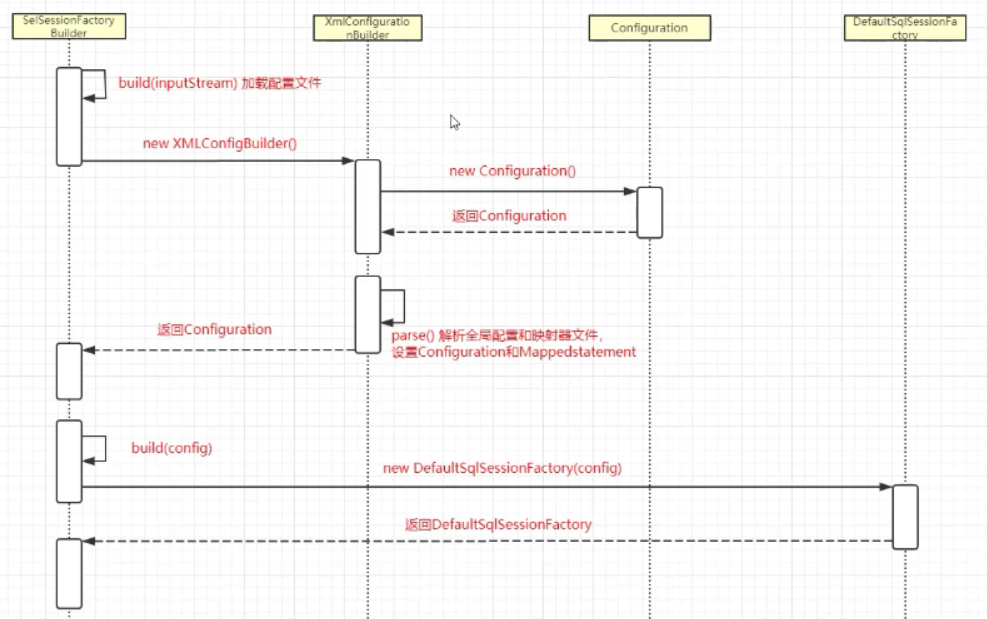
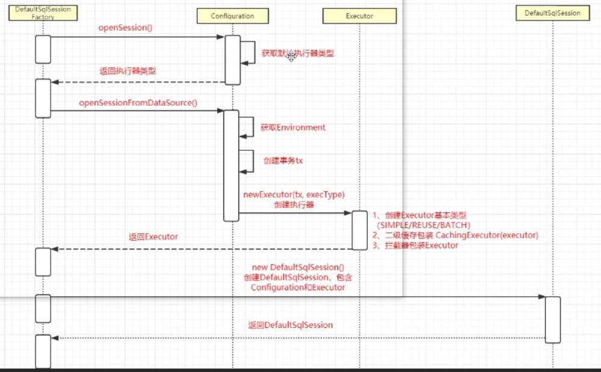
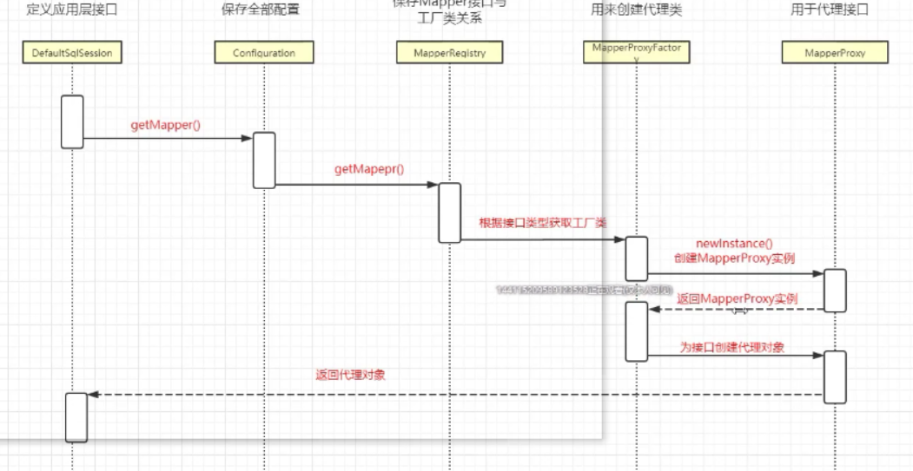

###  Mybatis的解析和运行原理

#### JDK动态代理

JDK动态代理由JDK的 java.lang.reflect.* 包提供支持

#####接口

```java
public interface HelloService{
    public void sayHello(String name);
}
```

#####  实现类

```java
public class HelloServiceImpl implements HelloService{
    public void sayHello(String name){
    	System.out.println(name);
    }
}
```

##### 代理类

```java
public class HelloServiceProxy implements InvocationHadler {
    private Object target;//真实服务对象
    
    //绑定委托对象，并返回一个代理对象
    public Object bind(Object target){
        this.target = target;
        //取得代理对象
        return Proxy.newProxyInstance(
            	 target.getClass().getClassLoader(),//类加载器
                 target.getClass.getInterfaces(),//代理对象挂在哪个接口下
                 this //使用 代理方法作为 对象的代理执行者
        	   );
    }
    
    /**
     *	通过代理对象调用方法首先进入这个方法
     *		proxy  代理对象
     *		method	被调用方法
     *		args	方法参数
     */
    public Object invoke(Object proxy,Method method,Object[] args) throws Throwable{
        Object result = null;
        //执行方法
        result = method.invode(target，args)； //反射调用方法  对象，参数
        return result;
    }
}
```

#####  客户端

```java
public class HelloServiceProxyDemo{
    public class void main(String[] args){
        HelloServiceProxy helloHandler = new HelloServiceProxy();
        //绑定委托对象，并返回一个代理对象
        HelloService proxy = (HelloService)helloHandler.bind(new HelloServiceImpl());
        proxy.sayHello("hello,world");
    }
}
```


####  CGLIB动态代理

```java
public class HelloServiceCglib implements MethodInterceptor {
    private Object target;
    
    //创建代理对象
    public Object getInstance(Object target){
        this.target = target;
        Enhancer enhancer = new Enhancer();
        enhancer.setSuperClass(this.target.getClass());
        //回调方法
        enhancer.setCallback(this);
        //创建代理对象
        return enhancer.create();
    }
    
    //回调方法
    @Override
    public Object intercept(Object obj,Method method,
                     Object[] args, MethodProxy proxy)  throws Throwable{
        
        Object returnObject = invokeSuper(obj, args);
        
        return returnObject;
    }
}
```


#### SqlSessionFactory 构建过程

1. 通过`org.apache.ibatis.builder.xml.XMLConfigBuilder` 解析配置的 XML文件，读出配置参数，并将读取的数据存入`org.apache.ibatis.session.Configuration`类中。
2. 使用Configuration对象创建SqlSessionFactory。MyBatis中的SqlSessionFactory是一个接口，一般使用它的实现类`org.apache.ibatis.session.defaults.DefaultSqlSessionFactory` 。

#####   Configuration构建

Configuration的作用

1. 读入配置文件，包括基础配置的xml文件和映射器的xml文件
2. 初始化基础配置
3. 提供单例，为后续创建SessionFactory服务提供配置参数
4. 执行一些重要的对象方法，初始化配置信息

#####  映射器的内部组成

一般映射器由3个部分组成

1. MappedStatement，它保存映射器的一个节点，包括许多我们配置的SQL、SQL的id、缓存信息、resultMap、parameterType、resultType等重要配置内容
2. SqlSource，它是提供BoundSql对象的地方，它是MappedStatement的一个属性
3. BoundSql，它是建立Sql和参数的地方。他有三个常用的属性：SQL、parameterObject、parameterMappings

###### parameterObject 为参数本身

​	传递简单对象时 mybatis 会把参数变为 对应的包装类型
​	传递pojo 或 Map ，那么 parameterObject 就是你传入的 POJO 或 Map 不变
​	传递多个参数，没有使用 @Param 注解  ，mybatis 会把 parameterObject变为 Map<String,Object>,  map的key 为参数的顺序。 ` map {"1": p1,"2": p2, ...}`
​	传递多个参数，使用` @Param` 注解  ，mybatis 会把 parameterObject变为 Map<String,Object>, map的key 为` @Param`注解的键值。` @Param("key1") String p1  -> map {"key1": p1, ...}`

###### parameterMappings 		

parameterMappings 是一个list，它的每一个元素都是 ParameterMapping 的对象，这个对象会描述我们的参数。参数包括属性、名称、表达式、javaType、JDBCType、typeHandler 等。 PreparedStatement 能够通过它找到 parameterObject 对象的属性并设置参数

 ######  SQL

SQL 是我们书写在 映射器 里面的一条SQL	


###  源码

####  缓存

##### 一级缓存

```java
package org.apache.ibatis.cache;

public interface Cache {
    
}
```


```java
package org.apache.ibatis.cache.impl;

public class PerpetualCache implements Cache {
    
}
```


```java
package org.apache.ibatis.session;

public interface SqlSession extends Closeable {
    
}
```


```java
package org.apache.ibatis.session.defaults;

public class DefaultSqlSession implements SqlSession {

  private final Configuration configuration;
  private final Executor executor;
    
}
```


```java
package org.apache.ibatis.executor;

public interface Executor {
    
}
```


```java
public abstract class BaseExecutor implements Executor {
	
    protected PerpetualCache localCache;

}
```

MyBatis 的一级缓存存在于 SqlSession 的生命周期中，在同一个 SqlSession 中查询时， MyBatis 会把执行的方法和参数通过算法生成缓存的键值，将键值和查询结果存入一个 Map对象中。如果同一个 SqlSession 中执行的方法和参数完全一致，那么通过算法会生成相同的键值，当 Map 缓存对象中己经存在该键值时，则会返回缓存中的对象。  

` flushCache="true"` 清空缓存


MyBatis 的 二级缓存非常强大，它不同于一级缓存只存在于 SqlSession 的生命周期中，而是可以理解为存在于 SqlSessionFactory 的生命周期中 。当存在多个 SqlSessioηFactory 时 ， 它们的缓存都是绑定在各自对象上的，缓存数据在一般情况下是不相通的。只有在使用如 Redis这样的缓存数据库时，才可 以共享缓存。  

二级缓存作用返回时 namespace 

最好使用在以查询为主的情况

二级缓存`CachingExecutor`包装`BaseExecutor`

```java
package org.apache.ibatis.executor;

public class CachingExecutor implements Executor {

  private final Executor delegate;
  private final TransactionalCacheManager tcm = new TransactionalCacheManager();//管理缓存
    
}
```


```java

public class TransactionalCacheManager {

  private final Map<Cache, TransactionalCache> transactionalCaches = new HashMap<>();

  public void clear(Cache cache) {
    getTransactionalCache(cache).clear();
  }

  public Object getObject(Cache cache, CacheKey key) {
    return getTransactionalCache(cache).getObject(key);
  }

  public void putObject(Cache cache, CacheKey key, Object value) {
    getTransactionalCache(cache).putObject(key, value);
  }

  public void commit() {
    for (TransactionalCache txCache : transactionalCaches.values()) {
      txCache.commit();
    }
  }

  public void rollback() {
    for (TransactionalCache txCache : transactionalCaches.values()) {
      txCache.rollback();
    }
  }

  private TransactionalCache getTransactionalCache(Cache cache) {
    return transactionalCaches.computeIfAbsent(cache, TransactionalCache::new);
  }

}

```


一级缓存默认开启


二级缓存不推荐使用

##### 配置二级缓存  

在 MyBatis 的全局配置 settings 中有一个参数 cacheEnabled，这个参数是二级缓存的全局开关，默认值是 true ，初始状态
为启用状态 。 如果把这个参数设置为 false ，即使有后面 的 二级缓存配置，也不会生效 。由于这个参数值默认为 true ，所以不必配置，如果想要配置，可以在 mybati s-config.xm l中添加如下代码。  

```xml
<settings>
    ...
	<setting name="cacheEnabled" value="true" />
</settings>
```

MyBatis 的二级缓存是和命名空间绑定的 ，即 二级缓存需要配置在 Mapper.xml 映射文件中 ，或者配置在 Mapper.java 接口中。在映射文件中 ， 命名空间就是 XML 根节点 mapper 的namespace 属性 。 在 Mapper 接口中，命名空间就是接口 的全限定名称。  


在保证二级缓存的全局配置开启的情况下，给 RoleMapper.xml 开启 二级缓存只需要在UserMapper. xml 中添加`<cache/>`元素即可  

二级缓存默认配置 `<cache/>`

缓存元素的属性  

```xml
<cache
	eviction="FIFO" 
	flushlnterval="60000"
	size="512"
	readOnly="true" />
```

eviction（收回策略）的值：

1.  LRU （最近最少使用的） ： 移除最长时间不被使用的对象，这是默认值 。  
2.  FIFO （先进先出〉 ： 按对象进入缓存的顺序来移除它们 。  
3.  SOFT （软引用） ： 移除基于垃圾回收器状态和软引用规则的对象 。  
4.  WEAK （弱引用） ： 更积极地移除基于垃圾收集器状态和弱引用规则的对象 。  


flushlnterval（刷新间隔〉。可以被设置为任意的正整数 ， 而且它们代表一个合理的毫秒形式的时间段 。 默认情况不设置，即没有刷新间 隔 ， 缓存仅仅在调用语句时刷新。  

size （引用数目）。可以被设置为任意正整数，要记住缓存的对象数目和运行环境的可用内存资源数目。默认值是 1024 。  

readOnly （只读）。属性可以被设置为 true 或 false 。只读的缓存会给所有调用者返回缓存对象的相同实例，因此这些对象不能被修改 ，这提供了很重要的性能优势 。可读写的缓存会通过序列化返回缓存对象的拷贝 ，这种方式会慢一些，但是安全 ，因此默认是 false 。  


使用二级缓存时 BaseExecutor 被 CachingExecutor 装饰

```java
package org.apache.ibatis.executor;
public class CachingExecutor implements Executor {
    
  private final Executor delegate;
  private final TransactionalCacheManager tcm = new TransactionalCacheManager();
    
}
```


##### 集成 Redis 缓存  

```xml
<dependency>
	<groupid>org.mybatis.caches</groupid>
	<artifactid>mybatis-redis</artifactid>
	<version>l.0.0-beta2</version>
</dependency>
```


在 src/main/resources 目录下新增 redis.properties 文件 。

```properties
host=localhost
port=6379
connectionTimeout=5000
soTimeout=5000
password=
database=0
clientName=  
```


```xml
<mapper namespace="tk.mybatis.simple.mapper.RoleMapper" >
	<cache type="org.mybatis.caches.redis.RedisCache" />
</mapper>  
```


#### 文件解析过程



##### SqlSessionFactoryBuilder

```java
package org.apache.ibatis.session;

public class SqlSessionFactoryBuilder {

  public SqlSessionFactory build(Reader reader, String environment, Properties properties) {
    try {
        
      XMLConfigBuilder parser = new XMLConfigBuilder(reader, environment, properties);
      return build(parser.parse());
        
    } catch (Exception e) {
      ...
    } finally {
      ErrorContext.instance().reset();
      try {
        reader.close();
      } catch (IOException e) {
        // Intentionally ignore. Prefer previous error.
      }
    }
  }
    
}
```

##### XMLConfigBuilder

```java
package org.apache.ibatis.builder.xml;

public class XMLConfigBuilder extends BaseBuilder {
  
  public Configuration parse() {
    if (parsed) {//判断是否已经解析
      throw new BuilderException("Each XMLConfigBuilder can only be used once.");
    }
    parsed = true;
    parseConfiguration(parser.evalNode("/configuration"));
    return configuration;
  }

  // 解析 mybatis-config.xml 文件 中的  元素 
  private void parseConfiguration(XNode root) {
    try {
      //issue #117 read properties first
      propertiesElement(root.evalNode("properties"));
      Properties settings = settingsAsProperties(root.evalNode("settings"));
      loadCustomVfs(settings);
      typeAliasesElement(root.evalNode("typeAliases"));
      pluginElement(root.evalNode("plugins"));
      objectFactoryElement(root.evalNode("objectFactory"));
      objectWrapperFactoryElement(root.evalNode("objectWrapperFactory"));
      reflectorFactoryElement(root.evalNode("reflectorFactory"));
      settingsElement(settings);
      // read it after objectFactory and objectWrapperFactory issue #631
      environmentsElement(root.evalNode("environments"));
      databaseIdProviderElement(root.evalNode("databaseIdProvider"));
      typeHandlerElement(root.evalNode("typeHandlers"));
      mapperElement(root.evalNode("mappers"));
    } catch (Exception e) {
      throw new BuilderException("Error parsing SQL Mapper Configuration. Cause: " + e, e);
    }
  }
    
    
  private void mapperElement(XNode parent) throws Exception {
  。。。
      XMLMapperBuilder mapperParser = new XMLMapperBuilder(
      		inputStream, configuration, url, configuration.getSqlFragments());
      mapperParser.parse();
  。。。
  }
}
```

##### XMLMapperBuilder

```java
package org.apache.ibatis.builder.xml;

public class XMLMapperBuilder extends BaseBuilder {
    
  public void parse() {
    if (!configuration.isResourceLoaded(resource)) {
      configurationElement(parser.evalNode("/mapper")); //mapper 文件中所有标签的解析
      configuration.addLoadedResource(resource);
      bindMapperForNamespace(); //绑定文件和接口
    }

    parsePendingResultMaps();
    parsePendingCacheRefs();
    parsePendingStatements();
  }

  private void configurationElement(XNode context) {
    try {
      String namespace = context.getStringAttribute("namespace");
      if (namespace == null || namespace.equals("")) {
        throw new BuilderException("Mapper's namespace cannot be empty");
      }
      builderAssistant.setCurrentNamespace(namespace);
      cacheRefElement(context.evalNode("cache-ref"));
      cacheElement(context.evalNode("cache"));
      parameterMapElement(context.evalNodes("/mapper/parameterMap"));
      resultMapElements(context.evalNodes("/mapper/resultMap"));
      sqlElement(context.evalNodes("/mapper/sql"));
      buildStatementFromContext(context.evalNodes("select|insert|update|delete"));//增删改查 标签的解析
    } catch (Exception e) {
      throw new BuilderException("Error parsing Mapper XML. Cause: " + e, e);
    }
  }

  private void buildStatementFromContext(List<XNode> list) {
    if (configuration.getDatabaseId() != null) {
      buildStatementFromContext(list, configuration.getDatabaseId());
    }
    buildStatementFromContext(list, null);
  }

  private void buildStatementFromContext(List<XNode> list, String requiredDatabaseId) {
    for (XNode context : list) {
      final XMLStatementBuilder statementParser = new XMLStatementBuilder(
          configuration, builderAssistant, context, requiredDatabaseId);
      try {
        statementParser.parseStatementNode();
      } catch (IncompleteElementException e) {
        configuration.addIncompleteStatement(statementParser);
      }
    }
  }

    
    
    
    
}
```


##### XMLStatementBuilder

```java
package org.apache.ibatis.builder.xml;
public class XMLStatementBuilder extends BaseBuilder {

  public void parseStatementNode() {
    String id = context.getStringAttribute("id");
    String databaseId = context.getStringAttribute("databaseId");

    if (!databaseIdMatchesCurrent(id, databaseId, this.requiredDatabaseId)) {
      return;
    }

    Integer fetchSize = context.getIntAttribute("fetchSize");
    Integer timeout = context.getIntAttribute("timeout");
    String parameterMap = context.getStringAttribute("parameterMap");
    String parameterType = context.getStringAttribute("parameterType");
    Class<?> parameterTypeClass = resolveClass(parameterType);
    String resultMap = context.getStringAttribute("resultMap");
    String resultType = context.getStringAttribute("resultType");
    String lang = context.getStringAttribute("lang");
    LanguageDriver langDriver = getLanguageDriver(lang);

    Class<?> resultTypeClass = resolveClass(resultType);
    String resultSetType = context.getStringAttribute("resultSetType");
    StatementType statementType = StatementType.valueOf(context.getStringAttribute("statementType", StatementType.PREPARED.toString()));
    ResultSetType resultSetTypeEnum = resolveResultSetType(resultSetType);

    String nodeName = context.getNode().getNodeName();
    SqlCommandType sqlCommandType = SqlCommandType.valueOf(nodeName.toUpperCase(Locale.ENGLISH));
    boolean isSelect = sqlCommandType == SqlCommandType.SELECT;
    boolean flushCache = context.getBooleanAttribute("flushCache", !isSelect);
    boolean useCache = context.getBooleanAttribute("useCache", isSelect);
    boolean resultOrdered = context.getBooleanAttribute("resultOrdered", false);

    // Include Fragments before parsing
    XMLIncludeTransformer includeParser = new XMLIncludeTransformer(configuration, builderAssistant);
    includeParser.applyIncludes(context.getNode());

    // Parse selectKey after includes and remove them.
    processSelectKeyNodes(id, parameterTypeClass, langDriver);
    
    // Parse the SQL (pre: <selectKey> and <include> were parsed and removed)
    SqlSource sqlSource = langDriver.createSqlSource(configuration, context, parameterTypeClass);
    String resultSets = context.getStringAttribute("resultSets");
    String keyProperty = context.getStringAttribute("keyProperty");
    String keyColumn = context.getStringAttribute("keyColumn");
    KeyGenerator keyGenerator;
    String keyStatementId = id + SelectKeyGenerator.SELECT_KEY_SUFFIX;
    keyStatementId = builderAssistant.applyCurrentNamespace(keyStatementId, true);
    if (configuration.hasKeyGenerator(keyStatementId)) {
      keyGenerator = configuration.getKeyGenerator(keyStatementId);
    } else {
      keyGenerator = context.getBooleanAttribute("useGeneratedKeys",
          configuration.isUseGeneratedKeys() && SqlCommandType.INSERT.equals(sqlCommandType))
          ? Jdbc3KeyGenerator.INSTANCE : NoKeyGenerator.INSTANCE;
    }

    builderAssistant.addMappedStatement(id, sqlSource, statementType, sqlCommandType,
        fetchSize, timeout, parameterMap, parameterTypeClass, resultMap, resultTypeClass,
        resultSetTypeEnum, flushCache, useCache, resultOrdered, 
        keyGenerator, keyProperty, keyColumn, databaseId, langDriver, resultSets);
  }
    
}
```

##### MapperBuilderAssistant

```java
package org.apache.ibatis.builder;
public class MapperBuilderAssistant extends BaseBuilder {

  public MappedStatement addMappedStatement(
      String id,
      SqlSource sqlSource,
      StatementType statementType,
      SqlCommandType sqlCommandType,
      Integer fetchSize,
      Integer timeout,
      String parameterMap,
      Class<?> parameterType,
      String resultMap,
      Class<?> resultType,
      ResultSetType resultSetType,
      boolean flushCache,
      boolean useCache,
      boolean resultOrdered,
      KeyGenerator keyGenerator,
      String keyProperty,
      String keyColumn,
      String databaseId,
      LanguageDriver lang,
      String resultSets) {

    if (unresolvedCacheRef) {
      throw new IncompleteElementException("Cache-ref not yet resolved");
    }

    id = applyCurrentNamespace(id, false);
    boolean isSelect = sqlCommandType == SqlCommandType.SELECT;

    MappedStatement.Builder statementBuilder = new MappedStatement.Builder(configuration, id, sqlSource, sqlCommandType)
        .resource(resource)
        .fetchSize(fetchSize)
        .timeout(timeout)
        .statementType(statementType)
        .keyGenerator(keyGenerator)
        .keyProperty(keyProperty)
        .keyColumn(keyColumn)
        .databaseId(databaseId)
        .lang(lang)
        .resultOrdered(resultOrdered)
        .resultSets(resultSets)
        .resultMaps(getStatementResultMaps(resultMap, resultType, id))
        .resultSetType(resultSetType)
        .flushCacheRequired(valueOrDefault(flushCache, !isSelect))
        .useCache(valueOrDefault(useCache, isSelect))
        .cache(currentCache);

    ParameterMap statementParameterMap = getStatementParameterMap(parameterMap, parameterType, id);
    if (statementParameterMap != null) {
      statementBuilder.parameterMap(statementParameterMap);
    }

    MappedStatement statement = statementBuilder.build();
    configuration.addMappedStatement(statement);
    return statement;
  }
    
}
```


```java
  public <T> void addMapper(Class<T> type) {
    if (type.isInterface()) {
      if (hasMapper(type)) {
        throw new BindingException("Type " + type + " is already known to the MapperRegistry.");
      }
      boolean loadCompleted = false;
      try {
        knownMappers.put(type, new MapperProxyFactory<T>(type));
        // It's important that the type is added before the parser is run
        // otherwise the binding may automatically be attempted by the
        // mapper parser. If the type is already known, it won't try.
        MapperAnnotationBuilder parser = new MapperAnnotationBuilder(config, type);
        parser.parse();
        loadCompleted = true;
      } finally {
        if (!loadCompleted) {
          knownMappers.remove(type);
        }
      }
    }
  }

```


#### 创建Session



##### DefaultSqlSessionFactory#openSession()

```java
public class DefaultSqlSessionFactory implements SqlSessionFactory {
    
  @Override
  public SqlSession openSession() {
    return openSessionFromDataSource(configuration.getDefaultExecutorType(), null, false);
  }

  private SqlSession openSessionFromDataSource(ExecutorType execType,
                                               TransactionIsolationLevel level, boolean autoCommit) {
    Transaction tx = null;
    try {
      final Environment environment = configuration.getEnvironment();
      final TransactionFactory transactionFactory = getTransactionFactoryFromEnvironment(environment);
      tx = transactionFactory.newTransaction(environment.getDataSource(), level, autoCommit);
      final Executor executor = configuration.newExecutor(tx, execType);
      return new DefaultSqlSession(configuration, executor, autoCommit);
    } catch (Exception e) {
      closeTransaction(tx); // may have fetched a connection so lets call close()
      throw ExceptionFactory.wrapException("Error opening session.  Cause: " + e, e);
    } finally {
      ErrorContext.instance().reset();
    }
  }
    
    
}
```

##### Configuration#newExecutor()

```java
package org.apache.ibatis.session;
public class Configuration {

  public Executor newExecutor(Transaction transaction, ExecutorType executorType) {
    executorType = executorType == null ? defaultExecutorType : executorType;
    executorType = executorType == null ? ExecutorType.SIMPLE : executorType;
    Executor executor;
    if (ExecutorType.BATCH == executorType) {
      executor = new BatchExecutor(this, transaction);
    } else if (ExecutorType.REUSE == executorType) {
      executor = new ReuseExecutor(this, transaction);
    } else {
      executor = new SimpleExecutor(this, transaction);
    }
    if (cacheEnabled) {
      executor = new CachingExecutor(executor); //装饰器模式
    }
    executor = (Executor) interceptorChain.pluginAll(executor);
    return executor;
  }
}
```


```java
package org.apache.ibatis.executor;
public interface Executor {
    
    
}
```


```java
package org.apache.ibatis.executor;
public abstract class BaseExecutor implements Executor {
    
}
```


```java
package org.apache.ibatis.executor;
public class SimpleExecutor extends BaseExecutor {
    
}
```

####getMapper



#####DefaultSqlSession#getMapper()

```java
package org.apache.ibatis.session.defaults;
public class DefaultSqlSession implements SqlSession {

  @Override
  public <T> T getMapper(Class<T> type) {
    return configuration.<T>getMapper(type, this);
  }
}
```


```java
package org.apache.ibatis.session;
public class Configuration {
    
  public <T> T getMapper(Class<T> type, SqlSession sqlSession) {
    return mapperRegistry.getMapper(type, sqlSession);
  }
    
}
```

#####MapperRegistry#getMapper()

```java
package org.apache.ibatis.binding;
public class MapperRegistry {
    
  public <T> T getMapper(Class<T> type, SqlSession sqlSession) {
    final MapperProxyFactory<T> mapperProxyFactory = (MapperProxyFactory<T>) knownMappers.get(type);
    if (mapperProxyFactory == null) {
      throw new BindingException("Type " + type + " is not known to the MapperRegistry.");
    }
    try {
      return mapperProxyFactory.newInstance(sqlSession);
    } catch (Exception e) {
      throw new BindingException("Error getting mapper instance. Cause: " + e, e);
    }
  }
    
}  
```

##### MapperProxyFactory#newInstance()

```java
package org.apache.ibatis.binding;

public class MapperProxyFactory<T> {


  public T newInstance(SqlSession sqlSession) {
    final MapperProxy<T> mapperProxy = new MapperProxy<T>(sqlSession, mapperInterface, methodCache);
    return newInstance(mapperProxy);
  }

  protected T newInstance(MapperProxy<T> mapperProxy) {
    return (T) Proxy.newProxyInstance(mapperInterface.getClassLoader(), 
                                      new Class[] { mapperInterface }, mapperProxy); //JDK动态代理
  }
    
}
```


```java
public class MapperProxy<T> implements InvocationHandler, Serializable {
    
}
```


####执行sql 方法

获得的 Map 为代理对象，执行方法`invoke`

```java
package org.apache.ibatis.binding;
public class MapperProxy<T> implements InvocationHandler, Serializable {

  @Override
  public Object invoke(Object proxy, Method method, Object[] args) throws Throwable {
    try {
      if (Object.class.equals(method.getDeclaringClass())) { //是否为 Object
        return method.invoke(this, args);
      } else if (isDefaultMethod(method)) {
        return invokeDefaultMethod(proxy, method, args);
      }
    } catch (Throwable t) {
      throw ExceptionUtil.unwrapThrowable(t);
    }
    final MapperMethod mapperMethod = cachedMapperMethod(method);
    return mapperMethod.execute(sqlSession, args);
  }
    
  private MapperMethod cachedMapperMethod(Method method) {
    MapperMethod mapperMethod = methodCache.get(method);
    if (mapperMethod == null) {
      mapperMethod = new MapperMethod(mapperInterface, method, sqlSession.getConfiguration());
      methodCache.put(method, mapperMethod);
    }
    return mapperMethod;
  }
    
}
```

#####MapperMethod#execute

```java
package org.apache.ibatis.binding;
public class MapperMethod {


  public Object execute(SqlSession sqlSession, Object[] args) {
    Object result;
    switch (command.getType()) {
      case INSERT: {
    	Object param = method.convertArgsToSqlCommandParam(args);
        result = rowCountResult(sqlSession.insert(command.getName(), param));
        break;
      }
      case UPDATE: {
        Object param = method.convertArgsToSqlCommandParam(args);
        result = rowCountResult(sqlSession.update(command.getName(), param));
        break;
      }
      case DELETE: {
        Object param = method.convertArgsToSqlCommandParam(args);
        result = rowCountResult(sqlSession.delete(command.getName(), param));
        break;
      }
      case SELECT:
        if (method.returnsVoid() && method.hasResultHandler()) {
          executeWithResultHandler(sqlSession, args);
          result = null;
        } else if (method.returnsMany()) {
          result = executeForMany(sqlSession, args);
        } else if (method.returnsMap()) {
          result = executeForMap(sqlSession, args);
        } else if (method.returnsCursor()) {
          result = executeForCursor(sqlSession, args);
        } else {
          Object param = method.convertArgsToSqlCommandParam(args);
          result = sqlSession.selectOne(command.getName(), param);
        }
        break;
      case FLUSH:
        result = sqlSession.flushStatements();
        break;
      default:
        throw new BindingException("Unknown execution method for: " + command.getName());
    }
    if (result == null && method.getReturnType().isPrimitive() && !method.returnsVoid()) {
      throw new BindingException("Mapper method '" + command.getName() 
          + " attempted to return null from a method with a primitive return type (" + method.getReturnType() + ").");
    }
    return result;
  }

}
```


##### DefaultSqlSession#selectOne

```java
package org.apache.ibatis.session.defaults;

public class DefaultSqlSession implements SqlSession {

  @Override
  public <T> T selectOne(String statement, Object parameter) {
    // Popular vote was to return null on 0 results and throw exception on too many.
    List<T> list = this.<T>selectList(statement, parameter);
    if (list.size() == 1) {
      return list.get(0);
    } else if (list.size() > 1) {
      throw new TooManyResultsException(
          "Expected one result (or null) to be returned by selectOne(), but found: " + list.size());
    } else {
      return null;
    }
  }
    
  @Override
  public <E> List<E> selectList(String statement, Object parameter) {
    return this.selectList(statement, parameter, RowBounds.DEFAULT);
  }

  @Override
  public <E> List<E> selectList(String statement, Object parameter, RowBounds rowBounds) {
    try {
      MappedStatement ms = configuration.getMappedStatement(statement); //获取SQL语句
      return executor.query(ms, wrapCollection(parameter), rowBounds, Executor.NO_RESULT_HANDLER);
    } catch (Exception e) {
      throw ExceptionFactory.wrapException("Error querying database.  Cause: " + e, e);
    } finally {
      ErrorContext.instance().reset();
    }
  }

}
```

#####BaseExecutor#query

```java
package org.apache.ibatis.executor;

public abstract class BaseExecutor implements Executor {

  @Override
  public <E> List<E> query(MappedStatement ms, Object parameter, RowBounds rowBounds, 
                           ResultHandler resultHandler) throws SQLException {
    BoundSql boundSql = ms.getBoundSql(parameter);
    CacheKey key = createCacheKey(ms, parameter, rowBounds, boundSql);
    return query(ms, parameter, rowBounds, resultHandler, key, boundSql);
 }


  @Override
  public CacheKey createCacheKey(MappedStatement ms, Object parameterObject, 
                                 RowBounds rowBounds, BoundSql boundSql) {
    if (closed) {
      throw new ExecutorException("Executor was closed.");
    }
    CacheKey cacheKey = new CacheKey();
    cacheKey.update(ms.getId());
    cacheKey.update(rowBounds.getOffset());
    cacheKey.update(rowBounds.getLimit());
    cacheKey.update(boundSql.getSql());
    List<ParameterMapping> parameterMappings = boundSql.getParameterMappings();
    TypeHandlerRegistry typeHandlerRegistry = ms.getConfiguration().getTypeHandlerRegistry();
    // mimic DefaultParameterHandler logic
    for (ParameterMapping parameterMapping : parameterMappings) {
      if (parameterMapping.getMode() != ParameterMode.OUT) {
        Object value;
        String propertyName = parameterMapping.getProperty();
        if (boundSql.hasAdditionalParameter(propertyName)) {
          value = boundSql.getAdditionalParameter(propertyName);
        } else if (parameterObject == null) {
          value = null;
        } else if (typeHandlerRegistry.hasTypeHandler(parameterObject.getClass())) {
          value = parameterObject;
        } else {
          MetaObject metaObject = configuration.newMetaObject(parameterObject);
          value = metaObject.getValue(propertyName);
        }
        cacheKey.update(value);
      }
    }
    if (configuration.getEnvironment() != null) {
      // issue #176
      cacheKey.update(configuration.getEnvironment().getId());
    }
    return cacheKey;
  }

  @SuppressWarnings("unchecked")
  @Override
  public <E> List<E> query(MappedStatement ms, Object parameter, RowBounds rowBounds, ResultHandler resultHandler, CacheKey key, BoundSql boundSql) throws SQLException {
    ErrorContext.instance().resource(ms.getResource()).activity("executing a query").object(ms.getId());
    if (closed) {
      throw new ExecutorException("Executor was closed.");
    }
    if (queryStack == 0 && ms.isFlushCacheRequired()) {
      clearLocalCache();
    }
    List<E> list;
    try {
      queryStack++;
      list = resultHandler == null ? (List<E>) localCache.getObject(key) : null; //一级缓存
      if (list != null) {
        handleLocallyCachedOutputParameters(ms, key, parameter, boundSql);
      } else {
        list = queryFromDatabase(ms, parameter, rowBounds, resultHandler, key, boundSql);//从数据库查询
      }
    } finally {
      queryStack--;
    }
    if (queryStack == 0) {
      for (DeferredLoad deferredLoad : deferredLoads) {
        deferredLoad.load();
      }
      // issue #601
      deferredLoads.clear();
      if (configuration.getLocalCacheScope() == LocalCacheScope.STATEMENT) {
        // issue #482
        clearLocalCache();
      }
    }
    return list;
  }

    

  private <E> List<E> queryFromDatabase(MappedStatement ms, Object parameter, RowBounds 
                                        rowBounds, ResultHandler resultHandler, 
                                        CacheKey key, BoundSql boundSql) throws SQLException {
    List<E> list;
    localCache.putObject(key, EXECUTION_PLACEHOLDER);
    try {
      list = doQuery(ms, parameter, rowBounds, resultHandler, boundSql);
    } finally {
      localCache.removeObject(key);
    }
    localCache.putObject(key, list);
    if (ms.getStatementType() == StatementType.CALLABLE) {
      localOutputParameterCache.putObject(key, parameter);
    }
    return list;
  }

}
```

##### SimpleExecutor#doQuery

```java
package org.apache.ibatis.executor;

public class SimpleExecutor extends BaseExecutor {

  @Override
  public <E> List<E> doQuery(MappedStatement ms, Object parameter, RowBounds rowBounds, 
                             ResultHandler resultHandler, BoundSql boundSql) throws SQLException {
    Statement stmt = null;
    try {
      Configuration configuration = ms.getConfiguration();
      StatementHandler handler = 
          configuration.newStatementHandler(wrapper, ms, parameter, rowBounds, resultHandler, boundSql);
      stmt = prepareStatement(handler, ms.getStatementLog());
      return handler.<E>query(stmt, resultHandler);//执行查询
    } finally {
      closeStatement(stmt);
    }
  }
    
    
  private Statement prepareStatement(StatementHandler handler, Log statementLog) throws SQLException {
    Statement stmt;
    Connection connection = getConnection(statementLog);
    stmt = handler.prepare(connection, transaction.getTimeout());
    handler.parameterize(stmt);
    return stmt;
  }

    
  @Override
  public <E> List<E> query(Statement statement, ResultHandler resultHandler) throws SQLException {
    String sql = boundSql.getSql();
    statement.execute(sql);
    return resultSetHandler.<E>handleResultSets(statement);
  }

}
```

