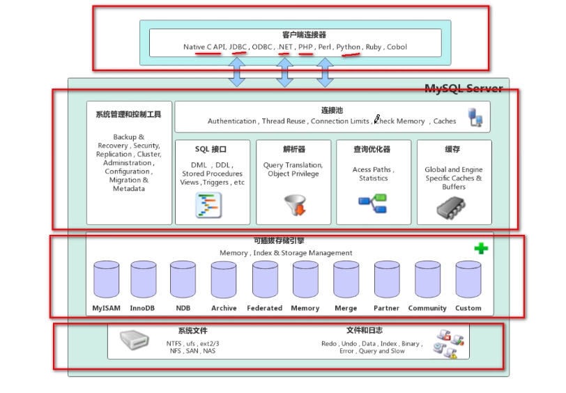
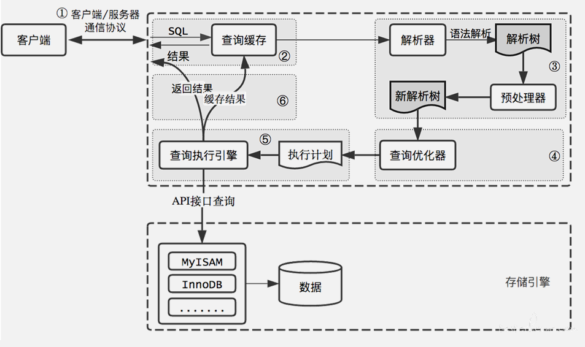
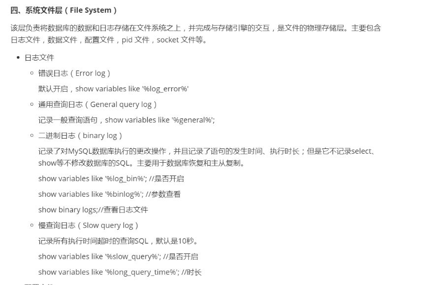
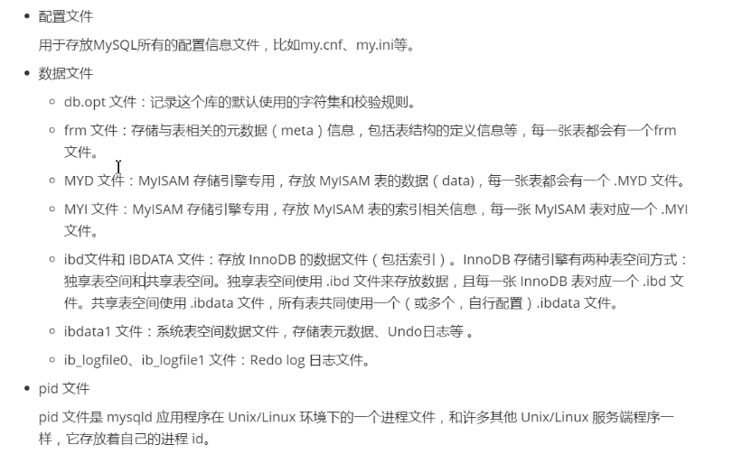

### Mysql架构

MySQL 体系结构由 Client Connectors 层、MySQL Server 层及存储引擎层组成。

##### Client Connectors 层

​		负责处理客户端的连接请求，与客户端创建连接。目前 MySQL 几乎支持所有的连接类型，例如常见的 JDBC、Python、Go 等。

##### MySQL Server 层

​		MySQL Server 层主要包括 Connection Pool、Service & utilities、SQL interface、Parser解析器、Optimizer 查询优化器、Caches 缓存等模块。

​		Connection Pool，负责处理和存储数据库与客户端创建的连接，一个线程负责管理一个连接。Connection Pool 包括了用户认证模块，就是用户登录身份的认证和鉴权及安全管理，也就是用户执行操作权限校验。

​		Service & utilities 是管理服务&工具集，包括备份恢复、安全管理、集群管理服务和工具。

​		SQL interface，负责接收客户端发送的各种 SQL 语句，比如 DML、DDL 和存储过程等。

​		Parser 解析器会对 SQL 语句进行语法解析生成解析树。

​		Optimizer 查询优化器会根据解析树生成执行计划，并选择合适的索引，然后按照执行计划执行 SQL 语言并与各个存储引擎交互。

​		Caches 缓存包括各个存储引擎的缓存部分，比如：InnoDB 存储的 Buffer Pool、MyISAM 存储引擎的 key buffer 等，Caches 中也会缓存一些权限，也包括一些 Session 级别的缓存。

##### 存储引擎层

存储引擎包括 MyISAM、InnoDB，以及支持归档的 Archive 和内存的 Memory 等。MySQL是插件式的存储引擎，只要正确定义与 MySQL Server 交互的接口，任何引擎都可以访问MySQL，这也是 MySQL 流行的原因之一。

##### 物理存储层

存储引擎底部是物理存储层，是文件的物理存储层，包括二进制日志、数据文件、错误日志、慢查询日志、全日志、redo/undo 日志等。

##### 客户端与 MySQL 的交互过程

1. 通过客户端/服务器通信协议与 MySQL 建立连接。半双工通信方式。
2. 查询缓存，这是 MySQL 的一个可优化查询的地方，如果开启了 Query Cache 且在查询缓存过程中查询到完全相同的 SQL 语句，则将查询结果直接返回给客户端；如果没有开启Query Cache 或者没有查询到完全相同的 SQL 语句则会由解析器进行语法语义解析，并生成解析树。
3. 预处理器生成新的解析树。
4. 查询优化器生成执行计划。 先执行where 过滤 ，再根据查询列进行属性投影
5. 查询执行引擎执行 SQL 语句，此时查询执行引擎会根据 SQL 语句中表的存储引擎类型，以及对应的 API 接口与底层存储引擎缓存或者物理文件的交互情况，得到查询结果，由MySQL Server 过滤后将查询结果缓存并返回给客户端。若开启了 Query Cache，这时也会将SQL 语句和结果完整地保存到 Query Cache 中，以后若有相同的 SQL 语句执行则直接返回结果。

#### 查看连接状态

命令：`show full processlist / show processlist`

状态：

sleep：线程正在等待客户端发送数据

Query：链接程序正在执行查询

Locked：线程正在等待表锁的释放

Sorting Result：线程正在对结果进行排序

Sending date ：向请求端返回数据

#### 查看缓存设置

命令: `show variables like 'query_cache%'`

查看缓存情况

命令：`show status like 'Qcache%'`

####  查询优化如何找到最优执行计划

- 使用等价变化规则
- 将可转换的外连接查询转换成内连接查询
- 优化count 、min、max 等函数
- 覆盖索引扫描
- 子查询优化
- 提前终止查询
- In的优化

#### ARIES 三原则

ARIES 三原则，是指 Write Ahead Logging（WAL）。

1. 先写日志后写磁盘，日志成功写入后事务就不会丢失，后续由 checkpoint 机制来保证磁盘物理文件与 Redo 日志达到一致性；
2. 利用 Redo 记录变更后的数据，即 Redo 记录事务数据变更后的值；
3. 利用 Undo 记录变更前的数据，即 Undo 记录事务数据变更前的值，用于回滚和其他事务多版本读。

###InnoDB 存储引擎

InnoDB 存储引擎的具体架构如下图所示。上半部分是**实例层**（计算层），位于内存中，下半部分是**物理层**，位于文件系统中。

####实例层

​		实例层分为线程和内存。InnoDB 重要的线程有 Master Thread，Master Thread 是 InnoDB 的主线程，负责调度其他各线程。

​		Master Thread 的优先级最高, 其内部包含几个循环：主循环（loop）、后台循环（background loop）、刷新循环（flush loop）、暂停循环（suspend loop）。Master Thread 会根据其内部运行的相关状态在各循环间进行切换。

大部分操作在主循环（loop）中完成，其包含 1s 和 10s 两种操作。

​	1s 操作主要包括如下。

​		日志缓冲刷新到磁盘（这个操作总是被执行，即使事务还没有提交）。

​		最多可能刷 100 个新脏页到磁盘。

​		执行并改变缓冲的操作。

​		若当前没有用户活动，可能切换到后台循环（background loop）等。

​	10s 操作主要包括如下。

​		最多可能刷新 100 个脏页到磁盘。

​		合并至多 5 个被改变的缓冲（总是）。

​		日志缓冲刷新到磁盘（总是）。

​		删除无用的 Undo 页（总是）。

​		刷新 100 个或者 10 个脏页到磁盘（总是）产生一个检查点（总是）等。

​		buf_dump_thread 负责将 buffer pool 中的内容 dump 到物理文件中，以便再次启动 MySQL 时，可以快速加热数据。

​		page_cleaner_thread 负责将 buffer pool 中的脏页刷新到磁盘，在 5.6 版本之前没有这个线程，刷新操作都是由主线程完成的，所以在刷新脏页时会非常影响 MySQL 的处理能力，在5.7 版本之后可以通过参数设置开启多个 page_cleaner_thread。

​		purge_thread 负责将不再使用的 Undo 日志进行回收。

​		read_thread 处理用户的读请求，并负责将数据页从磁盘上读取出来，可以通过参数设置线程数量。

​		write_thread 负责将数据页从缓冲区写入磁盘，也可以通过参数设置线程数量，page_cleaner 线程发起刷脏页操作后 write_thread 就开始工作了。

​		redo_log_thread 负责把日志缓冲中的内容刷新到 Redo log 文件中。

​		insert_buffer_thread 负责把 Insert Buffer 中的内容刷新到磁盘。实例层的内存部分主要包含 InnoDB Buffer Pool，这里包含 InnoDB 最重要的缓存内容。数据和索引页、undo 页、insert buffer 页、自适应 Hash 索引页、数据字典页和锁信息等。additional memory pool 后续已不再使用。Redo buffer 里存储数据修改所产生的 Redo log。double write buffer 是 double write 所需的 buffer，主要解决由于宕机引起的物理写入操作中断，数据页不完整的问题。

#### 物理层

物理层在逻辑上分为系统表空间、用户表空间和 Redo日志。

系统表空间里有 ibdata 文件和一些 Undo，ibdata 文件里有 insert buffer 段、double write段、回滚段、索引段、数据字典段和 Undo 信息段。

用户表空间是指以 .ibd 为后缀的文件，文件中包含 insert buffer 的 bitmap 页、叶子页（这里存储真正的用户数据）、非叶子页。InnoDB 表是索引组织表，采用 B+ 树组织存储，数据都存储在叶子节点中，分支节点（即非叶子页）存储索引分支查找的数据值。

Redo 日志中包括多个 Redo 文件，这些文件循环使用，当达到一定存储阈值时会触发checkpoint 刷脏页操作，同时也会在 MySQL 实例异常宕机后重启，InnoDB 表数据自动还原恢复过程中使用。

###文件

