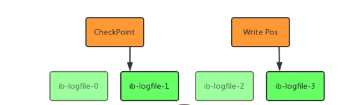
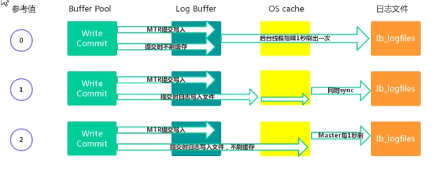

### Undo Log 日志

Undo 意为 撤销 或 取消

Undo Log ： 数据库事物开始之前，将要修改的记录 存放到 Undo 日志中，当数据回滚或数据崩溃时，利用 Undo 日志，撤销未提交事物对数据产生的影响。

Undo Log在事物开始前产生；

在事物提交时，并不会立刻删除 undo log ,innodb 该事物对应的 Undo Log 放入到删除列表中，后面会通过后台线程 purge thread 进行回收处理。


Undo Log 存储：Undo Log 采用段的方式 管理和记录。在 InnoDB 数据文件中 包含一种 rollback segment 回滚段，内部包含 1024 个 undo log segment。


undo log 相关参数 `show variables like '%innodb_undo%' `


####  Undo Log 作用

实现事物的原子性

实现多版本并发控制


### Redo Log 日志

Redo 重做

Redo Log ：指事物中修改的任何数据，将最新的数据备份存储位置（Redo Log），被称为重做日志

随着事物的操作执行，会生成 Redo Log，在事物提交时会将产生的 Redo Log 写入 Log Buffer ， 并不是随着事物的提交就立即写入磁盘文件。等事物操作的脏页写入磁盘后，Redo log 的使命也就完成了，Redo log 占用的空间就可以重用（被覆盖写入）。


####  Redo Log 写入机制

Redo Log 文件内容以循环的方式写入文件，写满时则回溯到第一个文件，进行覆盖写。




Write Post 是当前记录的位置，一边写一边后移，写到最后一个文件末尾后就回到0 号文件；

checkPoint 是当前要擦除的位置，也是往后推移并且循环的，擦除记录前要把记录更新到数据文件

write post 和 checkpoint 之间还空着的部分，可以用来记录更新的操作，如果 write post 追上 checkpoint ，表示写满，这时候不能再执行新的更新，得停下来先擦掉一些记录，把 checkpoint  推进一下。


Redo Buffer 持久化 到 Redo Log 的策略， 可以通过 `Innodb_flush_log_at_trx_commit` 设置：

1. 值为 0 ：每秒提交 Redo buffer -> OS cache -> flush  cache to disk ,可能丢失 一秒内的事物数据。由后台 Master线程每隔1秒执行一次操作；
2. 值为 1（默认值）：每次事物提交执行 Redo Buffer -> OS cache -> flush  cache to disk ，最安全，性能最差
3. 值为 2 ：每次事物提交执行  Redo Buffer -> OS cache ，然后由后台 Master 线程每隔 1 秒 执行  OS cache -> flush  cache to disk  操作。

一般建议选取值2，因为 MySQL 挂了数据没有损失，整个服务器挂了才会村上 1 秒事物提交数据。




###   Binlog日志

####  binlog 记录模式

Binary Log (二进制日志)，简称 binlog。Binlog是记录所有数据库表结构变更，以及表数据修改的二进制日志，不会记录 Select 和 show 者类操作。Binlog 日志以事件形式记录，还包含语句执行的消耗事件。

Bonlog 的使用场景

1. 主从复制：在主库中开启 Binlog 功能，这样主库可以吧 Binlog 传递给 从库，从库拿到 Binlog 后实现数据恢复达到主从数据一致性
2. 数据恢复


Binlog 文件名默认为 主机名_binlog-序列号， 也可以在配置文件中指定名称，文件记录模式有 STATEMENT、ROW、MIXDE 三种

- ROW：日志中会记录 每一行 数据被修改的情况，然后在 slave 端对相同的数据进行修改。优点：能清楚的记录每一个行数据修改细节，能完全实现主从数据同步和数据的恢复；缺点：批量操作，会产生大量的日志，尤其是 alert table 会让日志暴涨。
- STATEMENT：没一条被修改数据的SQL都会记录到 master 的 Binlog 中，slave 在负责的时候 SQL 进程会解析成和原理 master 端执行过 相同的 SQL 再执行。 简称 SQL已经复制。优点：日志量小，减少磁盘IO，提升存储和恢复速度；缺点：在某些情况下回导致主从数据不一致，如 last_insert_id()、now() 等函数。
- MIXED：以上两种模式的混合使用，一般会使用 STATEMENT 模式保存 Binlog，对 STATEMENT 模式无法复制的操作使用 ROW 模式 保存 binlog, Mysql 会根据执行的 SQL 语句选择写入模式


####   Binlog 写入机制

- 根据记录模式和操作触发event事件生成 log event (事件触发执行机制) 
- 将事物执行过程中产生 log event 写入缓冲区，每个事物线程都有一个缓冲区。log event 保存在一个 linlog_cache_mngr 数据结构中，在该结构中有两个缓冲区，一个是 stmt_cache 用于存放不支持事物的信息；另一个是 trx_cache 用于存放支持事物的信息。
- 事物在提交阶段会将产生的 log event 写入到外部 binlog 文件中

​	

####  Binlog 文件操作

##### Binlog 状态查看

```sql
SHOW VARIABLES LIKE '%log_bin%'
```


##### 开启Binlog功能

修改my.cnf 或 my.ini 配置文件，在 `[mysqlld]` 下面增加 `log_bin=mysql_bin_log` , 重启 MySQL服务

```ini
log-bin=mysqlbinlog
binlog-format=ROW
```


####  查看Binlog 日志

```sql
show binary log -- 等价于 show master logs 查看有哪些日志文件
show master status -- 当前正在操作的日志文件
show binlog events -- 查看文件内容
show binlog events in '文件名'
```

#### 使用Binlog 恢复数据

```sql
-- 按照指定时间恢复  -u用户名 -p密码
mysqlbinlog --start-datetime='2020-04-25 18:00:00' --stop-datetime-'2020-08-25 18:00:00' mysqlbinlog.000002 | mysql -uroot -p
-- 按照事件位置号恢复
mysqlbinlog --start-position=154 --stop-position=957  mysqlbinlog.000002 | mysql -uroot -p

```

mysqldump:定期全部备份数据库数据。

mysqlbinlog 可以做增量备份和恢复操作

####  删除 Binlog文件

```sql
purge binary log to 'musqlbinlog.000001'; -- 删除指定文件
purge binary log before '2020-04-25 18:00:00'; -- 删除指定日期之前的文件
rest master ;  --清除所有文件
```

可以通过设置 `expire_logs_days`参数启动自动清理功能。默认值为0表示没有启用。设置为1表示超出1天binlog文件会自动删除


