### 事务

一个逻辑工作单元要成为事务，在关系型数据库管理系统中，必须满足 4 个特性，即所谓的 ACID：原子性、一致性、隔离性和持久性。

1. 一致性：事务开始之前和事务结束之后，数据库的完整性限制未被破坏。
2. 原子性：事务的所有操作，要么全部完成，要么全部不完成，不会结束在某个中间环节。
3. 持久性：事务完成之后，事务所做的修改进行持久化保存，不会丢失。
4. 隔离性：当多个事务并发访问数据库中的同一数据时，所表现出来的相互关系。

#### 一致性

一致性其实包括两部分内容，分别是约束一致性和数据一致性。

​		约束一致性：大家应该很容易想到数据库中创建表结构时所指定的外键、Check、唯一索引等约束。可惜在 MySQL 中，是不支持 Check 的，只支持另外两种，所以约束一致性就非常容易理解了。

​		数据一致性：是一个综合性的规定，或者说是一个把握全局的规定。因为它是由原子性、持久性、隔离性共同保证的结果，而不是单单依赖于某一种技术。

#### 原子性

接下来看原子性，原子性就是前面提到的两个“要么”，即要么改了，要么没改。也就是说用户感受不到一个正在改的状态。MySQL 是通过 WAL（Write Ahead Log）技术来实现这种效果的。

可能你想问，原子性和 WAL 到底有什么关系呢？其实关系非常大。举例来讲，如果事务提交了，那改了的数据就生效了，如果此时 Buffer Pool 的脏页没有刷盘，如何来保证改了的数据生效呢？就需要使用 Redo 日志恢复出来的数据。而如果事务没有提交，且 Buffer Pool 的脏页被刷盘了，那这个本不应该存在的数据如何消失呢？就需要通过 Undo 来实现了，Undo 又是通过 Redo 来保证的，所以最终原子性的保证还是靠 Redo 的 WAL 机制实现的。

#### 持久性

再来看持久性。所谓持久性，就是指一个事务一旦提交，它对数据库中数据的改变就应该是永久性的，接下来的操作或故障不应该对其有任何影响。前面已经讲到，事务的原子性可以保证一个事务要么全执行，要么全不执行的特性，这可以从逻辑上保证用户看不到中间的状态。但持久性是如何保证的呢？一旦事务提交，通过原子性，即便是遇到宕机，也可以从逻辑上将数据找回来后再次写入物理存储空间，这样就从逻辑和物理两个方面保证了数据不会丢失，即保证了数据库的持久性。

#### 隔离性

最后看下隔离性。所谓隔离性，指的是一个事务的执行不能被其他事务干扰，即一个事务内部的操作及使用的数据对其他的并发事务是隔离的。锁和多版本控制就符合隔离性。

#### 查看事物

SHOW VARIABLES LIKE 'autocommit'

### 事物隔离级别

| 事物的隔离级别               | 脏读   | 不可重复读 | 幻读            |
| ---------------------------- | ------ | ---------- | --------------- |
| 未提交读（Read Uncommitted） | 可能   | 可能       | 可能            |
| 已提交读（Read Committed）   | 不可能 | 可能       | 可能            |
| 可重复读（Repeatable Read）  | 不可能 | 不可能     | 对 InnoDB不可能 |
| 串行化（Serializable）       | 不可能 | 不可能     | 不可能          |

### 并发事务控制

#### 单版本控制-锁

先来看锁，锁用独占的方式来保证在只有一个版本的情况下事务之间相互隔离，所以锁可以理解为单版本控制。

在 MySQL 事务中，锁的实现与隔离级别有关系，在 RR（Repeatable Read）隔离级别下，MySQL 为了解决幻读的问题，以牺牲并行度为代价，通过 Gap 锁来防止数据的写入，而这种锁，因为其并行度不够，冲突很多，经常会引起死锁。现在流行的 Row 模式可以避免很多冲突甚至死锁问题，所以推荐默认使用 Row + RC（Read Committed）模式的隔离级别，可以很大程度上提高数据库的读写并行度。

#### 多版本控制-MVCC

多版本控制也叫作 MVCC，是指在数据库中，为了实现高并发的数据访问，对数据进行多版本处理，并通过事务的可见性来保证事务能看到自己应该看到的数据版本。

那个多版本是如何生成的呢？每一次对数据库的修改，都会在 Undo 日志中记录当前修改记录的事务号及修改前数据状态的存储地址（即 ROLL_PTR），以便在必要的时候可以回滚到老的数据版本。例如，一个读事务查询到当前记录，而最新的事务还未提交，根据原子性，读事务看不到最新数据，但可以去回滚段中找到老版本的数据，这样就生成了多个版本。

多版本控制很巧妙地将稀缺资源的独占互斥转换为并发，大大提高了数据库的吞吐量及读写性能。

了解了单版本控制（锁）和多版本控制（MVCC），相信你对数据库的设置及并发性已经有了比较深入的理解。

#### 原子性背后的技术

先来看看原子性，每一个写事务，都会修改 Buffer Pool，从而产生相应的 Redo 日志，这些日志信息会被记录到 `ib_logfiles` 文件中。因为 Redo 日志是遵循 Write Ahead Log 的方式写的，所以事务是顺序被记录的。

在 `MySQL` 中，任何 Buffer Pool 中的页被刷到磁盘之前，都会先写入到日志文件中，这样做有两方面的保证。

1. 如果 Buffer Pool 中的这个页没有刷成功，此时数据库挂了，那在数据库再次启动之后，可以通过 Redo 日志将其恢复出来，以保证脏页写下去的数据不会丢失，所以必须要保证 Redo 先写。
2. 因为 Buffer Pool 的空间是有限的，要载入新页时，需要从 `LRU` 链表中淘汰一些页，而这些页必须要刷盘之后，才可以重新使用，那这时的刷盘，就需要保证对应的 `LSN` 的日志也要提前写到 `ib_logfiles` 中，如果没有写的话，恰巧这个事务又没有提交，数据库挂了，在数据库启动之后，这个事务就没法回滚了。所以如果不写日志的话，这些数据对应的回滚日志可能就不存在，导致未提交的事务回滚不了，从而不能保证原子性，所以原子性就是通过 `WAL` 来保证的。

#### 持久性背后的技术

再来看持久性，一个“提交”动作触发的操作有：binlog 落地、发送 binlog、存储引擎提交、flush_logs， check_point、事务提交标记等。这些都是数据库保证其数据完整性、持久性的手段。

那这些操作如何做到持久性呢？前面讲过，通过原子性可以保证逻辑上的持久性，通过存储引擎的数据刷盘可以保证物理上的持久性。这个过程与前面提到的 Redo 日志、事务状态、数据库恢复、参数 innodb_flush_log_at_trx_commit 有关，还与 binlog 有关。这里多提一句，在数据库恢复时，如果发现某事务的状态为 Prepare，则会在 binlog 中找到对应的事务并将其在数据库中重新执行一遍，来保证数据库的持久性。

#### 隔离性背后的技术

接下来看隔离性，InnoDB 支持的隔离性有 4 种，隔离性从低到高分别为：读未提交、读提交、可重复读、可串行化。

1. 读未提交（RU，Read Uncommitted）。它能读到一个事务的中间过程，违背了 ACID 特性，存在脏读的问题，所以基本不会用到，可以忽略。
2. 读提交（RC，Read Committed）。它表示如果其他事务已经提交，那么我们就可以看到，这也是一种最普遍适用的级别。但由于一些历史原因，可能 RC 在生产环境中用的并不多。
3. 可重复读（RR，Repeatable Read），是目前被使用得最多的一种级别。其特点是有 Gap 锁、目前还是默认的级别、在这种级别下会经常发生死锁、低并发等问题。
4. 可串行化，这种实现方式，其实已经并不是多版本了，又回到了单版本的状态，因为它所有的实现都是通过锁来实现的。

具体说到隔离性的实现方式，我们通常用 Read View 表示一个事务的可见性。前面讲到 RC 级别的事务可见性比较高，它可以看到已提交的事务的所有修改。而 RR 级别的事务，则没有这个功能，一个读事务中，不管其他事务对这些数据做了什么修改，以及是否提交，只要自己不提交，查询的数据结果就不会变。这是如何做到的呢？

随着时间的推移，读提交每一条读操作语句都会获取一次 Read View，每次更新之后，都会获取数据库中最新的事务提交状态，也就可以看到最新提交的事务了，即每条语句执行都会更新其可见性视图。而反观下面的可重复读，这个可见性视图，只有在自己当前事务提交之后，才去更新，所以与其他事务是没有关系的。

这里需要提醒大家的是：在 RR 级别下，长时间未提交的事务会影响数据库的 PURGE 操作，从而影响数据库的性能，所以可以对这样的事务添加一个监控。

最后我们来讲下可串行化的隔离级别，前面已经提到了，可串行化是通过锁来实现的，所以实际上并不是多版本控制，它的特点也很明显：读锁、单版本控制、并发低。

#### 一致性背后的技术

接下来是一致性。一致性可以归纳为数据的完整性。根据前文可知，数据的完整性是通过其他三个特性来保证的，包括原子性、隔离性、持久性，而这三个特性，又是通过 Redo/Undo 来保证的，正所谓：合久必分，分久必合，三足鼎力，三分归晋，数据库也是，为了保证数据的完整性，提出来三个特性，这三个特性又是由同一个技术来实现的，所以理解 Redo/Undo 才能理解数据库的本质。

###  `MVCC ` 

####  `MVCC` 实现原理

前文多次提到了 `MVCC` 这个概念，这里我们来讲解 `MVCC` 的实现原理。`MySQL InnoDB` 存储引擎，实现的是基于多版本的并发控制协议——`MVCC`，而不是基于锁的并发控制。

`MVCC` 最大的好处是读不加锁，读写不冲突。在读多写少的 `OLTP`（On-Line Transaction Processing）应用中，读写不冲突是非常重要的，极大的提高了系统的并发性能，这也是为什么现阶段几乎所有的 `RDBMS`（Relational Database Management System），都支持 `MVCC` 的原因。 

####  快照读与当前读

在 `MVCC` 并发控制中，读操作可以分为两类: 快照读（Snapshot Read）与当前读 （Current Read）。

1. 快照读：读取的是记录的可见版本（有可能是历史版本），不用加锁。
2. 当前读：读取的是记录的最新版本，并且当前读返回的记录，都会加锁，保证其他事务不会再并发修改这条记录。 

注意：`MVCC` 只在 `Read Commited` 和 `Repeatable Read` 两种隔离级别下工作。

如何区分快照读和当前读呢？ 可以简单的理解为：

1. 快照读：简单的 select 操作，属于快照读，不需要加锁。 
2. 当前读：特殊的读操作，插入/更新/删除操作，属于当前读，需要加锁。 

#### `MVCC` 多版本实现

这里举一个“事务对某行记录更新的过程”的案例来讲解 `MVCC `中多版本的实现。

1. 假设 `F1～F6` 是表中字段的名字，`1～6` 是其对应的数据。后面三个隐含字段分别对应该行的隐含ID、事务号和回滚指针，如下图所示。

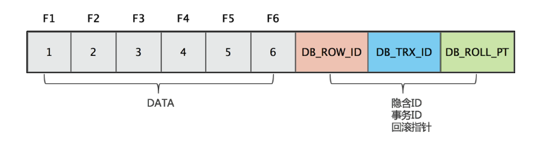

2. 隐含 ID（`DB_ROW_ID`），6 个字节，当由 `InnoDB` 自动产生聚集索引时，聚集索引包括这个 `DB_ROW_ID` 的值。
3. 事务号（`DB_TRX_ID`），6 个字节，标记了最新更新这条行记录的 `Transaction ID`，每处理一个事务，其值自动 +1。
4. 回滚指针（`DB_ROLL_PT`），7 个字节，指向当前记录项的 `Rollback Segment` 的 `Undo log`记录，通过这个指针才能查找之前版本的数据。

具体的更新过程，简单描述如下。

首先，假如这条数据是刚 INSERT 的，可以认为 ID 为 1，其他两个字段为空。

然后，当事务 1 更改该行的数据值时，会进行如下操作，如下图所示。

1. 用排他锁锁定该行；记录 Redo log；
2. 把该行修改前的值复制到 Undo log，即图中下面的行；
3. 修改当前行的值，填写事务编号，使回滚指针指向 Undo log 中修改前的行。

接下来，与事务 1 相同，此时 Undo log 中有两行记录，并且通过回滚指针连在一起。因此，如果 Undo log 一直不删除，则会通过当前记录的回滚指针回溯到该行创建时的初始内容，所幸的是在 InnoDB 中存在 purge 线程，它会查询那些比现在最老的活动事务还早的 Undo log，并删除它们，从而保证 Undo log 文件不会无限增长，如下图所示。

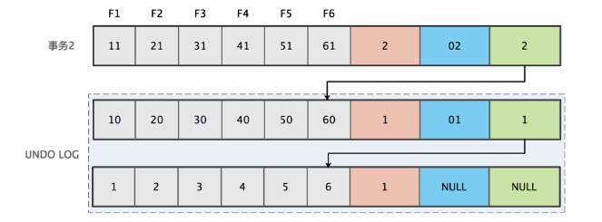

### 并发事务问题及解决方案

##### 脏读

​		一个事务正在对一条记录做修改，在这个事务完成并提交前，这条记录的数据就处于不一致状态；这时，另一个事务也来读取同一条记录，如果不加控制，第二个事务读取了这些“脏”数据，并据此做进一步的处理，就会产生未提交的数据依赖关系。这种现象被形象的叫作"脏读"（Dirty Reads）。

##### 不可重复读

​		一个事务在读取某些数据后的某个时间，再次读取以前读过的数据，却发现其读出的数据已经发生了改变、或某些记录已经被删除了！这种现象就叫作“ 不可重复读”（Non-Repeatable Reads）。

##### 幻读

​		一个事务按相同的查询条件重新读取以前检索过的数据，却发现其他事务插入了满足其查询条件的新数据，这种现象就称为“幻读”（Phantom Reads）。

#### 解决方案

产生的这些问题，MySQL 数据库是通过事务隔离级别来解决的，上文已经详细讲解过，这里再进行简单的说明。

在上文讲 MySQL 事务特性的隔离性的时候就已经详细地讲解了事务的四种隔离级别。这里要求大家能够记住这种关系的矩阵表；记住各种事务隔离级别及各自都解决了什么问题，如下图所示。

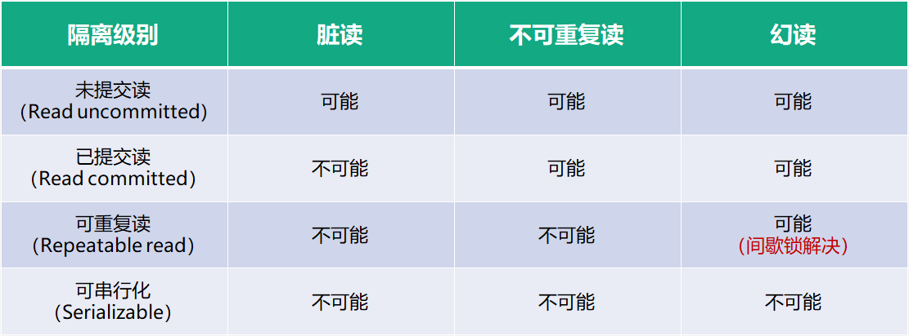

##### 不可重复读

MySQL 中默认的事务隔离级别是 RR，这里设置成 RC 隔离级别，此时提交事务 B 修改 id=1 的数据之后，事务 A 进行同样的查询操作，后一次和前一次的查询结果不一样，这就是不可重复读（重新读取产生的结果不一样了）。这里事务 A 读到了事务 B 提交的数据，即是“脏读”。

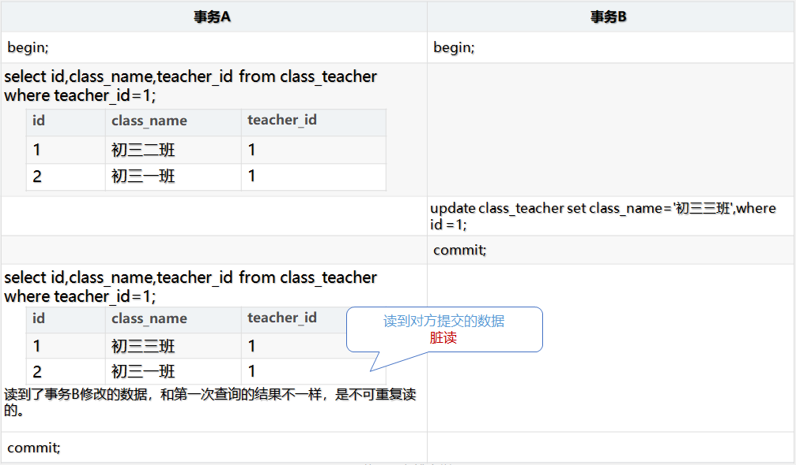

在RR隔离级别下的情况。当 teacher_id=1时，事务 A 先进行一次读取操作，事务 B 中间修改了 id=1 的数据并提交，事务 C 也插入了一条数据并提交。事务 A 第二次读到的数据和第一次完全相同。所以说它是可重读的。

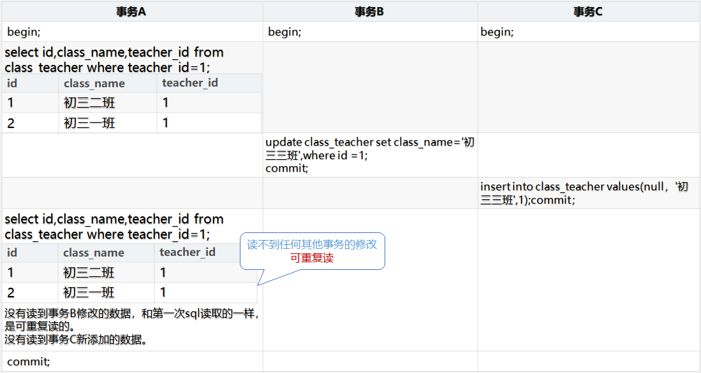

##### 幻读

行锁可以防止不同事务版本的数据在修改提交时造成数据冲突的情况。但如何避免别的事务插入数据造成的问题呢。我们先来看看在 RC 隔离级别下的处理过程。

如下图所示，事务 A 修改了所有 teacher_id=30 的数据，但是当事务 B INSERT 新数据后，事务 A 发现莫名其妙的多了一行 teacher_id=30 的数据， 而且没有被之前的 UPDATE语句所修改，这就是“当前读”的幻读问题。

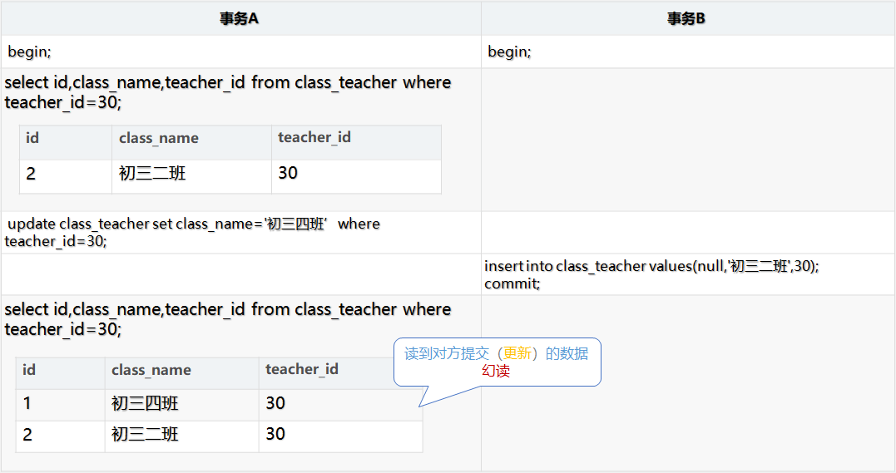

不可重复读重点在于 UPDATA 和 DELETE，而幻读的重点在于 INSERT。它们之间最大的区别是如何通过锁机制来解决它们产生的问题。这里说的锁只是使用悲观锁机制。

那么在 RR 隔离级别下，事务 A 在 UPDATE 后加锁，事务 B 无法插入新数据，这样事务 A在 UPDATE 前后读的数据保持一致，避免了幻读。

跟上面的案例一样，也是在 RR 事务隔离级别下，事务 A 在 UPDATE 后加锁，对于其他两个事务，事务 B 和事务 C 的 INSERT 操作，就必须等事务 A 提交后，才能继续执行。这里就用到了“锁”，这里使用的是 Gap 锁，后面会详细讲解。它和上面的情况一样，解决了“幻读”的发生，如下图所示。

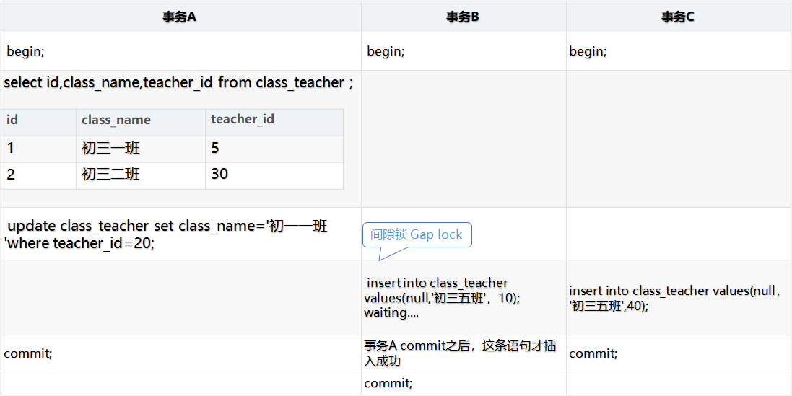

### `MySQL` 锁 

#### `MySQL` 锁分类

在 `MySQL` 中有三种级别的锁：页级锁、表级锁、行级锁。

1. 表级锁：开销小，加锁快；不会出现死锁；锁定粒度大，发生锁冲突的概率最高，并发度最低。 会发生在：`MyISAM`、`memory`、`InnoDB`、`BDB` 等存储引擎中。
2. 行级锁：开销大，加锁慢；会出现死锁；锁定粒度最小，发生锁冲突的概率最低，并发度最高。会发生在：`InnoDB` 存储引擎。
3. 页级锁：开销和加锁时间界于表锁和行锁之间；会出现死锁；锁定粒度界于表锁和行锁之间，并发度一般。会发生在：`BDB` 存储引擎。

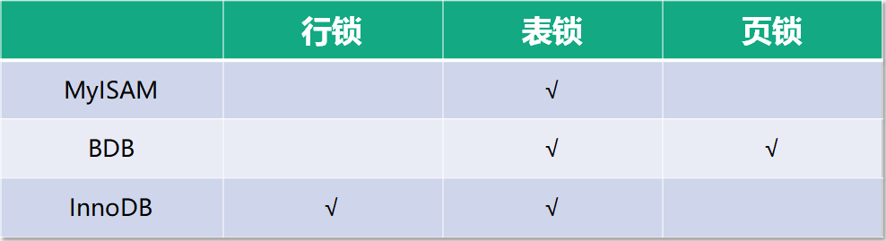

#### `InnoDB` 中的锁

在 `MySQL InnoDB` 存储引擎中，锁分为行锁和表锁。

其中行锁包括两种锁。

1. 共享锁（S）：允许一个事务去读一行，阻止其他事务获得相同数据集的排他锁。
2. 排他锁（X）：允许获得排他锁的事务更新数据，阻止其他事务取得相同数据集的共享读锁和排他写锁。

另外，为了允许行锁和表锁共存，实现多粒度锁机制，`InnoDB` 还有两种内部使用的意向锁（`Intention Locks`），这两种意向锁都是表锁。

表锁又分为三种。

1. 意向共享锁（IS）：事务计划给数据行加行共享锁，事务在给一个数据行加共享锁前必须先取得该表的 IS 锁。
2. 意向排他锁（IX）：事务打算给数据行加行排他锁，事务在给一个数据行加排他锁前必须先取得该表的 IX 锁。
3. 自增锁（AUTO-INC Locks）：特殊表锁，自增长计数器通过该“锁”来获得子增长计数器最大的计数值。

在加行锁之前必须先获得表级意向锁，否则等待 `innodb_lock_wait_timeout` 超时后根据`innodb_rollback_on_timeout` 决定是否回滚事务。

#### `InnoDB` 自增锁

​		在 `MySQL InnoDB` 存储引擎中，我们在设计表结构的时候，通常会建议添加一列作为自增主键。这里就会涉及一个特殊的锁：自增锁（即：`AUTO-INC Locks`），它属于表锁的一种，在 INSERT 结束后立即释放。我们可以执行 `show engine innodb status\G `来查看自增锁的状态信息。

​		在自增锁的使用过程中，有一个核心参数，需要关注，即` innodb_autoinc_lock_mode`,它有0、1、2 三个值。保持默认值就行。具体的含义可以参考官方文档，这里不再赘述，如下图所示。

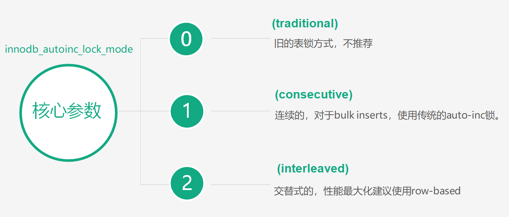

#### `InnoDB` 行锁

`InnoDB` 行锁是通过对索引数据页上的记录（record）加锁实现的。主要实现算法有 3 种：Record Lock、Gap Lock 和 Next-key Lock。

1. Record Lock 锁：单个行记录的锁（锁数据，不锁 Gap）。
2. Gap Lock 锁：间隙锁，锁定一个范围，不包括记录本身（不锁数据，仅仅锁数据前面的Gap）。
3. Next-key Lock 锁：同时锁住数据，并且锁住数据前面的 Gap。

#### `InnoDB` 加锁行为

​		下面举一些例子分析 `InnoDB `不同索引的加锁行为。分析锁时需要跟隔离级别联系起来，我们以 RR 为例，主要是从四个场景分析。

1. 主键 + RR。
2. 唯一键 + RR。
3. 非唯一键 + RR。
4. 无索引 + RR。

##### 主键 + RR

下面讲解第一种情况：主键 + RR，如下图所示。

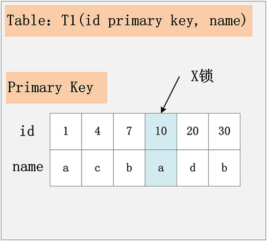

假设条件是：

​	`update t1 set name=‘XX’ where id=10`。

​	id 为主键索引。

加锁行为：**仅在 id=10 的主键索引记录上加 X锁 (排它锁)** 。

##### 唯一键 + RR

第二种情况：唯一键 + RR，如下图所示。

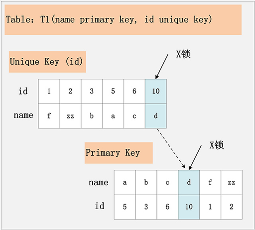

假设条件是：

​	`update t1 set name=‘XX’ where id=10。`

​	id 为唯一索引。

加锁行为：

​	先在唯一索引 id 上加 id=10 的 X 锁。

​	再在 id=10 的主键索引记录上加 X 锁，若 id=10 记录不存在，那么加间隙锁。

##### 非唯一键 + RR

第三种情况：非唯一键 + RR，如下图所示。

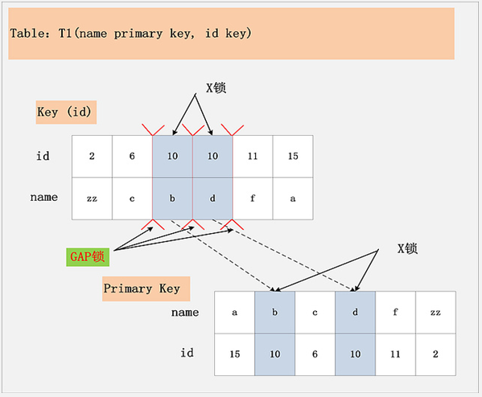

假设条件是：

​	`update t1 set name=‘XX’ where id=10。`

​	id 为非唯一索引。

加锁行为：

​		先通过 id=10 在 key(id) 上定位到第一个满足的记录，对该记录加 X 锁，而且要在 (6,c)~(10,b) 之间加上 Gap lock，为了防止幻读。然后在主键索引 name 上加对应记录的X 锁；

​		再通过 id=10 在 key(id) 上定位到第二个满足的记录，对该记录加 X 锁，而且要在(10,b)~(10,d)之间加上 Gap lock，为了防止幻读。然后在主键索引 name 上加对应记录的X 锁；

​		最后直到 id=11 发现没有满足的记录了，此时不需要加 X 锁，但要再加一个 Gap lock： (10,d)~(11,f)。

##### 无索引 + RR

第四种情况：无索引 + RR，如下图所示。

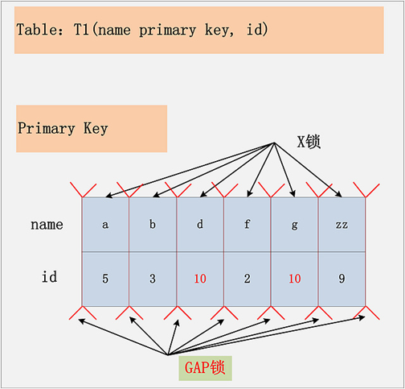

假设条件是：

​	`update t1 set name=‘XX’ where id=10。`

​	id 列无索引。

加锁行为：

​	表里所有行和间隙均加 X 锁。

#### `InnoDB` 死锁

在 `MySQL` 中死锁不会发生在 `MyISAM` 存储引擎中，但会发生在 `InnoDB` 存储引擎中，因为 `InnoDB` 是逐行加锁的，极容易产生死锁。那么死锁产生的四个条件是什么呢？

1. 互斥条件：一个资源每次只能被一个进程使用； 
2. 请求与保持条件：一个进程因请求资源而阻塞时，对已获得的资源保持不放；
3.  不剥夺条件：进程已获得的资源，在没使用完之前，不能强行剥夺；
4.  循环等待条件：多个进程之间形成的一种互相循环等待资源的关系。

在发生死锁时，`InnoDB` 存储引擎会自动检测，并且会自动回滚代价较小的事务来解决死锁问题。但很多时候一旦发生死锁，`InnoDB` 存储引擎的处理的效率是很低下的或者有时候根本解决不了问题，需要人为手动去解决。

既然死锁问题会导致严重的后果，那么在开发或者使用数据库的过程中，如何避免死锁的产生呢？这里给出一些建议：
加锁顺序一致；

1. 尽量基于 primary 或 unique key 更新数据。
2. 单次操作数据量不宜过多，涉及表尽量少。
3. 减少表上索引，减少锁定资源。
4. 相关工具：pt-deadlock-logger。

###InnoDB 锁类型

共享锁（行锁）：又称为读锁。多个事物对同一数据可以共享一把锁，但是只能读不能修改

排它锁（行锁）：又称为写锁。

意向锁共享锁（表锁）

意向锁排它锁（表锁）

自增锁

行锁通过给索引加锁来实现

通过索引条件的操作才会使用行锁

#### 行锁的算法

##### 记录锁 Record

唯一索引，条件为精准匹配

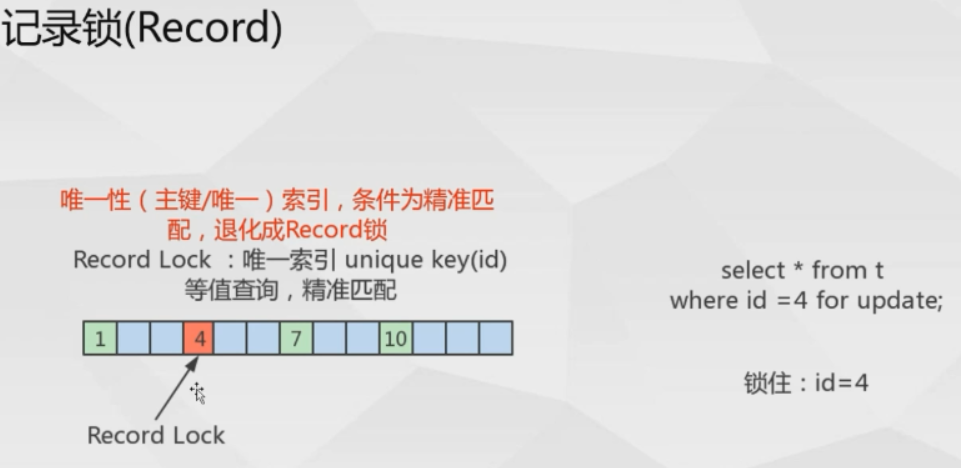

##### 间隙锁 GAP

当记录不存在，临键锁退化成 Gap 锁

Gap Lock 范围查询或等值查询，且记录不存在，  锁住区间

Gap 只在 RR事物隔离级别存在

##### 临键锁 next-Key locks （InnoDB 行锁的默认算术）

锁住记录+区间（左开右闭）

当SQL执行按照索引进行数据的检索时，查询条件为范围查找（between and, < , > 等），并有数据命中则此时 SQL 语句加上的锁为 next-Key locks ,锁住索引的记录 + 区间（左开右闭）

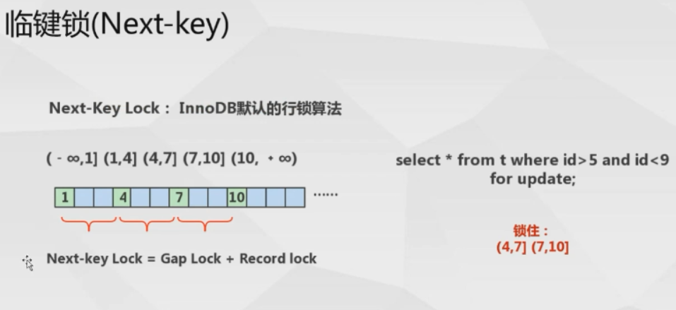

set session autocommit=off;   -- 关闭当前会话的自动提交

begin -- 事物开始

。。。

#### 查看事物隔离级别

select  global.@@tx_isolation;