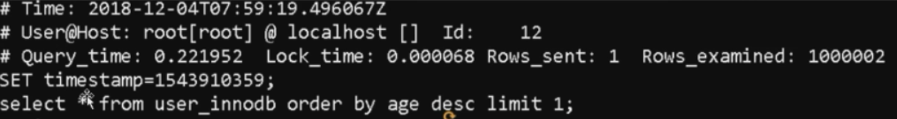

#### 为什么要用索引

- 索引能极大的减少存储引擎需要扫描的数量

- 索引可以把随机IO变成顺序IO；（覆盖索引，查询的列为索引）

- 索引可以帮我们在进行分组、排序等操作时，避免使用临时表

#### B+Tree

- B+节点关键字搜索采用闭合区间

- B+非叶节点不保存数据相关信息，只保存关键字和子节点的引用

- B+关键字对应的数据保存在叶子节点中

- B+的叶子节点是顺序排列的，并且相邻节点具有顺序引用关系

离散性越高，选择性越好

覆盖索引：查询列可通过索引节点中的关键字直接返回。

覆盖索引可减少数据库IO，将随机 IO 变为顺序 IO，可提高查询性能。

索引字段最好不可以为空

#### 索引优化

匹配列前缀可能用到索引 	like 999%;    like %999%、like %999 用不到索引

where 条件中 not in  和 <> 操作无法使用索引

匹配范围值，order by 也可用到索引

多用指定列查询，只返回自己想到的数据列，少用 select *

联合索引中如果不是按照索引最左列开始查找，无法使用索引

联合索引中精确匹配最左前列，并范围匹配另外一列可以用到索引

联合索引中如果查询中有某个列的范围查询，其右边所有的列都无法使用索引

用到 OR 建议用 In：（使用 OR 一条数据会与所有的OR条件比较， 使用 In 会优化 使用 二分查找 比较）

####  存储引擎

##### MyISAM

- select count(*) from table 无需进行数据的扫描
- 数据 MYD 和 所有 MYI 分开存储
- 表级锁
- 不支持事物

##### Innodb

MySql 5.5 级以后版本的默认存储引擎

- 事物 ACID
- 行级锁
- 聚集索引（主键索引）方式进行数据存储
- 支持外键关系保证数据完整性

#### 执行计划Id

select 查询的序列号 ，标识执行的顺序

- Id 相同，执行顺序由上至下
- Id 不同，如果是子查询，id的序号会递增，id值越大优先级越高，越先被执行
- Id相同又不同两种情况同时存在，Id相同可以认为是一组，从上往下顺序执行；在所有组中，Id越大，优先级越高，越先执行

#### 执行计划：select_type

- simple：简单的 select 查询，查询中不包含子查询或者 union
- PRIMARY：查询中包含子部分，最外层查询被标记为 primary
- SUBQUERY：表示在 select或  where 列表中包含了子查询
- MATERIALIZED：表示 where 后面 in 条件的子查询
- UNION：若第二个select 出现在 Union 之后，则被标记 为 union
- Union RESULT：从 union 表获取结果的select

#### 执行计划：table

查询涉及到的表

直接显示表名或者表的别名

`<unionM,N>`：由 Id 为 M,N 查询，union产生的结果

`<subqueryN>`：由 Id 为 N 查询产生的结果

#### 执行计划 TYPE

访问类型，SQL查询优化中一个很重要的指标，结果值从好到坏依次是： system > const > eq_ref > ref > range > index > ALl

system：表中只有一行记录，const 类型的特例，基本不会出现

const：表示通过索引一次就找到了，const 用于比较 primary key 或者 unique 索引

eq_ref：唯一索引扫描，对于每个索引键，表中只有一条记录与之匹配，常见于主键或唯一索引扫描

ref：非唯一索引扫描，返回匹配某个单独值的所有行，本质也是一种索引访问

range：只检索给定范围的行，使用一个索引来选择行

index： FUll Index Scan ，索引全表扫描，把索引从头到尾扫一遍

All：FULL Table Scan ，遍历全表以找到匹配的行

#### 如何定位慢SQL

慢查询日志：

查看有没有开启慢查询日志： `show variables like  'slow_query_log'`

开启：`set global  show_query_log=on`

show variables like  'slow_query%'

设置没有命中索引的进入慢查询

set  global  log_queries_not_using_indexeds = on;

设置记录执行时间超过多少秒的

set  global  log_query_time=0.01;

#####  慢查询日志分析

Time：日志记录的时间

User@Host：执行的用户及主机

Query_time：查询耗费时间； Lock_time 锁表时间； Rows_sent 发送给请求方的记录条数； rows_examined 语句扫描的记录条数

set timestamp：语句执行的时间点

select ... 执行的具体语句

##### 慢查询日志分析工具

mysqldumpslow -s at -t 10 /var/lib/mysql/gupaoedu-slow.log

