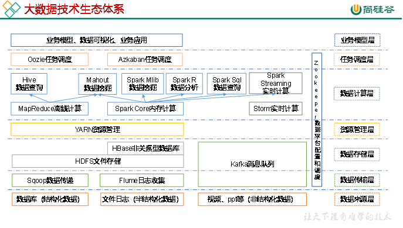

#### Hadoop组成

Hadoop1.x:  **MapReduce**(计算+资源调度) 、**HDFS**(数据存储)、**Common**(辅助工具)

Hadoop2.x: **MapReduce**(计算) 、**Yarn**(资源调度)、**HDFS**(数据存储)、**Common**(辅助工具)

##### HDFS

###### NameNode(nn):

 存储文件的员数据，如文件名，文件目录结构，文件属性(生成时间、副本数、文件权限)，以及每个文件的块列表和块所在的DataNode等。

###### DataNode(dn):

 在本地文件系统存储文件块数据，以及块数据的校验和

###### Secondary NameNode(2nn): 

用来监控HDFS状态的辅助后台程序，每隔一段时间获取HDFS元数据的快照。

##### YARN

###### ResourceManager(RM)作用：

​	处理客户端请求

​	监控NodeManager

​	启动或监控ApplicationMaster(任务)

​	资源的分配与调度

###### NodeManager作用：

​	管理单个节点上的资源

​	处理来自ResourceManager的命令

​	处理来自ApplicationMaster的命令

###### ApplicationMaster作用：

​	负责数据的切分

​	为应用程序申请资源并分配给内部任务

​	任务的监控与容错

###### Container

​	是YARN中的资源抽象，它封装了某个节点上的多维度资源，如内存，CPU，磁盘，网络

##### MapReduce

​	Map阶段并行处理数据

​	Reduce阶段对Map结果进行汇总	

#### Hadoop生态

