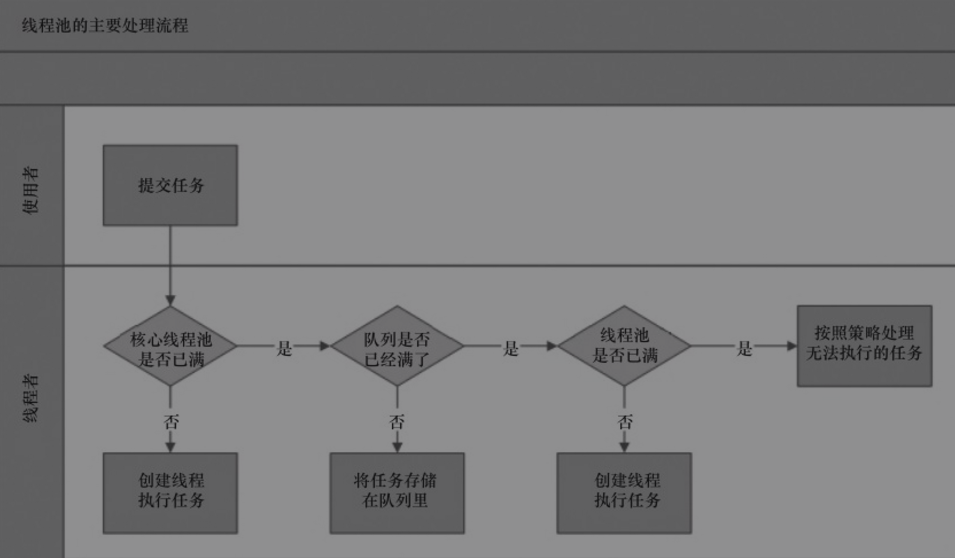
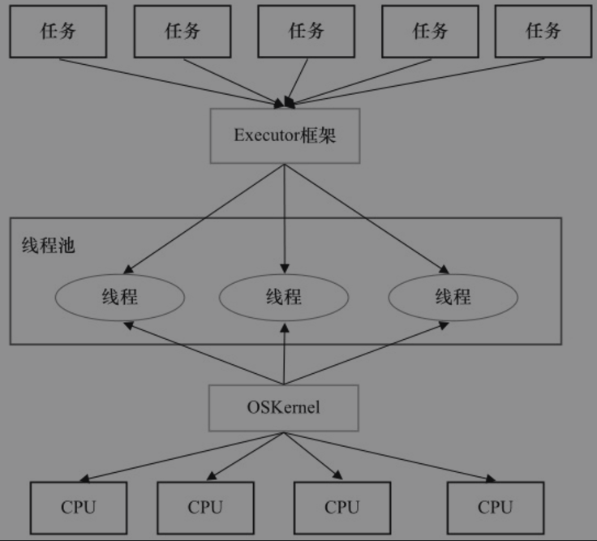
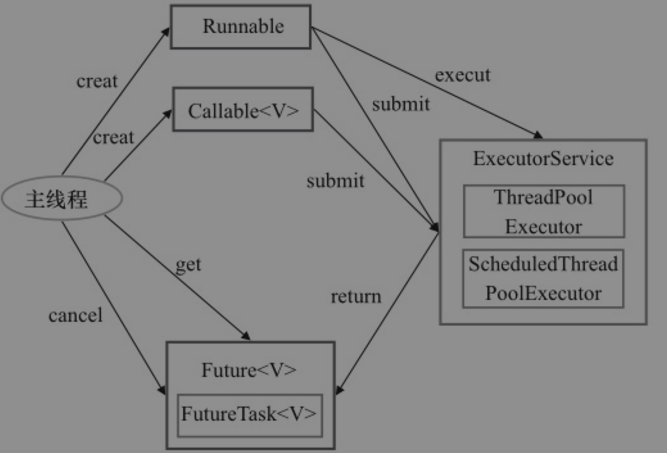
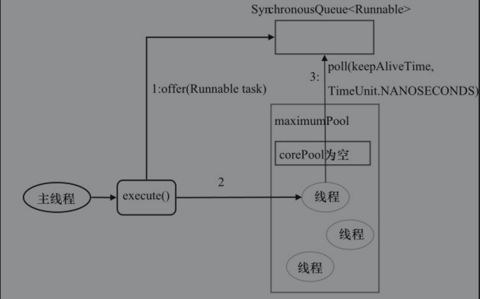
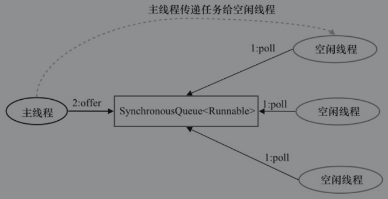
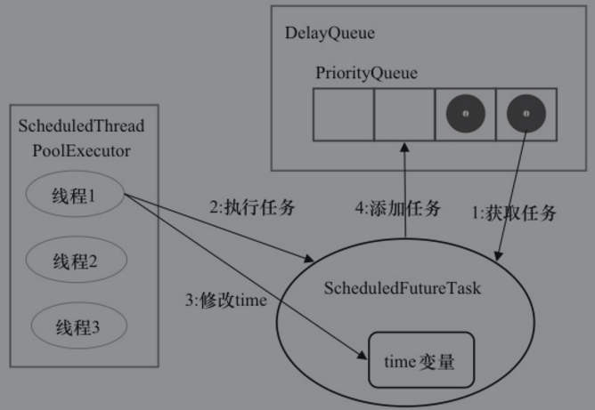
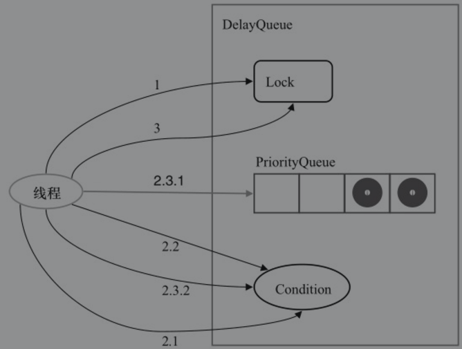
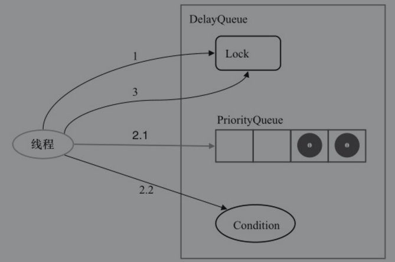

### 线程池

使用线程池能够带来3个好处。

1. 降低资源消耗。通过重复利用已创建的线程降低线程创建和销毁造成的消耗。
2. 提高响应速度。当任务到达时，任务可以不需要等到线程创建就能立即执行。
3. 提高线程的可管理性。线程是稀缺资源，如果无限制地创建，不仅会消耗系统资源，还会降低系统的稳定性，使用线程池可以进行统一分配、调优和监控。

#### 线程池的实现原理

当提交一个新任务到线程池时，线程池的处理流程如下

1. 线程池判断核心线程池里的线程是否都在执行任务。如果不是，则创建一个新的工作线程来执行任务。如果核心线程池里的线程都在执行任务，则进入下个流程。
2. 线程池判断工作队列是否已经满。如果工作队列没有满，则将新提交的任务存储在这个工作队列里。如果工作队列满了，则进入下个流程。
3. 线程池判断线程池的线程是否都处于工作状态。如果没有，则创建一个新的工作线程来执行任务。如果已经满了，则交给饱和策略来处理这个任务。




##### ThreadPoolExecutor

ThreadPoolExecutor执行execute方法分下面4种情况

1. 如果当前运行的线程少于corePoolSize，则创建新线程来执行任务（注意，执行这一步骤需要获取全局锁）。
2. 如果运行的线程等于或多于corePoolSize，则将任务加入BlockingQueue。
3. 如果无法将任务加入BlockingQueue（队列已满），则创建新的线程来处理任务（注意，执行这一步骤需要获取全局锁）。
4. 如果创建新线程将使当前运行的线程超出maximumPoolSize，任务将被拒绝，并调用RejectedExecutionHandler.rejectedExecution()方法。


ThreadPoolExecutor采取上述步骤的总体设计思路，是为了在执行execute()方法时，尽可能地避免获取全局锁（那将会是一个严重的可伸缩瓶颈）。在ThreadPoolExecutor完成预热之后（当前运行的线程数大于等于corePoolSize），几乎所有的execute()方法调用都是执行步骤2，而步骤2不需要获取全局锁。


```java
package java.util.concurrent;
public class ThreadPoolExecutor extends AbstractExecutorService {
    
    public void execute(Runnable command) {
        int c = ctl.get();
        if (workerCountOf(c) < corePoolSize) {
            if (addWorker(command, true))
                return;
            c = ctl.get();
        }
        if (isRunning(c) && workQueue.offer(command)) {
            int recheck = ctl.get();
            if (! isRunning(recheck) && remove(command))
                reject(command);
            else if (workerCountOf(recheck) == 0)
                addWorker(null, false);
        }
        else if (!addWorker(command, false))
            reject(command)
    }
}
```


#### 线程池的使用

 #####  线程池的创建


```java
package java.util.concurrent;
public class ThreadPoolExecutor extends AbstractExecutorService {
  	
	public ThreadPoolExecutor(int corePoolSize,
                          int maximumPoolSize,
                          long keepAliveTime,
                          TimeUnit unit,
                          BlockingQueue<Runnable> workQueue,
                          ThreadFactory threadFactory,
                          RejectedExecutionHandler handler) {
		
		
	}
}
```

创建一个线程池时需要输入的参数

1. `corePoolSize`（线程池的基本大小）：当提交一个任务到线程池时，线程池会创建一个线程来执行任务，即使其他空闲的基本线程能够执行新任务也会创建线程，等到需要执行的任务数大于线程池基本大小时就不再创建。如果调用了线程池的`prestartAllCoreThreads()`方法，线程池会提前创建并启动所有基本线程。
2. `runnableTaskQueue`（任务队列）：用于保存等待执行的任务的阻塞队列。可以选择以下几个阻塞队列。
3. `maximumPoolSize`（线程池最大数量）：线程池允许创建的最大线程数。如果队列满了，并且已创建的线程数小于最大线程数，则线程池会再创建新的线程执行任务。值得注意的是，如果使用了无界的任务队列这个参数就没什么效果。
4. `ThreadFactory`：用于设置创建线程的工厂，可以通过线程工厂给每个创建出来的线程设置更有意义的名字。
5. `RejectedExecutionHandler`（饱和策略）：当队列和线程池都满了，说明线程池处于饱和状态，那么必须采取一种策略处理提交的新任务。这个策略默认情况下是AbortPolicy，表示无法处理新任务时抛出异常。

##### 向线程池提交任务

可以使用两个方法向线程池提交任务，分别为execute()和submit()方法。

1. `execute()`方法用于提交不需要返回值的任务，所以无法判断任务是否被线程池执行成功。
2. `submit()`方法用于提交需要返回值的任务。线程池会返回一个`future`类型的对象，通过这个`future`对象可以判断任务是否执行成功，并且可以通过`future`的`get()`方法来获取返回值，`get()`方法会阻塞当前线程直到任务完成，而使用`get( long timeout，TimeUnit unit)`方法则会阻塞当前线程一段时间后立即返回，这时候有可能任务没有执行完。

##### 关闭线程池

可以通过调用线程池的shutdown或shutdownNow方法来关闭线程池。它们的原理是遍历线程池中的工作线程，然后逐个调用线程的interrupt方法来中断线程，所以无法响应中断的任务可能永远无法终止。但是它们存在一定的区别，shutdownNow首先将线程池的状态设置成STOP，然后尝试停止所有的正在执行或暂停任务的线程，并返回等待执行任务的列表，而shutdown只是将线程池的状态设置成SHUTDOWN状态，然后中断所有没有正在执行任务的线程。

只要调用了这两个关闭方法中的任意一个，isShutdown方法就会返回true。当所有的任务都已关闭后，才表示线程池关闭成功，这时调用isTerminaed方法会返回true。至于应该调用哪一种方法来关闭线程池，应该由提交到线程池的任务特性决定，通常调用shutdown方法来关闭线程池，如果任务不一定要执行完，则可以调用shutdownNow方法。

##### 合理地配置线程池

要想合理地配置线程池，就必须首先分析任务特性，可以从以下几个角度来分析。

1. 任务的性质：CPU密集型任务、IO密集型任务和混合型任务。
2. 任务的优先级：高、中和低。
3. 任务的执行时间：长、中和短。
4. 任务的依赖性：是否依赖其他系统资源，如数据库连接。

性质不同的任务可以用不同规模的线程池分开处理。CPU密集型任务应配置尽可能小的线程，如配置Ncpu+1个线程的线程池。由于IO密集型任务线程并不是一直在执行任务，则应配置尽可能多的线程，如2*Ncpu。混合型的任务，如果可以拆分，将其拆分成一个CPU密集型任务和一个IO密集型任务，只要这两个任务执行的时间相差不是太大，那么分解后执行的吞吐量将高于串行执行的吞吐量。如果这两个任务执行时间相差太大，则没必要进行分解。可以通过`Runtime.getRuntime().availableProcessors()`方法获得当前设备的CPU个数。

##### 线程池的监控

如果在系统中大量使用线程池，则有必要对线程池进行监控，方便在出现问题时，可以根据线程池的使用状况快速定位问题。可以通过线程池提供的参数进行监控，在监控线程池的时候可以使用以下属性。

1.  `taskCount`：线程池需要执行的任务数量。
2.  `completedTaskCount`：线程池在运行过程中已完成的任务数量，小于或等于taskCount。
3. `largestPoolSize`：线程池里曾经创建过的最大线程数量。通过这个数据可以知道线程池是否曾经满过。如该数值等于线程池的最大大小，则表示线程池曾经满过。
4. `getPoolSize`：线程池的线程数量。如果线程池不销毁的话，线程池里的线程不会自动销毁，所以这个大小只增不减。
5.  `getActiveCount`：获取活动的线程数。


### Executor框架

#### Executor框架的两级调度模型

在HotSpot VM的线程模型中，Java线程（java.lang.Thread）被一对一映射为本地操作系统线程。Java线程启动时会创建一个本地操作系统线程；当该Java线程终止时，这个操作系统线程也会被回收。操作系统会调度所有线程并将它们分配给可用的CPU。

在上层，Java多线程程序通常把应用分解为若干个任务，然后使用用户级的调度器（Executor框架）将这些任务映射为固定数量的线程；在底层，操作系统内核将这些线程映射到硬件处理器上。这种两级调度模型的示意图如图所示。



应用程序通过Executor框架控制上层的调度；

下层的调度由操作系统内核控制，下层的调度不受应用程序的控制。

#### Executor框架的结构

##### Executor框架主要组成

1. 任务。包括被执行任务需要实现的接口：Runnable接口或Callable接口。
2. 任务的执行。包括任务执行机制的核心接口Executor，以及继承自Executor的`ExecutorService`接口。Executor框架有两个关键类实现了`ExecutorService`接口（`ThreadPoolExecutor`和`ScheduledThreadPoolExecutor`）。
3. 异步计算的结果。包括接口Future和实现Future接口的FutureTask类。


##### Executor框架包含的主要的类与接口

1. Executor是一个接口，它是Executor框架的基础，它将任务的提交与任务的执行分离开来。
2. `ThreadPoolExecutor`是线程池的核心实现类，用来执行被提交的任务。
3. `ScheduledThreadPoolExecutor`是一个实现类，可以在给定的延迟后运行命令，或者定期执行命令。`ScheduledThreadPoolExecutor`比Timer更灵活，功能更强大。
4. Future接口和实现Future接口的`FutureTask`类，代表异步计算的结果。
5. `Runnable`接口和`Callable`接口的实现类，都可以被`ThreadPoolExecutor`或`Scheduled-ThreadPoolExecutor`执行。


##### Executor框架的使用




1. 主线程首先要创建实现Runnable或者Callable接口的任务对象。工具类Executors可以把一个Runnable对象封装为一个Callable对象 （`Executors.callable(Runnable task)`或`Executors.callable(Runnable task，Object resule)`。)
2. 然后可以把Runnable对象直接交给`ExecutorService`执行`ExecutorService.execute(Runnable command)`；或者也可以把Runnable对象或Callable对象提交给`ExecutorService`执行`Executor-Service.submit(Runnable task)或ExecutorService.submit(Callable<T>task)`。
3. 如果执行`ExecutorService.submit(…)`，`ExecutorService`将返回一个实现Future接口的对象（到目前为止的JDK中，返回的是`FutureTask`对象）。由于`FutureTask`实现了Runnable，程序员也可以创建`FutureTask`，然后直接交给`ExecutorService`执行。
4. 最后，主线程可以执行`FutureTask.get()`方法来等待任务执行完成。主线程也可以执行`FutureTask.cancel(boolean mayInterruptIfRunning)`来取消此任务的执行。

#### Executor框架的成员

##### `ThreadPoolExecutor`

`ThreadPoolExecutor`通常使用工厂类Executors来创建。Executors可以创建3种类型的`ThreadPoolExecutor`：`SingleThreadExecutor`、`FixedThreadPool`和`CachedThreadPool`。

###### `FixedThreadPool`

下面是Executors提供的，创建使用**固定线程数**的`FixedThreadPool`的API。

```java
public class Executors {
    
	public static ExecutorService newFixedThreadPool(int nThreads) {
    	return new ThreadPoolExecutor(nThreads, nThreads,
                                  0L, TimeUnit.MILLISECONDS,
                                  new LinkedBlockingQueue<Runnable>());
	}
    
    public static ExecutorService newFixedThreadPool(int nThreads, ThreadFactory threadFactory) {
        return new ThreadPoolExecutor(nThreads, nThreads,
                                      0L, TimeUnit.MILLISECONDS,
                                      new LinkedBlockingQueue<Runnable>(),
                                      threadFactory);
    }
}

```

 ######  `SingleThreadExecutor` 

下面是Executors提供的，创建使用**单个线程**的`SingleThread-Executor`的API。

```java
public class Executors {
    public static ExecutorService newSingleThreadExecutor() {
        
        return new FinalizableDelegatedExecutorService
            (new ThreadPoolExecutor(1, 1,
                                    0L, TimeUnit.MILLISECONDS,
                                    new LinkedBlockingQueue<Runnable>()));
    }
    
    public static ExecutorService newSingleThreadExecutor(ThreadFactory threadFactory) {
        
        return new FinalizableDelegatedExecutorService
            (new ThreadPoolExecutor(1, 1,
                                    0L, TimeUnit.MILLISECONDS,
                                    new LinkedBlockingQueue<Runnable>(),
                                    threadFactory));
    }

}
```

`SingleThreadExecutor`适用于需要保证顺序地执行各个任务；并且在任意时间点，不会有多个线程是活动的应用场景。

###### `CachedThreadPool `

下面是Executors提供的，创建一个会根据需要创建新线程的CachedThreadPool的API。

```java
public class Executors {

    public static ExecutorService newCachedThreadPool() {
        return new ThreadPoolExecutor(0, Integer.MAX_VALUE,
                                      60L, TimeUnit.SECONDS,
                                      new SynchronousQueue<Runnable>());
    }
    
    public static ExecutorService newCachedThreadPool(ThreadFactory threadFactory) {
        return new ThreadPoolExecutor(0, Integer.MAX_VALUE,
                                      60L, TimeUnit.SECONDS,
                                      new SynchronousQueue<Runnable>(),
                                      threadFactory);
    }
}
```

`CachedThreadPool`是大小无界的线程池，适用于执行很多的短期异步任务的小程序，或者是负载较轻的服务器。


#####  `ScheduledThreadPoolExecutor`

`ScheduledThreadPoolExecutor`通常使用工厂类Executors来创建。

Executors可以创建2种类型的`ScheduledThreadPoolExecutor`，如下。

1. `ScheduledThreadPoolExecutor`。包含若干个线程的`ScheduledThreadPoolExecutor`。
2. `SingleThreadScheduledExecutor`。只包含一个线程的`ScheduledThreadPoolExecutor`。


下面是工厂类Executors提供的，创建 `ScheduledThreadPoolExecutor`的API

```java
public class Executors {
    //ScheduledThreadPoolExecutor适用于需要多个后台线程执行周期任务，
    //同时为了满足资源管理的需求而需要限制后台线程的数量的应用场景
	public static ScheduledExecutorService newScheduledThreadPool(int corePoolSize) {
        
        return new ScheduledThreadPoolExecutor(corePoolSize);
    }
    
    public static ScheduledExecutorService newScheduledThreadPool(
            int corePoolSize, ThreadFactory threadFactory) {
        
        return new ScheduledThreadPoolExecutor(corePoolSize, threadFactory);
    }
    //SingleThreadScheduledExecutor适用于需要单个后台线程执行周期任务，
    //同时需要保证顺序地执行各个任务的应用场景。
    public static ScheduledExecutorService newSingleThreadScheduledExecutor() {
        
        return new DelegatedScheduledExecutorService
            (new ScheduledThreadPoolExecutor(1));
    }
    
    public static ScheduledExecutorService newSingleThreadScheduledExecutor(ThreadFactory threadFactory) {
        
        return new DelegatedScheduledExecutorService
            (new ScheduledThreadPoolExecutor(1, threadFactory));
    }
}
```


##### Future接口

Future接口和实现Future接口的FutureTask类用来表示异步计算的结果。当我们把Runnable接口或Callable接口的实现类提交（submit）给`ThreadPoolExecutor`或`ScheduledThreadPoolExecutor`时，`ThreadPoolExecutor`或`ScheduledThreadPoolExecutor`会 向我们返回一个`FutureTask`对象。

```java
		public Future<?> submit(Runnable task) 
        public <T> Future<T> submit(Callable<T> task)
        public <T> Future<T> submit(Runnable task, T result) 
```

##### Runnable接口和Callable接口

Runnable接口和Callable接口的实现类，都可以被`ThreadPoolExecutor`或`Scheduled-ThreadPoolExecutor`执行。它们之间的区别是Runnable不会返回结果，而Callable可以返回结果。


#### `ThreadPoolExecutor`详解

Executor框架最核心的类是`ThreadPoolExecutor`，它是线程池的实现类，主要由下列4个组件构成。

1. `corePool`：核心线程池的大小。
2.  `maximumPool`：最大线程池的大小。
3.  `BlockingQueue`：用来暂时保存任务的工作队列。
4.  `RejectedExecutionHandler`：当`ThreadPoolExecutor`已经关闭或ThreadPoolExecutor已经饱和时（达到了最大线程池大小且工作队列已满），execute()方法将要调用的Handler。
5.  通过Executor框架的工具类Executors，可以创建3种类型的`ThreadPoolExecutor`。
6.  `FixedThreadPool`。
7.  `SingleThreadExecutor`。
8.  `CachedThreadPool`。


##### `FixedThreadPool`详解

```java
public class Executors {
    
	public static ExecutorService newFixedThreadPool(int nThreads) {
    	return new ThreadPoolExecutor(nThreads, nThreads,
                                  0L, TimeUnit.MILLISECONDS,
                                  new LinkedBlockingQueue<Runnable>());
	}
     
}
```

`FixedThreadPool`的`corePoolSize`和`maximumPoolSize`都被设置为创建`FixedThreadPool`时指定的参数`nThreads`。

当线程池中的线程数大于`corePoolSize`时，`keepAliveTime`为多余的空闲线程等待新任务的最长时间，超过这个时间后多余的线程将被终止。这里把`keepAliveTime`设置为`0L`，意味着多余的空闲线程会被立即终止。

`FixedThreadPool`的execute()方法的运行示意图:

方法的运行示意图.PNG)

1. 如果当前运行的线程数少于`corePoolSize`，则创建新线程来执行任务。
2. 在线程池完成预热之后（当前运行的线程数等于`corePoolSize`），将任务加入`LinkedBlockingQueue`。
3. 线程执行完1中的任务后，会在循环中反复从`LinkedBlockingQueue`获取任务来执行。

`FixedThreadPool`使用无界队列`LinkedBlockingQueue`作为线程池的工作队列（队列的容量为`Integer.MAX_VALUE`）。使用无界队列作为工作队列会对线程池带来如下影响。

1. 当线程池中的线程数达到`corePoolSize`后，新任务将在无界队列中等待，因此线程池中的线程数不会超过`corePoolSize`。
2. 由于1，使用无界队列时`maximumPoolSize`将是一个无效参数。
3. 由于1和2，使用无界队列时`keepAliveTime`将是一个无效参数。
4. 由于使用无界队列，运行中的`FixedThreadPool`（未执行方法`shutdown()`或`shutdownNow()`）不会拒绝任务（不会调用`RejectedExecutionHandler.rejectedExecution`方法）。

 #####  `SingleThreadExecutor`详解

`SingleThreadExecutor`的`corePoolSize`和`maximumPoolSize`被设置为1。其他参数与`FixedThreadPool`相同。`SingleThreadExecutor`使用无界队列`LinkedBlockingQueue`作为线程池的工作队列（队列的容量为`Integer.MAX_VALUE`）。`SingleThreadExecutor`使用无界队列作为工作队列对线程池带来的影响与`FixedThreadPool`相同。


##### `CachedThreadPool`详解

```java
public class Executors {

    public static ExecutorService newCachedThreadPool() {
        return new ThreadPoolExecutor(0, Integer.MAX_VALUE,
                                      60L, TimeUnit.SECONDS,
                                      new SynchronousQueue<Runnable>());
    }
  	
}
```

`CachedThreadPool`的`corePoolSize`被设置为0，即`corePool`为空；`maximumPoolSize`被设置为`Integer.MAX_VALUE`，即`maximumPool`是无界的。这里把`keepAliveTime`设置为60L，意味着`CachedThreadPool`中的空闲线程等待新任务的最长时间为60秒，空闲线程超过60秒后将会被终止。

`FixedThreadPool`和`SingleThreadExecutor`使用无界队列`LinkedBlockingQueue`作为线程池的工作队列。`CachedThreadPool`使用没有容量的`SynchronousQueue`作为线程池的工作队列，但`CachedThreadPool`的`maximumPool`是无界的。这意味着，如果主线程提交任务的速度高于`maximumPool`中线程处理任务的速度时，`CachedThreadPool`会不断创建新线程。极端情况下，`CachedThreadPool`会因为创建过多线程而耗尽CPU和内存资源。

`CachedThreadPool`的`execute()`方法的执行示意图如图所示。



1. 首先执行`SynchronousQueue.offer(Runnable task)`。如果当前`maximumPool`中有空闲线程正在执行`SynchronousQueue.poll(keepAliveTime，TimeUnit.NANOSECONDS)`，那么主线程执行offer操作与空闲线程执行的poll操作配对成功，主线程把任务交给空闲线程执行，execute()方法执行完成；否则执行下面的步骤2）。
2. 当初始`maximumPool`为空，或者`maximumPool`中当前没有空闲线程时，将没有线程执行`SynchronousQueue.poll(keepAliveTime，TimeUnit.NANOSECONDS)`。这种情况下，步骤1）将失败。此时`CachedThreadPool`会创建一个新线程执行任务，execute()方法执行完成。
3. 在步骤2 中新创建的线程将任务执行完后，会执行`SynchronousQueue. poll(keepAliveTime，TimeUnit.NANOSECONDS)`。这个poll操作会让空闲线程最多在`SynchronousQueue`中等待60秒钟。如果60秒钟内主线程提交了一个新任务（主线程执行步骤1）），那么这个空闲线程将执行主线程提交的新任务；否则，这个空闲线程将终止。由于空闲60秒的空闲线程会被终止，因此长时间保持空闲的`CachedThreadPool`不会使用任何资源。

前面提到过，`SynchronousQueue`是一个没有容量的阻塞队列。每个插入操作必须等待另一个线程的对应移除操作，反之亦然。`CachedThreadPool`使用`SynchronousQueue`，把主线程提交的任务传递给空闲线程执行。`CachedThreadPool`中任务传递的示意图如图所示。




####  `ScheduledThreadPoolExecutor`详解

`ScheduledThreadPoolExecutor`继承自`ThreadPoolExecutor`。它主要用来在给定的延迟之后运行任务，或者定期执行任务。`ScheduledThreadPoolExecutor`的功能与Timer类似，但`ScheduledThreadPoolExecutor`功能更强大、更灵活。Timer对应的是单个后台线程，而`ScheduledThreadPoolExecutor`可以在构造函数中指定多个对应的后台线程数。

##### ` ScheduledThreadPoolExecutor`的运行机制

`DelayQueue`是一个无界队列，所以`ThreadPoolExecutor`的`maximumPoolSize`在`ScheduledThreadPoolExecutor`中没有什么意义（设置`maximumPoolSize`的大小没有什么效果）。

`ScheduledThreadPoolExecutor`的执行主要分为两大部分。

1. 当调用`ScheduledThreadPoolExecutor`的`scheduleAtFixedRate()`方法或者`scheduleWithFixedDelay()`方法时，会向`ScheduledThreadPoolExecutor`的`DelayQueue`添加一个实现了`RunnableScheduledFutur`接口的`ScheduledFutureTask`。
2. 线程池中的线程从`DelayQueue`中获取`ScheduledFutureTask`，然后执行任务。

`ScheduledThreadPoolExecutor`为了实现周期性的执行任务，对`ThreadPoolExecutor`做了如下的修改。

1. 使用DelayQueue作为任务队列。
2.  获取任务的方式不同（后文会说明）。
3.  执行周期任务后，增加了额外的处理（后文会说明）。

#####  `ScheduledThreadPoolExecutor`的实现

`ScheduledThreadPoolExecutor`会把待调度的任务（`ScheduledFutureTask`）放到一个`DelayQueue`中。

`ScheduledFutureTask`主要包含3个成员变量，如下。

1.  long型成员变量time，表示这个任务将要被执行的具体时间。
2.  long型成员变量`sequenceNumber`，表示这个任务被添加到`ScheduledThreadPoolExecutor`中的序号。
3.  long型成员变量period，表示任务执行的间隔周期。


`DelayQueue`封装了一个`PriorityQueue`，这个`PriorityQueue`会对队列中的`Scheduled-FutureTask`进行排序。排序时，time小的排在前面（时间早的任务将被先执行）。如果两个`ScheduledFutureTask`的time相同，就比较`sequenceNumber`，`sequenceNumber`小的排在前面（也就是说，如果两个任务的执行时间相同，那么先提交的任务将被先执行）。


 ######  `ScheduledThreadPoolExecutor`的任务执行步骤

1. 线程1 从`DelayQueue`中获取已到期的`ScheduledFutureTask(DelayQueue.take() )`。到期任务是指`ScheduledFutureTask`的time大于等于当前时间。
2. 线程1执行这个`ScheduledFutureTask`。
3. 线程1修改`ScheduledFutureTask`的time变量为下次将要被执行的时间。
4. 线程1把这个修改time之后的`ScheduledFutureTask`放回`DelayQueue`中（`DelayQueue.add()`）。




 ######  `DelayQueue.take()` 获取任务的执行步骤

获取任务分为3大步骤。

1）获取Lock。

2）获取周期任务。

​	2.1 如果`PriorityQueue`为空，当前线程到Condition中等待；。

​	2.2 如果`PriorityQueue`的头元素的time时间比当前时间大，到Condition中等待到time时间；。 

​	2.3 获取`PriorityQueue`的头元素（2.3.1）；如果`PriorityQueue`不为空，则唤醒在Condition中等待的所有线程。

3）释放Lock。



###### ` DelayQueue. add()` 执行任务

1）获取Lock。

2）添加任务。

​	 	向PriorityQueue添加任务。

​	 	如果在上面2.1中添加的任务是PriorityQueue的头元素，唤醒在Condition中等待的所有线程。

3）释放Lock。



```java
public class ScheduledThreadPoolExecutor
        extends ThreadPoolExecutor
        implements ScheduledExecutorService {
    
    static class DelayedWorkQueue extends AbstractQueue<Runnable>
        implements BlockingQueue<Runnable> {
        
        
         public RunnableScheduledFuture<?> take() throws InterruptedException {
            final ReentrantLock lock = this.lock;
            lock.lockInterruptibly();
            try {
                for (;;) {
                    RunnableScheduledFuture<?> first = queue[0];
                    if (first == null)
                        available.await();
                    else { //2.2
                        long delay = first.getDelay(NANOSECONDS);
                        if (delay <= 0)
                            return finishPoll(first);
                        first = null; 
                        if (leader != null)
                            available.await();
                        else {
                            Thread thisThread = Thread.currentThread();
                            leader = thisThread;
                            try {
                                available.awaitNanos(delay);
                            } finally {
                                if (leader == thisThread)
                                    leader = null;
                            }
                        }
                    }
                }
            } finally {
                if (leader == null && queue[0] != null)
                    available.signal();
                lock.unlock();
            }
        }

        
        
        
        public boolean add(Runnable e) {
            return offer(e);
        }
        public boolean offer(Runnable x) {
            final ReentrantLock lock = this.lock;
            lock.lock();
            try {
                int i = size;
                if (i >= queue.length)
                    grow();
                size = i + 1;
                if (i == 0) {
                    queue[0] = e;
                    setIndex(e, 0);
                } else {
                    siftUp(i, e);
                }
                if (queue[0] == e) {
                    leader = null;
                    available.signal();
                }
            } finally {
                lock.unlock();
            }
            return true;
        }
    } 
}
```


#### `FutureTask`详解

Future接口和实现Future接口的`FutureTask`类，代表异步计算的结果。

`FutureTask`除了实现Future接口外，还实现了Runnable接口。因此，`FutureTask`可以交给Executor执行，也可以由调用线程直接执行（`FutureTask.run()`）。根据`FutureTask.run()`方法被执行的时机，`FutureTask`可以处于下面3种状态。

1. 未启动。`FutureTask.run()`方法还没有被执行之前，`FutureTask`处于未启动状态。当创建一个`FutureTask`，且没有执行`FutureTask.run()`方法之前，这个`FutureTask`处于未启动状态。
2. 已启动。`FutureTask.run()`方法被执行的过程中，`FutureTask`处于已启动状态。
3. 已完成。`FutureTask.run()`方法执行完后正常结束，或被取消（`FutureTask.cancel(…)`），或执行`FutureTask.run()`方法时抛出异常而异常结束，`FutureTask`处于已完成状态。

当`FutureTask`处于未启动或已启动状态时，执行`FutureTask.get()`方法将导致调用线程阻塞；当`FutureTask`处于已完成状态时，执行`FutureTask.get()`方法将导致调用线程立即返回结果或抛出异常。

当`FutureTask`处于未启动状态时，执行`FutureTask.cancel()`方法将导致此任务永远不会被执行；当`FutureTask`处于已启动状态时，执行`FutureTask.cancel(true)`方法将以中断执行此任务线程的方式来试图停止任务；当`FutureTask`处于已启动状态时，执行`FutureTask.cancel(false)`方法将不会对正在执行此任务的线程产生影响（让正在执行的任务运行完成）；当`FutureTask`处于已完成状态时，执行`FutureTask.cancel(…)`方法将返回false。


Future接口不复杂，主要是对并发任务的执行及获取其结果的一些操作。主要提供了3大功能：

1. 判断并发任务是否执行完成。
2. 获取并发的任务完成后的结果。
3. 取消并发执行中的任务。


关于Future接口的方法：

1. V get()：获取并发任务执行的结果。注意，这个方法是阻塞性的。如果并发任务没有执行完成，调用此方法的线程会一直阻塞，直到并发任务执行完成。
2. V get(Long timeout, TimeUnit unit)：获取并发任务执行的结果。也是阻塞性的，但是会有阻塞的时间限制，如果阻塞时间超过设定的timeout时间，该方法将抛出异常。
3. booleanisDone()：获取并发任务的执行状态。如果任务执行结束，则返回true。
4. booleanisCancelled()：获取并发任务的取消状态。如果任务完成前被取消，则返回true。
5. boolean cancel(booleanmayInterruptRunning)：取消并发任务的执行。


 `FutureTask`的实现

`FutureTask`的 实 现 基 于`AbstractQueuedSynchronizer`（以 下 简 称为AQS）。`java.util.concurrent`中的很多可阻塞类（比如`ReentrantLock`）都是基于AQS来实现的。AQS是一个同步框架，它提供通用机制来原子性管理同步状态、阻塞和唤醒线程，以及维护被阻塞线程的队列。JDK 6中AQS被广泛使用，基于AQS实现的同步器包括：`ReentrantLock`、`Semaphore`、`ReentrantReadWriteLock`、`CountDownLatch`和`FutureTask`。


