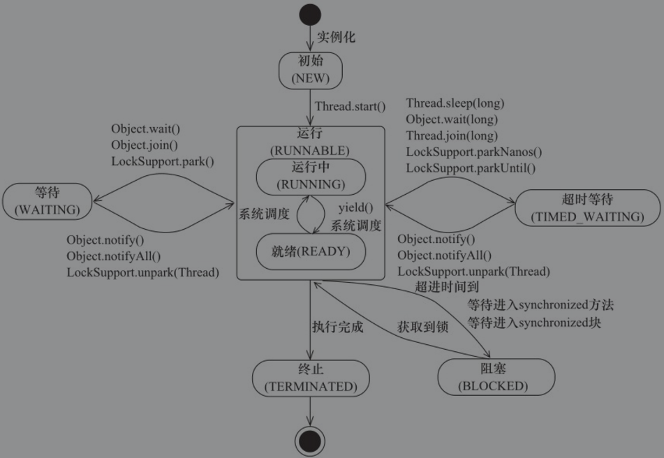

### 线程

  普通的java程序包含哪些线程：

```java
public class MultiThread {
	public static void main(String[] args) {
		// 获取java线程管理MXBean
		ThreadMXBean threadMXBean = ManagementFactory.getThreadMXBean();
		// 获取线程和 线程堆栈信息
		ThreadInfo[] threadInfos = threadMXBean.dumpAllThreads(false, false);
		
		for (ThreadInfo threadInfo : threadInfos) {
			System.out.println("[" + threadInfo.getThreadId() +"]" + threadInfo.getThreadName() );
		}
	}
}
```

输出：

```
[5]Attach Listener //
[4]Signal Dispatcher //分发处理发送给jvm信号的线程
[3]Finalizer //调用对象finalize 方法的线程
[2]Reference Handler //清除Reference的线程
[1]main  //main 线程，用户程序入口
```

#### 线程的优先级

​	在java线程中，通过一个整形成员变量 priority 来控制优先级，优先级范围从 1~10，线程构建时可以通过 setPriority(int) 方法来修改线程优先级。

​	线程优先级不能作为程序正确性的依赖，因为操作系统可以完全不用理会java线程对优先级的设定。

#### 线程的状态

  java线程在运行的生命周期中可能处于6中不同的状态

1. NEW:初始状态，线程构建还没有调用start()方法 ；
2. RUNNABLE:运行状态，java线程将操作系统中的就绪和运行两种状态称作‘运行中’
3. BLOCKED:阻塞状态
4. WAITING:等待状态，进入该状态表示当前线程需要其他线程做出一些特定动作（通知或中断）
5. TIME_WAITING:超时等待状态，他可以在指定的时间内自行返回
6. TERMINATED:终止状态，表示当前线程已经执行完毕

线程状态变迁:



  jps 查看进程
  jstack 进程id ：查看运行时的线程信息


#### Daemon 线程

​	Daemon线程是一种支持型线程，因为他主要被用作程序中后台调度，以及支持型工作

​	在线程**启动之前**通过 Thread.setDaemon(true) 将线程设置为 Deamon线程

 	Daemon线程中的finally块并不一定会执行

#### 线程中断

​	中断可以理解为线程的一个标识位属性，他表示一个运行中的线程是否被其他线程进行了中断操作。

​	其他线程通过调用该线程的 interrupt()方法对其进行中断操作

​	线程自身通过 isInterrupted() 来进行判断是否被中断，也可以调用静态方法 Thread.interrupted() 对当前线程的中断标识位进行复位。

​	如果该线程已经处于终结状态，即使该线程被中断过，在调用该线程对象的 isInterrupted() 时依旧会返回false

​	java API 中 许多声明抛出 InterruptedException 的方法在 抛出 InterruptedException 之前，java 虚拟机会将该线程的中断标识位清除，然后抛出异常


通过设置线程的中断标志不能直接终止该线程的执行，而是被中断的线程根据中断状态自行处理。

##### void interrupt()

​	当线程a运行时，线程b可以调用线程a的interrupt()方法来设置线程a的中断标志位true并立即返回。线程a实际并没有被中断，他会继续往下执行。

​	如果线程a因为调用了wait()系列函数，join方法或sleep方法而被阻塞挂起，这个时候线程b调用线程a的interrupt()方法，线程a会在调用这些方法的地方抛出InterruptedException异常而返回。

##### boolean isInterrupted()

​	检测该线程是否被中断，如果是返回true，否则返回false。

##### static boolean interrupted()

​	检测 **当前线程（方法所在的线程）**是否被中断，如果是返回true，并**清除中断标志**，

​	否则返回false。

```java
/**
 * 执行结果：
 *  Thread[Thread-0,5,main]....开始休眠2000秒
 *  主线程中断子线程休眠
 *  Thread[Thread-0,5,main]线程被中断休眠，抛出 InterruptedException 异常
 *  主线程执行完
 */
public class InterruptedTest extends Thread {
    @Override
    public void run() {
        try {
            while (!Thread.currentThread().isInterrupted()){
                System.out.println(Thread.currentThread() + "....开始休眠2000秒");
                Thread.sleep(2000000);
                System.out.println(Thread.currentThread() + "....醒来");
            }
        } catch (InterruptedException e){
            System.out.println(Thread.currentThread()+"线程被中断休眠，抛出 InterruptedException 异常");
            return;
        }
        System.out.println("线程正常执行完");
    }

    public static void main(String[] args) throws InterruptedException {
        InterruptedTest t = new InterruptedTest();
        //启动子线程
        t.start();
        //主线程休眠1s
        Thread.sleep(1000);
        //中断子线程
        System.out.println("主线程中断子线程休眠");
        t.interrupt();
        //等子线程执行完毕
        t.join();
        System.out.println("主线程执行完");
    }
}
```


