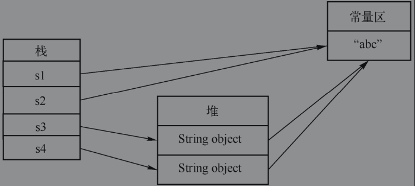

###  JVM内存划分

#### 类装载器子系统

类装载器子系统负责把class文件装载到内存中，供虚拟机执行。

JVM有两种类装载器，分别是启动类装载器和用户自定义类装载器。其中，启动类装载器是`JVM`实现的一部分；用户自定义类装载器则是Java程序的一部分，必须是`ClassLoader`类的子类。常见的类加载器主要有如下几种：

1. `Bootstrap ClassLoader`。这是`JVM`的根`ClassLoader`，它是用C++语言实现的，当`JVM`启动时，初始化此`ClassLoader`，并由此`ClassLoader`完成`$JAVA_HOME`中`jre/lib/rt.jar`（Sun JDK的实现）中所有class文件的加载，这个jar中包含了Java规范定义的所有接口以及实现。
2. `Extension ClassLoader`。`JVM`用此`ClassLoader`来加载扩展功能的一些jar包。
3. `System ClassLoader`。`JVM`用此`ClassLoader`来加载启动参数中指定的`Classpath`中的jar包以及目录，在`Sun JDK`中，`ClassLoader`对应的类名为`AppClassLoader`。
4. `User-Defined ClassLoader`。`User-Defined ClassLoader`是Java开发人员继承`ClassLoader`抽象类自行实现的`ClassLoader`，基于自定义的`ClassLoader`可用于加载非`Classpath`中的jar以及目录。

#### 方法区

方法区用来存储被虚拟机加载的类信息、常量、静态变量、编译器编译后的代码等数据。在类加载器加载class文件的时候，这些信息将会被提取出来，并存储到方法区中。由于这个区域是所有线程共享的区域，因此，它被设计为线程安全的。方法区可以被看成`JVM`的一个规范，在`HotSpot`中，方法区是用Perm区来实现的方法区。

在`JDK1.6`以及以下的版本中，方法区中还存放了运行时的常量池，最典型的应用就是字符串常量，例如，定义了如下语句：`String s=“Hello”;  Strings1=“Hello”;`，其中，“Hello”就是字符串常量，存储在常量池中，两个字符串引用s和s1都指向常量池中的“Hello”。**从`JDK1.7`开始，字符串常量池已经被移到堆区了**。

#### 堆

堆是虚拟机启动的时候创建的被所有线程共享的区域。这块区域主要用来存放对象的实例，通过new操作创建出来的对象的实例都存储在堆空间中，因此，堆就成为垃圾回收器管理的重点区域。

#### 虚拟机栈

栈是线程私有的区域，每当有新的线程创建时，就会给它分配一个栈空间，当线程结束后，栈空间就被回收，因此，栈与线程拥有相同的生命周期。栈主要用来实现Java语言中方法的调用与执行，每个方法在被执行的时候，都会创建一个栈帧用来存储这个方法的局部变量、操作栈、动态链接和方法出口等信息。当进行方法调用时，通过压栈与弹栈操作进行栈空间的分配与释放。当一个方法被调用的时候，会压入一个新的栈帧到这个线程的栈中，当方法调用结束后，就会弹出这个栈帧，从而回收掉调用这个方法使用的栈空间。

#### 本地方法栈

本地方法栈与虚拟机栈的作用是相似的，唯一不同的是虚拟机栈为虚拟机执行Java方法（也就是字节码）服务，而本地方法栈则是为虚拟机使用到的Native（本地）方法服务。Native（本地）方法接口都会使用某种本地方法栈，当线程调用Java方法时，JVM会创建一个新的栈帧并压入虚拟机栈。然而当它调用的是本地方法时，虚拟机栈保持不变，不会在线程的虚拟机栈中压入新的帧，而是简单地动态链接并直接调用指定的本地方法。如果某个虚拟机实现的本地方法接口使用的是C++连接模型，那么它的本地方法栈就是C++栈。

###    运行时数据区域

运行时数据区域包括：方法区、堆、 虚拟机栈、本地方法栈、程序计数器。

####   程序计数器

​	java虚拟机的多线程是通过**线程轮流切换**并分配处理器执行时间的方式来实现的，在任何一个确定的时刻，一个处理器都只会执行一条线程中的指令。为了**线程切换后能恢复到正确的执行位置**，每条线程都需要一个独立的程序计数器，各条线程之间计数器互不影响，独立存储，是线程私有的。

​	如果线程正在执行的是一个java方法，这个计数器记录的是正在执行的虚拟机字节码指令地址。

####   虚拟机栈(栈内存)

​	虚拟机栈也是线程私有的。

​	虚拟机栈描述的是java方法执行的**内存模型**：每个方法在执行的同时都会创建一个栈帧用于存储**局部变量表**、**操作数栈**、**动态链接**、**方法出口**等信息。

​	局部变量表存放了编译期可知的各种**基本数据类型**、**对象引用**（指向对象起始地址的引用指针）和 **returnAddress类型**。

​	long和double类型的数据会占用2个局部变量空间。

####   本地方法栈

虚拟机栈为虚拟机执行java方法服务，本地方法栈为虚拟使用到的Native方法服务。

####   java堆

java堆是被**所有线程共享**的一块内存区域，在虚拟机启动时创建，**用于存放对象实例**。

java堆是垃圾回收器管理的主要区域，可以细分为：新生代和老年代。

可以通过 -Xmx 和 -Xms来扩展。

####  方法区

方法区也是**线程共享**的内存区域，用于存放已被虚拟机加载的类信息、常量、静态变量、即时编译器编译后的代码等数据。

 #####  运行时常量池

运行时常量池是方法区的一部分。

class文件中有一项信息是**常量池**，用于存放编译期生成的各种**字面变量和符号引用**，这部分内容在类加载后进入方法区的运行时常量池中

### 运行时内存划分

`HotSport`把`JVM`中堆空间划分为三个代：年轻代（Young Generation）、老年代（Old Generation）和永久代（Permanent Generation）。以下将分别对这三个代进行分析。

1）年轻代（Young Generation）：被分成3个部分，一个Eden区和两个相同的Survivor区。Eden区主要用来存储新建的对象，Survivor区也被称为from和to区，Survivor区是大小相等的两块区域，在使用“复制”回收算法时，作为双缓存，起到内存整理的作用，因此，Survivor区始终都保持一个是空的。

2）老年代（Old Generation）：主要存储生命周期较长的对象、超大的对象（无法在年轻代分配的对象）。

3）永久代（Permanent Generation）：存放代码、字符串常量池、静态变量等可以持久化的数据。SunJDK把方法区实现在了永久代。

新建对象优先在Eden区分配内存，如果Eden区已满，那么在创建对象的时候，会因为无法申请到空间而触发minorGc操作;

minorGc主要用来对年轻代垃圾进行回收：把Eden区中不能被回收的对象放入到空的Survivor区，另一个Survivor区里不能被垃圾回收器回收的对象也会被放入到这个Survivor区，这样能保证有一个Survivor区是空的。如果在这个过程中发现Survivor区也满了，那么就会把这些对象拷贝到老年代（Old Generation），或者Survivor区并没有满，但是有些对象已经存在了非常长的时间，这些对象也将被放到老年代中，如果当老年代也被放满了，那么就会触发 `fullGC`。

什么情况下会触发 `fullGC`，如何避免？

因为`fullGC`是用来清理整个堆空间—包括年轻代和永久代的，所以`fullGC`会造成很大的系统资源开销。因此，通常需要尽量避免`fullGC`操作。下面介绍几种常见的`fullGC`产生的原因以及避免的方法。

（1）调用`System.gc()`方法会触发 `fullGC`

因此，在编码的时候尽量避免调用这个方法。

（2）老年代（Old Generation）空间不足

由于老年代主要用来存储从年轻代转入的对象、大对象和大数组，因此，为了避免触发 `fullGC`，应尽量做到让对象在`Minor GC`阶段被回收、不要创建过大的对象及数组。由于在Minor GC时，只有Survivor区放不下的对象才会被放入老年代，而此时只有老年代也放不下才会触发fullGC，因此，另外一种避免fullGC的方法如下所示：根据实际情况增大Survivor区、老年代空间或调低触发并发GC（并发垃圾回收）的比率。

（3）永久代（Permanent Generation）满

永久代主要存放class相关的信息，当永久代满的时候，也会触发fullGC。为了避免这种情况的发生，可以增大永久代的空间（例如-`XX:MaxPermSize=16m`:设置永久代大小为`16M`）。为了避免Perm区满引起的fullGC，也可以开启CMS回收永久带选项（开启的选项为：`+CMSPermGenSweepingEnabled-XX:+CMSClassUnloadingEnabled`。CMS利用和应用程序线程并发的垃圾回收线程来进行垃圾回收操作。

需要注意的是，Java 8中已经移除了永久代，新加了一个称为元数据区的native内存区，所以，大部分类的元数据都在本地内存中分配。

###String.intern( )

在Java语言中，对于String对象提供了专门的字符串常量池。

为了便于理解，首先介绍在Java语言中字符串的存储机制：

在Java语言中，字符串起着非常重要的作用，字符串的声明与初始化主要有如下两种情况：

1）对于`String s3=new String("abc")`语句与`String s4=new String("abc")`语句，存在两个引用对象`s3、s4`，两个内容相同的字符串对象`"abc"`，它们在内存中的地址是不同的。只要用到new总会生成新的对象。

2）对于`String s1="abc"`语句与`String s2="abc"`语句，在`JVM`中存在着一个字符串池，其中保存着很多String对象，并且可以被共享使用，`s1、s2`引用的是同一个常量池中的对象。

由于String的实现采用了Flyweight的设计模式，当创建一个字符串常量的时候，例如`String s="abc"`，会首先在字符串常量池中查找是否已经有相同的字符串被定义，它的判断依据是String类equals(Object obj)方法的返回值。如果已经定义，那么直接获取对其的引用，此时不需要创建新的对象，如果没有定义，那么首先创建这个对象，然后把它加入到字符串池中，再将它的引用返回。由于String是不可变类，一旦创建好了就不能被修改，因此String对象可以被共享而且不会导致程序的混乱。

在创建字符串对象的时候，会根据不同的情况来确定字符串被放在常量区还是堆中。而intern方法主要用来把字符串放入字符串常量池中。在以下两种情况下，字符串会被放到字符串常量池中：

1）直接使用双引号声明的String对象都会直接存储在常量池中。

2）通过调用String提供的intern方法把字符串放到常量池中，intern方法会从字符串常量池中查询当前字符串是否存在，若不存在，则会将当前字符串放入常量池中。

JDK1.6以及以前的版本一样，JDK1.7开始的版本对intern方法的处理是不同的，下面分别介绍这两种不同的实现方式。

##### intern方法在`JDK1.6`以及以前版本中的实现原理

`inten()`方法会查询字符串常量池是否存在当前字符串，若不存在则将当前字符串复制到字符串常量池中，并返回字符串常量池中的引用。如图所示，在`JDK1.6`中的字符串常量池是在Perm区中，前面提到过使用引号声明的字符串会直接存储在字符串常量池中，而new出来的String对象是放在堆区。即使通过调用intern方法把字符串放入字符串常量区中，由于堆和Perm区是两块独立的存储空间，存储在堆和Perm区中的对象一定会有不同的存储空间，因此，它们也有不同的地址。

intern方法在JDK1.6以及更低版本的实现原理

1）`String s1=new String(“a”)`。这句代码生成了2个对象。常量池中的“a”和堆中的字符串对象。`s1.intern();`这一句代码执行的时候，`s1`对象首先去常量池中寻找，由于发现 “a”已经在常量池里了，因此不做任何操作。

2）接下来执行`String s2=“a”`。这句代码是在栈中生成一个`s2`的引用，这个引用指向常量池中的“a”对象。显然`s1`与`s2`有不同的地址。

3）`String s3=new String(“a”)+new String(“a”)`。这行代码在字符串常量池中生成“a”（由于已经存在了，不会创建新的字符串），并且在堆中生成一个字符串对象（字符串的内容为`“aa”`），`s3`指向这个堆中的对象。需要注意的是，此时常量池中还不存在字符串`“aa”`。

4）接下来执行`s3.intern()`。这句代码执行的过程是：首先判断`“aa”`在字符串常量区中不存在，因此会把`“aa”`放入字符串常量区中，在`JDK6`中，会在常量池中生成一个`“aa”`的对象。由于在`JDK7`开始字符串常量池从Perm区移到堆中了，在这种情况下，常量池中不需要再存储一份对象了，而是直接存储堆中的引用。这份引用指向`s3`引用的对象。如上图所示，字符串常量区中的字符串`“aa”`直接指向堆中的字符串对象。由此可见，这种实现方式能够大大降低字符串所占用的内存空间。

5）在`JDK7`中执行`String s4=“aa”`。的时候，由于这个字符串在字符串常量区中已经存在了（指向`s3`引用对象的一个引用）。所以`s4`引用就指向和`s3`一样了。因此`s3==s4`的结果是true。

intern方法在JDK1.7以及以上版本中的实现原理

### 原空间`MetaSpace`

在JDK1.8以前的版本中，由于类大多是“static”的，很少被卸载或收集，因此这部分数据被称为“永久的(Permanent)”。同时，因为类class是JVM实现的一部分，而不是由应用创建的，所以又被认为是“非堆(non-heap)”内存。在JDK1.8之前的HotSpot JVM中，存放这些“永久的”的区域被叫作“永久代”。“永久代”是一片连续的堆空间。

从JDK1.7开始，HopSpot JVM已经逐步开始把永久代的数据向其他存储空间转移了，例如在JDK1.7中把字符串常量池从永久代转移到了JVM的堆空间中，但是永久代并没有完全被移除。

从JDK1.8开始彻底把永久代从JVM中移除了，而把类的元数据放到本地化的堆内存(native heap)中，这一块本地化的堆内存区域被叫作Metaspace（元空间）。

为什么要移除永久代呢？主要有以下几个：

1）由于Permanent Generation内存经常不够用或发生内存泄漏，而抛出异常：java.lang.OutOfMemoryError:PermGen。尤其是在Java Web开发的时候经常需要动态生成类，而永久代又是一块非常小的存储空间，动态生成过多的类会导致永久代的空间被用完而导致上述异常的出现。显然元空间有非常大的存储空间，因此从一定程度上可以避免这个问题。当然，永久代的移除并不意味着内存泄漏的问题就没有了。因此，仍然需要监控内存的消耗，因为内存泄漏仍然会耗尽整个本地内存。

2）移除永久代可以促进HotSpot JVM与JRockit VM的融合，因为JRockit没有永久代。

3）在HotSpot中，每个垃圾回收器都需要专门的代码来处理存储在PermGen中的类的元数据信息。从把类的元数据从永久代转移到Metaspace后，由于Metaspace的分配具有和Java Heap相同的地址空间，因此可以实现Metaspace和Java Heap的无缝化管理，而且简化了FullGC的过程，以至将来可以并行对元数据信息进行垃圾收集，而没有GC暂停。

#####Metaspace是如何进行内存分配的呢？

Metaspace VM通过借鉴内存管理的方式来管理Metaspace，把原来由多个垃圾回收器完成的工作全部移到Metaspace VM（由C++实现的）上了。MetaspaceVM实现垃圾回收的思想非常简单：类与类加载器有着相同的生命周期，也就是说，只要类加载器还存活着，在Metaspace中存储的类的元数据就不能被释放。

Metaspace VM通过一个块分配器来管理Metaspace内存的分配。块的大小取决于类加载器的类型。Metaspace VM维护着一个全局的可使用的块列表。当一个类加载器需要一个块的时候，它会从这个全局块列表中取走一个块，然后添加到它自己维护的块列表中。当类加载器的生命周期结束的时候，它的块将会被释放，从而把申请的块归还给全局的块列表。每个块又被分成多个block，每个block存储一个元数据单元。

由于类的大小不是固定的，当一个类加载器需要一个块的时候，有可能空闲的块太小了不足以容纳当前的类，就会出现内存碎片，目前Metaspace VM还没有使用压缩算法或者其他的方法来解决这个碎片问题。

MetaSpace主要新增加了如下几个参数：

- -XX:MetaspaceSize：分配给类元数据的内存（单位是字节）。
- -XX:MaxMetaspaceSize：分配给类元数据空间的最大值，一旦超过此值就会触发Full GC。
- -XX:MinMetaspaceFreeRatio：表示一次GC以后，为了避免增加元数据空间的大小，空闲的类元数据的容量的最小比例，不够就会导致垃圾回收。
- -XX:MaxMetaspaceFreeRatio：表示一次GC以后，为了避免增加元数据空间的大小，空闲的类元数据的容量的最大比例，不够就会导致垃圾回收。

MetaSpace的引入主要有如下几个优点：

- 充分利用了Java语言规范中的好处：类及相关的元数据与类加载器有相同的生命周期。
- 每个加载器有专门的存储空间。
- 只进行线性分配。
- 不会单独回收某个类。
- 省掉了GC扫描及压缩的时间。

