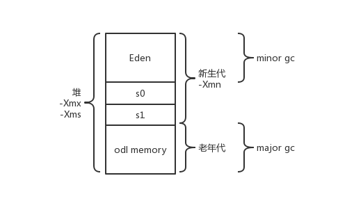
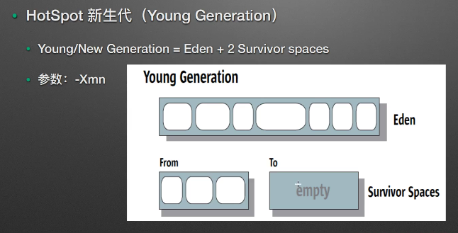
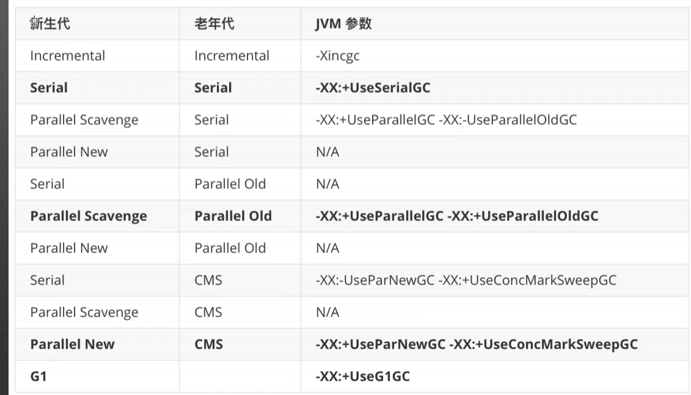

####  判断对象可回收

#####  引用计数算法

不能解决对象间的循环引用

#####  可达性分析算法

一般通过可达性分析来判断对象是否可以被回收。

算法思路：以一系列的 “GC Roots” 对象为起始点，从这些起始点开始向下搜索，搜索所走过的路径称为引用链，当一个对象没有任何引用链相连时，此对象不可用。

java中可以作为 GC Roots 的对象包括：

1. 虚拟机栈中引用的对象
2. 方法区中静态属性引用的对象
3. 方法区中常量引用的对象
4. 本地方法栈中JNI引用的对象


####  垃圾回收算法

#####  标记-清除算法

标记出所有需要回收的对象，然后统一回收所有被标记的对象。

效率不高，会产生大量不连续的内存碎片。

#####  复制算法*

将内存划分为大小相等的两块，每次只使用其中一块。当这一块内存用完了，就将还存活着的对象复制到另一块上面，然后把已使用过的内存空间一次清理掉。

一般采用这种算法来**回收新生代**，新生代中的对象98%是“朝生夕死”的(可以被回收)，所以将内存分为**一块较大的 Eden**空间和**两块较小的 Survivor**空间。 **回收时将 Eden和survivor中还存活的对象一次性的复制到另一块survivor空间上，然后清理掉Eden和刚才使用过的survivor空间** 。一般Eden和survivor的大小比例是8:1。







##### 标记-整理算法

标记出所有需要回收的对象，然后让存活的对象向一端移动，最后直接清理掉端边界以外的内存。

##### 分代收集算法*

当前商业虚拟机都采用分代收集算法。

一般**把java堆分为新生代和老年代**（根据**对象的存活周期划分**）。

**新生代中，每次垃圾收集时都有大批对象死去，只有少量存活**，选用复制算法。

**老年代中，对象存活率高**，采用标记清理或标记整理算法。


##### 永久代 Permanent Generation

存储：元数据，如class信息，String.intern()对象。

GC: FGC将会回收该区域

空间：非堆区域。+-XX:MaxPermSize 参数调整最大值

 java8 开始移除该区域，使用 Metaspace 代替


#### 串行垃圾收集器

##### 新生代收集器

​	新生代收集器 Young Generation Collection

​	算法：复制算法 mark-copy

​	eden：YGC后存活的对象复制到To Survivor 区域，足够老的对象直接复制到老年代

​	from：相对年轻的存活对象也复制到To区域，相对老的存活对象直接复制到老年代

​	to区域：当空姐满后，Eden和from将不会复制对象到此，无论在这两个区域的存活对象经历多少次YGC

​	当Eden 和 from 区域中的存活对象被复制后，垃圾收集器将他们标记为 待回收对象，不再检测他们的可达性

​	当YGC完成后，Eden和To区域将被清空，from区域存放仍存活的对象，即from区域和to区域的角色互换

##### 老年代收集器

​	来年的收集器 Old Generation Collection

​	标记阶段：鉴别哪些对象是否存活

​	清扫阶段：清扫分代信息，识别垃圾

​	压缩阶段：a.k.a滑动压缩，将存活的对象滑动到老年代空间的起始区域，使得空闲区域连续


#### 垃圾收集事件

Minor GC: 次要GC（小规模GC），清理Young/New Generation

Major GC: 主要GC（大规模GC），清理 Old Generation

Full GC: 完全GC，清理整个堆


####  垃圾收集器

##### Serial收集器

serial收集器（单线程收集器）：使用一个CPU或一条收集线程去完成垃圾收集工作，在进行垃圾收集时，**必须暂停其他所有的工作线程，直到收集结束**。

在单个**CPU环境下简单高效**，没有线程交互的开销。虚拟机在client模式下默认的新生代收集器。

使用参数：-XX:+UseSerialGC


并发：单CPU，   并行：多CPU

并行是指两个或者多个事件在同一时刻发生；而并发是指两个或多个事件在同一时间间隔内发生。

**parallel：并行**，并行收集器，多条垃圾收集器线程并行工作，此时用户线程仍处于等待状态。

**Concurrent：并发**，并发收集器，用户线程与垃圾收集器线程同时执行（不一定是并行的，可能会交替执行），用户程序在继续运行，而垃圾收集器运行与另一个CPU上。


#####  ParNew收集器

ParNew收集器是serial收集器的多线程版本，可以使用多条线程进行垃圾收集。**仅能处理新生代**。

适用于多CPU环境下，默认开启的线程数与CPU的数量相同，在CPU数量非常多时，可以使用-XX:ParallelGCThreads 参数来限制垃圾收集器的线程数。

#####  Parallel Scavenge 收集器

Parallel Scavenge收集器是一个**新生代收集器**，复制算法收集器，并行的多线程收集器，与ParNew收集器类似，更关注达到一个可控制的吞吐量。

吞吐量 = 运行用户代码时间 / (运行用户代码时间 + 垃圾收集时间)

Parallel Scavenge收集器提供了两个参数用于精确控制吞吐量。

​	-XX:MaxGCPauseMillis 控制垃圾收集最大停顿时间；值为大于0的毫秒数，收集器尽可能保证一次垃圾收集的时间不超过设定值。值太小时会导致垃圾回收发生的更频繁，导致吞吐量下降

​	-XX:GCTimeRatio 直接设置吞吐量大小。值为 大于0，小于100 的整数。默认值为99 就是最大允许 1%（1/(1+99) ）的垃圾收集时间

##### GMS收集器*

GMS (Concurrent Mark Sweep) 收集器以**获取最短回收停顿时间**为目标。基于“**标记-清除**”算法实现。

**仅能处理老年代**

过程分为四个步骤

1. 初始标记：需要“**stop the world**”停止用户线程。只标记一下 GC Roots 能直接关联到的对象，速度很快。
2. 并发标记：用户程序运行。进行 GC Roots Tracing(向下搜索)的过程。
3. 重新标记：需要“**stop the world**”停止用户线程。修正并发标记期间程序运行导致标记变动的记录。
4. 并发清除：用户程序运行。并发清理。

**优点：并发收集，低停顿**。

**缺点：**

1. **对CPU资源非常敏感**。在并发阶段虽然不会导致用户线程停顿，但会因为占用了一部分线程导致程序变慢，总吞吐量会降低，GMS默认启动的回收线程数是 (CPU数量 + 3 )/4 。 **cpu数量在4个以上时，并发回收垃圾线程占用的资源随着 cpu数量的增加而下降。** CPU数量不足4个时对用户程序的影响很大，可能导致用户程序的速度降低50%。
2. **无法处理浮动垃圾。** 并发清理阶段用户线程运行产生的垃圾称为浮动垃圾，只有在下一次GC时才会被清理。垃圾回收阶段用户线程还要运行，因此要预留足够的空间给用户线程使用。预留空间不足时启用 serial old收集器重新进行老年代的垃圾收集，会造成较长时间的停顿。
3. **会产生大量的碎片空间。**无法找到足够大的连续空间时不得不提前触发Full GC。


##### G1收集器

基于**标记-整理**算法实现，将java堆划分为多个大小相等的对立区域，

过程：

1. 初始标记：“**stop the world**”
2. 并发标记：用户程序运行。
3. 最终标记：“**stop the world**”
4. 筛选回收：“**stop the world**”





####  MemoryManager

```java
public class MemoryPoolDemo {
    public static void main(String[] args) {
        ManagementFactory.getMemoryManagerMXBeans()
                .forEach(xmbean->{
                    System.out.printf(
                        "当前 MemoryManagerMXBean 名称: %s 以及他关联的内存池名称： %s \n",
                            xmbean.getName(),
                            Arrays.asList(xmbean.getMemoryPoolNames())
                    );
                }
        );
    }
}


```

当前 MemoryManagerMXBean 名称: CodeCacheManager 以及他关联的内存池名称： [Code Cache] 
当前 MemoryManagerMXBean 名称: Metaspace Manager 以及他关联的内存池名称： [Metaspace, Compressed Class Space] 
当前 MemoryManagerMXBean 名称: PS Scavenge 以及他关联的内存池名称： [PS Eden Space, PS Survivor Space] 
当前 MemoryManagerMXBean 名称: PS MarkSweep 以及他关联的内存池名称： [PS Eden Space, PS Survivor Space, PS Old Gen] 