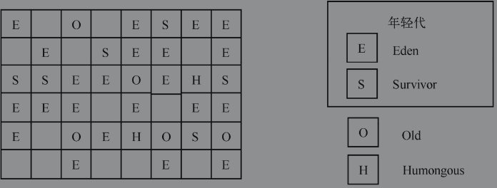

####  判断对象可回收

#####  引用计数算法

不能解决对象间的循环引用

#####  可达性分析算法

一般通过可达性分析来判断对象是否可以被回收。

算法思路：以一系列的 “GC Roots” 对象为起始点，从这些起始点开始向下搜索，搜索所走过的路径称为引用链，当一个对象没有任何引用链相连时，此对象不可用。

java中可以作为 GC Roots 的对象包括：

1. 虚拟机栈中引用的对象
2. 方法区中静态属性引用的对象
3. 方法区中常量引用的对象
4. 本地方法栈中JNI引用的对象


####  垃圾回收算法

#####  标记-清除算法

标记出所有需要回收的对象，然后统一回收所有被标记的对象。

效率不高，会产生大量不连续的内存碎片。


#####  复制算法*

将内存划分为大小相等的两块，每次只使用其中一块。当这一块内存用完了，就将还存活着的对象复制到另一块上面，然后把已使用过的内存空间一次清理掉。

一般采用这种算法来**回收新生代**，新生代中的对象98%是“朝生夕死”的(可以被回收)，所以将内存分为**一块较大的 Eden**空间和**两块较小的 Survivor**空间。 **回收时将 Eden和survivor中还存活的对象一次性的复制到另一块survivor空间上，然后清理掉Eden和刚才使用过的survivor空间** 。一般Eden和survivor的大小比例是8:1。


##### 标记-整理算法

标记出所有需要回收的对象，然后让存活的对象向一端移动，最后直接清理掉端边界以外的内存。

##### 分代收集算法*

当前商业虚拟机都采用分代收集算法。

一般**把java堆分为新生代和老年代**（根据**对象的存活周期划分**）。

**新生代中，每次垃圾收集时都有大批对象死去，只有少量存活**，选用复制算法。

**老年代中，对象存活率高**，采用标记清理或标记整理算法。


##### 永久代 Permanent Generation

存储：元数据，如class信息，String.intern()对象。

GC: FGC将会回收该区域

空间：非堆区域。+-XX:MaxPermSize 参数调整最大值

 java8 开始移除该区域，使用 Metaspace 代替


#### 串行垃圾收集器

串行垃圾回收器是一种单线程的垃圾回收器，它主要为单线程环境设计的。它在运行的时候会暂停所有的应用线程。

串行垃圾回收器是最简单的回收器，也是使用最少的回收器，在年轻代和老年代中都使用了一个单独的线程来实现垃圾的回收。

在年轻代中使用的是拷贝算法。这种算法的主要思路为：把内存分成大小相等的两部分，每次只会使用其中的一块内存进行内存的分配，当内存使用完以后就会触发GC（Garbage Collection）。GC的工作方式为：把所有存活的对象复制到另外一块内存中，然后清除当前使用的内存块，之后所有的内存的分配都会在另一块内存上进行。这种方法虽然比较简单高效，但是它浪费了一半的内存（有一半的内存一直处于空闲状态）。

而在老年代或永久代中使用的是“标记-清扫-压缩”算法。这种算法的原理是：在标记阶段，垃圾回收器首先识别哪些对象仍然活着；在扫描阶段，垃圾回收器会扫描整个代，然后识别哪些是垃圾；然后在压缩阶段，垃圾回收器会执行平移压缩，它会把所有存活的对象移动到代的最前端，从而使尾部有一块连续的空闲的空间。之后的分配就可以在老年代和永久代使用空闲指针（bump-the-pointer）算法。

这种算法的主要思路为：JVM内部维护两个指针（allocatedTail指向已经分配的对象的尾部，geneTail指向代尾），每当需要新分配内存空间的时候，它会首先检查剩余的空闲空间是否够用（通过geneTail与geneTail可以确定代中还剩余多少空间）。如果空间够用，那么通过更新allocatedTail来把内存分配给请求的对象。


##### 新生代收集器

​	新生代收集器 Young Generation Collection

​	算法：复制算法 mark-copy

​	eden：YGC后存活的对象复制到To Survivor 区域，足够老的对象直接复制到老年代

​	from：相对年轻的存活对象也复制到To区域，相对老的存活对象直接复制到老年代

​	to区域：当空姐满后，Eden和from将不会复制对象到此，无论在这两个区域的存活对象经历多少次YGC

​	当Eden 和 from 区域中的存活对象被复制后，垃圾收集器将他们标记为 待回收对象，不再检测他们的可达性

​	当YGC完成后，Eden和To区域将被清空，from区域存放仍存活的对象，即from区域和to区域的角色互换

##### 老年代收集器

​	老年的收集器 Old Generation Collection  （并行压缩收集器）

​	标记阶段：鉴别哪些对象是否存活

​	清扫阶段：清扫分代信息，识别垃圾

​	压缩阶段：a.k.a滑动压缩，将存活的对象滑动到老年代空间的起始区域，使得空闲区域连续


####并行垃圾回收

并行垃圾回收器与串行垃圾回收器唯一的区别就是并行垃圾回收器使用多线程进行垃圾回收。

当并行垃圾回收器在运行的时候，它仍然会暂停所有的应用程序，但是由于使用了多线程进行垃圾回收，因此能够缩短垃圾回收的时间。

可以用命令行参数`-XX:+UseParallelGC`明确指定使用这种垃圾回收算法。

需要注意的是，在一台有N个CPU的主机上，并行垃圾回收器会使用N个垃圾回收器线程进行垃圾回收。当然可以使用如下的命令行来设置垃圾回收器线程的个数：`-XX:ParallelGCThreads=<垃圾回收器线程的个数>`


#### 垃圾收集事件

Minor GC: 次要GC（小规模GC），清理Young/New Generation

Major GC: 主要GC（大规模GC），清理 Old Generation

Full GC: 完全GC，清理整个堆


####  垃圾收集器

##### Serial收集器

serial收集器（单线程收集器）：使用一个CPU或一条收集线程去完成垃圾收集工作，在进行垃圾收集时，**必须暂停其他所有的工作线程，直到收集结束**。

在单个**CPU环境下简单高效**，没有线程交互的开销。虚拟机在client模式下默认的新生代收集器。

使用参数：-XX:+UseSerialGC


Serial收集器是Hotspot运行在Client模式下的**默认新生代收集器**, 它在进行垃圾收集时，会暂停所有的工作进程，用一个线程去完成GC工作


并发：单CPU，   并行：多CPU

并行是指两个或者多个事件在同一时刻发生；而并发是指两个或多个事件在同一时间间隔内发生。

**parallel：并行**，并行收集器，多条垃圾收集器线程并行工作，此时用户线程仍处于等待状态。

**Concurrent：并发**，并发收集器，用户线程与垃圾收集器线程同时执行（不一定是并行的，可能会交替执行），用户程序在继续运行，而垃圾收集器运行与另一个CPU上。


#####  ParNew收集器

ParNew收集器是serial收集器的多线程版本，可以使用多条线程进行垃圾收集。**仅能处理新生代**。

适用于多CPU环境下，默认开启的线程数与CPU的数量相同，在CPU数量非常多时，可以使用-XX:ParallelGCThreads 参数来限制垃圾收集器的线程数。

#####  Parallel Scavenge 收集器

Parallel Scavenge收集器是一个**新生代收集器**，复制算法收集器，并行的多线程收集器，与ParNew收集器类似，更关注达到一个可控制的吞吐量。

吞吐量 = 运行用户代码时间 / (运行用户代码时间 + 垃圾收集时间)

Parallel Scavenge收集器提供了两个参数用于精确控制吞吐量。

​	-XX:MaxGCPauseMillis 控制垃圾收集最大停顿时间；值为大于0的毫秒数，收集器尽可能保证一次垃圾收集的时间不超过设定值。值太小时会导致垃圾回收发生的更频繁，导致吞吐量下降

​	-XX:GCTimeRatio 直接设置吞吐量大小。值为 大于0，小于100 的整数。默认值为99 就是最大允许 1%（1/(1+99) ）的垃圾收集时间

##### GMS收集器*

GMS (Concurrent Mark Sweep) 收集器以**获取最短回收停顿时间**为目标。基于“**标记-清除**”算法实现。

可以用命令行参数`-XX:+UseConcMarkSweepGC`显示指定使用这种算法。

**仅能处理老年代**

过程分为四个步骤

1. 初始标记：需要“**stop the world**”停止用户线程。只标记一下 GC Roots 能直接关联到的对象，速度很快。
2. 并发标记：用户程序运行。进行 GC Roots Tracing(向下搜索)的过程。
3. 重新标记：需要“**stop the world**”停止用户线程。修正并发标记期间程序运行导致标记变动的记录。
4. 并发清除：用户程序运行。并发清理。

**优点：并发收集，低停顿**。

**缺点：**

1. **对CPU资源非常敏感**。在并发阶段虽然不会导致用户线程停顿，但会因为占用了一部分线程导致程序变慢，总吞吐量会降低，GMS默认启动的回收线程数是 (CPU数量 + 3 )/4 。 **cpu数量在4个以上时，并发回收垃圾线程占用的资源随着 cpu数量的增加而下降。** CPU数量不足4个时对用户程序的影响很大，可能导致用户程序的速度降低50%。
2. **无法处理浮动垃圾。** 并发清理阶段用户线程运行产生的垃圾称为浮动垃圾，只有在下一次GC时才会被清理。垃圾回收阶段用户线程还要运行，因此要预留足够的空间给用户线程使用。预留空间不足时启用 serial old收集器重新进行老年代的垃圾收集，会造成较长时间的停顿。
3. **会产生大量的碎片空间。**无法找到足够大的连续空间时不得不提前触发Full GC。


##### G1收集器

基于**标记-整理**算法实现，将java堆划分为多个大小相等的对立区域，

过程：

1. 初始标记：“**stop the world**”
2. 并发标记：用户程序运行。
3. 最终标记：“**stop the world**”
4. 筛选回收：“**stop the world**”


G1（Garbage-First）的出现可以很好地解决了垃圾回收器暂停用户线程时间的不确定性，它是一款面向服务器的垃圾回收器，主要针对配备多核处理器及大容量内存的机器。在以极高的概率满足GC暂停用户线程时间要求的同时，还具有很高的吞吐量。这种垃圾算法是从Oracle JDK 7update 4开始支持的, 它主要有以下几个特点：

1. 可预测性：可以预测GC暂停用户线程的时间，提供了设置暂停时间的选项。
2. 压缩特性：在满足暂停时间要求的基础上，尽可能多地消除碎片。
3. 并发性：与CMS算法一样，GC操作也可以与应用的线程一起并发执行。
4. 节约：这种回收算法不需要请求更大的Java堆。


与前面介绍的垃圾回收器相比，G1 GC可以被看作是一种增量式的并行压缩GC算法，它提供了可以预测暂停时间的功能。通过并行、并发和多阶段标记循环，G1GC可以被应用在堆空间很大的场景，同时还能够提供合理的在最坏情况下的暂停时间。它的基本思想是在GC工作前设置堆范围（-Xms用来设置堆的最小值，-Xmx用来设置堆的最大值）和实际暂停目标时间（使用-XX：MaxGCPauseMillis来设置）。

G1 GC将年轻代、老年代的物理空间划分取消了，取而代之的是，G1算法将堆划分为若干个区域（Region）。一段连续的堆空间被划分为固定大小的区域，然后用一个空闲链表来维护这些区域。每个区域要么对应老年代，要么对应年轻代。根据实际堆空间的大小，这些区域可以被划分为1MB～32MB大小，从而保持总的区域的个数维持在2048左右。G1 GC最主要的一条原则是：在标记阶段完成后，G1就可以知道哪些heap区的empty空间最大。它会在满足暂停时间要求的基础上，优先回收这些空闲空间最大的区域。正因为此，这种算法也被称为garbage-First（垃圾优先）的垃圾回收器。

虽然引入了区域的概念，但是G1 GC从本质上来讲仍然属于分代回收器。年轻代的垃圾回收依然会暂停所有应用线程的执行，它会把存活对象拷贝到Survivor或者老年代。在老年代中，G1 GC通过把对象从一个区域复制到另外一个区域来实现垃圾清理的工作。使用这种方式的好处是：在垃圾清理的过程中实现了堆内存的压缩，也就很好地避免了CMS方法中内存碎片的问题。而且在G1 GC中这些区域可以是不连续的，G1 GC的区域划分如图所示。



图中的E、S和O在前面的章节中已经介绍过了。在G1中，还有引入了一种特殊的区域：Humongous区域。这些区域被设计成为存放占用超过分区容量50%以上的那些对象。它们被保存在一个连续的区域集合里。对于这些很大的对象而言，在默认情况下，它们会被分配到老年代中，但是如果把一个生命周期比较短的大对象存放在老年代中，那么会对垃圾回收器的性能造成极大的影响。Humongous区域的出现就是为了解决这个问题。如果一个H区无法容纳一个大的对象，那么G1会寻找连续的H区来存储这个大对象。

虽然引入了区域的概念，但是每个区域还是对应年轻代或老年代。在年轻代中，当年轻代占用达到一定比例的时候，开始出发收集。存活的对象会被拷贝到一个新的S区或者O区里面。经过Young GC后存活的对象被复制到一个或者多个区域空闲中，这些被填充的区域将是新的年轻代；当年轻代对象的年龄达到某个阈值的时候，这些对象也会被复制到老年代的区域中。这个回收过程是并发多线程执行的，也是STW（Stop-The-Word）的。回收结束后会重新计算E区和S区的大小，这样有助于合理利用内存，提高回收效率。


####  MemoryManager

```java
public class MemoryPoolDemo {
    public static void main(String[] args) {
        ManagementFactory.getMemoryManagerMXBeans()
                .forEach(xmbean->{
                    System.out.printf(
                        "当前 MemoryManagerMXBean 名称: %s 以及他关联的内存池名称： %s \n",
                            xmbean.getName(),
                            Arrays.asList(xmbean.getMemoryPoolNames())
                    );
                }
        );
    }
}


```

当前 MemoryManagerMXBean 名称: CodeCacheManager 以及他关联的内存池名称： [Code Cache] 
当前 MemoryManagerMXBean 名称: Metaspace Manager 以及他关联的内存池名称： [Metaspace, Compressed Class Space] 
当前 MemoryManagerMXBean 名称: PS Scavenge 以及他关联的内存池名称： [PS Eden Space, PS Survivor Space] 
当前 MemoryManagerMXBean 名称: PS MarkSweep 以及他关联的内存池名称： [PS Eden Space, PS Survivor Space, PS Old Gen] 