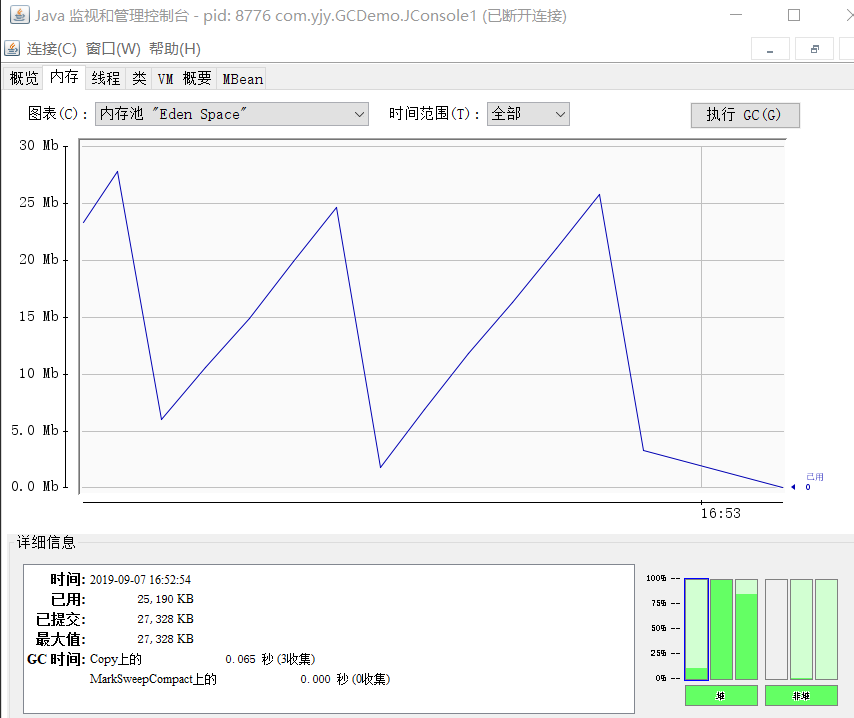

###   JConsole

通过jdk/bin目录下“jconsole.exe”启动 JConsole。

####   内存监控

```java
/**
 *  设置虚拟机参数 -Xms100m -Xmx100m -XX:+UseSerialGC -XX:+PrintGCDetails
 */
public class JConsole1 {

    public static void main(String[] args) throws InterruptedException {
        fillHeap(1000);
    }

    private static void fillHeap(int num) throws InterruptedException {
        List<OOMObject> list = new ArrayList<>();
        for (int i=0; i < num; i++){
            Thread.sleep(50);//稍作延迟令曲线变化更明显
            list.add(new OOMObject());
        }
        System.gc();
    }

    static class OOMObject {
        public byte[] placeholder = new byte[64*1024];
    }

}
```

#####  回收日志

[GC (Allocation Failure) [DefNew: 27328K->3392K(30720K), 0.0170793 secs] 27328K->12714K(99008K), 0.0171394 secs] [Times: user=0.01 sys=0.00, real=0.02 secs] 
[GC (Allocation Failure) [DefNew: 30720K->3368K(30720K), 0.0327874 secs] 40042K->37207K(99008K), 0.0328473 secs] [Times: user=0.02 sys=0.02, real=0.03 secs] 
[GC (Allocation Failure) [DefNew: 30661K->3368K(30720K), 0.0160669 secs] 64500K->61954K(99008K), 0.0161128 secs] [Times: user=0.00 sys=0.02, real=0.02 secs] 
[Full GC (System.gc()) [Tenured: 58585K->66580K(68288K), 0.0456096 secs] 67549K->66580K(99008K), [Metaspace: 9289K->9289K(1058816K)], 0.0457293 secs] [Times: user=0.05 sys=0.00, real=0.05 secs] 
Heap
 def new generation   total 30720K, used 476K [0x00000000f9c00000, 0x00000000fbd50000, 0x00000000fbd50000)
  eden space 27328K,   1% used [0x00000000f9c00000, 0x00000000f9c77318, 0x00000000fb6b0000)
  from space 3392K,   0% used [0x00000000fba00000, 0x00000000fba00000, 0x00000000fbd50000)
  to   space 3392K,   0% used [0x00000000fb6b0000, 0x00000000fb6b0000, 0x00000000fba00000)
 tenured generation   total 68288K, used 66580K [0x00000000fbd50000, 0x0000000100000000, 0x0000000100000000)
   the space 68288K,  97% used [0x00000000fbd50000, 0x00000000ffe55030, 0x00000000ffe55200, 0x0000000100000000)
 Metaspace       used 9295K, capacity 9690K, committed 9984K, reserved 1058816K
  class space    used 1097K, capacity 1198K, committed 1280K, reserved 1048576K

#####  内存Ended区域变化




####  线程监控

