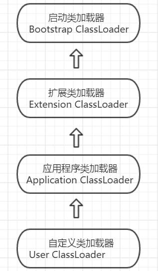

###  类加载器

​	类加载器：完成 **通过一个类的全限定名来获取描述此类的二进制字节流** 的动作。

#### 类与类加载器

​	每一个类加载器都有一个**独立的类名称空间**。比较两个类是否相等只有在这两个类是同一个类加载器加载的前提下才有意义，否则，即使这两个类源于同一个class文件，被一个虚拟机加载，只要加载他们的加载器不同，那么这两个类就必定不相等。


​	Class对象是通过ClassLoader的loadClass方法加载并获取。

​	ClassLoader可以通过Class的getClassLoader()方法获取。

​	.class文件或者网络I/O都是字节码流（Stream）,ClassLoader能够把二进制流解析为Class对象，通过复用ClassLoader#defineClass方法实现（重）定义Class类，如Groovy动态加载类。

```java
import org.apache.commons.io.FileUtils;
import java.io.File;
import java.io.IOException;

public class ClassLoadingDemo {

    public static void main(String[] args) throws IOException {

        String className = "com.yjy.classload.v1.User";
        String classFileName = className.replace('.', '/').concat(".class");
        String classPath = System.getProperty("user.dir")+"/target/classes";

        File classFile = new File(classPath,classFileName);
        System.out.println(classFile.getAbsolutePath());
        MyClassLoader myClassLoader = new MyClassLoader();
        //.class 文件变为字节流 ，再定义class对象
        Class<?> userClass  = myClassLoader.defineClass(className,classFile);
        //输出 当前类对象class com.yjy.classload.v1.User
        System.out.println("当前类对象" + userClass);
    }

    static class MyClassLoader extends ClassLoader{
        public MyClassLoader(){
            //当前上下文的Class作为Parent
            super(Thread.currentThread().getContextClassLoader());
        }

        // 文件 -》 定义某个class
        public Class<?> defineClass(String name , File classFile) throws IOException {
            byte[] bytes = loadBytes(classFile);

            //利用 ClassLoader defineClass 来定义class
            return super.defineClass(name,bytes,0,bytes.length);
        }

        private byte[] loadBytes(File classFile) throws IOException {
            byte[] bytes = FileUtils.readFileToByteArray(classFile);
            return bytes;
        }
    }
}

```


####  双亲委派模型

#####类加载器

​	从java虚拟机的角度来讲，只存在两种不同的类加载器：

  		1. 启动类加载器：使用C++语言实现，是虚拟机自身的一部分；
  		2. 其他加载器：这些加载器都由java语言实现，独立于虚拟机外部，并且都继承自抽象类java.lang.ClassLoader


java程序使用到的3中系统提供的类加载器：

1. 启动类加载器(Bootstrap ClassLoader) : 负责加载的类  a.存放在< JAVA_HOME >\bin 目录中的类 ；b. 被 -Xbootclasspath参数所指定的路径中的类。  自定义加载器中如果需要把加载请求委派给引导类加载器，那直接使用null代替即可。
2. 扩展类加载器(Extension ClassLoader)：这个加载器由 sun.misc.Launcher$ExtClassLoader实现，他负责加载 < JAVA_HOME >\lib\ext 目录中的，或被java.ext.dirs系统变量所指定的路径中的所有类库。
3. 应用程序类加载器(Application ClassLoader): 这个类加载器由sun.mis.Launcher$AppClassLoader实现。这个类加载器时ClassLoader中的getSystemClassLoader()方法的返回值。他负责加载用户类路径上所指定的类库，是程序中默认的类加载器。

##### 双亲委派模型

​	  

​	类加载器之间的这种层次关系，称为类加载器的双亲委派模型。 双亲委派模型要求除了顶层的启动类加载器外，其余的类加载器都应有自己的父加载器。这里的父子关系一般不会以继承的关系来实现，而是以**组合的关系来复用父加载器的代码**。

​	双亲委派模型工作的过程是：如果一个类加载器收到了类加载的请求，它首先不会去尝试加载这个类，**而是把这个请求委派给父类加载器去完成**，每个层次的类加载器都是如此，因此所有的加载请求最终都应该传送到顶层的启动类加载器中，只有当父类加载器反馈自己无法完成这个加载请求时，子类才会尝试自己去加载。

​	实现双亲委派的代码都集中在 java.lang.ClassLoader 中的loadClass()方法中：

```java
public abstract class ClassLoader {

    private final ClassLoader parent;
    
    protected Class<?> loadClass(String name, boolean resolve)
        		throws ClassNotFoundException {
        synchronized (getClassLoadingLock(name)) {
            // 首先检查请求的类是否已经被加载过
            Class<?> c = findLoadedClass(name);
            if (c == null) {
                long t0 = System.nanoTime();
                try {
                    //若父类加载器为空则默认使用启动类加载器作为父加载器
                    if (parent != null) {
                        c = parent.loadClass(name, false);
                    } else {
                        c = findBootstrapClassOrNull(name);
                    }
                } catch (ClassNotFoundException e) {
                    //父类加载器 加载失败抛出ClassNotFoundException 
                    // 说明父类加载器无法完成加载请求
                    
                }
                if (c == null) {
                    // If still not found, then invoke findClass in order
                    // to find the class.
                    long t1 = System.nanoTime();
                    //调用自己的findClass方法进行加载
                    c = findClass(name);
                    // this is the defining class loader; record the stats
                    sun.misc.PerfCounter.getParentDelegationTime().addTime(t1 - t0);
                    sun.misc.PerfCounter.getFindClassTime().addElapsedTimeFrom(t1);
                    sun.misc.PerfCounter.getFindClasses().increment();
                }
            }
            if (resolve) {
                resolveClass(c);
            }
            return c;
        }
    }
}
```


   


