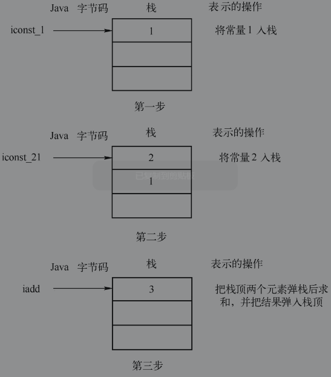
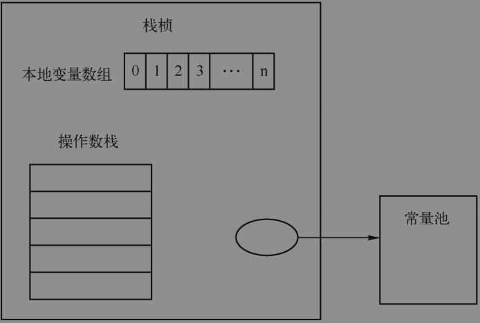
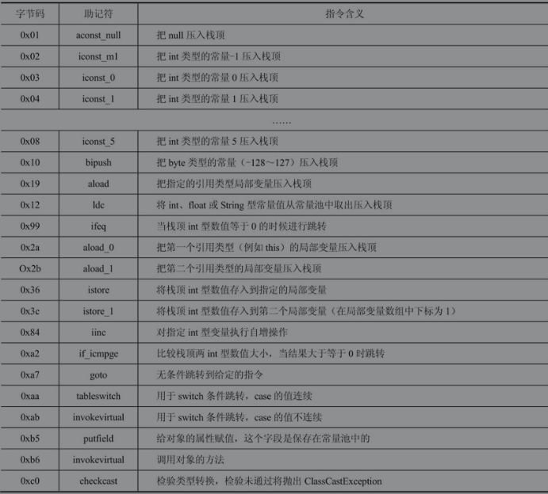
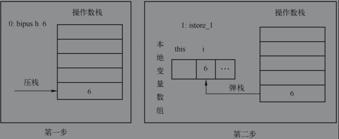
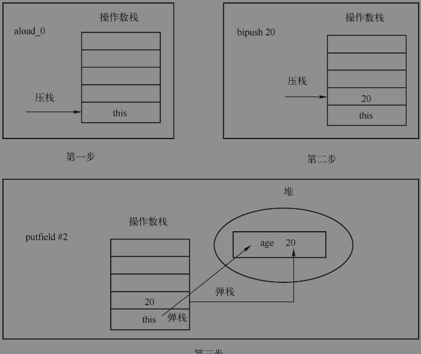

## Java代码的执行

Java代码的执行方式如下：首先把Java代码编译为字节码，然后JVM通过解释字节码来执行。这一节将重点介绍JVM是如何执行字节码的。

###  Java字节码

可以把Java语言中的字节码理解为C/C++中的汇编语言，因此理解字节码以及它们的执行方式不仅能帮助程序员理解底层的执行原理，而且能够帮助程序员编写高性能的代码或者对代码进行调优。

JVM是一个基于堆栈模式的虚拟机。每个线程都有一个栈来存储栈桢信息。每次方法的调用都会创建新的栈桢，方法调用结束后栈桢通过弹栈的方式被回收，这种执行方式与C/C++是相类似的。下面通过一个简单的例子来理解如何用栈来进行计算。以1+2为例，通常用栈计算的表达式都会被表示为后缀表达式，1+2的后缀表达式可以表示为：1 2+，计算的过程如图所示。




Java字节码与汇编语言类似，也是包含了很多操作指令，由于Java字节码中的指令只占用一个字节，因此最多能表示256种指令。指令是由“类型+操作”组成的。例如iadd（i表示integer，add表示相加）表示对两个整数求和。

本地变量数组也被称为本地变量列表，它包括方法的参数，同时也用来保持本地变量的值。本地变量列表的大小是在编译时决定的，取决于数字和本地变量的大小和方法的参数。

JVM是一个基于栈模式的虚拟机，因此栈中自然就包含了栈桢信息，栈桢在方法调用的时候被创建，它主要由操作数栈（Operand Stack）、本地变量数组和一个与当先类的方法的运行时常量池的引用组成，如图所示。



本地变量数组有时候也被称为本地变量表，主要存储了方法的参数和方法内声明的本地变量，根据实际情况的不同，可以分为如下几种情况：

1. 对于普通的方法而言，由于本地变量表中会首先存储方法的参数（从下标0开始），因此下标为0的位置存储第一个参数，下标为1的位置存储第二个参数，依次类推，接着存储本地变量。
2. 如果这个栈桢用来实现构造方法的调用或者一个实例方法的调用，那么显然在调用时必须要保存实例的引用。在这种情况下，下标为0的位置存储的是this（实例的引用），然后从位置1开始存储方法的参数。
3. 对于类方法（被static修饰的方法）而言，由于它的调用是不需要实例的引用的，因此栈桢中没有必要存储this。在这种情况下，从位置0开始存储方法的参数。

根据上面的分析可以发现，本地变量表的大小主要根据方法参数和本地变量的数量以及大小来决定。操作数栈是一个后进先出的栈，栈的大小也是在编译时确定的，它通过入栈和出栈的操作来完成特定的运算功能。




### 变量的执行

#### 局部变量

上面介绍了栈桢的基本概念，在栈桢中，所有的局部变量都存储在本地变量数组中（包括方法中定义的局部变量、方法的参数，如果是对象的方法，那么在下标为0的位置还存储了this）。局部变量主要可以存储的类型为：Java的8种基本类型（byte、char、short、int、long、float、double、boolean）、引用和返回值地址。在这些局部变量中，因为double需要占用2个字节，所以它在本地变量数组中占用两个位置，其他的变量都只占用一个位置。

在方法中声明一个局部变量是怎么执行的呢？

首先，变量的值会被存储在操作数栈上，接着会把这个变量的值存入本地局部变量表中对应的变量的位置。对于引用也是类似的，只不过这个变量的值是一个引用而不是具体的值，被引用的对象仍然存储在堆中。


下面通过一个例子来介绍具体执行的过程：

```java
public class Test {
    public static void main(String[] args) {
        int i =6;
    }
}
```

使用`Javac Test.java`编译生成.class文件，然后使用`javap -c Test`反编译生成字节码，如下所示：

```
Compiled from "Test.java"
public class com.yjy.Test {
  public com.yjy.Test();
    Code:
       0: aload_0							//将 this 压入栈顶
       1: invokespecial #1                  // Method java/lang/Object."<init>":()V 调用父类构造方法
       4: return

  public static void main(java.lang.String[]);
    Code:
       0: bipush        6
       2: istore_1
       3: return
}
```

这里重点介绍“int i=6;”对应的字节码 ：“bipush 6”：用来把6压入到操作栈中。“istore_1”：用来把栈顶的元素存入到第二个局部变量，由于第一个局部变量是this，第二个局部变量是i，因此这两行中间码执行的结果就是把6赋值给i。执行过程如图所示。



编译后的class文件对每个方法都保存着一个局部变量表，可以使用`Javac-gTest.java`编译生成.class文件，然后使用`javap -l Test`反编译生成字节码，如下所示：

```java
Compiled from "Test.java"
public class com.yjy.Test {
  public com.yjy.Test();
    LineNumberTable:
      line 3: 0
    LocalVariableTable:
      Start  Length  Slot  Name   Signature
          0       5     0  this   Lcom/yjy/Test;

  public static void main(java.lang.String[]);
    LineNumberTable:
      line 5: 0
      line 6: 3
    LocalVariableTable:
      Start  Length  Slot  Name   Signature
          0       4     0  args   [Ljava/lang/String;
          3       1     1     i   I
```

由此可以看出，在局部变量表中，下标为1的位置存储的是局部变量i。


#### 实例变量

实例变量的初始化在字节码中会被加入到构造方法中，如下例所示：

```java
public class Test {
    public int age = 20;
}

```

使用 `Javac -g Test.java`编译生成.class文件，然后使用`javap -v Test`可以获取到实例变量初始化的字节码，如下所示：

```
Classfile /E:/idea_workspace/spring-mybatis-test/target/classes/com/yjy/Test.class
  Last modified 2020-11-30; size 291 bytes
  MD5 checksum cd1d7f662a86157ba36238e53dda9abd
  Compiled from "Test.java"
public class com.yjy.Test
  minor version: 0
  major version: 52
  flags: ACC_PUBLIC, ACC_SUPER
Constant pool:
   #1 = Methodref          #4.#16         // java/lang/Object."<init>":()V
   #2 = Fieldref           #3.#17         // com/yjy/Test.age:I
   #3 = Class              #18            // com/yjy/Test
   #4 = Class              #19            // java/lang/Object
   #5 = Utf8               age
   #6 = Utf8               I
   #7 = Utf8               <init>
   #8 = Utf8               ()V
   #9 = Utf8               Code
  #10 = Utf8               LineNumberTable
  #11 = Utf8               LocalVariableTable
  #12 = Utf8               this
  #13 = Utf8               Lcom/yjy/Test;
  #14 = Utf8               SourceFile
  #15 = Utf8               Test.java
  #16 = NameAndType        #7:#8          // "<init>":()V
  #17 = NameAndType        #5:#6          // age:I
  #18 = Utf8               com/yjy/Test
  #19 = Utf8               java/lang/Object
{
  public int age;
    descriptor: I
    flags: ACC_PUBLIC

  public com.yjy.Test();	//构造方法
    descriptor: ()V
    flags: ACC_PUBLIC		//作用域修饰符
    Code:
      stack=2, locals=1, args_size=1
         0: aload_0
         1: invokespecial #1                  // Method java/lang/Object."<init>":()V
         4: aload_0
         5: bipush        20
         7: putfield      #2                  // Field age:I
        10: return
      LineNumberTable:
        line 3: 0
        line 4: 4
      LocalVariableTable:
        Start  Length  Slot  Name   Signature
            0      11     0  this   Lcom/yjy/Test;
}
SourceFile: "Test.java"
```

首先介绍构造方法中字节码的含义：

`aload_0`：由于局部变量表中0的位置存储的是this，因此这个指令的含义是把this压入栈顶。

`invokespecial`：调用父类的构造方法。

`bipush 20`：把20压入栈顶。

`putfield #2`：根据参数#2在常量池中找到实例变量age，然后把栈顶的元素弹栈并赋值给这个示例变量，因此执行的是age=20。


具体执行过程如图所示




####常量

在Java语言中，被final修饰的变量就是常量。常量的字节码与变量类似，唯一不同的是增加了一个修饰符ACC_FINAL，如下例所示：

```
public class Test {
    public final int age = 20;
}
```

使用 `Javac -g Test.java`编译生成.class文件，然后使用`javap -v Test`可以获取到实例变量初始化的字节码，如下所示：

```
...
public class com.yjy.Test
  minor version: 0
  major version: 52
  flags: ACC_PUBLIC, ACC_SUPER
Constant pool:
  ...
{
  public final int age;
    descriptor: I
    flags: ACC_PUBLIC, ACC_FINAL
    ConstantValue: int 20

  public com.yjy.Test();
    descriptor: ()V
    flags: ACC_PUBLIC
    Code:
      stack=2, locals=1, args_size=1
         0: aload_0
         1: invokespecial #1                  // Method java/lang/Object."<init>":()V
         4: aload_0
         5: bipush        20
         7: putfield      #2                  // Field age:I
        10: return
      LineNumberTable:
        line 3: 0
        line 4: 4
      LocalVariableTable:
        Start  Length  Slot  Name   Signature
            0      11     0  this   Lcom/yjy/Test;
}
SourceFile: "Test.java"
```


#### 静态变量

静态变量是类的属性，是所有对象共享的，因此不会在构造方法中初始化，取而代之的是在类的构造方法中用putstatic进行初始化，如下例所示：

```java
public class Test {
    public static int age = 20;
}
```

使用 `Javac -g Test.java`编译生成.class文件，然后使用`javap -v Test`可以获取到实例变量初始化的字节码，如下所示：

```java
Classfile /E:/idea_workspace/spring-mybatis-test/target/classes/com/yjy/Test.class
  Last modified 2020-11-30; size 336 bytes
  MD5 checksum cc0ba9b313b49c4e65cbd93c6dc4791e
  Compiled from "Test.java"
public class com.yjy.Test
  minor version: 0
  major version: 52
  flags: ACC_PUBLIC, ACC_SUPER
Constant pool:
...
{
  public static int age;
    descriptor: I
    flags: ACC_PUBLIC, ACC_STATIC

  public com.yjy.Test();
    descriptor: ()V
    flags: ACC_PUBLIC
    Code:
      stack=1, locals=1, args_size=1
         0: aload_0
         1: invokespecial #1                  // Method java/lang/Object."<init>":()V
         4: return
      LineNumberTable:
        line 3: 0
      LocalVariableTable:
        Start  Length  Slot  Name   Signature
            0       5     0  this   Lcom/yjy/Test;

  static {};
    descriptor: ()V
    flags: ACC_STATIC
    Code:
      stack=1, locals=0, args_size=0
         0: bipush        20
         2: putstatic     #2                  // Field age:I
         5: return
      LineNumberTable:
        line 4: 0
}
SourceFile: "Test.java"
```

在上例中，初始化静态变量使用的是 `putstatic #2 `，#2在常量池中对应的是静态变量age。


### 条件语句的执行

流程控制语句主要通过比较两个变量的值，然后根据比较的结果使用goto跳转到指定的字节码去执行

#### if/else

对于if/else的语法以及表示的含义这里就不做介绍了，下面直接通过一个例子来说明其对应的字节码：

```java
public class Test {
    public static void main(String[] args) {
        max(2,3);
    }
    public static int max(int m,int n){
        if (m > n)
            return m;
        else
            return n;
    }
}
```

通过 `javap -v Test ` 生成字节码， 这里重点介绍max方法中if/else对应的中间码，如下所示：

```
public static int max(int, int);
    descriptor: (II)I
    flags: ACC_PUBLIC, ACC_STATIC
    Code:
      stack=2, locals=2, args_size=2
         0: iload_0	 	//将第一个参数压栈： m
         1: iload_1		//将第二个参数压栈： n
         2: if_icmple     7	 //比较两个参数的值 如果 m < n 不满足，那么直接跳到第7行执行
         5: iload_0		//将第一个参数压栈： m
         6: ireturn		//返回栈顶元素
         7: iload_1		//将第一个参数压栈： n
         8: ireturn		//返回栈顶元素
      LineNumberTable:
        line 9: 0
        line 10: 5
        line 12: 7
      LocalVariableTable:
        Start  Length  Slot  Name   Signature
            0       9     0     m   I
            0       9     1     n   I
      StackMapTable: number_of_entries = 1
        frame_type = 7 /* same */
```


####switch

switch表达式的类型只能是下面的几种：byte、char、short、Byte、Character、Short、Integer、enum。从Java 7开始也支持String了。`JVM`主要通过`tableswitch`和`lookupswitch`这两个指令实现switch的逻辑，但是这两个指令都只能操作整数，因此在使用switch的时候，传入的参数都会被默认转换委托int类型。对于String而言，它是通过`hashCode()`方法转换为int类型来执行的。

##### `tableswitch`

`tableswitch`指令的主要工作原理为：把case分支中介于最大值与最小值范围的所有取值都列出来（case中没有的值也列出来，但是它们会指向default代码块）：因此，对于给定的取值，通过`tableswitch`可以直接找到需要执行的代码块，如果传入的参数值不在这个范围内，那么可以直接跳转到default代码块执行。由于这种方法会把case中没有的值也会被列出，因此需要耗费更多的内存，但是执行时间比较快，是一种典型的空间换时间的方法。示例如下所示：

```java
public class Test {
    public int testSwitch(int param){
        switch (param){
            case 1:
                return 1;
            case 2:
                return 2;
            case 4:
                return 4;
            default:
                return 0;
        }
    }
}
```

通过 `javap -v Test ` 生成字节码：

```
 public int testSwitch(int);
    descriptor: (I)I
    flags: ACC_PUBLIC
    Code:
      stack=1, locals=2, args_size=2
         0: iload_1
         1: tableswitch   { // 1 to 4
                       1: 32
                       2: 34
                       3: 38
                       4: 36
                 default: 38
            }
        32: iconst_1
        33: ireturn
        34: iconst_2
        35: ireturn
        36: iconst_4
        37: ireturn
        38: iconst_0
        39: ireturn
      LineNumberTable:
        line 5: 0
        line 7: 32
        line 9: 34
        line 11: 36
        line 13: 38
      LocalVariableTable:
        Start  Length  Slot  Name   Signature
            0      40     0  this   Lcom/yjy/Test;
            0      40     1 param   I
      StackMapTable: number_of_entries = 4
        frame_type = 32 /* same */
        frame_type = 1 /* same */
        frame_type = 1 /* same */
        frame_type = 1 /* same */
```

从上面例子可以看出，执行switch操作最重要的就是`tableswitch`，它可以根据输入的参数找到需要跳转的指令，从而实现了根据不同的参数执行不同的分支的功能。

##### `lookupswitch`

在上面的例子中，case中并没有3，但是在`tableswitch`中却有3，这样做是为了提高查询效率，但是如果不同的case对应的值比较分散，如果仍然采用这种方式，那么必然会浪费大量内存，因此Java还有另外一种实现方式，那就是`lookupswitch`，这种方式不会列出case对应的范围内所有可取的值，而是只列出case中出现的值。在执行`lookupswitch`指令时，操作数栈顶的值需要和`lookupswitch`中的每一个值进行比较，来确定跳转的地址。由此可见，`lookupswitch`指令的性能比`tableswitch`低，后者在执行时可以立即索引到对应的匹配。编译器在编译switch语句的时候会根据性能与内存的消耗等因素做一个权衡来选择其中一个指令来完成switch操作。下面通过一个例子来介绍`lookupwtitch`的执行方式：

```java
public class Test {
    public int testSwitch(int param){
        switch (param){
            case 1:
                return 1;
            case 52:
                return 2;
            case 94:
                return 4;
            default:
                return 0;
        }
    }
}
```

通过 `javap -v Test ` 生成字节码：

```
 public int testSwitch(int);
    descriptor: (I)I
    flags: ACC_PUBLIC
    Code:
      stack=1, locals=2, args_size=2
         0: iload_1
         1: lookupswitch  { // 3
                       1: 36
                      52: 38
                      94: 40
                 default: 42
            }
        36: iconst_1
        37: ireturn
        38: iconst_2
        39: ireturn
        40: iconst_4
        41: ireturn
        42: iconst_0
        43: ireturn
```

从上面的例子可以看出，二者的执行方式是非常类似的，唯一不同的是执行`lookupswitch`的时候性能比较低下。由此可以看出，在使用switch的时候尽可能使case的取值比较集中，这样能提高执行效率。


###循环语句的执行

条件判断语句的字节码的实现是通过比较两个值的大小来决定跳转的位置的，而由于循环语句需要多次迭代执行循环体中的代码，因此也需要根据比较结果跳转到特定的指令去执行，这里主要以while循环为例进行讲解，其他的几种循环的实现方式非常类似。

while循环的字节码包含一个条件判断指令（`if_icompge`或者`if_icmplt`）和一个goto语句。一旦条件不满足，就会跳转到循环之后的指令去执行，从而结束循环；循环体的最后一句指令是goto，为了跳转到循环的开始部分，继续执行下一次循环，示例代码如下所示：

```java
public class Test {
    public void testWhile(){
        int i = 0;
        while (i < 4){
            i++;
        }
    }
}
```

通过 `javap -v Test ` 生成字节码：

```
 public void testWhile();
    descriptor: ()V
    flags: ACC_PUBLIC
    Code:
      stack=2, locals=2, args_size=1
         0: iconst_0 			//常数 0 压入栈顶
         1: istore_1			//栈顶元素弹栈 赋值给下标为1 的局部变量
         2: iload_1				//下标为1 的局部变量 的值 压入栈顶
         3: iconst_4			//把常量4 压入栈顶
         4: if_icmpge     13		//如果栈顶元素的值4 大于栈中第二个元素的值，那么跳转到13
         7: iinc          1, 1		//对局部变量表中下标为1 的变量自增（i++）
        10: goto          2			//跳转到 2 继续执行下次循环
        13: return
      LineNumberTable:
        line 5: 0
        line 6: 2
        line 7: 7
        line 9: 13
      LocalVariableTable:
        Start  Length  Slot  Name   Signature
            0      14     0  this   Lcom/yjy/Test;  //局部变量第一个存储的是 this
            2      12     1     i   I				//局部变量第二个存储的是i
      StackMapTable: number_of_entries = 2
        frame_type = 252 /* append */
          offset_delta = 2
          locals = [ int ]
        frame_type = 10 /* same */
```


###泛型擦除的类型转换

在前面泛型擦除章节已经介绍过，因为Java代码在编译的过程中会进行类型擦除，所以所有的泛型类型变量最后都会被替换为原始类型。例如：`ArrayList<Integer>`的类型参数为Integer，但是被擦除类型后就变成了原始类型Object。既然都被替换为原始类型，那么为什么在获取的时候，不需要进行强制类型转换呢？而且只能获取到String类型的值呢？其实它是通过类型转换来实现的。下面通过一个例子从字节码的角度来分析这种类型转换的实现方式：

```java
public class Test {
    public static void main(String[] args) {
        ArrayList<String> list = new ArrayList<String>();
        list.add(new String("hello"));
        String s = list.get(0);
    }
}

```

`javap -v Test.class `生成的字节码如下所示

```
public class com.yjy.Test
  minor version: 0
  major version: 52
  flags: ACC_PUBLIC, ACC_SUPER
Constant pool:
   #1 = Methodref          #10.#30        // java/lang/Object."<init>":()V
   #2 = Class              #31            // java/util/ArrayList
....
{
  public com.yjy.Test();
    descriptor: ()V
    flags: ACC_PUBLIC
    Code:
      stack=1, locals=1, args_size=1
         0: aload_0
         1: invokespecial #1                  // Method java/lang/Object."<init>":()V
         4: return
      LineNumberTable:
        line 5: 0
      LocalVariableTable:
        Start  Length  Slot  Name   Signature
            0       5     0  this   Lcom/yjy/Test;

  public static void main(java.lang.String[]);
    descriptor: ([Ljava/lang/String;)V
    flags: ACC_PUBLIC, ACC_STATIC
    Code:
      stack=4, locals=3, args_size=1
         0: new           #2                  // class java/util/ArrayList
         3: dup
         4: invokespecial #3                  // Method java/util/ArrayList."<init>":()V
         7: astore_1
         8: aload_1
         9: new           #4                  // class java/lang/String
        12: dup
        13: ldc           #5                  // String hello
        15: invokespecial #6                  // Method java/lang/String."<init>":(Ljava/lang/String;)V
        18: invokevirtual #7                  // Method java/util/ArrayList.add:(Ljava/lang/Object;)Z
        21: pop
        22: aload_1
        23: iconst_0
        24: invokevirtual #8                  // Method java/util/ArrayList.get:(I)Ljava/lang/Object;
        27: checkcast     #4                  // class java/lang/String
        30: astore_2
        31: return
      LineNumberTable:
        line 7: 0
        line 8: 8
        line 9: 22
        line 10: 31
      LocalVariableTable:
        Start  Length  Slot  Name   Signature
            0      32     0  args   [Ljava/lang/String;
            8      24     1  list   Ljava/util/ArrayList;
           31       1     2     s   Ljava/lang/String;
      LocalVariableTypeTable:
        Start  Length  Slot  Name   Signature
            8      24     1  list   Ljava/util/ArrayList<Ljava/lang/String;>;
}
```

从上面的字节码可以看出：24: invokevirtual #8完成了get方法的调用，它的返回值是Object类型，最重要的是字节码：27: checkcast #4，它实现了类型检查（#4在常量池中表示的是String类型）。由此可见，类型检查是调用的地方进行的，如果试图把get返回的结果复制给Integer类型的引用变量，那么checkcast指令将会抛出异常，这也就是为什么类型被擦除后仍然能够检查类型是否匹配。