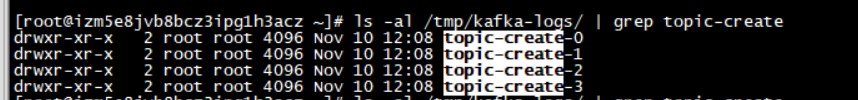
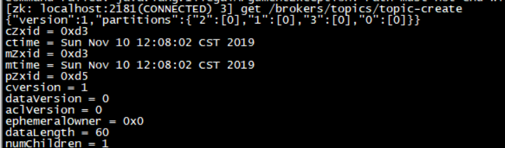
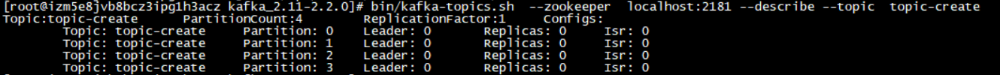
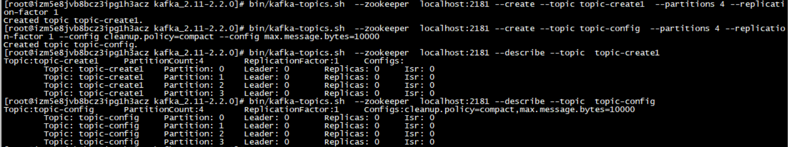

主题作为消息的归类，分区可以有一个至多个副本，每个副本对应一个日志文件，每个日志文件对应一至多个日志分段，每个日志分段还可以细分为索引文件、日志存储文件和快照文件

### 主题管理

​	可以通过 kafka-topics.sh脚本或KafkaAdminClient  管理主体（创建主题、查看主题信息、修改主题、删除主题）。

​	kafka-topics.sh 脚本有5中指令类型：create、list、describe、alter、delete。

#### 创建主题

同一个分区中多个副本必须分布在不同的broker中

通过kafka-topics.sh创建一个分区数为4、副本因子为1的主题topic-create  

> bin/kafka-topics.sh  --zookeeper  localhost:2181 --create --topic topic-create  --partitions 4 --replication-factor 1

参数：

​	 --zookeeper 表示zookeeper 的链接地址

​	--topic 表示主题名称

​	--partitions 表示分区数

​	--replication-factor 表示副本因子

##### 查看创建的主题

默认情况下可以在  /tmp/kafka-logs/  目录下查看创建的主题分区

> ls -al /tmp/kafka-logs/ | grep topic-create

还可以通过zookeeper客户端获取分区和副本的分配情况

> zkCli.sh
>
> get /brokers/topics/topic-create

"2":[0] 表示：  分区2分配了一个副本在 brokerid 为0 的节点中

如果有多个副本

"1":[0,1] 表示：分区1分配了2个副本，分别在 brokerid 为0和1 的节点中

还可以通过 describe 指令查看分区副本的分配细节

> bin/kafka-topics.sh  --zookeeper  localhost:2181 --describe --topic  topic-create

 #####  手动指定分区副本的分配

replica-assignment  part1_replical1: part1_replical2,   part2_replical1: part2_replical2 ... 分区号的数组按从小到大排序，分区与分区之间按照“ ，”隔开。分区内副本用 “ : ”隔开。

例如**创建主题topic-create-same 的分区 0、1、2 分别在在  brokerid 为2和0 、0和1 、 1和2  的节点中**。

> bin/kafka-topics.sh  --zookeeper  localhost:2181 --create --topic topic-create-same -- replica-assignment 2:0 , 0:1 , 1:2 

常见错误：

1. 分区内副本不能重复 ，例 0:0,1:1   。这种会报AdminCommandFailedException 异常
2. 分区内副本数不同 ，例如  0:1 , 0 , 1:0    。会报AdminOperationException异常
3. 不可跳过分区  ，例如  2:0 ,   , 1:2   是不被允许的，会报NumberFormatException 异常

##### 通过config参数来设置创建主题的相关参数

这个参数可以覆盖原本的默认配置

> bin/kafka-topics.sh  --zookeeper  localhost:2181 --create --topic topic-config  --partitions 4 --replication-factor 1 --config cleanup.policy=compact --config max.message.bytes=10000

#####  主题命名方式

1. 不能创建已存在的主题
2. kafka-topic.sh 脚本内部  会根据主题名称来命名 metrics 的名称，并且会将 “.” 号改为“_”号，创建topic.1_2为名称的主题时提示 WARNING警告， 之后在创建 topic_1.2 的主题时发生InvalidTopicException异常。

