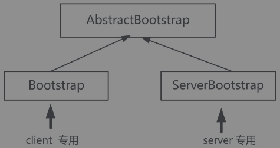

### Bootstrap启动器类

Bootstrap类是Netty提供的一个便利的工厂类，可以通过它来完成Netty的客户端或服务器端的Netty组件的组装，以及Netty程序的初始化。当然，Netty的官方解释是，完全可以不用这个Bootstrap启动器。但是，一点点去手动创建通道、完成各种设置和启动、并且注册到EventLoop，这个过程会非常麻烦。通常情况下，还是使用这个便利的Bootstrap工具类会效率更高。

在Netty中，有两个启动器类，分别用在服务器和客户端。




#### 父子通道

在Netty中，每一个NioSocketChannel通道所封装的是Java NIO通道，再往下就对应到了操作系统底层的socket描述符。理论上来说，操作系统底层的socket描述符分为两类：

1. 连接监听类型。连接监听类型的socket描述符，放在服务器端，它负责接收客户端的套接字连接；在服务器端，一个“连接监听类型”的socket描述符可以接受（Accept）成千上万的传输类的socket描述符。
2. 传输数据类型。数据传输类的socket描述符负责传输数据。同一条TCP的Socket传输链路，在服务器和客户端，都分别会有一个与之相对应的数据传输类型的socket描述符。

在Netty中，异步非阻塞的服务器端监听通道NioServerSocketChannel，封装在Linux底层的描述符，是“连接监听类型”socket描述符；而NioSocketChannel异步非阻塞TCP Socket传输通道，封装在底层Linux的描述符，是“数据传输类型”的socket描述符。

在Netty中，将有接收关系的NioServerSocketChannel和NioSocketChannel，叫作父子通道。其中，NioServerSocketChannel负责服务器连接监听和接收，也叫父通道（Parent Channel）。对应于每一个接收到的NioSocketChannel传输类通道，也叫子通道（ChildChannel）。


#### EventLoopGroup线程组

在Netty中，一个EventLoop相当于一个子反应器（SubReactor）。

一个NioEventLoop子反应器拥有了一个线程，同时拥有一个Java NIO选择器。

多个EventLoop线程组成一个EventLoopGroup线程组。

EventLoopGroup的构造函数有一个参数，用于指定内部的线程数。在构造器初始化时，会按照传入的线程数量，在内部构造多个Thread线程和多个EventLoop子反应器（一个线程对应一个EventLoop子反应器），进行多线程的IO事件查询和分发。

默认的EventLoopGroup内部线程数为最大可用的CPU处理器数量的2倍。假设电脑使用的是4核的CPU，那么在内部会启动8个EventLoop线程，相当8个子反应器（SubReactor）实例。

从前文可知，为了及时接受（Accept）到新连接，在服务器端，一般有两个独立的反应器，一个反应器负责新连接的监听和接受，另一个反应器负责IO事件处理。对应到Netty服务器程序中，则是设置两个EventLoopGroup线程组，一个EventLoopGroup负责新连接的监听和接受，一个EventLoopGroup负责IO事件处理。

负责新连接的监听和接受的EventLoopGroup线程组，查询父通道的IO事件，有点像负责招工的包工头，因此，可以形象地称为“包工头”（Boss）线程组。另一个EventLoopGroup线程组负责查询所有子通道的IO事件，并且执行Handler处理器中的业务处理——例如数据的输入和输出（有点儿像搬砖），这个线程组可以形象地称为“工人”（Worker）线程组。

#### Bootstrap的启动流程

Bootstrap的启动流程，也就是Netty组件的组装、配置，以及Netty服务器或者客户端的启动流程。

```java
 			ServerBootstrap bootstrap = new ServerBootstrap();
			//创建反应器线程组
			EventLoopGroup boosLoopGroup = new NioEventLoopGroup(1);
      		EventLoopGroup workerLoopGroup = new NioEventLoopGroup();

            //1. 设置反应器线程组
            bootstrap.group(boosLoopGroup,workerLoopGroup);
            //2. 设置nio类型的通道
            bootstrap.channel(NioServerSocketChannel.class);
            //3. 设置监听端口
            bootstrap.localAddress(serverPort);
           
```

##### 设置通道参数

这里用到了Bootstrap的option() 选项设置方法。对于服务器的Bootstrap而言，这个方法的作用是：给父通道（Parent Channel）接收连接通道设置一些选项。如果要给子通道（Child Channel）设置一些通道选项，则需要用另外一个childOption()设置方法。可以设置哪些通道选项（ChannelOption）呢？在上面的代码中，设置了一个底层TCP相关的选项ChannelOption.SO_KEEPALIVE。该选项表示：是否开启TCP底层心跳机制，true为开启，false为关闭。

```java
//4. 设置通道参数
bootstrap.option(ChannelOption.SO_KEEPALIVE,true);
bootstrap.option(ChannelOption.ALLOCATOR, PooledByteBufAllocator.DEFAULT);         
```


##### 装配子通道流水线

每一个通道的子通道，都用一条ChannelPipeline流水线。它的内部有一个双向的链表。装配流水线的方式是：将业务处理器ChannelHandler实例加入双向链表中。

```java
			//5. 装配子通道流水线
            bootstrap.childHandler(new ChannelInitializer<SocketChannel>() {
                //有一个链接到达时会创建一个通达
                @Override
                protected void initChannel(SocketChannel ch) throws Exception {
                    //流水线管理子通道中的Handler处理器
                    //向子通道流水线添加一个Handler处理器
                    ch.pipeline().addLast(new NettyDiscardHandler());
                }
            });
```

装配子通道的Handler流水线调用childHandler()方法，传递一个ChannelInitializer通道初始化类的实例。在父通道成功接收一个连接，并创建成功一个子通道后，就会初始化子通道，这里配置的ChannelInitializer实例就会被调用。

在ChannelInitializer通道初始化类的实例中，有一个initChannel初始化方法，在子通道创建后会被执行到，向子通道流水线增加业务处理器。

为什么仅装配子通道的流水线，而不需要装配父通道的流水线呢？原因是：父通道也就是NioServerSocketChannel连接接受通道，它的内部业务处理是固定的：接受新连接后，创建子通道，然后初始化子通道，所以不需要特别的配置。如果需要完成特殊的业务处理，可以使用ServerBootstrap的handler(ChannelHandler handler)方法，为父通道设置ChannelInitializer初始化器。

##### 开始绑定服务器新连接的监听端口

```java
			//6. 开始绑定服务器
            // 通过调用sync同步方法阻塞直到绑定成功
            ChannelFuture channelFuture = bootstrap.bind().sync();
            System.out.println("服务器绑定成功，监听端口："
                    + channelFuture.channel().localAddress());
```

b.bind()方法的功能：返回一个端口绑定Netty的异步任务channelFuture。在这里，并没有给channelFuture异步任务增加回调监听器，而是阻塞channelFuture异步任务，直到端口绑定任务执行完成。

在Netty中，所有的IO操作都是异步执行的，这就意味着任何一个IO操作会立刻返回，在返回的时候，异步任务还没有真正执行。什么时候执行完成呢？Netty中的IO操作，都会返回异步任务实例（如ChannelFuture实例），通过自我阻塞一直到ChannelFuture异步任务执行完成，或者为ChannelFuture增加事件监听器的两种方式，以获得Netty中的IO操作的真正结果。上面使用了第一种。至此，服务器正式启动。

##### 自我阻塞，直到通道关闭

```java
		 	//7. 等待通道关闭的异步任务结束
            //  服务器监听通道会一直等待通道关闭的异步任务结束
            ChannelFuture closeFuture = channelFuture.channel().closeFuture();
            closeFuture.sync();
```

如果要阻塞当前线程直到通道关闭，可以使用通道的closeFuture()方法，以获取通道关闭的异步任务。当通道被关闭时，closeFuture实例的sync()方法会返回。

#####关闭EventLoopGroup

```java
			//8. 关闭 EventLoopGroup
            workerLoopGroup.shutdownGracefully();
            boosLoopGroup.shutdownGracefully();
```

关闭Reactor反应器线程组，同时会关闭内部的subReactor子反应器线程，也会关闭内部的Selector选择器、内部的轮询线程以及负责查询的所有的子通道。在子通道关闭后，会释放掉底层的资源，如TCP Socket文件描述符等。


#### ChannelOption通道选项

无论是对于NioServerSocketChannel父通道类型，还是对于NioSocketChannel子通道类型，都可以设置一系列的ChannelOption选项。在ChannelOption类中，定义了一大票通道选项。

##### SO_RCVBUF, SO_SNDBUF

此为TCP参数。每个TCP socket（套接字）在内核中都有一个发送缓冲区和一个接收缓冲区，这两个选项就是用来设置TCP连接的这两个缓冲区大小的。TCP的全双工的工作模式以及TCP的滑动窗口便是依赖于这两个独立的缓冲区及其填充的状态。

##### TCP_NODELAY

此为TCP参数。表示立即发送数据，默认值为True（Netty默认为True，而操作系统默认为False）。该值用于设置Nagle算法的启用，该算法将小的碎片数据连接成更大的报文（或数据包）来最小化所发送报文的数量，如果需要发送一些较小的报文，则需要禁用该算法。Netty默认禁用该算法，从而最小化报文传输的延时。

说明一下：这个参数的值，与是否开启Nagle算法是相反的，设置为true表示关闭，设置为false表示开启。通俗地讲，如果要求高实时性，有数据发送时就立刻发送，就设置为true，如果需要减少发送次数和减少网络交互次数，就设置为false。

##### SO_KEEPALIVE

此为TCP参数。表示底层TCP协议的心跳机制。true为连接保持心跳，默认值为false。启用该功能时，TCP会主动探测空闲连接的有效性。可以将此功能视为TCP的心跳机制，需要注意的是：默认的心跳间隔是7200s即2小时。Netty默认关闭该功能。

#####  SO_REUSEADDR

此为TCP参数。设置为true时表示地址复用，默认值为false。有四种情况需要用到这个参数设置：

1. 当有一个有相同本地地址和端口的socket1处于TIME_WAIT状态时，而我们希望启动的程序的socket2要占用该地址和端口。例如在重启服务且保持先前端口时。
2. 有多块网卡或用IP Alias技术的机器在同一端口启动多个进程，但每个进程绑定的本地IP地址不能相同。
3. 单个进程绑定相同的端口到多个socket（套接字）上，但每个socket绑定的IP地址不同。
4. 完全相同的地址和端口的重复绑定。但这只用于UDP的多播，不用于TCP。

##### SO_LINGER

此为TCP参数。表示关闭socket的延迟时间，默认值为-1，表示禁用该功能。-1表示socket.close()方法立即返回，但操作系统底层会将发送缓冲区全部发送到对端。0表示socket.close()方法立即返回，操作系统放弃发送缓冲区的数据，直接向对端发送RST包，对端收到复位错误。非0整数值表示调用socket.close()方法的线程被阻塞，直到延迟时间到来、发送缓冲区中的数据发送完毕，若超时，则对端会收到复位错误。

##### SO_BACKLOG

此为TCP参数。表示服务器端接收连接的队列长度，如果队列已满，客户端连接将被拒绝。默认值，在Windows中为200，其他操作系统为128。如果连接建立频繁，服务器处理新连接较慢，可以适当调大这个参数．

#####SO_BROADCAST

此为TCP参数。表示设置广播模式。


