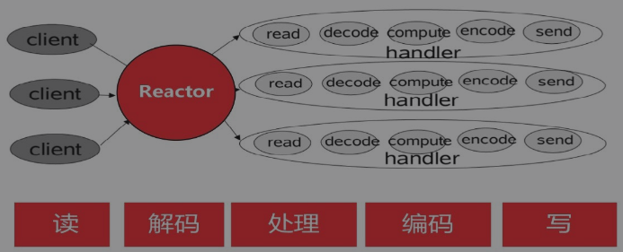
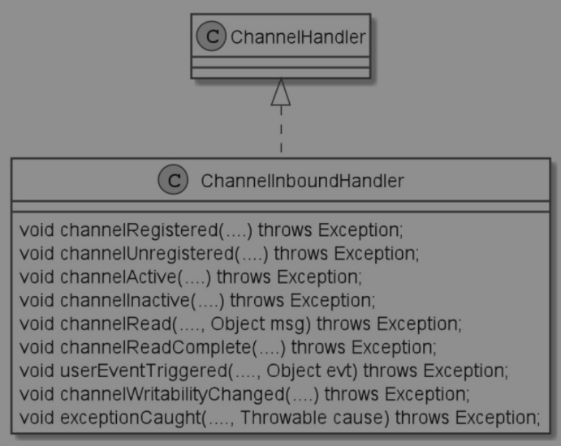

## Handler业务处理器

在Reactor反应器经典模型中，反应器查询到IO事件后，分发到Handler业务处理器，由Handler完成IO操作和业务处理。

整个的IO处理操作环节包括：从通道读数据包、数据包解码、业务处理、目标数据编码、把数据包写到通道，然后由通道发送到对端。




前后两个环节，从通道读数据包和由通道发送到对端，由Netty的底层负责完成，不需要用户程序负责。用户程序主要在Handler业务处理器中，Handler涉及的环节为：数据包解码、业务处理、目标数据编码、把数据包写到通道中。

前面已经介绍过，从应用程序开发人员的角度来看，有入站和出站两种类型操作。

- 入站处理，触发的方向为：自底向上，Netty的内部（如通道）到ChannelInboundHandler入站处理器。
- 出站处理，触发的方向为：自顶向下，从ChannelOutboundHandler出站处理器到Netty的内部（如通道）。

按照这种方向来分，前面数据包解码、业务处理两个环节——属于入站处理器的工作；后面目标数据编码、把数据包写到通道中两个环节——属于出站处理器的工作。


###  ChannelInboundHandler通道入站处理器

当数据或者信息入站到Netty通道时，Netty将触发入站处理器ChannelInboundHandler所对应的入站API，进行入站操作处理。

ChannelInboundHandler的主要操作，如图所示，具体的介绍如下：




####  channelRegistered

当通道注册完成后，Netty会调用fireChannelRegistered，触发通道注册事件。通道会启动该入站操作的流水线处理，在通道注册过的入站处理器Handler的channelRegistered方法，会被调用到。

#### channelActive

当通道激活完成后，Netty会调用fireChannelActive，触发通道激活事件。通道会启动该入站操作的流水线处理，在通道注册过的入站处理器Handler的channelActive方法，会被调用到。

#### channelRead

当通道缓冲区可读，Netty会调用fireChannelRead，触发通道可读事件。通道会启动该入站操作的流水线处理，在通道注册过的入站处理器Handler的channelRead方法，会被调用到。

#### channelReadComplete

当通道缓冲区读完，Netty会调用fireChannelReadComplete，触发通道读完事件。通道会启动该入站操作的流水线处理，在通道注册过的入站处理器Handler的channelReadComplete方法，会被调用到。

#### channelInactive

当连接被断开或者不可用，Netty会调用fireChannelInactive，触发连接不可用事件。通道会启动对应的流水线处理，在通道注册过的入站处理器Handler的channelInactive方法，会被调用到。

#### exceptionCaught

当通道处理过程发生异常时，Netty会调用fireExceptionCaught，触发异常捕获事件。通道会启动异常捕获的流水线处理，在通道注册过的处理器Handler的exceptionCaught方法，会被调用到。注意，这个方法是在通道处理器中ChannelHandler定义的方法，入站处理器、出站处理器接口都继承到了该方法。

### ChannelOutboundHandler通道出站处理器

当业务处理完成后，需要操作Java NIO底层通道时，通过一系列的ChannelOutboundHandler通道出站处理器，完成Netty通道到底层通道的操作。比方说建立底层连接、断开底层连接、写入底层Java NIO通道等。ChannelOutboundHandler接口定义了大部分的出站操作，如图所示，具体的介绍如下：


再强调一下，出站处理的方向：是通过上层Netty通道，去操作底层Java IO通道。主要出站（Outbound）的操作如下：

#### bind

监听地址（IP+端口）绑定：完成底层Java IO通道的IP地址绑定。如果使用TCP传输协议，这个方法用于服务器端。

#### connect

连接服务端：完成底层Java IO通道的服务器端的连接操作。如果使用TCP传输协议，这个方法用于客户端。

#### write

写数据到底层：完成Netty通道向底层Java IO通道的数据写入操作。此方法仅仅是触发一下操作而已，并不是完成实际的数据写入操作。

#### flush

腾空缓冲区中的数据，把这些数据写到对端：将底层缓存区的数据腾空，立即写出到对端。

#### read

从底层读数据：完成Netty通道从Java IO通道的数据读取。

#### disConnect

断开服务器连接：断开底层Java IO通道的服务器端连接。如果使用TCP传输协议，此方法主要用于客户端。


在Netty中，ChannelOutboundHandler的默认实现为ChannelOutboundHandlerAdapter，在实际开发中，只需要继承这个ChannelOutboundHandlerAdapter默认实现，重写自己需要的方法即可。


### ChannelInitializer通道初始化处理器

在前面已经讲到，通道和Handler业务处理器的关系是：一条Netty的通道拥有一条Handler业务处理器流水线，负责装配自己的Handler业务处理器。装配Handler的工作，发生在通道开始工作之前。现在的问题是：如果向流水线中装配业务处理器呢？这就得借助通道的初始化类——ChannelInitializer。

首先回顾一下NettyDiscardServer丢弃服务端的代码，在给接收到的新连接装配Handler业务处理器时，使用childHandler()方法设置了一个ChannelInitializer实例：

```java
			bootstrap.childHandler(new ChannelInitializer<SocketChannel>() {
                //有一个链接到达时会创建一个通道
                @Override
                protected void initChannel(SocketChannel ch) throws Exception {
                    //流水线管理子通道中的Handler处理器
                    //向子通道流水线添加一个Handler处理器
                    ch.pipeline().addLast(new NettyDiscardHandler());
                }
            });
```

上面的ChannelInitializer也是通道初始化器，属于入站处理器的类型。在示例代码中，使用了ChannelInitializer的initChannel() 方法。它是何方神圣呢？

initChannel()方法是ChannelInitializer定义的一个抽象方法，这个抽象方法需要开发人员自己实现。在父通道调用initChannel()方法时，会将新接收的通道作为参数，传递给initChannel()方法。initChannel()方法内部大致的业务代码是：拿到新连接通道作为实际参数，往它的流水线中装配Handler业务处理器。


###ChannelInboundHandler的生命周期的实践案例

为了弄清Handler业务处理器的各个方法的执行顺序和生命周期，这里定义一个简单的入站Handler处理器——InHandlerDemo。这个类继承于ChannelInboundHandlerAdapter适配器，它实现了基类的大部分入站处理方法，并在每一个方法的实现代码中都加上必要的输出信息，以便于观察方法是否被执行到。


InHandlerDemo的代码如下：

```java

public class InHandlerDemo extends ChannelInboundHandlerAdapter {

    @Override
    public void handlerAdded(ChannelHandlerContext ctx) throws Exception {
        System.out.println("handlerAdded() 被调用");
        super.handlerAdded(ctx);
    }

    @Override
    public void channelRegistered(ChannelHandlerContext ctx) throws Exception {
        System.out.println("channelRegistered() 被调用");
        super.channelRegistered(ctx);
    }

    @Override
    public void channelActive(ChannelHandlerContext ctx) throws Exception {
        System.out.println("channelActive() 被调用");
        super.channelActive(ctx);
    }

    @Override
    public void channelRead(ChannelHandlerContext ctx, Object msg) throws Exception {
        System.out.println("channelRead() 被调用");
        super.channelRead(ctx, msg);
    }

    @Override
    public void channelReadComplete(ChannelHandlerContext ctx) throws Exception {
        System.out.println("channelReadComplete() 被调用");
        super.channelReadComplete(ctx);
    }

    @Override
    public void channelInactive(ChannelHandlerContext ctx) throws Exception {
        System.out.println("channelInactive() 被调用");
        super.channelInactive(ctx);
    }

    @Override
    public void channelUnregistered(ChannelHandlerContext ctx) throws Exception {
        System.out.println("channelUnregistered() 被调用");
        super.channelUnregistered(ctx);
    }

    @Override
    public void handlerRemoved(ChannelHandlerContext ctx) throws Exception {
        System.out.println("handlerRemoved() 被调用");
        super.handlerRemoved(ctx);
    }
}

```

为了演示这个入站处理器，需要编写一个单元测试代码：将上面的Inhandler入站处理器加入到一个EmbeddedChannel嵌入式通道的流水线中。接着，通过writeInbound方法写入ByteBuf数据包。InHandlerDemo作为一个入站处理器，会处理从通道到流水线的入站报文——ByteBuf数据包。单元测试的代码如下：

```java
public class InHandlerDemoTest {
    public static void main(String[] args) {
        final InHandlerDemo inHandler = new InHandlerDemo();
        //初始化处理器
        ChannelInitializer i = new ChannelInitializer<EmbeddedChannel>(){
            @Override
            protected void initChannel(EmbeddedChannel ch) {
                ch.pipeline().addLast(inHandler);
            }
        };
        //创建嵌入式通道
        EmbeddedChannel channel = new EmbeddedChannel(i);
        ByteBuf buf = Unpooled.buffer();
        buf.writeInt(1);
        //模拟入站，写一个入站数据包
        channel.writeInbound(buf);
        channel.flush();
        //模拟入站，写一个入站数据包
        channel.writeInbound(buf);
        channel.flush();
        //通道关闭
        channel.close();
        try {
            Thread.sleep(Integer.MAX_VALUE);
        } catch (InterruptedException e) {
            e.printStackTrace();
        }   
    }
}
```

输出的结果具体如下：

```
handlerAdded() 被调用
channelRegistered() 被调用
channelActive() 被调用
channelRead() 被调用
channelReadComplete() 被调用
channelRead() 被调用
channelReadComplete() 被调用
channelInactive() 被调用
channelUnregistered() 被调用
handlerRemoved() 被调用
```


##### 结果

在讲解上面的方法之前，首先对方法进行分类：（1）生命周期方法，（2）入站回调方法。上面的几个方法中，channelRead、channelReadComplete是入站处理方法；而其他的6个方法是入站处理器的周期方法。

从输出的结果可以看到，ChannelHandler中的回调方法的执行顺序为：handlerAdded() →channelRegistered() → channelActive() → 入站方法回调 → channelInactive() → channelUnregistered()→ handlerRemoved()。其中，读数据的入站回调为：channelRead() → channelReadComplete()；入站方法会多次调用，每一次有ByteBuf数据包入站都会调用到。


除了两个入站回调方法外，其余的6个方法都和ChannelHandler的生命周期有关，具体的介绍如下：

1. handlerAdded() ：当业务处理器被加入到流水线后，此方法被回调。也就是在完成ch.pipeline().addLast(handler)语句之后，会回调handlerAdded()。
2. channelRegistered()：当通道成功绑定一个NioEventLoop线程后，会通过流水线回调所有业务处理器的channelRegistered()方法。
3. channelActive()：当通道激活成功后，会通过流水线回调所有业务处理器的channelActive()方法。通道激活成功指的是，所有的业务处理器添加、注册的异步任务完成，并且NioEventLoop线程绑定的异步任务完成。
4. channelInactive()：当通道的底层连接已经不是ESTABLISH状态，或者底层连接已经关闭时，会首先回调所有业务处理器的channelInactive()方法。
5. channelUnregistered()：通道和NioEventLoop线程解除绑定，移除掉对这条通道的事件处理之后，回调所有业务处理器的channelUnregistered ()方法。
6. handlerRemoved()：最后，Netty会移除掉通道上所有的业务处理器，并且回调所有的业务处理器的handlerRemoved()方法。


除了生命周期的回调，就是入站和出站处理的回调。对于Inhandler入站处理器，有两个很重要的回调方法为：

1. channelRead()：有数据包入站，通道可读。流水线会启动入站处理流程，从前向后，入站处理器的channelRead()方法会被依次回调到。
2. channelReadComplete()：流水线完成入站处理后，会从前向后，依次回调每个入站处理器的channelReadComplete()方法，表示数据读取完毕。