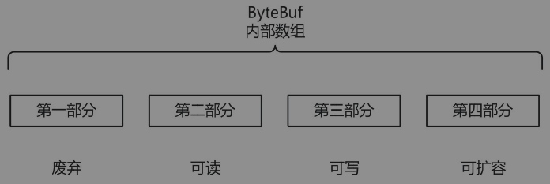
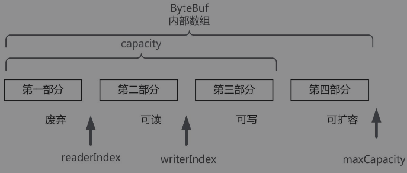
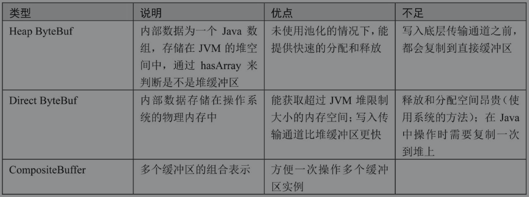

##ByteBuf缓冲区

Netty提供了ByteBuf来替代Java NIO的ByteBuffer缓冲区，以操纵内存缓冲区。


与Java NIO的ByteBuffer相比，ByteBuf的优势如下：

-  Pooling (池化，这点减少了内存复制和GC，提升了效率)
- 复合缓冲区类型，支持零复制
- 不需要调用flip()方法去切换读/写模式·
- 扩展性好，例如StringBuffer
-  可以自定义缓冲区类型
-  读取和写入索引分开
-  方法的链式调用
-  可以进行引用计数，方便重复使用


### ByteBuf的逻辑部分

ByteBuf是一个字节容器，内部是一个字节数组。从逻辑上来分，字节容器内部可以分为四个部分，具体如图所示。



第一个部分是已用字节，表示已经使用完的废弃的无效字节；第二部分是可读字节，这部分数据是ByteBuf保存的有效数据，从ByteBuf中读取的数据都来自这一部分；第三部分是可写字节，写入到ByteBuf的数据都会写到这一部分中；第四部分是可扩容字节，表示的是该ByteBuf最多还能扩容的大小。


### ByteBuf的重要属性

ByteBuf通过三个整型的属性有效地区分可读数据和可写数据，使得读写之间相互没有冲突。这三个属性定义在AbstractByteBuf抽象类中，分别是：

- readerIndex（读指针）
-  writerIndex（写指针）
-  maxCapacity（最大容量）

ByteBuf的这三个重要属性，如图所示。




这三个属性的详细介绍如下：

- readerIndex（读指针）：指示读取的起始位置。每读取一个字节，readerIndex自动增加1。一旦readerIndex与writerIndex相等，则表示ByteBuf不可读了。
-  writerIndex（写指针）：指示写入的起始位置。每写一个字节，writerIndex自动增加1。一旦增加到writerIndex与capacity()容量相等，则表示ByteBuf已经不可写了。capacity()是一个成员方法，不是一个成员属性，它表示ByteBuf中可以写入的容量。注意，它不是最大容量maxCapacity。
- maxCapacity（最大容量）：表示ByteBuf可以扩容的最大容量。当向ByteBuf写数据的时候，如果容量不足，可以进行扩容。扩容的最大限度由maxCapacity的值来设定，超过maxCapacity就会报错。


### ByteBuf的三组方法

#### 容量系列

##### capacity()

 capacity()：表示ByteBuf的容量，它的值是以下三部分之和：废弃的字节数、可读字节数和可写字节数。

##### maxCapacity()

 maxCapacity()：表示ByteBuf最大能够容纳的最大字节数。当向ByteBuf中写数据的时候，如果发现容量不足，则进行扩容，直到扩容到maxCapacity设定的上限。

#### 写入系列

##### isWritable() 

isWritable() ：表示ByteBuf是否可写。如果capacity()容量大于writerIndex指针的位置，则表示可写，否则为不可写。注意：如果isWritable()返回false，并不代表不能再往ByteBuf中写数据了。如果Netty发现往ByteBuf中写数据写不进去的话，会自动扩容ByteBuf。

##### writableBytes() 

writableBytes() ：取得可写入的字节数，它的值等于容量capacity()减去writerIndex。

##### maxWritableBytes() 

maxWritableBytes() ：取得最大的可写字节数，它的值等于最大容量maxCapacity减去writerIndex。

##### writeBytes(byte[] src) 

writeBytes(byte[] src) ：把src字节数组中的数据全部写到ByteBuf。这是最为常用的一个方法。

##### writeTYPE(TYPE value）

writeTYPE(TYPE value）：写入基础数据类型的数据。TYPE表示基础数据类型，包含了8大基础数据类型。具体如下：writeByte()、writeBoolean()、writeChar()、writeShort()、writeInt()、writeLong()、writeFloat()、writeDouble()。

##### setTYPE(TYPE value）

setTYPE(TYPE value）：基础数据类型的设置，不改变writerIndex指针值，包含了8大基础数据类型的设置。具体如下：setByte()、setBoolean()、setChar()、setShort()、setInt()、setLong()、setFloat()、setDouble()。setType系列与writeTYPE系列的不同：setType系列不改变写指针writerIndex的值；writeTYPE系列会改变写指针writerIndex的值。

##### markWriterIndex()与resetWriterIndex()

markWriterIndex()与resetWriterIndex()：这两个方法一起介绍。前一个方法表示把当前的写指针writerIndex属性的值保存在markedWriterIndex属性中；后一个方法表示把之前保存的markedWriterIndex的值恢复到写指针writerIndex属性中。markedWriterIndex属性相当于一个暂存属性，也定义在AbstractByteBuf抽象基类中。

#### 读取系列

##### isReadable( )

isReadable( ) ：返回ByteBuf是否可读。如果writerIndex指针的值大于readerIndex指针的值，则表示可读，否则为不可读。

##### readableBytes( )

readableBytes( ) ：返回表示ByteBuf当前可读取的字节数，它的值等于writerIndex减去readerIndex。

##### readBytes(byte[] dst)

readBytes(byte[] dst)：读取ByteBuf中的数据。将数据从ByteBuf读取到dst字节数组中，这里dst字节数组的大小，通常等于readableBytes()。这个方法也是最为常用的一个方法之一。

##### readType()

readType()：读取基础数据类型，可以读取8大基础数据类型。具体如下：readByte()、readBoolean()、readChar()、readShort()、readInt()、readLong()、readFloat()、readDouble()。

##### getTYPE(TYPE value）

getTYPE(TYPE value）：读取基础数据类型，并且不改变指针值。具体如下：getByte()、getBoolean()、getChar()、getShort()、getInt()、getLong()、getFloat()、getDouble()。getType系列与readTYPE系列的不同：getType系列不会改变读指针readerIndex的值；readTYPE系列会改变读指针readerIndex的值。

##### markReaderIndex( )与resetReaderIndex( )

markReaderIndex( )与resetReaderIndex( ) ：这两个方法一起介绍。前一个方法表示把当前的读指针ReaderIndex保存在markedReaderIndex属性中。后一个方法表示把保存在markedReaderIndex属性的值恢复到读指针ReaderIndex中。markedReaderIndex属性定义在AbstractByteBuf抽象基类中。


###ByteBuf基本使用的实践案例

ByteBuf的基本使用分为三部分：

1. 分配一个ByteBuf实例；
2. 向ByteBuf写数据；
3. 从ByteBuf读数据。


这里用了默认的分配器，分配了一个初始容量为9，最大限制为100个字节的缓冲区。关于ByteBuf实例的分配，稍候具体详细介绍。实战代码很简单，具体如下：

```java
public class ByteBufWriteReadTest {
    public static void main(String[] args) {
        //分配 ByteBuf
        ByteBuf buf = ByteBufAllocator.DEFAULT.buffer(9,100);
        //写入 4 个字节
        buf.writeBytes(new byte[]{1,2,3,4});
        System.out.println("start============get=========");
        getByteBuf(buf);
        System.out.println("start============read=========");
        readByteBuf(buf);

    }
    //取字节
    private static void readByteBuf(ByteBuf buf) {
        while (buf.isReadable()){
            System.out.println("取一个字节：" + buf.readByte());

        }
    }
    //读字节不改变指针
    private static void getByteBuf(ByteBuf buf) {
        for (int i = 0;i < buf.readableBytes(); i++){
            System.out.println("读取一个字节：" + buf.getByte(i));
        }
    }
}

```

运行的结果如下：

```
start============get=========
读一个字节：1
读一个字节：2
读一个字节：3
读一个字节：4
start============read=========
取一个字节：1
取一个字节：2
取一个字节：3
取一个字节：4
```


### ByteBuf的引用计数

Netty的ByteBuf的内存回收工作是通过引用计数的方式管理的。JVM中使用“计数器”（一种GC算法）来标记对象是否“不可达”进而收回（注：GC是GarbageCollection的缩写，即Java中的垃圾回收机制）, Netty也使用了这种手段来对ByteBuf的引用进行计数。Netty采用“计数器”来追踪ByteBuf的生命周期，一是对Pooled ByteBuf的支持，二是能够尽快地“发现”那些可以回收的ByteBuf（非Pooled），以便提升ByteBuf的分配和销毁的效率。

插个题外话：什么是Pooled（池化）的ByteBuf缓冲区呢？在通信程序的执行过程中，Buffer缓冲区实例会被频繁创建、使用、释放。大家都知道，频繁创建对象、内存分配、释放内存，系统的开销大、性能低，如何提升性能、提高Buffer实例的使用率呢？从Netty4版本开始，新增了对象池化的机制。即创建一个Buffer对象池，将没有被引用的Buffer对象，放入对象缓存池中；当需要时，则重新从对象缓存池中取出，而不需要重新创建。

#### retain()、release()

回到正题。引用计数的大致规则如下：在默认情况下，当创建完一个ByteBuf时，它的引用为1；每次调用retain()方法，它的引用就加1；每次调用release()方法，就是将引用计数减1；如果引用为0，再次访问这个ByteBuf对象，将会抛出异常；如果引用为0，表示这个ByteBuf没有哪个进程引用它，它占用的内存需要回收。在下面的例子中，多次用到了retain()和release()方法，运行后可以看效果：

```java
public class ReferenceTest {
    public static void main(String[] args) {

        ByteBuf buf =  ByteBufAllocator.DEFAULT.buffer();
        System.out.println("after create:" + buf.refCnt());

        buf.retain();
        System.out.println("after retain:" + buf.refCnt());

        buf.release();
        System.out.println("after release:" + buf.refCnt());

        buf.release();
        System.out.println("after release:" + buf.refCnt());

        //refCnt 为0 不能再 retain
        buf.retain();
        System.out.println("after retain:" + buf.refCnt());
    }
}
/*
after create:1
after retain:2
after release:1
after release:0
Exception in thread "main" io.netty.util.IllegalReferenceCountException: refCnt: 0, increment: 1
*/
```

运行后我们会发现：最后一次retain方法抛出了IllegalReferenceCountException异常。原因是：在此之前，缓冲区buffer的引用计数已经为0，不能再retain了。也就是说：在Netty中，引用计数为0的缓冲区不能再继续使用。

为了确保引用计数不会混乱，在Netty的业务处理器开发过程中，应该坚持一个原则：retain和release方法应该结对使用。简单地说，在一个方法中，调用了retain，就应该调用一次release。

如果retain和release这两个方法，一次都不调用呢？则在缓冲区使用完成后，调用一次release，就是释放一次。例如在Netty流水线上，中间所有的Handler业务处理器处理完ByteBuf之后直接传递给下一个，由最后一个Handler负责调用release来释放缓冲区的内存空间。

当引用计数已经为0, Netty会进行ByteBuf的回收。分为两种情况：（1）Pooled池化的ByteBuf内存，回收方法是：放入可以重新分配的ByteBuf池子，等待下一次分配。（2）Unpooled未池化的ByteBuf缓冲区，回收分为两种情况：如果是堆（Heap）结构缓冲，会被JVM的垃圾回收机制回收；如果是Direct类型，调用本地方法释放外部内存（unsafe.freeMemory）。


###ByteBuf的Allocator分配器

Netty通过ByteBufAllocator分配器来创建缓冲区和分配内存空间。Netty提供了ByteBufAllocator的两种实现：PoolByteBufAllocator和UnpooledByteBufAllocator。

PoolByteBufAllocator（池化ByteBuf分配器）将ByteBuf实例放入池中，提高了性能，将内存碎片减少到最小；这个池化分配器采用了jemalloc高效内存分配的策略，该策略被好几种现代操作系统所采用。

UnpooledByteBufAllocator是普通的未池化ByteBuf分配器，它没有把ByteBuf放入池中，每次被调用时，返回一个新的ByteBuf实例；通过Java的垃圾回收机制回收。

不同的Netty版本，对于分配器的默认使用策略是不一样的。在Netty 4.0版本中，默认的分配器为UnpooledByteBufAllocator。而在Netty 4.1版本中，默认的分配器为PooledByteBufAllocator。现在PooledByteBufAllocator已经广泛使用了一段时间，并且有了增强的缓冲区泄漏追踪机制。因此，可以在Netty程序中设置启动器Bootstrap的时候，将PooledByteBufAllocator设置为默认的分配器。

```java
        ServerBootstrap b = new ServerBootstrap();
		...
        b.option(ChannelOption.ALLOCATOR,PooledByteBufAllocator.DEFAULT);
        b.childOption(ChannelOption.ALLOCATOR,PooledByteBufAllocator.DEFAULT);
```

内存管理的策略可以灵活调整，这是使用Netty所带来的又一个好处。只需一行简单的配置，就能获得到池化缓冲区带来的好处。在底层，Netty为我们干了所有“脏活、累活”！这主要是因为Netty用到了Java的Jemalloc内存管理库。

使用分配器分配ByteBuf的方法有多种。下面列出主要的几种：

```java
public class AllocatorTest {
    public static void main(String[] args) {
        ByteBuf buf = null;

        //1. 分配器默认分配初始容量为9，最大容量100 的缓冲区
        buf = ByteBufAllocator.DEFAULT.buffer(9,100);

        //2. 分配器默认分配初始容量为256，最大容量Integer.MAX_VALUE 的缓冲区
        buf = ByteBufAllocator.DEFAULT.buffer();

        //3. 非池化分配器，分配基于java 堆(Heap)结构内存缓冲区
        buf = UnpooledByteBufAllocator.DEFAULT.heapBuffer();

        //4. 池化分配器，分配基于操作系统管理的直接内存缓冲区
        buf = PooledByteBufAllocator.DEFAULT.directBuffer();
    }
}

```

###ByteBuf缓冲区的类型

根据内存的管理方不同，分为堆缓存区和直接缓存区，也就是Heap ByteBuf和Direct ByteBuf。另外，为了方便缓冲区进行组合，提供了一种组合缓存区。



上面三种缓冲区的类型，无论哪一种，都可以通过池化（Pooled）、非池化（Unpooled）两种分配器来创建和分配内存空间。

下面对Direct Memory（直接内存）进行一下特别的介绍：

- Direct Memory不属于Java堆内存，所分配的内存其实是调用操作系统malloc()函数来获得的；由Netty的本地内存堆Native堆进行管理。
- Direct Memory容量可通过-XX:MaxDirectMemorySize来指定，如果不指定，则默认与Java堆的最大值（-Xmx指定）一样。注意：并不是强制要求，有的JVM默认Direct Memory与-Xmx无直接关系。
- Direct Memory的使用避免了Java堆和Native堆之间来回复制数据。在某些应用场景中提高了性能。
- 在需要频繁创建缓冲区的场合，由于创建和销毁Direct Buffer（直接缓冲区）的代价比较高昂，因此不宜使用Direct Buffer。也就是说，Direct Buffer尽量在池化分配器中分配和回收。如果能将Direct Buffer进行复用，在读写频繁的情况下，就可以大幅度改善性能。
- 对Direct Buffer的读写比Heap Buffer快，但是它的创建和销毁比普通HeapBuffer慢。
- 在Java的垃圾回收机制回收Java堆时，Netty框架也会释放不再使用的DirectBuffer缓冲区，因为它的内存为堆外内存，所以清理的工作不会为Java虚拟机（JVM）带来压力。注意一下垃圾回收的应用场景：（1）垃圾回收仅在Java堆被填满，以至于无法为新的堆分配请求提供服务时发生；（2）在Java应用程序中调用System.gc()函数来释放内存。


### 三类ByteBuf使用的实践案例

首先对比介绍一下，Heap ByteBuf和Direct ByteBuf两类缓冲区的使用。它们有以下几点不同：

- 创建的方法不同： *Heap ByteBuf通过调用分配器的buffer()方法来创建* ；而Direct ByteBuf的创建，是通过调用分配器的directBuffer()方法。
- Heap ByteBuf缓冲区可以直接通过array()方法读取内部数组；而DirectByteBuf缓冲区不能读取内部数组。
- 可以调用hasArray()方法来判断是否为Heap ByteBuf类型的缓冲区；如果hasArray()返回值为true，则表示是Heap堆缓冲，否则就不是。
- Direct ByteBuf要读取缓冲数据进行业务处理，相对比较麻烦，需要通过getBytes/readBytes等方法先将数据复制到Java的堆内存，然后进行其他的计算。


Heap ByteBuf和Direct ByteBuf这两类缓冲区的使用对比，实践案例的代码如下：

```java
public class ByteBufTypeTest {
    final static Charset UTF_8 = Charset.forName("UTF-8");
    public static void main(String[] args) {
        testHeapBuffer();
        testDirectBuffer();
    }
    //直接缓冲区
    private static void testDirectBuffer() {
        ByteBuf directBuf = ByteBufAllocator.DEFAULT.directBuffer();
        directBuf.writeBytes("哈哈哈呵呵呵".getBytes(UTF_8));
        if (!directBuf.hasArray()){
            int length = directBuf.readableBytes();
            byte[] array = new byte[length];
            //把数据读取到堆内存
            directBuf.getBytes(directBuf.readerIndex(),array);
            System.out.println(new String(array,UTF_8));
        }
        directBuf.release();
    }
    // 堆缓冲区
    private static void testHeapBuffer() {
        ByteBuf heapBuf = ByteBufAllocator.DEFAULT.heapBuffer();
        heapBuf.writeBytes("哈哈哈呵呵呵".getBytes(UTF_8));
        if (heapBuf.hasArray()){
            byte[] array = heapBuf.array();
            int offset = heapBuf.arrayOffset() + heapBuf.readerIndex();
            int length = heapBuf.readableBytes();
            System.out.println(new String(array,offset,length,UTF_8));
        }
        heapBuf.release();
    }
}
```


注意，如果hasArray()返回false，不一定代表缓冲区一定就是Direct ByteBuf直接缓冲区，也有可能是CompositeByteBuf缓冲区。

在很多通信编程场景下，需要多个ByteBuf组成一个完整的消息：例如HTTP协议传输时消息总是由Header（消息头）和Body（消息体）组成的。如果传输的内容很长，就会分成多个消息包进行发送，消息中的Header就需要重用，而不是每次发送都创建新的Header。

#### CompositeByteBuf

下面演示一下通过CompositeByteBuf来复用Header，代码如下：

```java
public class CompositeByteBufTest {
    final static Charset UTF_8 = Charset.forName("UTF-8");
    public static void main(String[] args) {
        CompositeByteBuf cbuf = ByteBufAllocator.DEFAULT.compositeBuffer();
        //消息头
        ByteBuf headerBuf = Unpooled.copiedBuffer("消息头：", UTF_8);
        //消息体1
        ByteBuf bodyBuf = Unpooled.copiedBuffer("消息体1",UTF_8);
        cbuf.addComponents(headerBuf,bodyBuf);
        sendMsg(cbuf);
        //在 refCnt 为0前，retain
        headerBuf.retain();
        cbuf.release();
        
        cbuf = ByteBufAllocator.DEFAULT.compositeBuffer();
        //消息体2
        bodyBuf = Unpooled.copiedBuffer("消息体2",UTF_8);
        cbuf.addComponents(headerBuf,bodyBuf);
        sendMsg(cbuf);
        cbuf.release();
    }
    private static void sendMsg(CompositeByteBuf cbuf) {
        for (ByteBuf b : cbuf){
            int length = b.readableBytes();
            byte[] array = new byte[length];
            //将 CompositeByteBuf 中的数据复制到数组中
            b.getBytes(b.readerIndex(),array);
            System.out.println(new String(array,UTF_8));
        }
        System.out.println();
    }
}
```

在上面的程序中，向CompositeByteBuf对象中增加ByteBuf对象实例，这里调用了addComponents方法。Heap ByteBuf和Direct ByteBuf两种类型都可以增加。如果内部只存在一个实例，则CompositeByteBuf中的hasArray()方法，将返回这个唯一实例的hasArray()方法的值；如果有多个实例，CompositeByteBuf中的hasArray()方法返回false。

##### nioBuffer

调用nioBuffer()方法可以将CompositeByteBuf实例合并成一个新的Java NIOByteBuffer缓冲区（注意：不是ByteBuf）。


### ByteBuf的自动释放

在入站处理时，Netty是何时自动创建入站的ByteBuf的呢？

查看Netty源代码，我们可以看到，Netty的Reactor反应器线程会在底层的JavaNIO通道读数据时，也就是AbstractNioByteChannel.NioByteUnsafe.read()处，调用ByteBufAllocator方法，创建ByteBuf实例，从操作系统缓冲区把数据读取到Bytebuf实例中，然后调用pipeline.fireChannelRead(byteBuf)方法将读取到的数据包送入到入站处理流水线中。

再看看入站处理时，入站的ByteBuf是如何自动释放的。

#### TailHandler自动释放

Netty默认会在ChannelPipline通道流水线的最后添加一个TailHandler末尾处理器，它实现了默认的处理方法，在这些方法中会帮助完成ByteBuf内存释放的工作。

在默认情况下，如果每个InboundHandler入站处理器，把最初的ByteBuf数据包一路往下传，那么TailHandler末尾处理器会自动释放掉入站的ByteBuf实例。

如何让ByteBuf数据包通过流水线一路向后传递呢？

如果自定义的InboundHandler入站处理器继承自ChannelInboundHandlerAdapter适配器，那么可以在InboundHandler的入站处理方法中调用基类的入站处理方法。

总体来说，如果自定义的InboundHandler入站处理器继承自ChannelInboundHandlerAdapter适配器，那么可以调用以下两种方法来释放ByteBuf内存：

1. 手动释放ByteBuf。具体的方式为调用byteBuf.release()。
2. 调用父类的入站方法将msg向后传递，依赖后面的处理器释放ByteBuf。具体的方式为调用基类的入站处理方法super.channelRead(ctx, msg)。


#### SimpleChannelInboundHandler自动释放

如果Handler业务处理器需要截断流水线的处理流程，不将ByteBuf数据包送入后边的InboundHandler入站处理器，这时，流水线末端的TailHandler末尾处理器自动释放缓冲区的工作自然就失效了。

在这种场景下，Handler业务处理器有两种选择：

1. 手动释放ByteBuf实例。
2. 继承SimpleChannelInboundHandler，利用它的自动释放功能。

我们聚焦的是第二种选择：看看SimpleChannelInboundHandler是如何自动释放的。

以入站读数据为例，Handler业务处理器必须继承自SimpleChannelInboundHandler基类。并且，业务处理器的代码必须移动到重写的channelRead0(ctx, msg)方法中。SimpleChannelInboundHandle类的channelRead等入站处理方法，会在调用完实际的channelRead0方法后，帮忙释放ByteBuf实例。


SimpleChannelInboundHandler是如何释放ByteBuf的，那么就一起来看看Netty源代码。

截取部分的代码如下所示：

```java
package io.netty.channel;

public abstract class SimpleChannelInboundHandler<I> extends ChannelInboundHandlerAdapter {

    
    @Override
    public void channelRead(ChannelHandlerContext ctx, Object msg) throws Exception {
        boolean release = true;
        try {
            if (acceptInboundMessage(msg)) {
                @SuppressWarnings("unchecked")
                I imsg = (I) msg;
                //调用实际的业务代码，必须由子类继承并且提供实现
                channelRead0(ctx, imsg);
            } else {
                release = false;
                ctx.fireChannelRead(msg);
            }
        } finally {
            if (autoRelease && release) {
                ReferenceCountUtil.release(msg);
            }
        }
    }

}
```

在Netty的SimpleChannelInboundHandler类的源代码中，执行完由子类继承的channelRead0()业务处理后，在finally语句代码段中，ByteBuf被释放了一次，如果ByteBuf计数器为零，将被彻底释放掉。

#####出站缓冲区的自动释放

再看看出站处理时，Netty是何时释放出站的ByteBuf的呢？

出站缓冲区的自动释放方式：HeadHandler自动释放。在出站处理流程中，申请分配到的ByteBuf主要是通过HeadHandler完成自动释放的。

出站处理用到的Bytebuf缓冲区，一般是要发送的消息，通常由Handler业务处理器所申请而分配的。例如，在write出站写入通道时，通过调用ctx.writeAndFlush(Bytebufmsg), Bytebuf缓冲区进入出站处理的流水线。在每一个出站Handler业务处理器中的处理完成后，最后数据包（或消息）会来到出站的最后一棒HeadHandler，在数据输出完成后，Bytebuf会被释放一次，如果计数器为零，将被彻底释放掉。在Netty开发中，必须密切关注Bytebuf缓冲区的释放，如果释放不及时，会造成Netty的内存泄露（Memory Leak），最终导致内存耗尽。