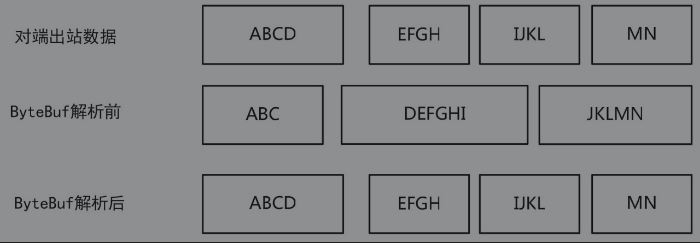

## Decoder与Encoder

编码与解码  De coder与En coder

在入站处理过程中，需要将ByteBuf二进制类型，解码成Java POJO对象。这个解码过程，可以通过Netty的Decoder解码器去完成。

在出站处理过程中，业务处理后的结果（出站数据），需要从某个Java POJO对象，编码为最终的ByteBuf二进制数据，然后通过底层Java通道发送到对端。在编码过程中，需要用到Netty的Encoder编码器去完成数据的编码工作。

### Decoder原理与实践

什么叫作Netty的解码器呢？

首先，它是一个InBound入站处理器，解码器负责处理“入站数据”。

其次，它能将上一站Inbound入站处理器传过来的输入（Input）数据，进行数据的解码或者格式转换，然后输出（Output）到下一站Inbound入站处理器。

一个标准的解码器将输入类型为ByteBuf缓冲区的数据进行解码，输出一个一个的Java POJO对象。Netty内置了这个解码器，叫作ByteToMessageDecoder，位在Netty的io.netty.handler.codec包中。

强调一下，所有的Netty中的解码器，都是Inbound入站处理器类型，都直接或者间接地实现了ChannelInboundHandler接口。


####ByteToMessageDecoder解码器

ByteToMessageDecoder是一个非常重要的解码器基类，它是一个抽象类，实现了解码的基础逻辑和流程。ByteToMessageDecoder继承自ChannelInboundHandlerAdapter适配器，是一个入站处理器，实现了从ByteBuf到Java POJO对象的解码功能。

ByteToMessageDecoder解码的流程，可以描述为：首先，它将上一站传过来的输入到Bytebuf中的数据进行解码，解码出一个`List<Object>`对象列表；然后，迭代`List<Object>`列表，逐个将Java POJO对象传入下一站Inbound入站处理器。


ByteToMessageDecoder仅仅是个抽象类，不能以实例化方式创建对象。也就是说，直接通过ByteToMessageDecoder类，并不能完成Bytebuf字节码到具体Java类型的解码，还得依赖于它的具体实

ByteToMessageDecoder的解码方法名为decode。通过源代码我们可以发现，decode方法只是提供了一个抽象方法，也就是说，decode方法中的具体解码过程，ByteToMessageDecoder没有具体的实现。换句话说，如何将Bytebuf数据变成Object数据，需要子类去完成，父类不管。

总之，作为解码器的父类，ByteToMessageDecoder仅仅提供了一个流程性质的框架：子类的decode方法完成 解码之后将Object结果放入自己内部的结果列表`List<Object>`中，最终，父类会负责将`List<Object>`中的元素，一个一个地传递给下一个站。


如果要实现一个自己的解码器，首先继承ByteToMessageDecoder抽象类。然后，实现其基类的decode抽象方法。将解码的逻辑，写入此方法。总体来说，如果要实现一个自己的ByteBuf解码器，流程大致如下：

1. 首先继承ByteToMessageDecoder抽象类。
2. 然后实现其基类的decode抽象方法。将ByteBuf到POJO解码的逻辑写入此方法。将Bytebuf二进制数据，解码成一个一个的Java POJO对象。
3. 在子类的decode方法中，需要将解码后的Java POJO对象，放入decode的List<Object>实参中。这个实参是ByteToMessageDecoder父类传入的，也就是父类的结果收集列表。


#### 自定义Byte2IntegerDecoder整数解码器的实践案例

下面是一个小小的实践案例：整数解码器。

其功能是，将ByteBuf缓冲区中的字节，解码成Integer整数类型。按照前面的流程，大致的步骤为：

1. 定义一个新的整数解码器——Byte2IntegerDecoder类，让这个类继承Netty的ByteToMessageDecoder字节码解码抽象类。
2. 实现父类的decode方法，将ByteBuf缓冲区数据，解码成以一个一个的Integer对象。
3. 在decode方法中，将解码后得到的Integer整数，加入到父类传递过来的`List<Object>`实参中。

```java
public class Byte2IntegerDecoder extends ByteToMessageDecoder {
    @Override
    protected void decode(ChannelHandlerContext ctx, ByteBuf in, List<Object> out) throws Exception {
        while (in.readableBytes() >= 4){
            int i = in.readInt();
            System.out.println("解出一个整数：" + i);
            out.add(i);
        }
    }
}
```

至此，一个简单的解码器就已经完成了。

如何使用这个自定义的Byte2IntegerDecoder解码器呢？

首先，需要将其加入到通道的流水线中。其次，由于解码器的功能仅仅是完成ByteBuf的解码，不做其他的业务处理，所以还需要编写一个业务处理器，用于在读取解码后的Java POJO对象后，完成具体的业务处理。

这里编写一个简单的业务处理器IntegerProcessHandler，用于处理Byte2IntegerDecoder解码之后的Java Integer整数。其功能是：读取上一站的入站数据，把它转换成整数，并且输出到Console控制台上。实践案例的代码如下：

至此，已经编写了Byte2IntegerDecoder和IntegerProcessHandler这两个自己的入站处理器：一个负责解码，另外一个负责业务处理。

最终，如何测试这两个入站处理器呢？使用EmbeddedChannel嵌入式通道，编写一个测试实例，完整的代码如下：

```java
public class Byte2IntegerDecoderTest {
    public static void main(String[] args) {
        ChannelInitializer initializer = new ChannelInitializer() {
            @Override
            protected void initChannel(Channel ch) throws Exception {
                ch.pipeline().addLast(new Byte2IntegerDecoder());
                ch.pipeline().addLast(new IntegerProcessHandler());
            }
        };
        EmbeddedChannel channel = new EmbeddedChannel(initializer);
        for (int j = 0; j < 100; j++){
            ByteBuf buf = Unpooled.buffer();
            buf.writeInt(j);
            channel.writeInbound(buf);
        }
        try {
            Thread.sleep(Integer.MAX_VALUE);
        } catch (InterruptedException e) {
            e.printStackTrace();
        }
    }
}
```

在测试用例中，新建了一个EmbeddedChannel嵌入式通道实例，将两个自己的入站处理器Byte2IntegerDecoder和IntegerProcessHandler加入通道的流水线上。

请注意先后次序：Byte2IntegerDecoder解码器在前、IntegerProcessHandler整数处理器在后。为什么呢？因为入站处理的次序为——从前到后。

为了测试入站处理器，需要确保通道能接收到ByteBuf入站数据。这里调用writeInbound方法，模拟入站数据的写入，向嵌入式通道EmbeddedChannel写入100次ByteBuf入站缓冲；每一次写入仅仅包含一个整数。

EmbeddedChannel的writeInbound方法模拟入站数据，会被流水线上的两个入站处理器所接收和处理。接着，这些入站的二进制字节被解码成一个一个的整数，然后逐个地输出到控制台上。

最后说明一下：ByteToMessageDecoder传递给下一站的是解码之后的JavaPOJO对象，不是ByteBuf缓冲区。问题来了，ByteBuf缓冲区由谁负责进行引用计数和释放管理的呢？

其实，基类ByteToMessageDecoder负责解码器的ByteBuf缓冲区的释放工作，它会调用ReferenceCountUtil.release(in)方法，将之前的ByteBuf缓冲区的引用数减1。这个工作是自动完成的。

如果这个ByteBuf被释放了，在后面还需要用到，怎么办呢？可以在decode方法中调用一次ReferenceCountUtil.retain(in)来增加一次引用计数。

#### ReplayingDecoder解码

使用上面的Byte2IntegerDecoder整数解码器会面临一个问题：需要对ByteBuf的长度进行检查，如果有足够的字节，才进行整数的读取。这种长度的判断，是否可以由Netty帮忙来完成呢？答案是：使用Netty的ReplayingDecoder类可以省去长度的判断。

ReplayingDecoder类是ByteToMessageDecoder的子类。其作用是：

- 在读取ByteBuf缓冲区的数据之前，需要检查缓冲区是否有足够的字节。
- 若ByteBuf中有足够的字节，则会正常读取；反之，如果没有足够的字节，则会停止解码。

使用ReplayingDecoder基类，编写整数解码器，则可以不用进行长度检测。

改写上一个的整数解码器，继承ReplayingDecoder类，创建一个新的整数解码器，类名为Byte2IntegerReplayDecoder，代码如下：

```java
public class Byte2IntegerDecoder extends ReplayingDecoder{
    @Override
    protected void decode(ChannelHandlerContext ctx, ByteBuf in, List<Object> out) throws Exception {
        int i = in.readInt();
        System.out.println("解出一个整数：" + i);
        out.add(i);
    }
}
```

通过这个示例程序，我们可以看到：继承ReplayingDecoder类实现一个解码器，就不用编写长度判断的代码。ReplayingDecoder进行长度判断的原理，其实很简单：它的内部定义了一个新的二进制缓冲区类，对ByteBuf缓冲区进行了装饰，这个类名为ReplayingDecoderBuffer。该装饰器的特点是：在缓冲区真正读数据之前，首先进行长度的判断：如果长度合格，则读取数据；否则，抛出ReplayError。ReplayingDecoder捕获到ReplayError后，会留着数据，等待下一次IO事件到来时再读取。

简单来讲，ReplayingDecoder基类的关键技术就是偷梁换柱，在将外部传入的ByteBuf缓冲区传给子类之前，换成了自己装饰过的ReplayingDecoderBuffer缓冲区。也就是说，在示例程序中，Byte2IntegerReplayDecoder中的decode方法所得到的实参in的值，它的直接类型并不是原始的ByteBuf类型，而是ReplayingDecoderBuffer类型。

这一点做得非常精彩，且看如下解释：

ReplayingDecoderBuffer类型，首先是一个内部的类，其次它继承了ByteBuf类型，包装了ByteBuf类型的大部分读取方法。ReplayingDecoderBuffer类型的读取方法与ByteBuf类型的读取方法相比，做了什么样的功能增强呢？主要是进行二进制数据长度的判断，如果长度不足，则抛出异常。这个异常会反过来被ReplayingDecoder基类所捕获，将解码工作停掉。

ReplayingDecoder的作用，远远不止于进行长度判断，它更重要的作用是用于分包传输的应用场景。


#### 整数的分包解码器的实践案例

前面讲到，底层通信协议是分包传输的，一份数据可能分几次达到对端。发送端出去的包在传输过程中会进行多次的拆分和组装。接收端所收到的包和发送端所发送的包不是一模一样的，具体如图所示：在发送端发出4个字符串，Netty NIO接收端可能只是接收到了3个ByteBuf数据缓冲。




在Java OIO流式传输中，不会出现这样的问题，因为它的策略是：不读到完整的信息，就一直阻塞程序，不向后执行。但是，在Java的NIO中，由于NIO的非阻塞性，就会出现这样的问题。怎样保证一次性读取到完整的数据，就成了一个大问题。

我们知道，Netty接收到的数据都可以通过解码器进行解码。那么，Netty通过什么样的解码器对图中的3个ByteBuf数据缓冲数据进行解码，而后得到和发送端一模一样的4个字符串，是怎么办到的呢？

对于上面这个问题，还是可以使用ReplayingDecoder来解决。前文讲到，在进行数据解析时，如果发现当前ByteBuf中所有可读的数据不够，ReplayingDecoder会结束解析，直到可读数据是足够的。这一切都是在ReplayingDecoder内部进行，它是通过和缓冲区装饰器类ReplayingDecoderBuffer相互配合完成的，根本就不需要用户程序来操心。

图所展示的是字符串接收时的错乱问题，完全可以通过继承ReplayingDecoder基类来解决。但是，一上来就实现字符串的解码和纠正，相对比较复杂些。在此之前，作为铺垫，我们先看一个简单点的例子：解码整数序列，并且将它们两两一组进行相加。

要完成以上的例子，需要用到ReplayingDecoder一个很重要的属性——state成员属性。该成员属性的作用就是保存当前解码器在解码过程中的当前阶段。在Netty源代码中，该属性的定义具体如下：

```java
package io.netty.handler.codec;
public abstract class ReplayingDecoder<S> extends ByteToMessageDecoder {

    //初始化内部的 Buf 缓冲装饰器类
    private final ReplayingDecoderByteBuf replayable = new ReplayingDecoderByteBuf();
    
    private S state;//保存当前解码器在解码过程中的当前阶段
    
    private int checkpoint = -1;//读断点指针
    
    protected ReplayingDecoder() {
        this(null);
    }
    protected ReplayingDecoder(S initialState) {
        state = initialState;
    }

}
```

上一小节，在定义的整数解码实例中，使用的是默认的无参数构造器，也就是说，state的值为null，泛型实参类型，为默认的Object。总之，就是没有用到state属性。

这一小节，就需要用到state成员属性了。为什么呢？整个解码工作通过一次解码不能完成。要完成两个整数相加就需要解码两次，每一次解码只能解码出一个整数。只有两个整数都得到之后，然后求和，整个解码的工作才算完成。

下面，先基于ReplayingDecoder基础解码器，编写一个整数相加的解码器：解码2个整数，并把这两个数据相加之和作为解码的结果。代码如下：

```java
public class IntegerAddDecode extends ReplayingDecoder<IntegerAddDecode.Status> {
    enum Status{
        PARSE_1, PARSE_2
    }
    private int first;
    private int second;
    public IntegerAddDecode(){
        //在构造函数中初始化父类的 state 属性，表示当前阶段
        super(Status.PARSE_1);
    }
    @Override
    protected void decode(ChannelHandlerContext ctx, ByteBuf in, List<Object> out) throws Exception {
        switch (state()){
            case PARSE_1:
                //从装饰器 ByteBuf中 读取数据
                first = in.readInt();
                //第一步解析成功
                //进入第二步，并设置 “读断点指针” 为当前的读取位置
                checkpoint(Status.PARSE_2);
                break;
            case PARSE_2:
                second = in.readInt();
                Integer sun = first + second;
                out.add(sun);
                checkpoint(Status.PARSE_1);
                break;
            default:
                break;
        }
    }
}
```

IntegerAddDecoder类继承了`ReplayingDecoder<IntegerAddDecoder.Status>`，后面的泛型实参为自定义的状态类型，是一个enum枚举类型，这里的读取有两个阶段：

- 第一个阶段读取前面的整数。
- 第二个阶段读取后面的整数，然后相加。

状态的值保持在父类的成员变量state中。前文说明过：该成员变量保存当面解码的阶段，需要在构造函数中进行初始化。在上面的子类构造函数中，调用了super(Status.PARSE_1)对state进行了初始化。

在IntegerAddDecoder类中，每一次decode方法中的解码，有两个阶段：

- 第一个阶段，解码出前一个整数。
- 第二个阶段，解码出后一个整数，然后求和。

每一个阶段一完成，就通过checkpoint（Status）方法，把当前的状态设置为新的Status值。这个值保存在ReplayingDecoder的state属性中。

严格来说，checkpoint（Status）方法有两个作用：

- 设置state属性的值，更新一下当前的状态。
- 还有一个非常大的作用，就是设置“读断点指针”。


什么是ReplayingDecoder的“读断点指针”呢？

“读断点指针”是ReplayingDecoder类的另一个重要的成员，它保存着装饰器内部ReplayingDecoderBuffer成员的起始读指针，有点儿类似于mark标记。当读数据时，一旦可读数据不够，ReplayingDecoderBuffer在抛出ReplayError异常之前，ReplayingDecoder会把读指针的值还原到之前的checkpoint（IntegerAddDecoder.Status）方法设置的“读断点指针”（checkpoint）。于是乎，在ReplayingDecoder下一次读取时，还会从之前设置的断点位置开始。

checkpoint（IntegerAddDecoder.Status）方法，仅仅从参数上去看比较奇怪，参数为要设置的阶段，但是它的功能却又包含了“读断点指针”的设置。

总结一下，在这个IntegerAddDecoder的使用实例中，解码器保持了以下状态信息：

- 当前通道的读取阶段，是Status.PARSE_1或者Status.PARSE_2。
- 每一次读取，还要保持当前“读断点指针”，便于在可读数据不足时进行恢复。

因此，IntegerAddDecoder是有状态的，不能在不同的通道之间进行共享。更加进一步说，ReplayingDecoder类型和其所有的子类都需要保存状态信息，都有状态的，都不适合在不同的通道之间共享。

至此，IntegerAddDecoder已经介绍完了。


#### 字符串的分包解码器的实践案例

到目前为止，通过前面的整数分包传输，对ReplayingDecoder的分阶段解码，大家应该有了一个完整的了解。现在来看一下字符串的分包传输。在原理上，字符串分包解码和整数分包解码是一样的。有所不同的是：整数的长度是固定的，目前在Java中是4个字节；而字符串的长度不是固定的，是可变长度的，这就是一个小小的难题。

如何获取字符串的长度信息呢？这个问题和程序所使用的具体传输协议是强相关的。一般来说，在Netty中进行字符串的传输，可以采用普通的Header-Content内容传输协议：

1. 在协议的Head部分放置字符串的字节长度。Head部分可以用一个整型int来描述即可。
2. 在协议的Content部分，放置的则是字符串的字节数组。

后面会专门介绍，在实际的传输过程中，一个Header-Content内容包，在发送端会被编码成为一个ByteBuf内容发送包，当到达接收端后，可能被分成很多ByteBuf接收包。对于这些参差不齐的接收包，该如何解码成为最初的ByteBuf内容发送包，来获得Header-Content内容分包呢？

不用急，采用ReplayingDecoder解码器即可。下面就是基于ReplayingDecoder实现自定义的字符串分包解码器的示例程序，它的代码大致如下：

```java
public class StringReplayingDecoder extends ReplayingDecoder<StringReplayingDecoder.Status> {
    enum Status{
        PARSE_1,PARSE_2
    }
    private int length;
    private byte[] inBytes;
    public StringReplayingDecoder(){
        super(Status.PARSE_1);
    }
    @Override
    protected void decode(ChannelHandlerContext ctx, ByteBuf in, List<Object> out) throws Exception {
        switch (state()){
            case PARSE_1:
                //1. 从装饰器 ByteBuf 中读取长度
                length = in.readInt();
                inBytes = new byte[length];
                checkpoint(Status.PARSE_2);//进入第二步，读取内容
                break;
            case PARSE_2:
                in.readBytes(inBytes,0,length);
                out.add(new String(inBytes,"UTF-8"));
                checkpoint(Status.PARSE_1);
                break;
            default:
                break;
        }
    }
}
```

在StringReplayDecoder类中，每一次decode方法中的解码分为两个步骤：

第1步骤，解码出一个字符串的长度。

第2步骤，按照第一个阶段的字符串长度解码出字符串的内容。

在decode方法中，每个阶段一完成，就通过checkpoint（Status）方法把当前的状态设置为新的Status值。

为了处理StringReplayDecoder解码后的字符串，这里编写一个简单的业务处理器。其功能是：读取上一站的入站数据，把它转换成字符串，并且输出到Console控制台上。新业务处理器名称为StringProcessHandler，具体如下：

```java
public class StringProcessHandler extends ChannelInboundHandlerAdapter {
    @Override
    public void channelRead(ChannelHandlerContext ctx, Object msg) throws Exception {
        String s = (String)msg;
        System.out.println("打印出一个字符串：" + s);
    }
}
```

至此，已经编写了StringReplayDecoder和StringProcessHandler两个自己的入站处理器：一个负责字符串解码，另外一个负责字符串输出。如何使用这两个入站处理器呢？编写一个测试实例，完整的代码如下：

```java
public class StringReplayingDecoderTest {
    public static void main(String[] args) {
        ChannelInitializer i = new ChannelInitializer<EmbeddedChannel>() {
            @Override
            protected void initChannel(EmbeddedChannel ch) throws Exception {
                ch.pipeline().addLast(new StringReplayingDecoder());
                ch.pipeline().addLast(new StringProcessHandler());
            }
        };
        EmbeddedChannel channel = new EmbeddedChannel(i);
        byte[] bytes = "红黑红黑或或或或".getBytes(Charset.forName("utf-8"));
        for (int j = 0; j<100; j++){
            int random = j%3;
            ByteBuf buf = Unpooled.buffer();
            buf.writeInt(bytes.length * random);
            for (int k =0; k < random; k++){
                buf.writeBytes(bytes);
            }
            channel.writeInbound(buf);
        }
        try {
            Thread.sleep(Integer.MAX_VALUE);
        } catch (InterruptedException e) {
            e.printStackTrace();
        }
    }
}

```

在测试用例中，新建了一个EmbeddedChannel嵌入式通道实例，将两个自己的入站处理器StringReplayDecoder和StringProcessHandler加入通道的流水线中。为了测试入站处理器，调用writeInbound方法，向EmbeddedChannel嵌入式通道写入100次ByteBuf入站缓冲；每一个ByteBuf缓冲仅仅包含一个字符串。EmbeddedChannel嵌入式通道接收到入站数据后，流水线上的两个入站处理器就能不断地处理这些入站数据：将接到的二进制字节解码成一个一个的字符串，然后逐个地输出到控制台上。


小结：

通过ReplayingDecoder解码器，可以正确地解码分包后的ByteBuf数据包。但是，在实际的开发中，不太建议继承这个类，原因是：

（1）不是所有的ByteBuf操作都被ReplayingDecoderBuffer装饰类所支持，可能有些ByteBuf操作在ReplayingDecoder子类的decode实现方法中被使用时就会抛出ReplayError异常。

（2）在数据解析逻辑复杂的应用场景，ReplayingDecoder在解析速度上相对较差。


原因是什么呢？在ByteBuf中长度不够时，ReplayingDecoder会捕获一个ReplayError异常，这时会把ByteBuf中的读指针还原到之前的读断点指针（checkpoint），然后结束这次解析操作，等待下一次IO读事件。在网络条件比较糟糕时，一个数据包的解析逻辑会被反复执行多次，如果解析过程是一个消耗CPU的操作，那么这对CPU是个大负担。


所以，ReplayingDecoder更多的是应用于数据解析逻辑简单的场景。在数据解析复杂的应用场景，建议使用在前文介绍的解码器ByteToMessageDecoder或者其子类（后文介绍），它们会更加合适。

##### ByteToMessageDecoder

继承ByteToMessageDecoder基类，实现Header-Content协议传输分包的字符串内容解码器，代码如下：

```java
public class StringIntegerHeaderDecoder extends ByteToMessageDecoder {
    @Override
    protected void decode(ChannelHandlerContext ctx, ByteBuf in, List<Object> out) throws Exception {
        //可读字节小于4，消息头还没有读满，返回
        if (in.readableBytes() < 4){
            return;
        }
        //消息头已经完整
        //在真正开始从缓冲区读取数据之前，调用markReaderIndex()设置回滚点
        //回滚点为消息头 readIndex读指针位置
        in.markReaderIndex();
        int length = in.readInt();

        //从缓冲区读出消息头的大小，这会使得 readIndex 读指针前移
        //剩余长度不够消息体，重置读指针
        if(in.readableBytes() < length){
            //读指针回滚到消息头的 readIndex 位置处，未进行状态的保存
            in.resetReaderIndex();
            return;
        }
        //读取数据，编码成字符串
        byte[] inBytes = new byte[length];
        in.readBytes(inBytes,0,length);
        out.add(new String(inBytes,"UTF-8"));
    }
}

```

在上面的示例程序中，在读取数据之前，需要调用buf.markReaderIndex()记录当前的位置指针，当可读内容不够，也就是buf.readableBytes() < length时，需要调用buf.resetReaderIndex()方法将读指针回滚到旧的读起始位置。

表面上，ByteToMessageDecoder基类是无状态的，它不像ReplayingDecoder，需要使用状态位来保存当前的读取阶段。但是，实际上，ByteToMessageDecoder也是有状态的。为什么呢？

在ByteToMessageDecoder的内部，有一个二进制字节的累积器cumulation，它用来保存没有解析完的二进制内容。所以，ByteToMessageDecoder及其子类是有状态的业务处理器，也就是说，它不能共享，在每次初始化通道的流水线时，都要重新创建一个ByteToMessageDecoder或者它的子类的实例。


#### MessageToMessageDecoder解码器

解码器，将一种POJO对象解码成另外一种POJO对象

与前面不同的是，在这种应用场景下的Decoder解码器，需要继承一个新的Netty解码器基类：MessageToMessageDecoder<I>。在继承它的时候，需要明确的泛型实参<I>。这个实参的作用就是指定入站消息Java POJO类型。

这里有个问题：为什么MessageToMessageDecoder<I>需要指定入站数据的类型，而在前面，使用ByteToMessageDecoder解码ByteBuf的时候，不需要指定泛型实参？原因很简单：ByteToMessageDecoder的入站消息类型是十分明确的，就是二进制缓冲区ByteBuf类型。但是，MessageToMessageDecoder<I>的入站消息的类型是不明确的，可以是任何的POJO类型，所以需要指定。

MessageToMessageDecoder类也是一个入站处理器，也有一个decode抽象方法。decode的具体解码的逻辑需要子类去实现。

下面通过实现一个整数Integer到字符串String的解码器，演示一下MessageToMessageDecoder的使用。此解码器的具体功能是将整数转成字符串，然后输出到下一站。代码很简单，如下所示：

```java
public class Integer2StringDecoder extends MessageToMessageDecoder<Integer> {
    @Override
    protected void decode(ChannelHandlerContext ctx, Integer msg, List<Object> out) throws Exception {
        out.add(String.valueOf(msg));
    }
}
```

这里定义的Integer2StringDecoder新类，继承自MessageToMessageDecoder基类。基类泛型实参为Integer，明确了入站的数据类型为Integer。在decode方法中，将整数转成字符串，再加入到一个List列表参数中即可。这个List实参是由父类在调用时传递过来的。在子类decode方法处理完成后，父类会将这个List实例的所有元素进行迭代，逐个发送给下一站Inbound入站处理器。

Integer2StringDecoder的使用与前面的解码器一样。


### 开箱即用的Netty内置Decoder

Netty提供了不少开箱即用的Decoder解码器，在一般情况下，能满足很多编解码应用场景的需求，这为大家省去了开发Decoder的时间。下面将几个比较基础的解码器梳理一下，大致如下：

##### 固定长度数据包解码器——FixedLengthFrameDecoder

适用场景：每个接收到的数据包的长度，都是固定的，例如100个字节。

在这种场景下，只需要把这个解码器加到流水线中，它会把入站ByteBuf数据包拆分成一个个长度为100的数据包，然后发往下一个channelHandler入站处理器。补充说明一下：这里所指的一个数据包，在Netty中就是一个ByteBuf实例。注：数据帧（Frame），本书也通称为数据包。

##### 行分割数据包解码器——LineBasedFrameDecoder

适用场景：每个ByteBuf数据包，使用换行符（或者回车换行符）作为数据包的边界分割符。

如果每个接收到的数据包，都以换行符/回车换行符作为分隔。在这种场景下，只需要把这个解码器加到流水线中，Netty会使用换行分隔符，把ByteBuf数据包分割成一个一个完整的应用层ByteBuf数据包，再发送到下一站。

##### 自定义分隔符数据包解码器——DelimiterBasedFrameDecoder

DelimiterBasedFrameDecoder是LineBasedFrameDecoder按照行分割的通用版本。不同之处在于，这个解码器更加灵活，可以自定义分隔符，而不是局限于换行符。如果使用这个解码器，那么接收到的数据包，末尾必须带上对应的分隔符。

##### 自定义长度数据包解码器——LengthFieldBasedFrameDecoder

这是一种基于灵活长度的解码器。在ByteBuf数据包中，加了一个长度字段，保存了原始数据包的长度。解码的时候，会按照这个长度进行原始数据包的提取。

这种解码器在所有开箱即用解码器中是最为复杂的一种，后面会重点介绍。


#### LineBasedFrameDecoder解码器

在前面字符串分包解码器中，内容是按照Header-Content协议进行传输的。如果不使用Header-Content协议，而是在发送端通过换行符（“\n”或者“\r\n”）来分割每一次发送的字符串，接收端是否可以正确地解析呢？答案是肯定的。

在Netty中，提供了一个开箱即用的、使用换行符分割字符串的解码器，它的名字为LineBasedFrameDecoder，它也是一个最为基础的Netty内置解码器。这个解码器的工作原理很简单，它依次遍历ByteBuf数据包中的可读字节，判断在二进制字节流中，是否存在换行符“\n”或者“\r\n”的字节码。如果有，就以此位置为结束位置，把从可读索引到结束位置之间的字节作为解码成功后的ByteBuf数据包。当然，这个ByteBuf数据包，也就是解码后的那行字符串的二进制字节码。

LineBasedFrameDecoder支持配置一个最大长度值，表示一行最大能包含的字节数。如果连续读取到最大长度后，仍然没有发现换行符，就会抛出异常。

下面演示一下LineBasedFrameDecoder的使用，代码如下：

```java

```

