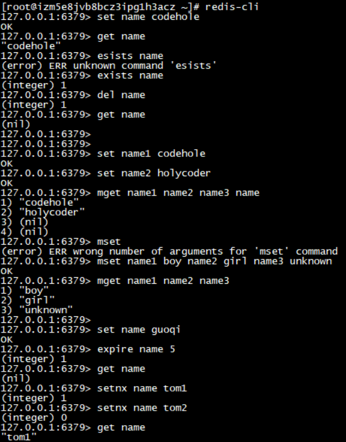
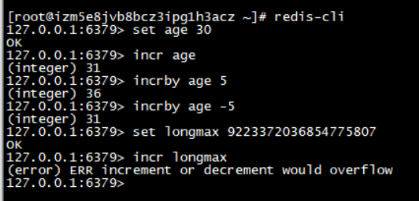
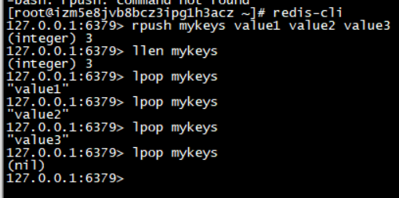
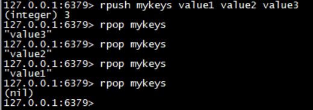
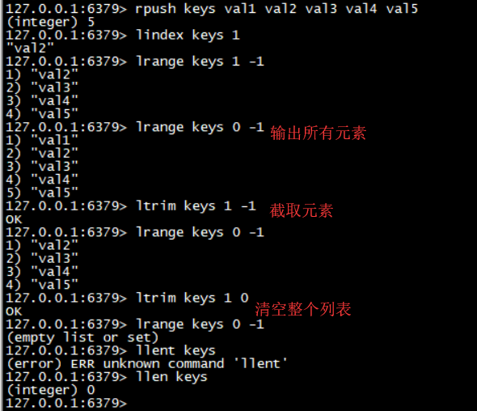
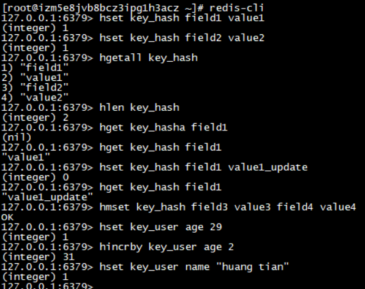
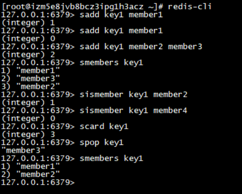
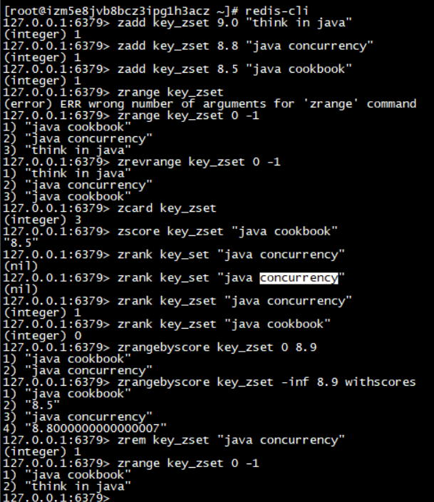

####  安装

直接安装方式

> yum install redis

启动Redis服务  配置文件位与 /etc/redis.conf

> redis-server /etc/redis.conf 

运行客户端

> redis-cli

关闭reids

> redis-cli shutdown

####  五中基础数据结构

##### String(字符串)

string在Redis内部表示就是一个**字符数组**，长度可以修改，内部结构的实现类似于java的ArrayList，采用预分配冗余空间来减少内存的频繁分配，内部**为当前字符串分配的实际长度大于字符串长度**，长度小于1MB时扩容加倍现有的空间，长度超过1MB时扩容一次只会多扩1MB，最大长度为512MB.

######  键值对

对Redis进行新增、查询、删除

> set key value
>
> get key
>
> exists key
>
> del key

######  批量键值对

> mset key1 value1 key2 value2
>
> mget key1 key2

######  过期和set命令扩展

value 为整数是可以进行自增操作（有最大值和最小值）。

> set key value1
>
> expire key 5    # 5秒后过期
>
> setex key  5 value  #5秒后过期
>
> setnx name value    # 如果name就执行set创建，存在时不创建
>
> set age 30
>
> incr age  # 输出31
>
> incrby age 5  # 输出36
>
> incrby age -5 # 输出31

###### 操作截图

#####list(列表)

Redis列表相当于java里面的LinkedList, 是链表结构，插入删除较快时间复杂度是O(1), 索引定位很慢时间复杂度为O(n)。

###### 先进先出：队列(右边进，左边出)

队列是先进先出的数据结构，常用于消息排队和异步逻辑处理，确保元素的访问顺序

> rpush keys value1 value2 value3
>
> llen keys #长度， 输出3
>
> lpop keys #输出 value1
>
> lplo keys #输出 value2

###### 后进先出：栈(右边进右边出)

> rpush keys value1 value2 value3
>
> rpop keys #输出 value3

###### 慢操作

lindex 命令：相当于java链表的 get(int index)，需要对链表进行遍历，性能随着参数的增大而变差

ltrim 命令： 保留参数 start_index 和 end_index 区间内的值。参数可以为负数 -1表示倒数第一个元素，-2表示倒数第2个元素。

 ###### 快速列表

​	列表在元素较少的情况下，会使用一块连续的内存存储 ，这个结构叫做 ziplist，即压缩列表。

​	列表在元素较多时，使用quicklist(快速列表)结构，即用双向指针将多个ziplist 串联起来。减少了附加指针和碎片化。

##### hash(字典)

Redis的字典相当于java中的HashMap，是无序字典。结构为 素组 + 链表。

Redis字典的值只能是字符串。

> hset key field "value from hash"    #命令行的字符串如果包含空格，要用引号括起来
>
> hset key field2 value2
>
> hgetall key     # key 和 value 间隔出现
>
> hlen key
>
> hget key field
>
> hset key field value   # 更新操作，返回0
>
> hmset key field3 value3 field4 value4   #批量set
>
> hset user age 20
>
> hincrby user age 2 # 值增加2

#####  set(集合)

Redis的set集合相当于java中的HashSet，键值对是无序的、唯一的。

> sadd key_set member1  # 加入成功返回1
>
> sadd key_set member1  #加入重复值返回0
>
> smembers key_set   # 输出set 中的值，与插入的顺序不一致
>
> sismember key_set member1  # 查询某个value 是否存在，存在返回1，不存在返回0
>
> scard key_set  # 获取长度
>
> spop key_set # 弹出一个

##### zset(有序列表)

zset 数据结构 保证value 的唯一性，并可以给value 赋予一个 score，代表这个value的排序权重。

数据结构为跳跃列表。

> zadd key_zset 9.0  "value score is 9.0"
>
> zadd key_zset 8.9 "value score is 8.9"
>
> zadd key_zset 8.6 "value score is 8.6"
>
> zrange key_zset 0 -1   # 按 score 排序列出，参数区间为排名范围
>
> zrevrange key_zset 0 -1 # 按 score 逆序列出
>
> zcard key_zset  # 输出总数
>
> zscore key_zset "value score is 8.9"   #获取指定 value的 score
>
> zrank key_zset "value score is 8.9" # 获取排名
>
> zrangebyscore key_zset 0 8.91   # 根据权重区间遍历 zset
>
> zrangebyscore key_zset -inf 8.91 withscores   # inf 代表无穷大， 遍历同时返回分值
>
> zrem key_zset "value score is 8.9"  # 删除value

###### 

##### 容器型数据结构

list、set、hash、zset 都是容器型数据结构。他们共享以下2条通用规则

1. 如果容器不存在就创建一个再操作；
2. 如果容器里的元素没有了，那么立即删除容器，释放内存。

#####  过期时间

Redis中所有的数据结构都可以设置过期时间。

如果一个字符串已经设置了过期时间，然后调用set修改了他，他的过期时间会消失。