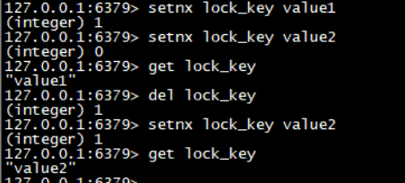

####  命令setnx

setnx (set if not exists) 命令，设置前判断是否存在， 保证该 key 只能被设置一次。设置完之后 del 指令释放掉。

可以用于**分布式锁**

> setnx key value
>
> del key

redis 2.8 版本以后 setnx 扩展参数可以设置过期时间

> setnx key value ex 5 nx     # 是 setnx 和 expire 组合在一起的原子指令

