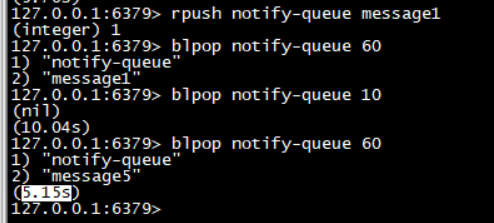

####  异步消息队列

​	Redis的list(列表)数据结构可以作为异步消息队列。用rpush 和 lpush 操作入队列，用 lpop 和 rpop操作出队列。

​	rpush  进  lpop 出  

​	lpush  进  rpop 出

客户端循环pop操作来获取消息，队列空了以后可以设置休眠1S，再获取，降低 客户端消耗和 Redis 的 QPS。


####  阻塞读

​	命令 blpop/brpop 这两个指令的前缀字符b代表的是 locking,就是阻塞读。

​	阻塞读在队列没有数据的时候进入休眠状态，一旦数据到来立刻醒过来，消息的延迟几乎为0。

> rpush notify-queue message1 
>
> blpop notify-queue 60   #立刻返回  message1
>
> blpop notify-queue 10   #等待10以后返回 nil  和 等待时间 10.04s , 编写客户端的时要处理，进行重试
>
> blpop notify-queue 60  # 然后在另外一个客户端 rpush  ,  rush完成后返回  message5 和等待时间 5.15s




####  延时队列

客户端加锁没加成功，一般采用以下方式处理：

1. 直接抛出异常，通知客户重试。
2. sleep一会，然后重试。
3. 将请求转移至**延时队列**，过一会再试。

Redis延时队列可以通过Redis的 zset 有序列表来实现。


```java
package com.yjy.RedisDemo.dealyingqueue;


import com.alibaba.fastjson.JSON;
import com.alibaba.fastjson.TypeReference;
import redis.clients.jedis.Jedis;

import java.lang.reflect.Type;
import java.util.Set;
import java.util.UUID;

/**
 * Redis 延时队列
 */
public class RedisDelayingQueue<T> {

    static class TaskItem<T> {
        public String id;
        public T msg;
    }

    //fastjson 序列化对象中存在 generic 类型时需要使用 TypeReference
    private Type TaskType = new TypeReference<TaskItem<T>>() {
    }.getType();

    private Jedis jedis;
    private String queueKey;

    public RedisDelayingQueue(Jedis jedis, String queueKey) {
        this.jedis = jedis;
        this.queueKey = queueKey;
    }

    public void delay(T msg) {
        TaskItem<T> task = new TaskItem<T>();
        // 分配唯一Id
        task.id = UUID.randomUUID().toString();
        task.msg = msg;
        // 序列化
        String s = JSON.toJSONString(task);
        //塞入延时队列 5s 后再试
        jedis.zadd(queueKey, System.currentTimeMillis() + 5000, s);
    }

    public void loop() {
        while (!Thread.interrupted()) {
            //取一条
            Set<String> values = jedis.zrangeByScore(queueKey, 0, System.currentTimeMillis(), 0, 1);
            System.out.println("----" + values.toString());
            if (values.isEmpty()) {

                try {
                    Thread.sleep(500);
                } catch (InterruptedException e) {
                    break;
                }
                continue;
            }
            String s = values.iterator().next();
            if (jedis.zrem(queueKey, s) > 0) {
                TaskItem<T> taskItem = JSON.parseObject(s, TaskType);
                this.handleMsg(taskItem.msg);
            }
        }
    }

    private void handleMsg(T msg) {
        System.out.println(msg);
    }

    public static void main(String[] args) {
        Jedis jedis = new Jedis("47.105.97.61", 6379);

        RedisDelayingQueue<String> queue = new RedisDelayingQueue<>(jedis, "q-demo");

        Thread producer = new Thread() {
            @Override
            public void run() {
                for (int i = 0; i < 10; i++) {
                    queue.delay("codehole" + i);
                }
            }
        };

        Thread consumer = new Thread() {
            @Override
            public void run() {
                queue.loop();
            }
        };

        producer.start();
        consumer.start();
        try {
            producer.join();
            Thread.sleep(6000);
            consumer.interrupt();
            consumer.join();
        } catch (InterruptedException e) {
            System.out.println("e---" + e);
        }
    }
}
```