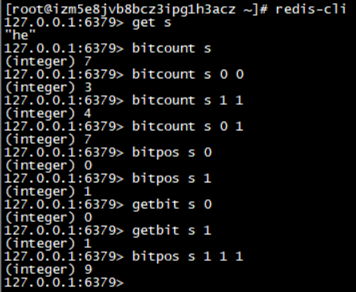

### 位图

位图的数据结构是byte数组

位图的最小单位是bit，每个bit的取值只能是0或1

Redis的位数组是自动扩充的，如果设置了某个偏移位置超出了现有的内容范围，就会自动将为数组扩充

#### 基本用法

h 的 ASCII 码 0b1101000

e 的 ASCII 码 0b1100101

##### 零存整取

> setbit s 1 1
>
> setbit s 2 1
>
> setbit s 4 1
>
> setbit s 9 1
>
> setbit s 10 1
>
> setbit s 13 1
>
> setbit s 15 1
>
> get s   #  返回 “he”

##### 零存零取

> getbit s 10    # 获取某个具体位置的值

##### 整存零取

> set w h
>
> getbit w 1   # 返回 1
>
> getbit w 3   # 返回 3 

####  统计查找

bitcount 用来统计指定位置范围内1的个数。

bitpos 用途查找指定范围内出现的第一个0或1。

> bitcount s  # 返回7
>
> bitcount s 0 0 # 第一个字符中1 的位数
>
> bitcount s 0 1 # 前两个字符中1 的位数
>
> bitpos s 0 # 第一个0 位
>
> bitpos s 1 # 第一个1 位
>
> bitpos s 1 1 1 第二个字符算起，第一个1 位   , 返回 9 

####  bitfield指令

Redis3.2 以后新增指令bitfield指令，可以一次进行多个位的操作。

bitfield有三个子指令，分别get、set、incrby，它们都可以对指定位片段进行读写。

> set w hello
>
> bitfield w get u4 0  # 从第 一 个位开始取 4 个位，结果是无符号数(u)
>
> bitfield w get u3 2  # 从第 三 个位开始取 3 个位，结果是无符号数(u)
>
> bitfield w get i4 0   #  从第 一 个位开始取 4 个位，结果是有符号数(i)

使用set子指令将第二个字符e改成a, a的 ASCII码是97

> bitfield w set u8 8 98  #从第9个位开始，将接下来的8个位用无符号数97替换

使用incrby来对指定范围内的位进行自增操作。出现溢出时Redis默认的处理是折返，即将溢出的符号位丢掉。

> bitfield w incrby u4 2 1  # 从第三位开始，对接下来的4位无符号数 +1

bitfield指令提供了溢出策略子指令overflow，使用户可以选择溢出行为。默认为折返(wrap)，还可以选择失败(fail) 报错不执行，以及饱和截断(sat)  超过了范围就停留在最大或最小值。

> bitfield w overfllow sat incrby u4 2 1
>
> bitfield w overflow fail incrby u4 2 1